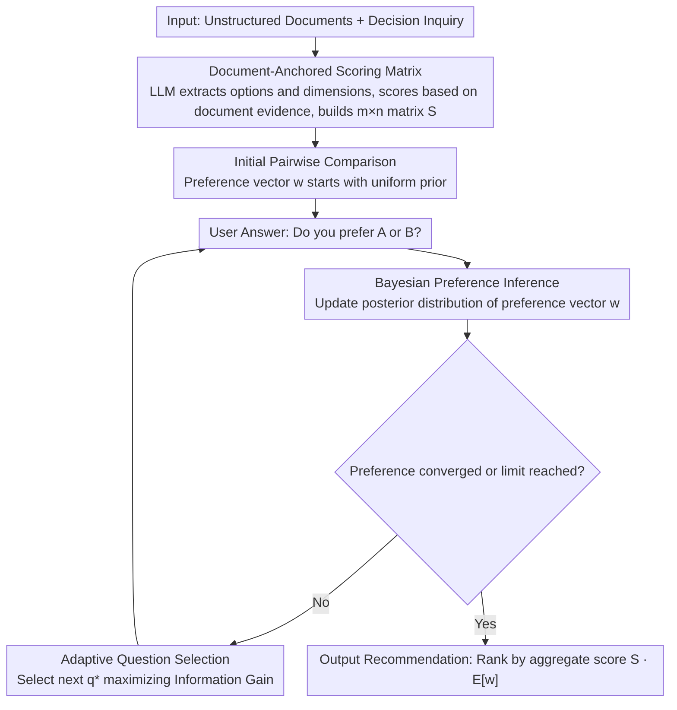

# Decisive: Guiding User Decisions with Optimal Preference Elicitation from Unstructured Documents

**Conference**: ACL 2026  
**arXiv**: [2604.18122](https://arxiv.org/abs/2604.18122)  
**Code**: None  
**Area**: Recommender Systems  
**Keywords**: Decision Support, Preference Elicitation, Bayesian Inference, Document Anchoring, Interactive Systems

## TL;DR

The DECISIVE interactive decision-making framework is proposed to extract objective option scoring matrices from unstructured documents. By combining Bayesian preference inference with adaptive pairwise comparison questions, the system efficiently learns the user's latent preference vector. This achieves transparent personalized recommendations while minimizing interaction burden, improving decision accuracy by up to 20% over strong baselines.

## Background & Motivation

**Background**: Decision making is a cognitive-intensive task where users must synthesize information from multiple unstructured sources, weigh competing factors, and integrate personal subjective preferences. Typical scenarios include selecting products, schools, or medical plans. Existing decision support tools include direct LLM-generated suggestions and traditional decision support systems (DSS).

**Limitations of Prior Work**: When LLMs directly answer decision questions, they either cause information overload (listing all pros and cons without clear advice) or act too arbitrarily (giving recommendations without transparency or consideration of personal preferences). Traditional DSS require structured inputs and explicit preference weights, but users often cannot accurately express their preferences—they "know what they want" but cannot articulate specific weight distributions.

**Key Challenge**: Effective decision support needs to simultaneously solve two problems: (1) objectively extracting multi-dimensional option scores from unstructured information; (2) efficiently eliciting user subjective preferences. Existing methods either neglect the anchoring of objective information (relying purely on LLM subjective judgment) or ignore the efficiency of preference elicitation (requiring users to complete long questionnaires).

**Goal**: To build an interactive decision-making framework that provides objective extraction of option information from documents while efficiently learning user preferences through minimal interaction, ultimately delivering transparent and personalized recommendations.

**Key Insight**: The authors decompose the decision problem into "objective dimensions" and "subjective dimensions." Objective dimensions are addressed via document-anchored scoring matrices, while subjective dimensions are handled through Bayesian preference inference. The bridge between the two consists of adaptively selected pairwise comparison questions.

**Core Idea**: Use a document-anchored option scoring matrix to provide an objective foundation, and efficiently learn the user's latent preference vector through adaptive pairwise comparisons that maximize information gain. The combination achieved transparent, efficient, and personalized decision recommendations.

## Method

### Overall Architecture

The input to DECISIVE is a set of unstructured documents related to the decision (e.g., product reviews, school brochures) and a decision query. The output is a personalized ranking and recommendation of options. The process is divided into four steps: (1) Extracting options and evaluation dimensions from documents to construct an objective scoring matrix; (2) Designing initial pairwise comparison questions for the user; (3) Updating the preference posterior distribution based on user answers and adaptively selecting the next question; (4) Outputting the final recommendation when preferences converge or the interaction limit is reached. Phase (3) is an interactive loop of "asking → updating → re-selecting" that continues until convergence.

### Key Designs

**1. Document-Anchored Scoring Matrix: Anchoring Scores in Facts rather than LLM Priors**

Directly asking an LLM to score decisions often leads to hallucinations, training bias, and lack of traceability. DECISIVE requires the LLM to first identify options and evaluation dimensions (e.g., price, quality, convenience) from source documents. It then scores each option for each dimension strictly based on document content, constructing an $m \times n$ scoring matrix (with $m$ options and $n$ dimensions) while requiring citations of document evidence. This ensures that objective dimensions have a traceable factual basis, making the recommendation process transparent rather than a black box.

**2. Bayesian Preference Inference: Intuitive Questions instead of Numerical Weights**

Users often "know what they want" but cannot specify exact weight distributions. Asking for numerical preferences directly is unnatural. DECISIVE assumes the user has a latent preference vector $\mathbf{w} \in \mathbb{R}^n$ representing the importance of each dimension, initialized with a uniform prior. Each time a user answers a "Do you value A more than B?" pairwise comparison, a Bayesian update calculates the posterior distribution of preferences. The final recommendation uses the product of the scoring matrix and the posterior mean, $S \cdot E[\mathbf{w}]$, as the comprehensive score for each option. The Bayesian framework naturally handles uncertainty: users only make intuitive judgments, and preference estimates refine as more answers are collected.

**3. Adaptive Question Selection: Asking the Most Informative Comparison per Round**

Randomly selecting questions is inefficient, as many comparisons do not impact the final decision. DECISIVE selects the pairwise dimension comparison that maximizes the information gain of the final recommendation, formulated as $q^* = \arg\max_q I(D; A_q | \mathcal{H})$, where $D$ is the final decision, $A_q$ is the user's answer to question $q$, and $\mathcal{H}$ is the history of answers. Intuitively, it prioritizes dimensions that most significantly affect the final ranking, reaching a reliable recommendation in 5-8 rounds whereas random selection might require over 15.

## Key Experimental Results

### Main Results

| Method | Decision Accuracy | User Satisfaction | Interaction Rounds |
|------|----------|----------|---------|
| DECISIVE | Optimal | Highest | 5-8 rounds to converge |
| GPT-4 Direct Rec. | -20% | Lower | 0 (but not personalized) |
| Traditional MCDM | -15% | Moderate | Requires full weight input |
| Random Question Selection | -12% | Moderate | Requires more rounds |

### Ablation Study

| Configuration | Decision Accuracy | Description |
|------|----------|------|
| Full DECISIVE | Optimal | Document Anchoring + Bayesian Inference + Adaptive Selection |
| w/o Document Anchoring | Significant Drop | LLM scores were inconsistent and untraceable |
| w/o Adaptive Selection | Slow Convergence | Required 2-3x more interaction rounds |
| w/o Bayesian Inference | Slight Drop | Uncertainty modeling contributes to robustness |

### Key Findings

- Document anchoring is the most critical component; without it, LLM scoring exhibits significant training bias and inconsistency.
- Adaptive question selection makes 5-8 interaction rounds sufficient for reliable recommendations, compared to 15+ rounds for random selection.
- High cross-domain generalization: performs excellently across product selection, school choice, and travel planning.
- The uncertainty estimation in the Bayesian framework can be used to determine "when the recommendation is reliable enough"—automatically stopping questions when the posterior variance falls below a threshold.

## Highlights & Insights

- The framework design clearly **decomposes decision problems into objective scores and subjective preferences**. This allows each part to be independently optimized and evaluated.
- **Adaptive pairwise comparison** is more natural than traditional weight sliders or Likert scales; users perform intuitive judgments rather than precise quantification.
- The framework is transferable to any scenario requiring personalized recommendations, particularly information-dense decisions such as choosing insurance plans or investment strategies.

## Limitations & Future Work

- The quality of the scoring matrix depends on the completeness of the source documents; if key information is missing from the documents, scores will be biased.
- The assumption that user preferences can be represented by a linear weighted model may not hold in reality, as preferences can be non-linear (e.g., dismissing an option if a dimension falls below a threshold).
- The language generation quality of the pairwise questions may affect user understanding and answer accuracy.
- Future work could explore multi-turn conversational preference elicitation (rather than just multiple-choice) and dynamic updates to the scoring matrix.

## Related Work & Insights

- **vs LLM Direct Recommendation**: LLM recommendations are often opaque and impersonal; DECISIVE addresses these issues through explicit preference elicitation and document anchoring.
- **vs Traditional MCDM (Multi-Criteria Decision Making)**: Traditional MCDM (e.g., AHP, TOPSIS) requires users to provide complete preference weights upfront; DECISIVE reduces user burden through adaptive learning.
- **vs Conversational Recommendation**: Conversational recommenders elicit preferences via free-text interactions, which can be inefficient and hard to converge; DECISIVE's structured pairwise comparisons are more efficient.

## Rating

- Novelty: ⭐⭐⭐⭐ The combination of document anchoring, Bayesian preference inference, and adaptive selection is innovative in search and recommendation.
- Experimental Thoroughness: ⭐⭐⭐⭐ Multi-domain evaluation and detailed ablations, though lacked large-scale user studies.
- Writing Quality: ⭐⭐⭐⭐ Clear framework description and persuasive motivation.
- Value: ⭐⭐⭐⭐ Provides a principled framework for LLM-assisted decision making with broad application prospects.

<!-- RELATED:START -->

## Related Papers

- [\[ACL 2026\] Mirroring Users: Towards Building Preference-aligned User Simulator with User Feedback in Recommendation](mirroring_users_towards_building_preference-aligned_user_simulator_with_user_fee.md)
- [\[ICLR 2026\] Supporting High-Stakes Decision Making Through Interactive Preference Elicitation in the Latent Space](../../ICLR2026/recommender/supporting_high-stakes_decision_making_through_interactive_preference_elicitatio.md)
- [\[ACL 2026\] Learning to Retrieve User History and Generate User Profiles for Personalized Persuasiveness Prediction](learning_to_retrieve_user_history_and_generate_user_profiles_for_personalized_pe.md)
- [\[ACL 2026\] HARPO: Hierarchical Agentic Reasoning for User-Aligned Conversational Recommendation](harpo_hierarchical_agentic_reasoning_for_user-aligned_conversational_recommendat.md)
- [\[ACL 2026\] What Makes LLMs Effective Sequential Recommenders? A Study on Preference Intensity and Temporal Context](what_makes_llms_effective_sequential_recommenders_a_study_on_preference_intensit.md)

<!-- RELATED:END -->
