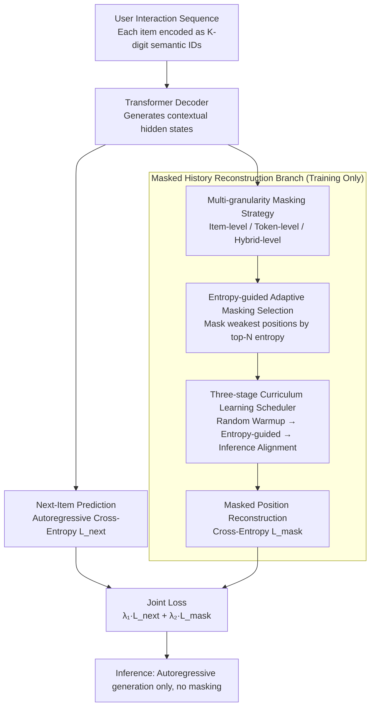

# From Past To Path: Masked History Learning for Next-Item Prediction in Generative Recommendation

**Conference**: ACL 2026  
**arXiv**: [2509.23649](https://arxiv.org/abs/2509.23649)  
**Code**: [GitHub](https://github.com/CQU-MM-Intelligent-Lab/MHL)  
**Area**: Image Generation  
**Keywords**: Generative Recommendation, Masked History Learning, Entropy-guided, Curriculum Learning, Sequential Recommendation

## TL;DR

Proposes the Masked History Learning (MHL) training framework, which incorporates a masked history reconstruction auxiliary task into the autoregressive training of generative recommendation. Combined with an entropy-guided adaptive masking strategy and a curriculum learning scheduler, it shifts the model from merely predicting "what is next" to understanding "why this path was formed," significantly outperforming SOTA on three datasets.

## Background & Motivation

**Background**: Generative recommendation is an emerging paradigm that encodes items as semantic ID sequences and utilizes pre-trained language models (e.g., T5) or LLMs to directly generate identifiers for recommended items, offering advantages in flexibility and scalability.

**Limitations of Prior Work**: Existing generative recommendation models (TIGER, HSTU, RPG, etc.) almost entirely rely on autoregressive next-item prediction training. This "left-to-right" paradigm is inherently biased toward local context and fails to capture deep historical dependencies and complex user intentions within user behavior paths. Models excel at local prediction but lack global understanding, making them susceptible to noise and short-term bias (short-term myopia).

**Key Challenge**: When recent interaction history is truncated, existing SOTA models experience performance collapse (e.g., after a photography enthusiast buys a camera, tripod, camera bag, and lens in sequence, the model focuses only on "lens" to predict lens accessories, ignoring that the "camera body" is the true intent driving the subsequent purchase of a memory card).

**Goal**: Enable generative recommendation models to not only learn "what is next" but also understand "why this purchase path was formed."

**Key Insight**: Borrow the concept of masked language modeling from NLP to introduce a historical reconstruction auxiliary task into autoregressive training.

**Core Idea**: Jointly optimize the dual objectives of next-item prediction and masked history reconstruction. Use information entropy guidance to select the most informative history positions for masking, and utilize curriculum learning for a smooth transition from historical understanding to future prediction.

## Method

### Overall Architecture

MHL adds a masked history reconstruction branch to semantic ID-based generative recommendation. Each item is encoded as a $K$-digit semantic ID, and a Transformer decoder generates contextual hidden states. During training, two losses are jointly optimized: (1) $\mathcal{L}_{next}$ predicts the semantic IDs of the next item; (2) $\mathcal{L}_{mask}$ reconstructs the masked historical items from context states. The reconstruction branch is driven by three components: a multi-granularity masking strategy creates reconstruction tasks, entropy guidance selects the weakest positions for masking, and a three-stage curriculum learning scheduler smooths the transition from masked training to mask-free inference. During inference, only autoregressive generation is used without masking.

### Key Designs

**1. Multi-granularity Masking Strategy: Forcing the model to understand the structure of historical sequences at different levels**

Pure next-item prediction only learns "what is next" and lacks an understanding of historical dependencies, while a single masking method only provides a single level of learning signal. MHL designs three masking granularities—Item-level (replaces entire $K$-digit semantic IDs to learn item dependencies), Token-level (replaces single digits to learn intra-item token relationships), and Hybrid-level (randomly selects item or token level). Diversified reconstruction tasks force the model to simultaneously understand cross-item structures and intra-item structures. 

Complementary pressure across granularities: Experiments show that token-level masking provides finer learning signals and performs best when combined with the R→E→Inf curriculum learning.

**2. Entropy-guided Adaptive Masking Selection: Targeting reconstruction at the model's weakest positions**

Random masking treats all positions equally, ignoring the uneven information density in user behavior—key decision points and noisy positions are masked equally, leading to low learning efficiency. In each training step, MHL first performs a no-grad forward pass on the unmasked sequence to calculate the prediction entropy $\mathcal{H}_t^k$ for each position. High-entropy positions indicate areas where the model lacks understanding, often corresponding to key decision points or complex semantic units. The top-$N$ positions are masked according to entropy in descending order, where $N$ is sampled from a uniform distribution $\mathcal{U}(1, \lfloor\gamma \cdot T\rfloor)$ to prevent overfitting.

This ensures the reconstruction target is always concentrated on the most uncertain positions that require "remedial" learning, spending the masking budget effectively rather than wasting it on well-learned recency positions.

**3. Three-stage Curriculum Learning Scheduler: Smoothing the transition from "masked training" to "mask-free inference"**

Using entropy-guided masking directly can lead to training instability (unreliable early entropy estimation), and there is an inherent discrepancy between masked training and mask-free inference. MHL bridges this with three phases: Phase I uses a low-rate random masking for warmup to establish baseline reconstruction capability and stable optimization; Phase II switches to a high-rate entropy-guided masking to encourage deep historical understanding, with the masking ratio exponentially decaying $\gamma \leftarrow \max(\gamma_{min}, \gamma \cdot \eta)$ as performance plateaus; Phase III sets $\gamma=0$ and trains only $\mathcal{L}_{next}$ to perform inference alignment and eliminate the training-inference gap.

The three-stage transition implements a smooth switch from "understanding the path" to "generating the path"—ablation shows that skipping Phase III causes a significant performance drop, proving this final alignment is key to converting historical understanding into prediction performance.

### Loss & Training

$$\mathcal{L}_{MHL} = \lambda_1 \mathcal{L}_{next} + \lambda_2 \mathcal{L}_{mask}$$

Where $\mathcal{L}_{next}$ is the standard cross-entropy loss for the next item's semantic ID, and $\mathcal{L}_{mask}$ is the reconstruction cross-entropy loss for masked positions.

## Key Experimental Results

### Main Results

| Dataset | Metric | MHL | RPG (Prev. SOTA) | Gain |
|--------|------|-----|-------------|------|
| Beauty | R@10 | .0795 | .0745 | +6.7% |
| Beauty | N@10 | .0495 | .0436 | +13.5% |
| Toys | R@10 | .0903 | .0778 | +16.1% |
| Toys | N@10 | .0564 | .0460 | +22.6% |
| Sports | R@10 | .0511 | .0436 | +17.2% |
| Sports | N@10 | .0298 | .0246 | +21.1% |

### Ablation Study

| Configuration | Key Metric | Description |
|------|---------|------|
| Token-level + R→E→Inf | Best | Overall best across three datasets |
| No Masking (Baseline RPG) | .0745 R@10 | Next-item prediction only |
| Random Masking | Improved | Simple masking is effective |
| Entropy-only (No Curriculum) | Performance drop | Instability due to unreliable early entropy estimation |
| Truncating Recent History | MHL vs SOTA +40% | MHL is robust under history truncation |

### Key Findings
- The masked history reconstruction auxiliary task brings improvements across all three granularities (item/token/hybrid).
- Token-level masking performs best due to providing finer-grained learning signals.
- Entropy-guided masking must be paired with curriculum learning to be effective—direct application leads to training instability.
- When recent interaction history is truncated, MHL demonstrates extreme robustness (+40%), proving it learns deep intent rather than just relying on recency effects.
- Phase III (Inference Alignment) is critical—skipping this phase leads to a significant performance decline.

## Highlights & Insights
- **Training Paradigm Innovation**: Introduces masked language modeling concepts into the autoregressive training of generative recommendation, shifting from "predicting results" to "understanding the process."
- **Deep Insight**: The "understanding the past to predict the future" insight is convincingly demonstrated through robustness experiments (history truncation), showing the value of deep historical understanding.
- **Synergistic Design**: The combination of entropy guidance and curriculum learning is elegant—entropy guidance provides high-quality signals, while curriculum learning ensures training stability and inference alignment.
- **High Universality**: As a training framework, it can be directly applied to various semantic ID-based generative recommendation models.

## Limitations & Future Work
- **Limited Dataset Scale**: Validated only on three categories of Amazon Reviews 2014; testing on larger scales and more domains is needed.
- **Additional Computational Overhead**: Entropy-guided masking requires an extra no-grad forward pass to calculate entropy at each step.
- **Hyperparameter Sensitivity**: Hyperparameters such as the transition points between the three curriculum phases and the masking ratios require tuning.
- Future Explorations: Application to LLM-based recommendation systems, cross-domain recommendation, and multi-modal recommendation.

## Related Work
- **vs BERT4Rec/S3-Rec**: Uses bidirectional encoders + masked prediction for discriminative recommendation; MHL adds a masked reconstruction auxiliary task to a unidirectional decoder to maintain generative capability.
- **vs TIGER/RPG**: SOTA generative recommendation based on pure autoregressive next-item prediction; MHL significantly improves upon these via historical reconstruction auxiliary tasks.
- **vs HSTU**: Facebook's industrial-grade sequential recommendation model; MHL outperforms it across all metrics.

## Rating
- Novelty: ⭐⭐⭐⭐ Meaningful training paradigm innovation by introducing masked learning to generative recommendation; the combination of entropy guidance and curriculum learning is clever.
- Experimental Thoroughness: ⭐⭐⭐⭐ Multiple datasets, comparison with multiple baselines, detailed ablation studies, and robustness analysis.
- Writing Quality: ⭐⭐⭐⭐ The photography enthusiast example is intuitive, and the methodological motivation is clearly articulated.
- Value: ⭐⭐⭐⭐ Provides a new training paradigm for generative recommendation; the historical understanding perspective is inspiring.

<!-- RELATED:START -->

## Related Papers

- [\[ACL 2026\] Learning to Retrieve User History and Generate User Profiles for Personalized Persuasiveness Prediction](learning_to_retrieve_user_history_and_generate_user_profiles_for_personalized_pe.md)
- [\[AAAI 2026\] Inductive Generative Recommendation via Retrieval-based Speculation](../../AAAI2026/recommender/inductive_generative_recommendation_via_retrieval-based_speculation.md)
- [\[AAAI 2026\] FreqRec: Exploiting Inter-Session Information with Frequency-enhanced Dual-Path Networks for Sequential Recommendation](../../AAAI2026/recommender/exploiting_inter-session_information_with_frequency-enhanced_dual-path_networks_.md)
- [\[AAAI 2026\] Tool4POI: A Tool-Augmented LLM Framework for Next POI Recommendation](../../AAAI2026/recommender/tool4poi_a_tool-augmented_llm_framework_for_next_poi_recommendation.md)
- [\[AAAI 2026\] Align³GR: Unified Multi-Level Alignment for LLM-based Generative Recommendation](../../AAAI2026/recommender/align3gr_unified_multi-level_alignment_for_llm-based_generat.md)

<!-- RELATED:END -->
