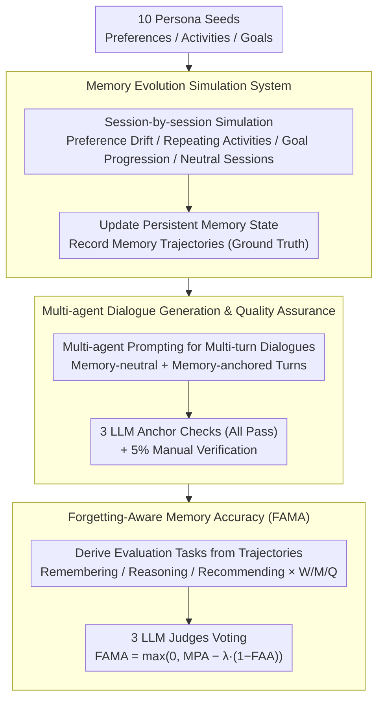

# From Recall to Forgetting: Benchmarking Long-Term Memory for Personalized Agents

**Conference**: ACL 2026 Findings  
**arXiv**: [2604.20006](https://arxiv.org/abs/2604.20006)  
**Code**: [GitHub](https://github.com/geniesinc/Memora)  
**Area**: Long-Term Memory / Personalized Agents  
**Keywords**: Long-term memory benchmark, memory consolidation, memory mutation, forgetting-aware evaluation, personalized agent, Memora, FAMA

## TL;DR

This paper proposes the Memora benchmark and the FAMA metric, extending long-term memory evaluation from shallow factual retrieval to memory consolidation and mutation handling across weeks to months, revealing systemic failures of existing LLMs and memory agents in handling frequent knowledge updates.

## Background & Motivation

**Background**: Personalized agents need to maintain persistent memory across sessions during long-term interactions. Existing benchmarks (LoCoMo, LongMemEval, PersonaMem, etc.) primarily operationalize long-term memory as "cross-session factual retrieval," where 94% of LoCoMo questions and 85% of LongMemEval questions require referencing at most 2 historical sessions.

**Limitations of Prior Work**: Existing benchmarks exhibit two core flaws: (1) extremely low demand for memory consolidation—referencing only approximately 1 historical session on average; (2) memory mutation is rarely tested—LongMemEval features at most 2 updates, and PersonaMem involves at most 3. Evaluation metrics only reward memory presence without penalizing the erroneous use of outdated information.

**Key Challenge**: Human cognition not only recalls but also accumulates experience, reconciles changes, and maintains a coherent world model. Current evaluation frameworks essentially only test "the ability to retrieve an isolated piece of information from history," failing to expose the true capabilities of models in memory evolution and conflict resolution.

**Goal**: To construct an evaluation system that far exceeds existing benchmarks in memory consolidation (up to 309 cross-session references) and memory mutation (up to 94 updates/deletions), and to propose an evaluation metric capable of penalizing the "use of outdated memory."

**Key Insight**: Define memory tasks across three dimensions—Remembering, Reasoning, and Recommending—covering three time spans: weekly, monthly, and quarterly.

**Core Idea**: Long-term memory is not just about "remembering" but also "knowing when to forget"; the FAMA metric exposes critical flaws in existing systems by explicitly penalizing reliance on outdated memory.

## Method

**Overall Architecture**: Memora is a simulation-driven benchmark construction pipeline. It starts from seed memories of 10 professional personas (preferences, activities, goals), simulates user interactions session-by-session to evolve memory trajectories with authentic dynamics (as ground truth); it then transcribes each session specification into high-quality multi-turn dialogues with quality verification; finally, it derives evaluation tasks from memory trajectories and scores them using the forgetting-aware metric FAMA. These three stages correspond to the three key designs below.

**Key Designs**:

**1. Memory Evolution Simulation System: Enabling Memory "Mutation" with Verifiable Trajectories**

In existing benchmarks, sessions are largely independent, where memory is rarely referenced repeatedly and even more rarely overturned. Memora first constructs 10 professional personas (engineers, researchers, etc.), each maintaining three categories of memory: preferences, activities, and goals. The simulator advances session-by-session, injecting dynamics such as preference drift, repeating activities, and long-term goal progression, while interspersing neutral sessions that do not modify memory. It updates the persistent memory state after each session and records a complete memory trajectory as ground truth. This evolution mechanism maximizes consolidation and mutation pressure—average memory consolidation (cross-session references) reaches 28.4 in the Quarterly setting compared to ~1 in existing benchmarks; memory mutations (updates/deletions) reach 14.8, while existing benchmarks stay near 0–2.

**2. Multi-agent Dialogue Generation and Quality Assurance: Transcribing Session Specs to Dialogues**

Simulation produces structured session specifications. Using these directly for questions loses natural dialogue context, while allowing LLMs to freely generate dialogues risks "hallucinating" memory details not present in the simulation, thus contaminating ground truth. This work uses a multi-agent prompting framework to transcribe session specs into multi-turn dialogues, distinguishing between memory-neutral and memory-anchored turns. Subsequently, 3 LLMs independently perform automated memory anchor checks (all must pass), followed by 5% manual verification. This dual quality control ensures generated dialogues strictly align with the underlying memory trajectory without introducing untracked false memories.

**3. Forgetting-Aware Memory Accuracy (FAMA): Rewarding Remembering and Penalizing Failure to Forget**

Traditional metrics only check if the model uses the correct memory but do not penalize the continued citation of outdated information. FAMA combines both into a single score:
$$\text{FAMA} = \max(0,\ \text{MPA} - \lambda\,(1-\text{FAA}))$$
where $\text{MPA}$ (memory presence accuracy) measures whether valid memories that should be remembered are used, and $\text{FAA}$ (forgetting absence accuracy) measures whether outdated memories that should be forgotten are successfully omitted. The weight $\lambda = N_{\text{forget}} / (N_{\text{presence}} + N_{\text{forget}})$ is dynamically adjusted based on the ratio of forgetting items to presence items in each task, ensuring that tasks with more forgetting requirements penalize failures more heavily. Each criterion is adjudicated by a majority vote of 3 LLM judges (GPT-4.1, Claude Haiku 4.5, Gemini 2.5 Flash). The $\text{FAA}$ component is key to explicitly integrating "knowing when to forget" into the metric.

## Key Experimental Results

**Performance of LLM Base Models (FAMA, 0-100)**:

| Model | Remembering (W/M/Q) | Recommending (W/M/Q) | Reasoning (W/M/Q) |
|------|---------------------|----------------------|--------------------|
| GPT-5.2 | 25.3/19.9/23.4 | 54.8/51.1/53.4 | 4.7/0.0/1.0 |
| Claude Sonnet 4.5 | 27.5/19.4/21.3 | 43.6/39.0/44.0 | 6.7/3.0/5.5 |
| Gemini 3 Pro | 20.4/21.4/17.3 | 45.1/45.9/52.6 | 6.7/4.0/4.0 |

**Performance of Long-Term Memory Agents (FAMA)**:

| Agent | Remembering (W/M/Q) | Recommending (W/M/Q) | Reasoning (W/M/Q) |
|-------|---------------------|----------------------|--------------------|
| A-Mem | 71.8/41.9/40.8 | 35.0/37.5/35.0 | 2.0/2.0/5.0 |
| LangMem | 71.2/42.0/39.1 | 48.9/44.1/33.9 | 30.0/14.0/11.0 |
| MemoBase | 43.6/20.1/15.2 | 68.9/58.5/45.6 | 18.0/7.0/1.0 |
| MemoryOS | 51.8/29.8/25.1 | 62.6/48.5/44.0 | 20.7/6.0/5.5 |
| Mem-0 | 40.4/21.1/19.9 | 52.6/36.2/38.5 | 16.0/0.0/2.0 |

**Key Findings**:
- **Reasoning phase almost completely fails**: Reasoning scores for all models and agents are mostly <10, with GPT-5.2 even scoring 0 on Monthly tasks.
- **Memory Agents outperform LLMs significantly in Remembering**: For example, A-Mem scores 71.8 vs. GPT-5.2's 25.3, but the advantage in Reasoning is limited.
- **Increasing time spans lead to continuous performance degradation**: From Weekly to Quarterly, Remembering scores for all systems decrease significantly.
- **Reasoning tokens yield inconsistent effects**: While helpful in some scenarios (e.g., Gemini's Monthly Reasoning increased from 4 to 10), the overall improvement remains limited.
- **All systems frequently reuse invalidated memories**: This exposes a fundamental difficulty in maintaining a consistent belief state under high consolidation and high mutation pressure.

## Highlights & Insights

- **Innovation in Evaluation Paradigm**: Transitions long-term memory evaluation from "Do you remember?" to "Do you know what to forget?", with an elegant and practical FAMA metric design.
- **Simulation-Driven Construction**: A pipeline of structured seeds → session simulation → dialogue generation → automated verification enables large-scale, high-quality benchmark construction.
- **Reasoning is the Major Bottleneck**: Comprehensive reasoning across timelines is the critical weakness of all existing systems.
- **Unprecedented Benchmark Scale**: Under the Quarterly setting, each persona averages 1991 sessions and 1171.4 memory operations.

## Limitations & Future Work

- Based on simulated data rather than real user interactions, which may pose ecological validity issues.
- Evaluation relies on LLM-as-judge (though consistent with human annotation at 88.3%).
- All agents use a uniform GPT-4o-mini backend, which might underestimate certain agents' performance with stronger LLMs.
- The effects of memory compression/summarization strategies were not explored.

## Related Work & Insights

- **LoCoMo (Maharana et al., 2024)**: Multi-session dialogue benchmark; 94% of questions require referencing ≤ 2 sessions.
- **LongMemEval (Wu et al., 2024)**: Million-token evaluation, but with limited memory updates.
- **PersonaMem (Jiang et al., 2025)**: Evaluates personalized decision-making with at most 3 memory mutations.
- **MemoryAgentBench (Hu et al., 2025)**: Agentic memory evaluation.
- **Insight**: The core challenge of long-term memory lies not in capacity, but in temporal consistency management and knowledge state maintenance. Evaluating AI memory should not merely focus on "how much is remembered" but on "how information is prioritized amidst contradictions."

## Rating

- **Novelty**: ★★★★☆ — The FAMA metric and large-scale memory mutation evaluation are significant contributions.
- **Experimental Thoroughness**: ★★★★☆ — Comprehensive coverage with 4 LLMs and 6 memory agents.
- **Writing Quality**: ★★★★☆ — Clear articulation of motivation and effective quantitative comparison with prior work.
- **Value**: ★★★★★ — Fills a critical gap in the evaluation of personalized agents.

<!-- RELATED:START -->

## Related Papers

- [\[ACL 2026\] IceBreaker for Conversational Agents: Breaking the First-Message Barrier with Personalized Starters](icebreaker_for_conversational_agents_breaking_the_first-message_barrier_with_per.md)
- [\[ICLR 2026\] Token-Efficient Long-Term Interest Sketching and Internalized Reasoning for LLM-based Recommendation](../../ICLR2026/recommender/token-efficient_long-term_interest_sketching_and_internalized_reasoning_for_llm-.md)
- [\[ICML 2026\] RGMem: Renormalization Group-Inspired Memory Evolution for Language Agents](../../ICML2026/recommender/rgmem_renormalization_group-inspired_memory_evolution_for_language_agents.md)
- [\[ICLR 2026\] Beyond Markovian Drifts: Action-Biased Geometric Walks with Memory for Personalized Summarization](../../ICLR2026/recommender/beyond_markovian_drifts_action-biased_geometric_walks_with_memory_for_personaliz.md)
- [\[ACL 2026\] Bridging Language and Items for Retrieval and Recommendation: Benchmarking LLMs as Semantic Encoders](bridging_language_and_items_for_retrieval_and_recommendation_benchmarking_llms_a.md)

<!-- RELATED:END -->
