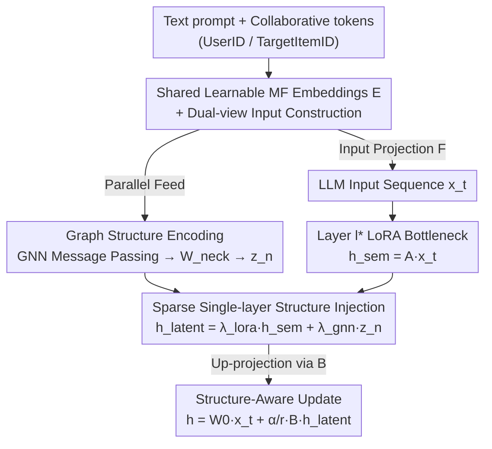

# GraphLoRA: Structure-Aware Low-Rank Adaptation for Large Language Model Recommendation

**Conference**: ACL 2026  
**arXiv**: [2606.07526](https://arxiv.org/abs/2606.07526)  
**Code**: https://github.com/wgj15965/GraphLoRA  
**Area**: Recommender Systems / LLM Efficient Fine-tuning  
**Keywords**: LLM Recommendation, LoRA, Graph Message Passing, Collaborative Signals, Structure-Aware Fine-tuning

## TL;DR
Existing LLM recommenders either feed collaborative information into prompts or inject pre-trained static embeddings into LoRA weights, treating structure as a "one-read" static input. GraphLoRA embeds a trainable graph message passing network into the LoRA bottleneck (between down-projection $\mathbf{A}$ and up-projection $\mathbf{B}$), allowing collaborative topology to propagate dynamically within the parameter space and directly guide weight updates. With only ~1.67% additional parameters, it outperforms SOTAs like CoRA on ML-1M and Amazon-Book.

## Background & Motivation

**Background**: LLMs have emerged as powerful recommenders due to their reasoning and generalization capabilities. However, a core challenge remains: how to align the textual semantics LLMs excel at with the **inherently structured** collaborative signals of user-item interactions. Two primary paradigms exist: (a) **Input-space alignment** (e.g., TALLRec linearizes histories into text prompts; CoLLM projects MF embeddings into soft tokens); (b) **Parameter-space alignment** (e.g., CoRA injects externally pre-trained collaborative embeddings into LoRA weights).

**Limitations of Prior Work**: Input-space alignment forces the LLM to "read" structure passively, where complex high-order graph topologies are flattened into linear sequences or static tokens, losing structural inductive bias. Parameter-space alignment, while internalizing collaborative patterns, relies on **externally pre-trained and static** embeddings (e.g., from MF). Consequently, structural information remains decoupled from the model and cannot be jointly refined with semantic representations.

**Key Challenge**: Both paradigms treat structural information as "static input"—either as static prompts or static weights—thus **failing to capture high-order dependencies** and preventing structure and semantics from mutually shaping each other during training.

**Core Idea**: This work re-interprets LoRA as a **learnable reasoning pathway** rather than a passive fine-tuning module. Specifically, a differentiable graph message passing module is embedded within the LoRA bottleneck to dynamically aggregate high-order neighborhood information in the low-rank latent space. This generalizes traditional LoRA from "independent low-rank adaptation" to "structure-aware low-rank propagation," enabling the LLM to internalize collaborative topology while jointly refining semantics and structure.

## Method

### Overall Architecture
Standard LoRA defines weight updates as $\mathbf{h}=\mathbf{W}_0\mathbf{x}+\frac{\alpha}{r}\mathbf{B}\mathbf{A}\mathbf{x}$. GraphLoRA intervenes in the low-rank latent space between $\mathbf{A}$ (down-projection) and $\mathbf{B}$ (up-projection). Given a hybrid sequence $\mathbf{X}=\{\mathbf{x}_1,\dots,\mathbf{x}_T\}$ containing both text and collaborative tokens (placeholder `<UserID>`, `<TargetItemID>`), the workflow consists of four steps: (1) Collaborative Initialization—using learnable MF embeddings $\mathbf{E}=[\mathbf{P};\mathbf{Q}]$ for user/item identities; (2) Dual-view Input Construction—mapping $\mathbf{E}$ into the LLM sequence via input projection $\mathcal{F}$ while recording anchor positions; (3) Graph Structure Encoding—passing the same $\mathbf{E}$ through a GNN for $L$-layer message passing to obtain structural representations, followed by a bottleneck projection $\mathbf{W}_{neck}$ to the rank $r$ space $\mathbf{z}_n$; (4) Structure-Aware Parameter Injection—at a specified layer $l^*$, fusing structural signals $\mathbf{z}_n$ with semantic intermediaries $\mathbf{h}_{sem}=\mathbf{A}\mathbf{x}_t$ before the up-projection $\mathbf{B}$. Crucially, the GNN and $\mathbf{W}_{neck}$ are **jointly optimized** with the LLM.

### Key Designs

**1. Shared Learnable Collaborative Embeddings + Dual-view Input Construction**

Unlike CoRA's "frozen external features," GraphLoRA treats MF-derived embeddings $\mathbf{E}=[\mathbf{P};\mathbf{Q}]\in\mathbb{R}^{(|\mathcal{U}|+|\mathcal{I}|)\times d_{emb}}$ as a **shared, learnable** state feeding two pathways: one projects $d_{emb}$ to $d_{model}$ via $\mathcal{F}$ for prompts, and the other feeds the GNN. A mapping $\pi(b,t)\mapsto n$ binds sequence anchors to graph nodes. This ensures that $\mathbf{E}$ is **dynamically aligned** with semantic reasoning, as it updates alongside the recommendation objective.

**2. Graph Message Passing within LoRA Bottleneck**

This core component upgrades "independent adaptation" to "structure-aware propagation." Given the user-item subgraph and shared embeddings $\mathbf{E}$, the GNN follows the MPNN paradigm for $L$ layers:

$$\mathbf{e}_n^{(k+1)}=\psi\Big(\mathbf{e}_n^{(k)},\ \mathop{\text{AGG}}_{v\in\mathcal{N}_n}\big(\phi(\mathbf{e}_v^{(k)},\mathbf{e}_n^{(k)})\big)\Big)$$

The resulting $\mathbf{e}_n^{(L)}$ is compressed to the rank $r$ task-relevant subspace via $\mathbf{z}_n=\mathbf{W}_{neck}\mathbf{e}_n^{(L)}\in\mathbb{R}^{r}$. This reduces projection complexity from $\mathcal{O}(d_{model}\times d_{emb})$ to $\mathcal{O}(r\times d_{emb})$, ensuring structural signals reside in the same low-rank subspace as LoRA parameters.

**3. Sparse Single-layer Structure-Aware Injection + Joint Optimization**

GraphLoRA adopts a **sparse single-layer** strategy, injecting only at a target layer $l^*$ (e.g., layer 31 for ML-1M). For a collaborative token $\mathbf{x}_t$, signals are fused:

$$\mathbf{h}_{latent}=\lambda_{lora}\mathbf{h}_{sem}+\lambda_{gnn}\mathbf{z}_n$$

(where $\lambda_{lora}=1.0, \lambda_{gnn}=0.1$). This is then projected back via $\mathbf{B}$. Gradient flow $\mathbf{B}\to\mathbf{z}_n\to\mathbf{W}_{neck}\to\text{GNN}$ ensures $\mathbf{z}_n$ evolves into a semantically aligned structural bias. This "explicit structural guidance" adds only ~1.67% parameters over LoRA-only.

### Loss & Training
The model is trained end-to-end using BCE loss. The LLM uses AdamW while the GNN uses Adam. The backbone is Vicuna-7B ($d=4096$), with MF dimension $d_{emb}=256$ and LoRA rank $r=8$ applied to $\{q,v\}$. Training used 4 RTX 3090s with a learning rate of $1e^{-4}$ and cosine warm-up.

## Key Experimental Results

### Main Results
On ML-1M and Amazon-Book, GraphLoRA outperforms CoRA despite using a tighter parameter budget ($r=8, \{q,v\}$ vs $r=16, \{q,k,v,o\}$):

| Method (Setting) | ML-1M AUC | ML-1M UAUC | Amazon AUC | Amazon UAUC |
|------|-----------|------------|------------|-------------|
| TALLRec | 0.7044 | 0.6741 | 0.6583 | 0.4971 |
| CoLLM-MF ($r=8,\{q,v\}$) | 0.7028 | 0.6714 | 0.8021 | 0.5782 |
| BinLLM ($r=8,\{q,v\}$) | 0.7132 | 0.6815 | 0.8157 | 0.5724 |
| CoRA-MF ($r=16,\{q,k,v,o\}$) | 0.7361 | 0.6884 | 0.8179 | 0.6262 |
| **GraphLoRA ($r=8,\{q,v\}$)** | **0.7472** | **0.7102** | **0.8205** | **0.6303** |

**Equal Budget Fairness**: When CoRA-MF is constrained to $r=8, \{q,v\}$, it suffers "perceptual collapse" (UAUC drops to 0.4995 on Amazon-Book), whereas GraphLoRA remains robust.

### Ablation Study

| Configuration | ML-1M AUC/UAUC | Amazon AUC/UAUC | Description |
|------|----------------|-----------------|------|
| LoRA-only (Frozen MF) | 0.6981 / 0.6548 | 0.8012 / 0.6026 | No graph path, frozen MF |
| LoRA-only (Trainable MF) | 0.7178 / 0.6952 | 0.8136 / 0.6153 | Injection path is identity |
| **GraphLoRA (Full)** | **0.7472 / 0.7102** | **0.8205 / 0.6303** | Integrated GNN in bottleneck |
| GraphLoRA (GCN) | 0.7417 / 0.6934 | 0.8168 / 0.6277 | GCN backbone |

Injection position ablation: Placing the GNN before $\mathbf{A}$ (Pre-A) causes parameters to surge by 5.224× with worse performance (ML-1M 0.7333). The Middle strategy ($\mathbf{A}\to$GNN$\to\mathbf{B}$) provides the best cost-benefit.

### Key Findings
- **Trainable MF provides the first tier of gain; graph aggregation provides the second**: Performance increases significantly from frozen MF to trainable MF, and further with GNN bottleneck aggregation.
- **Injection position is critical**: Integration must occur within the bottleneck (after $\mathbf{A}$, before $\mathbf{B}$) to maintain high information density in the low-rank subspace.
- **Extreme parameter efficiency**: GraphLoRA achieves SOTA with only +1.67% parameters, outperforming CoRA under strict budgets.

## Highlights & Insights
- Re-interpreting LoRA as a "learnable propagation pathway" rather than just an adapter is a significant conceptual shift—the same $\mathbf{A}/\mathbf{B}$ matrices now serve message passing.
- The shared learnable MF embedding bridge breaks the limitations of static injection, allowing structure and semantics to shape each other.
- The bottleneck projection $\mathbf{W}_{neck}$ aligns high-dimensional structure into the rank $r$ subspace, proving that *where* you fuse signals is as important as *what* you fuse.

## Limitations & Future Work
- The injection layer $l^*$ is manually tuned per dataset; an automated selection mechanism is missing.
- Only 1-hop neighbor sampling is used; the full utility of multi-hop high-order signals remains to be explored.
- Scalability to even larger models and more complex domains (e.g., multi-behavior recommendation) requires further validation.

## Related Work & Insights
- **vs. TALLRec / CoLLM (Input-space)**: These flatten structure into prompts; GraphLoRA internalizes it in parameters.
- **vs. CoRA (Parameter-space)**: CoRA uses frozen external embeddings and dense injection; GraphLoRA uses joint optimization and sparse bottleneck injection.
- **vs. GraphGPT / HiGPT (Projector route)**: These align structure to token space via projectors; GraphLoRA achieves this within the LoRA bottleneck at much lower cost.

## Rating
- Novelty: ⭐⭐⭐⭐⭐ 
- Experimental Thoroughness: ⭐⭐⭐⭐ 
- Writing Quality: ⭐⭐⭐⭐ 
- Value: ⭐⭐⭐⭐⭐ 

<!-- RELATED:START -->

<!-- RELATED:END -->

## Related Papers

- [\[AAAI 2026\] Inference-Aware Prompt Optimization for Aligning Black-Box Large Language Models](../../AAAI2026/recommender/inference-aware_prompt_optimization_for_aligning_black-box_large_language_models.md)
- [\[NeurIPS 2025\] Measuring What Matters: Construct Validity in Large Language Model Benchmarks](../../NeurIPS2025/recommender/measuring_what_matters_construct_validity_in_large_language_model_benchmarks.md)
- [\[ICLR 2026\] GoalRank: Group-Relative Optimization for a Large Ranking Model](../../ICLR2026/recommender/goalrank_group-relative_optimization_for_a_large_ranking_model.md)
- [\[ACL 2026\] HSUGA: LLM-Enhanced Recommendation with Hierarchical Semantic Understanding and Group-Aware Alignment](hsuga_llm-enhanced_recommendation_with_hierarchical_semantic_understanding_and_g.md)
- [\[ACL 2025\] KERL: Knowledge-Enhanced Personalized Recipe Recommendation using Large Language Models](../../ACL2025/recommender/kerl_knowledge-enhanced_personalized_recipe_recommendation_using_large_language_.md)

<!-- RELATED:END -->
