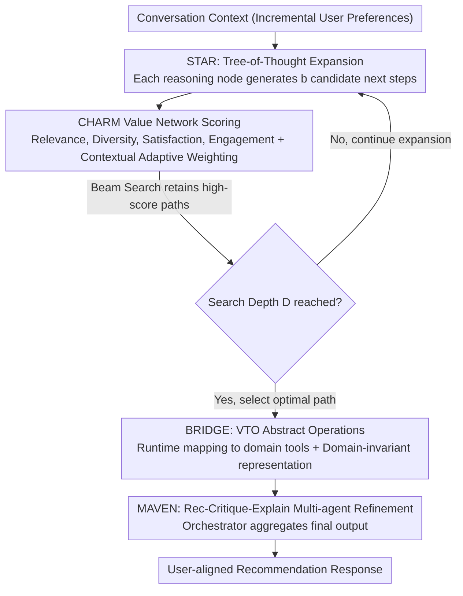

# HARPO: Hierarchical Agentic Reasoning for User-Aligned Conversational Recommendation

**Conference**: ACL 2026  
**arXiv**: [2604.10048](https://arxiv.org/abs/2604.10048)  
**Code**: [https://anonymous.4open.science/r/HARPO-D881](https://anonymous.4open.science/r/HARPO-D881)  
**Area**: Recommender Systems  
**Keywords**: Conversational Recommendation, Agentic Reasoning, Preference Optimization, Tree Search, Recommendation Quality

## TL;DR
Proposes the HARPO framework, which redefines conversational recommendation as a structured decision-making problem optimized for recommendation quality. Through four components—hierarchical preference learning, value-network-guided tree search reasoning, virtual tool operations, and multi-agent refinement—it significantly outperforms existing methods on the ReDial, INSPIRED, and MUSE benchmarks.

## Background & Motivation

**Background**: Conversational Recommender Systems (CRS) aim to help users discover items matching their preferences through natural language interaction. Recently, LLM-based CRS methods have achieved strong performance on proxy metrics such as Recall@K and BLEU.

**Limitations of Prior Work**: High proxy metric scores do not necessarily imply high-quality user-aligned recommendations. Existing methods primarily optimize intermediate goals like retrieval accuracy, generation fluency, or tool calling rather than the recommendation quality itself. For example, "something casual for a summer wedding" might be misinterpreted as daily casual wear instead of occasion-appropriate wedding attire; such responses score high on automated metrics but yield low user satisfaction.

**Key Challenge**: There is a fundamental misalignment between CRS training/evaluation objectives (proxy metrics) and actual recommendation quality. Proxy metrics are only weakly correlated with user-aligned recommendation quality.

**Goal**: Model conversational recommendation as a structured decision-making problem that explicitly optimizes recommendation quality, rather than treating quality as a byproduct of response generation.

**Key Insight**: From a decision-making reasoning perspective, the authors argue that the system should explicitly reason across multiple candidate recommendation strategies, evaluate their expected quality, and select recommendations based on user-alignment standards rather than proxy signals.

**Core Idea**: Decompose recommendation quality into interpretable dimensions (relevance, diversity, satisfaction, engagement) through hierarchical preference learning, and use a learned value network to guide tree search reasoning to explore candidate recommendation paths.

## Method

### Overall Architecture
HARPO treats a round of conversational recommendation as a "think before you speak" decision problem: after receiving the conversation context, the system does not directly generate a recommendation. Instead, it expands several candidate recommendation strategies in a reasoning tree, scores each path according to recommendation quality $\mathcal{Q}$ using a learned value network, and selects the optimal path for the final response. The entire process is supported by four components sharing the same pre-trained language model backbone: STAR handles structured tree search, CHARM decomposes "quality" into learnable multi-dimensional rewards, BRIDGE handles cross-domain transfer, and MAVEN performs multi-agent refinement, optimizing for the recommendation quality itself throughout the process.

### Key Designs

**1. STAR: Explicit comparison of multiple recommendation strategies using Tree-of-Thought instead of one-shot generation.**

Existing CRS directly feed the dialogue context into the model to generate recommendations, allowing only one attempt without the possibility of revision. STAR expands this step into a tree search: each reasoning node is denoted as $s=(\mathbf{h}, \tau, \mathbf{v}, d)$, representing the dialogue context encoding, the current step of thought, the predicted virtual tool operation, and the search depth; at each node, $b$ candidate next steps are generated, and the best paths are retained via beam search after evaluation by the value network. Instead of a generic score, the value network predicts along four dimensions—relevance, diversity, satisfaction, and engagement—and aggregates them using learnable weights. This allows the system to compare multiple recommendation schemes before speaking and select the one with the highest expected quality.

**2. CHARM: Decomposing "recommendation quality" into interpretable multi-dimensional rewards with context-adaptive weighting.**

A single scalar reward compresses the reasons for a "good" recommendation into one number, losing information, and the importance of each dimension naturally varies across dialogues. CHARM assigns a dedicated reward head to each quality dimension: $R_k(\mathbf{h}) = \tanh(\mathbf{W}_k^{(2)} \cdot \text{GELU}(\mathbf{W}_k^{(1)} \cdot \mathbf{h}))$, with outputs in $[-1,1]$. It then uses a meta-learning approach to calculate context-varying weights $\mathbf{w} = \text{softmax}(\mathbf{W}_{\text{meta}} \cdot [\text{Enc}(\mathbf{h}); \mathbf{e}_d] + \mathbf{b})$, allowing the model to capture differences such as "relevance matters more for wedding occasions, while engagement matters more for casual chitchat." Training utilizes a margin-based preference optimization loss, ensuring that the total score of high-quality recommendations is higher than that of low-quality ones.

**3. BRIDGE: Cross-domain reasoning transfer via Virtual Tool Operations + Adversarial Domain Adaptation.**

Tool-augmented methods are often tightly coupled with specific tool implementations in a given domain, requiring reconstruction for new domains. BRIDGE utilizes a Gradient Reversal Layer for adversarial domain adaptation to learn domain-invariant representations, while maintaining a learnable domain gate $\mathbf{z}' = \sigma(\mathbf{g}_d) \odot \mathbf{z} + (1-\sigma(\mathbf{g}_d)) \odot \mathbf{h}$ to preserve useful domain-specific signals. Accompanying Virtual Tool Operations (VTO) decouple "high-level reasoning actions" from "low-level tool specifics"; at inference time, it only produces abstract operations, which are dynamically mapped to real tools at runtime—similar to interface design in software, allowing the same reasoning logic to be applied to different domain tools.

**4. MAVEN: Collaborative refinement via recommendation, critique, and explanation agents.**

Generating a recommendation in one go often mixes "what to select, why to select, and how to speak" without self-inspection. MAVEN employs three agents with complementary roles on a shared representation: each agent $a$ has an independent encoder and output head $\mathbf{o}_a = \text{Head}_a(\text{Enc}_a(\mathbf{h}))$. The recommendation agent generates candidates, the critique agent identifies flaws, and the explanation agent provides justification. An orchestrator then concatenates these outputs and aggregates them via an FFN into the final response: $\mathbf{o}_{\text{final}} = \text{FFN}([\mathbf{o}_{\text{rec}}; \mathbf{o}_{\text{crit}}; \mathbf{o}_{\text{exp}}])$, with weights varying by context. Training uses a consistency loss $\mathcal{L}_{\text{agree}} = 1 - \cos(\mathbf{o}_{\text{rec}}, \mathbf{o}_{\text{crit}})$ to encourage coordination, while allowing disagreement when necessary, effectively subjecting the STAR-selected candidates to an internal "propose-critique-justify" review before the final response.

### Loss & Training
The total loss includes preference optimization loss $\mathcal{L}_{\text{pref}}$, domain adaptation loss $\mathcal{L}_{\text{domain}}$, task preservation loss $\mathcal{L}_{\text{task}}$, and agent consistency loss $\mathcal{L}_{\text{agree}}$.

## Key Experimental Results

### Main Results
Recommendation performance on the ReDial dataset:

| Method | R@1 | R@10 | R@50 | MRR@10 | User Sat. | Engage. |
|------|-----|------|------|--------|-----------|---------|
| KBRD | 2.9 | 16.7 | 36.2 | 7.4 | 0.42 | 0.38 |
| UniCRS | 3.8 | 18.1 | 37.4 | 8.4 | 0.45 | 0.41 |
| GPT-4 | — | — | — | — | — | — |
| **Ours (HARPO)** | **Best** | **Best** | **Best** | **Best** | **Best** | **Best** |

### Ablation Study

| Configuration | Key Metrics | Description |
|------|---------|------|
| Full HARPO | Best | Complete model |
| w/o STAR | Significant drop | Removed tree search reasoning |
| w/o CHARM | Clear drop | Removed hierarchical preference optimization |
| w/o BRIDGE | Drop in cross-domain | Removed domain transfer module |
| w/o MAVEN | Slight drop | Removed multi-agent refinement |

### Key Findings
- HARPO achieves an average improvement of 17-21% over the strongest baseline (GPT-4), with even larger gains in user-alignment metrics.
- The largest improvement is seen on the INSPIRED dataset (+45.7% R@10 higher than GPT-4), as social dialogue requires reasoning over implicit preferences.
- Human evaluation confirms that recommendation quality, explanation quality, and overall ratings are significantly better than GPT-4 (+0.55, +0.50, +0.55).
- The CHARM reward model achieves a Pearson correlation coefficient of 0.64-0.73 with independent human judgment.

## Highlights & Insights
- Identifying the misalignment between proxy metrics and recommendation quality as a fundamental problem in the CRS field is a paradigm-shifting insight.
- VTO abstraction decouples reasoning logic from specific tools, similar to interface design in software engineering, providing an elegant solution for transferable reasoning.
- Multi-dimensional quality decomposition combined with context-adaptive weighting avoids the information compression issues inherent in single reward signals.

## Limitations & Future Work
- The CHARM reward model itself may contain biases; while correlated with human judgment, it is not a perfect substitute.
- Tree search reasoning increases computational overhead at inference time, requiring latency considerations for practical deployment.
- Experimental dataset scales are limited (ReDial 10k dialogues), with insufficient large-scale validation.
- Future work could explore expanding quality dimensions to even more fine-grained user preference modeling.

## Related Work & Insights
- **vs UniCRS**: UniCRS unifies recommendation and generation but still optimizes proxy metrics; HARPO directly optimizes recommendation quality.
- **vs RecMind**: RecMind uses self-motivated reasoning but lacks quality-guided search; HARPO’s value network provides quality-oriented guidance.
- **vs GPT-4**: Even powerful general models perform well on proxy metrics but lag behind the specifically optimized HARPO on user-alignment metrics.

## Rating
- Novelty: ⭐⭐⭐⭐ Redefining conversational recommendation as a quality-optimized decision problem is novel.
- Experimental Thoroughness: ⭐⭐⭐⭐ Complete results across three datasets, human evaluation, and ablation studies.
- Writing Quality: ⭐⭐⭐⭐ Deep problem analysis and logically clear framework design.
- Value: ⭐⭐⭐⭐ Provides important methodological insights for the CRS field.

<!-- RELATED:START -->

## Related Papers

- [\[ACL 2026\] Mirroring Users: Towards Building Preference-aligned User Simulator with User Feedback in Recommendation](mirroring_users_towards_building_preference-aligned_user_simulator_with_user_fee.md)
- [\[ACL 2026\] Where and What: Reasoning Dynamic and Implicit Preferences in Situated Conversational Recommendation](where_and_what_reasoning_dynamic_and_implicit_preferences_in_situated_conversati.md)
- [\[ICML 2025\] MATCHA: Toward Safe and Human-Aligned Game Conversational Recommendation via Multi-Agent Decomposition](../../ICML2025/recommender/toward_safe_and_human-aligned_game_conversational_recommendation_via_multi-agent.md)
- [\[ACL 2026\] Intent-Driven Semantic ID Generation for Grounded Conversational News Recommendation](intent-driven_semantic_id_generation_for_grounded_conversational_news_recommenda.md)
- [\[ACL 2026\] ReRec: Reasoning-Augmented LLM-based Recommendation Assistant via Reinforcement Fine-tuning](rerec_reasoning-augmented_llm-based_recommendation_assistant_via_reinforcement_f.md)

<!-- RELATED:END -->
