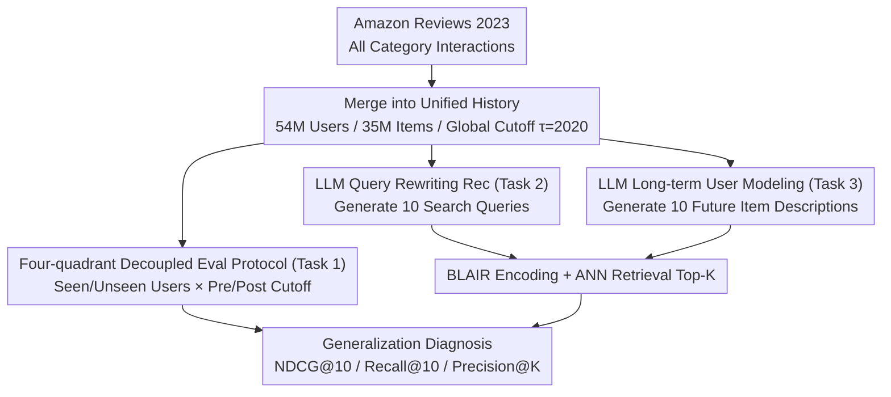

# HORIZON: A Benchmark for in-the-wild User Behaviour Modeling

**Conference**: ACL 2026 Findings  
**arXiv**: [2604.17259](https://arxiv.org/abs/2604.17259)  
**Code**: [https://github.com/microsoft/horizon-benchmark](https://github.com/microsoft/horizon-benchmark)  
**Area**: Recommender Systems / User Behavior Modeling  
**Keywords**: Sequential Recommendation, Cross-domain User Modeling, Long-term Behavior Prediction, Temporal Generalization, LLM Recommendation

## TL;DR

This paper proposes HORIZON, the first fully open-source large-scale cross-domain long-term recommendation benchmark. Based on merged Amazon Reviews, it constructs a unified interaction history containing 54M users and 35M items. It designs a four-quadrant evaluation protocol decoupled along the time axis and user dimension, revealing that models like BERT4Rec perform strongly in-distribution but significantly degrade in temporal extrapolation and unseen user scenarios. Furthermore, LLMs do not consistently outperform specialized architectures in user behavior modeling.

## Background & Motivation

**Background**: Sequential recommendation is the core of personalized systems. Prevailing methods (SASRec, BERT4Rec, etc.) have made significant progress on single-domain short-sequence benchmarks like MovieLens and Amazon Reviews. In reality, user behaviors span multiple domains and platforms, and preferences evolve continuously over time.

**Limitations of Prior Work**: (1) Existing benchmarks primarily focus on single-domain next-item prediction—while Amazon Reviews covers multiple categories, it is usually partitioned by category during evaluation, failing to capture cross-category transfer behaviors; (2) Leave-One-Out and Ratio-Based evaluations suffer from temporal leakage risks—user interactions in the training set may occur later in time than interactions in the test set for other users; (3) No public benchmarks simultaneously support generalization evaluation across domains, long time spans, and unseen users; (4) Although PinnerFormer and USE are well-designed, they rely on private data and are not reproducible.

**Key Challenge**: Existing evaluation protocols conflate all generalization dimensions—temporal generalization (whether the model can predict behaviors in future periods), user generalization (whether the model can handle unseen users), and cross-domain generalization (whether the model can utilize cross-category signals) are evaluated without distinction, making it impossible to accurately diagnose specific model weaknesses.

**Goal**: To build a large-scale, cross-domain, temporally continuous public benchmark and design an evaluation protocol that orthogonally decouples the time axis and user dimension to systematically evaluate the generalization capabilities of recommendation models across various dimensions.

**Key Insight**: Merge all category interactions from Amazon Reviews 2023 into a unified user history, set a global time cutoff $\tau$=2020, and construct a four-quadrant evaluation along "Seen/Unseen Users × Pre-cutoff/Post-cutoff Time."

**Core Idea**: Generalization capability is not one-dimensional—the same model may perform excellently in-distribution but collapse during temporal extrapolation, or be strong for seen users but weak for unseen users. Decoupled evaluation is key to diagnosing these issues.

## Method

### Overall Architecture

HORIZON starts with Amazon Reviews 2023, merging user interactions from all categories into a unified history (54M users, 35M items, 486M interactions), with $\tau$=2020 as the global time cutoff. Three tasks are defined on this basis: Task 1 is traditional next-item recommendation with a four-quadrant decoupled evaluation; Task 2 requires an LLM to rewrite user history into search queries for retrieval; Task 3 requires an LLM to directly generate descriptions for multiple future items to model long-term preference evolution. All three tasks share the same cross-domain, temporally continuous data.

### Key Designs

**1. Four-quadrant Decoupled Evaluation Protocol (Task 1): Splitting Temporal and User Generalization into Orthogonal Axes**

Traditional Leave-One-Out only covers the "Seen User, Pre-cutoff" corner, and Ratio-Based evaluation conflates multiple generalization dimensions, making it impossible to detect when a model fails in a specific dimension. HORIZON slices four quadrants along "Seen/Unseen Users × Pre/Post Cutoff": (1a) In-distribution + Time-aligned: standard Leave-One-Out for seen users before the cutoff; (1b) In-distribution + Temporal-extrapolation: all interactions of the same users after the cutoff; (1c) Unseen User + Time-aligned: Leave-One-Out for entirely new users before the cutoff; (1d) Unseen User + Temporal-extrapolation: prediction for new users after the cutoff, the most challenging scenario. Crucially, models are trained only on (1a) and then evaluated on all four settings. This decomposition highlights discrepancies masked by old protocols—for instance, BERT4Rec performs best in (1a) but degrades severely in (1c).

**2. LLM Query Rewriting Recommendation (Task 2): Testing LLM's Ability to Translate Behavior into Semantic Search Intent**

ID-based models are nearly helpless with brand-new items and unseen users, whereas the strength of LLMs lies in semantic understanding. In Task 2, after reading user interaction history, the LLM generates 10 diverse search queries $Q = \{q_1,...,q_{10}\}$. A pre-trained BLAIR encoder then maps queries and items into the same embedding space for Top-K retrieval via ANN indexing, evaluated by Recall@K and Precision@K. This makes the recommendation process explicit as a set of readable search queries, serving as a semantic complement to ID-based methods and facilitating debugging.

**3. LLM Long-term User Modeling (Task 3): Upgrading from "Predicting the Next Click" to "Foreseeing Long-term Needs"**

Active recommendation and inventory planning in reality require anticipating needs over a future period, yet few public benchmarks evaluate this. In Task 3, given user history before the cutoff, the LLM generates natural language descriptions for 10 likely future interactions at once, following the same retrieval pipeline as Task 2 to match the item catalog. The difference from Task 2 is the requirement to predict long-term evolution (multiple targets instead of one) with an evaluation window covering the entire post-cutoff period, making it more difficult and practically valuable.

### Loss & Training

In Task 1, traditional models are trained using standard settings within the RecBole framework. For Task 2/3, LLMs are used in a zero-shot manner, with LoRA and full fine-tuning provided as comparative baselines.

## Key Experimental Results

### Main Results

**Task 1: Four-quadrant Evaluation Results (NDCG@10 / Recall@10)**

| Model | (1a) In-dist Aligned | (1b) In-dist Extrap | (1c) Unseen Aligned | (1d) Unseen Extrap |
|------|----------------|----------------|------------------|------------------|
| BERT4Rec | 26.4 / 33.9 | 1.1 / 2.8 | 11.8 / 17.8 | 1.1 / 2.8 |
| SASRec | 25.2 / 34.1 | 2.9 / 6.2 | 17.8 / 26.2 | 3.1 / 6.7 |
| CORE | 8.5 / 12.1 | 0.09 / 0.26 | 5.9 / 11.1 | 0.10 / 0.32 |
| GRU4Rec | 0.08 / 0.14 | 0.01 / 0.01 | 0.01 / 0.01 | 0.01 / 0.01 |

**Task 2: LLM Query Rewriting (Zero-shot)**

| Model | Recall@10 | Recall@100 | Precision@10 |
|------|-----------|------------|-------------|
| Qwen3-8B | 2.06 | 3.50 | 0.25 |
| LLaMA-3.1-8B | 1.62 | 2.84 | 0.20 |
| Gemma2-9B | 1.45 | 2.66 | 0.16 |

### Ablation Study

| Analysis Dimension | Finding | Description |
|---------|------|------|
| Temporal vs. User Gen | Temporal extrapolation degrades more severely | BERT4Rec NDCG@10: 26.4→1.1 (-96%) |
| Seen vs. Unseen Users | SASRec is more robust in degradation | SASRec maintains NDCG=17.8 in (1c) vs. 11.8 for BERT4Rec |
| LLM Scaling Effect | Qwen3-235B ≈ Qwen3-8B | R@100: 3.40 vs. 3.50; no significant gain from scale/reasoning |
| LLM FT vs. Zero-shot | Fine-tuning effect is limited | Zero-shot is superior in terms of scalability |
| Non-attention Models | GRU4Rec largely fails | Complex cross-domain environments require flexible context modeling |

### Key Findings

- BERT4Rec is strongest in the standard (1a) setting (NDCG@10=26.4) but degrades heavily on unseen users (1c) (dropping to 11.8), whereas SASRec (17.8) is more robust—traditional evaluations mask this critical difference.
- Temporal distribution shift is more fatal than user distribution shift: performance for all models plummets by 90%+ in (1b)/(1d) because ID-based models cannot handle brand-new items.
- LLMs do not demonstrate an overwhelming advantage in recommendation tasks—absolute Recall values are very low (<4%@100), suggesting that LLMs' world knowledge is difficult to translate directly into precise user preference understanding.
- Qwen3-235B in reasoning mode actually performs slightly worse than in non-reasoning mode (R@100: 2.96 vs. 3.40), indicating that model scale and chains of thought provide limited help for recommendation tasks.

## Highlights & Insights

- The four-quadrant evaluation design is the primary methodological contribution—evaluating a single trained model across four orthogonal settings reveals generalization defects systematically hidden by traditional protocols. This paradigm can be directly migrated to any scenario requiring generalization assessment, such as dialogue systems or search ranking.
- Merging user histories across domains (rather than partitioning by category) is a simple but powerful data processing idea—increasing the average user history length from 3.86 to 9.07 and releasing more cross-domain signals.
- While the "query rewriting → retrieval" paradigm for LLM recommendation shows limited effectiveness, it provides interpretable intermediate representations (search queries), making it more suitable for debugging and analysis than black-box recommendation models.

## Limitations & Future Work

- Limited to English e-commerce data; multilingual and other scenarios (news, social, video) are not covered.
- Only utilizes text modality; multi-modal information such as item images is not integrated.
- Due to computational constraints, models were trained on a 100K user subset, failing to fully utilize the 54M total dataset.
- LLM evaluation for Tasks 2/3 was only conducted on OOD users, lacking an in-distribution comparison.

## Related Work & Insights

- **vs Amazon Reviews**: Uses the same data source but a fundamentally different evaluation—Amazon Reviews partitions by category, mientras HORIZON merges them into a cross-domain unified history.
- **vs PinnerFormer**: Pinterest's large-scale multi-year user modeling, but private data is not reproducible. HORIZON is the first open-source benchmark with similar positioning.
- **vs MIND**: Microsoft News Dataset, which has only two weeks of history and is single-domain; HORIZON covers years of cross-domain interactions.

## Rating

- Novelty: ⭐⭐⭐⭐⭐ The four-quadrant decoupled evaluation is a significant methodological contribution; the cross-domain merging is simple but effective.
- Experimental Thoroughness: ⭐⭐⭐⭐ Comprehensive coverage of traditional models and LLM baselines, though full data utilization was limited by resources.
- Writing Quality: ⭐⭐⭐⭐ The evaluation protocol is clearly designed, and findings are presented systematically.
- Value: ⭐⭐⭐⭐⭐ Provides a much-needed standardized generalization testing framework for recommender system evaluation.

<!-- RELATED:START -->

## Related Papers

- [\[ACL 2026\] Learning to Retrieve User History and Generate User Profiles for Personalized Persuasiveness Prediction](learning_to_retrieve_user_history_and_generate_user_profiles_for_personalized_pe.md)
- [\[ACL 2026\] Mirroring Users: Towards Building Preference-aligned User Simulator with User Feedback in Recommendation](mirroring_users_towards_building_preference-aligned_user_simulator_with_user_fee.md)
- [\[AAAI 2026\] RecToM: A Benchmark for Evaluating Machine Theory of Mind in LLM-based Conversational Recommender Systems](../../AAAI2026/recommender/rectom_a_benchmark_for_evaluating_machine_theory_of_mind_in_llm-based_conversati.md)
- [\[ACL 2026\] HARPO: Hierarchical Agentic Reasoning for User-Aligned Conversational Recommendation](harpo_hierarchical_agentic_reasoning_for_user-aligned_conversational_recommendat.md)
- [\[AAAI 2026\] Length-Adaptive Interest Network for Balancing Long and Short Sequence Modeling in CTR Prediction](../../AAAI2026/recommender/length-adaptive_interest_network_for_balancing_long_and_short_sequence_modeling_.md)

<!-- RELATED:END -->
