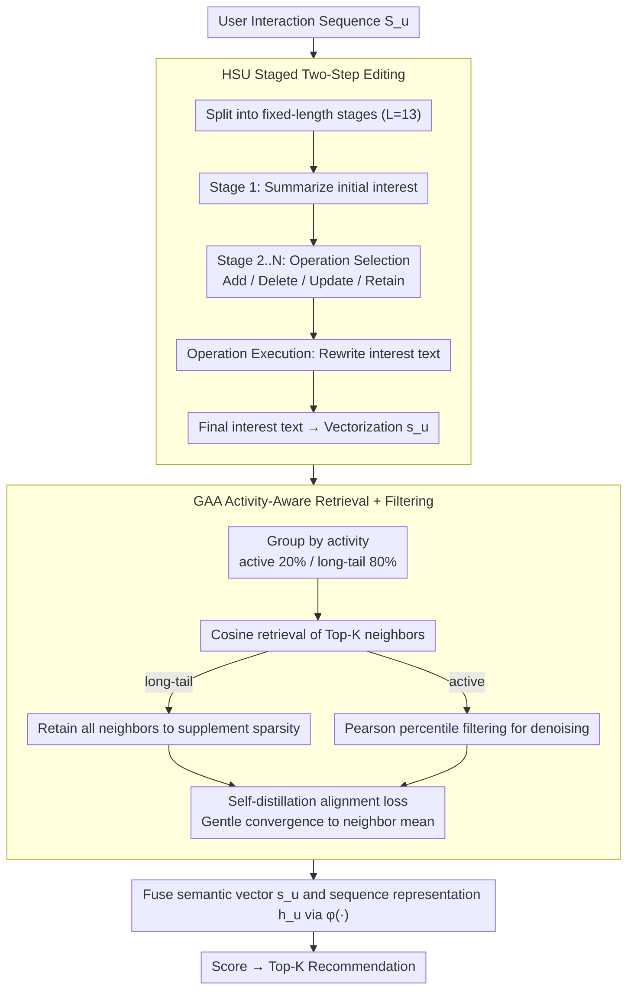

# HSUGA: LLM-Enhanced Recommendation with Hierarchical Semantic Understanding and Group-Aware Alignment

**Conference**: ACL 2026 Findings  
**arXiv**: [2605.11662](https://arxiv.org/abs/2605.11662)  
**Code**: HSUGA (GitHub, name provided but link not provided in the original PDF)  
**Area**: Recommender Systems / LLM-Enhanced Sequential Recommendation / Long-tail Users  
**Keywords**: Sequential Recommendation, LLM Semantic Embedding, Staged Preference Evolution, Edit Operations, Grouped Self-Distillation  

## TL;DR
HSUGA decouples and enhances the two core stages of LLM-enhanced sequential recommendation. It adopts the HSU module, which uses "staged processing + four atomic edits (Add/Delete/Update/Retain)," to stabilize semantic extraction from long sequences. It also introduces GAA self-distillation alignment, which groups users by activity (top 20% active / 80% long-tail) to address under-supervision for long-tail users and over-alignment for active users. As a plug-and-play solution, it yields performance gains across Steam/Fashion/Beauty datasets using GRU4Rec/BERT4Rec/SASRec backbones.

## Background & Motivation

**Background**: The mainstream paradigm for LLM-enhanced sequential recommendation (LLM4SR) typically involves two steps: (1) using an LLM to summarize user interaction histories into semantic embeddings (embedding extraction); (2) integrating these embeddings into traditional sequence encoders (e.g., GRU4Rec, BERT4Rec, SASRec) for downstream utilization (embedding utilization). Representative methods include LLMEmb, LLM2Rec, LLM-ESR, RLMRec, and LLMInit.

**Limitations of Prior Work**: Structural flaws exist at both ends. On the extraction side, current methods feed entire long interaction sequences into an LLM for one-time summarization, which often triggers "lost-in-the-middle" issues, resulting in unstable embeddings particularly for long-tail users. On the utilization side, all users are subjected to a uniform alignment/retrieval strategy, ignoring differences in activity levels. Representing active users is already dense, and forcing alignment with neighbors can introduce noise, whereas long-tail representations are sparse and suffer from insufficient alignment.

**Key Challenge**: The trade-off between the reliability of long-sequence reasoning and the simplicity of direct summarization; the conflict between uniform alignment strategies and user activity heterogeneity. A "one-size-fits-all" approach leads to either noise or underfitting.

**Goal**: To develop two plug-and-play plugins that address these issues independently while maintaining backbone independence, allowing integration with any LLM4SR method.

**Key Insight**: Drawing inspiration from Chain-of-Thought (CoT) and editable LLM memory, the authors segment long sequences into fixed-length stages. Each stage constrains the LLM to a two-step process: "select operation type (Add/Delete/Update/Retain) then execute." This restricts semantic updates to a discrete action space, preventing open-ended semantic drift and error accumulation.

**Core Idea**: Instead of one-time summarization, semantic extraction is performed via "atomic edit operations + staged updates" (HSU). For semantic utilization, "activity-based grouping + adaptive neighbor count + Pearson percentile filtering" replaces "uniform neighbor alignment" (GAA). Both components function as modular plugins.

## Method

### Overall Architecture
HSUGA takes a user's full interaction sequence $\mathcal{S}_u = [i_1, \dots, i_T]$ as input and outputs Top-K recommendations. It structures the "extraction" and "utilization" phases of LLM4SR as two standalone plugins. The extraction plugin, HSU, divides long sequences into fixed-length stages and incrementally updates interest text through staged atomic edits to produce $\mathbf{s}_u$. The utilization plugin, GAA, retrieves neighbors based on user activity groups and performs self-distillation alignment. Finally, the sequence encoder output $\mathbf{h}_u$ and the semantic vector $\mathbf{s}_u$ are combined via a fusion function $\phi(\cdot)$ (e.g., addition, gating, or concat-projection) to obtain $\tilde{\mathbf{h}}_u$. The score $\hat{y}_{u,j} = \mathbf{e}_j^\top \tilde{\mathbf{h}}_u$ is optimized jointly with the GAA self-distillation loss.

### Key Designs

**1. HSU Staged Two-Step Editing: Replacing "Long Sequence Summarization" with "Incremental Interest Rewriting"**

Directly feeding long interaction sequences to an LLM often causes the "lost-in-the-middle" effect, leading to unstable embeddings. HSU segments the sequence into stages of fixed length $L$ (default 13). Stage 1 generates an initial interest description. From stage 2 onwards, each stage undergoes "Operation Selection → Operation Execution." The LLM selects from {Add, Delete, Update, Retain} and rewrites the interest text accordingly (Add introduces new concepts, Delete removes outdated interests, Update refines existing preferences, Retain maintains the status quo). The final interest text is vectorized into $\mathbf{s}_u$. This transforms open-ended semantic evolution into state transitions within a discrete action space, providing interpretability while preventing semantic drift.

**2. GAA Activity-Aware Retrieval + Filtering: Supplementing Long-Tail Users and Denoising Active Users**

Uniform alignment is suboptimal due to varying user densities. GAA first classifies users based on interaction count $n_u$ into top 20% "active" and 80% "long-tail." It then retrieves a Top-$K$ neighbor set $N_u^{(g)}$ from $\mathcal{U} \setminus \{u\}$ using cosine similarity, where $K$ is set higher for long-tail users and lower for active users. For long-tail users, $N_u^{\text{long-tail}} = N_u^{(g)}$ is fully retained. For active users, Pearson similarity is used for percentile filtering: $N_u^{\text{active}} = \{v \in N_u^{(g)} \mid \text{Pearson}(u,v) \ge Q_\tau(\mathcal{S}_u)\}$, where $Q_\tau$ is the $\tau$-th percentile of the user’s own similarity distribution. Percentile-based thresholds are used instead of absolute values to account for varying global similarity scales. Figure 3(a) confirms that the optimal neighbor count for long-tail users is significantly higher than for active users.

**3. Self-Distillation Alignment Loss: Gentle Convergence Toward Neighbor Mean**

Self-distillation is more moderate than hard contrastive learning. GAA uses the neighbor mean $\frac{1}{|N_u|}\sum_{v \in N_u} f(v)$ as a teacher mediator and the target user representation $f(u)$ as the student mediator. The loss is defined as $\mathcal{L}_{SD} = \frac{1}{|\mathcal{U}|}\sum_u \|f(u) - \frac{1}{|N_u|}\sum_{v \in N_u} f(v)\|^2$. Combined with grouped retrieval, long-tail users receive a teacher signal representing the majority vote of sparse neighbors, while active users receive a signal from carefully selected high-correlation neighbors.

### Loss & Training
- Ranking Loss (pairwise): $\mathcal{L}_{\text{Rank}} = -\sum_u \sum_k \log \sigma(\hat{y}_{u,k}^+ - \hat{y}_{u,k}^-)$.
- Total Loss: $\mathcal{L} = \mathcal{L}_{\text{Rank}} + \alpha \cdot \mathcal{L}_{SD}$, with $\alpha \in \{1, 0.5, 0.1, 0.05, 0.01\}$ selected via grid search.
- Neighbor count $N_u^{(g)} \in \{2, 6, 10, 14, 18\}$; $\tau$ searched via octiles; LLM is Qwen2.5-7B-Instruct (default), stage length 13.

## Key Experimental Results

### Main Results

| Dataset | Backbone | Metric | LLM-ESR (Prev. SOTA) | HSUGA | Gain |
|--------|----------|------|-------------------|-------|------|
| Fashion | SASRec | HR@10 | 0.5619 | **0.5880** | +4.6% |
| Fashion | SASRec | Tail Item HR@10 | 0.1095 | **0.1602** | +46.3% |
| Beauty | BERT4Rec | HR@10 | 0.5393 | **0.5711** | +5.9% |
| Beauty | BERT4Rec | Tail Item HR@10 | 0.1379 | **0.1829** | +32.6% |
| Beauty | SASRec | NDCG@10 | 0.3713 | **0.3911** | +5.3% |
| Beauty | SASRec | Tail Item HR@10 | 0.2257 | **0.2415** | +7.0% |

HSUGA achieves SOTA across three datasets and three backbones, with the most significant improvements observed on **tail items** (up to +46%), validating the group-aware design's ability to supplement sparse signals.

### Ablation Study (Fashion Dataset, SASRec Backbone)

| Configuration | HR@10 | NDCG@10 | Tail Item HR@10 | Notes |
|------|-------|---------|-----------------|------|
| HSUGA (Full) | **0.5946** | **0.4979** | **0.1930** | Full model |
| w/o Add | 0.5881 | 0.4921 | 0.1746 | Remove Add op |
| w/o Delete | 0.5892 | 0.4929 | 0.1773 | Remove Delete op |
| w/o Update | 0.5869 | 0.4929 | 0.1720 | Remove Update op (-1.3% HR) |
| w/o Retain | 0.5845 | 0.4918 | 0.1657 | Remove Retain op (-1.7% HR, most critical) |
| w/o Interest Updater | 0.5872 | 0.4930 | 0.1784 | HSU reverts to standard prop |
| w/o Group-Aware SD | 0.5841 | 0.4904 | **0.1573** | Disable grouping; Tail Item HR drops 18.5% |
| w/o Active User Filter | 0.5903 | 0.4928 | 0.1745 | Remove active user filtering |

### Key Findings
- **Group-Aware design is crucial**: Removing Group-Aware SD results in the sharpest drop for tail items (0.1930 → 0.1573, -18.5%), indicating that activity-differentiated alignment is the core source of gain for long-tail scenarios.
- **Retain operation contribution**: Among the four atomic edits, removing "Retain" leads to the largest performance drop, suggesting that explicitly choosing not to modify interest is more stable than making no action implicit.
- **HSUGA-7B > CoT-14B**: HSUGA + Qwen2.5-7B outperforms CoT + Qwen2.5-14B, demonstrating that gains stem from the structured reasoning paradigm rather than pure model capacity.
- **High Stability**: Performance varies by only $\pm 0.005$ HR@10 across different grouping thresholds (15%/20%/25%) and Pearson percentiles (25/50/75).

## Highlights & Insights
- **Constraining semantic editing to a discrete action space** is the most ingenious aspect of this work. It transforms open-ended LLM summarization into a controlled state machine, improving interpretability and resisting error accumulation.
- **Heterogeneous alignment based on user activity** addresses a long-neglected perspective in long-tail recommendation. Traditional contrastive learning treats all users equally, but optimal neighbor counts for active and long-tail users are inversely related.
- **Percentile-based thresholds** are a practical engineering contribution. They naturally adapt to different user similarity scales, making the filtering more robust than absolute thresholds.
- **Plugin Paradigm**: HSUGA does not compete directly with existing LLM4SR methods but complements them. It can improve "extraction-heavy" methods by adding GAA or "utilization-heavy" methods by adding HSU.

## Limitations & Future Work
- **High Inference Cost**: Although HSU supports staged parallelization and incremental updates, LLM inference costs remain high for industrial-scale user bases.
- **Fixed Stage Length**: Stage length is currently hardcoded (default 13). Interest evolution varies by user and should theoretically be adaptive, using session boundaries or topic shifts.
- **Atomic Operation Complexity**: Current operations (Add, Delete, Update, Retain) might not cover complex evolutions like merging similar interests or splitting generalized ones.
- **Activity Metrics**: GAA relies solely on interaction count $n_u$. Future work could incorporate interest diversity, expenditure, or temporal decay.

## Related Work & Insights
- **vs LLM-ESR (Liu et al., NeurIPS 2024)**: LLM-ESR uses LLM semantic embeddings with a dual-tower retrieval setup. HSUGA builds on this by addressing "how to extract semantics stably" and "how to utilize them based on user differences."
- **vs Chain-of-Thought (Wei et al. NeurIPS 2022)**: HSU is a structured variant of CoT for recommendation, constraining reasoning to "Selection → Execution."
- **vs MemoryBank (Zhong et al., AAAI 2024)**: HSU adapts atomic operations from editable memory design to preference evolution modelling.

## Rating
- Novelty: ⭐⭐⭐⭐ Mapping editable memory atomic operations to interest evolution is innovative.
- Experimental Thoroughness: ⭐⭐⭐⭐⭐ Extensive results across backbones, datasets, and baselines, combined with efficiency and robustness analyses.
- Writing Quality: ⭐⭐⭐⭐ Clear structure and well-presented formulas/tables.
- Value: ⭐⭐⭐⭐ The plugin paradigm and significant tail item improvements (+30-46%) offer high practical value for industry.

<!-- RELATED:START -->

## Related Papers

- [\[ACL 2026\] HARPO: Hierarchical Agentic Reasoning for User-Aligned Conversational Recommendation](harpo_hierarchical_agentic_reasoning_for_user-aligned_conversational_recommendat.md)
- [\[ACL 2025\] GRAM: Generative Recommendation via Semantic-aware Multi-granular Late Fusion](../../ACL2025/recommender/gram_generative_recommendation.md)
- [\[AAAI 2026\] Align³GR: Unified Multi-Level Alignment for LLM-based Generative Recommendation](../../AAAI2026/recommender/align3gr_unified_multi-level_alignment_for_llm-based_generat.md)
- [\[AAAI 2026\] Wavelet Enhanced Adaptive Frequency Filter for Sequential Recommendation](../../AAAI2026/recommender/wavelet_enhanced_adaptive_frequency_filter_for_sequential_re.md)
- [\[ACL 2026\] Intent-Driven Semantic ID Generation for Grounded Conversational News Recommendation](intent-driven_semantic_id_generation_for_grounded_conversational_news_recommenda.md)

<!-- RELATED:END -->
## Related Papers

- [\[ACL 2026\] HARPO: Hierarchical Agentic Reasoning for User-Aligned Conversational Recommendation](harpo_hierarchical_agentic_reasoning_for_user-aligned_conversational_recommendat.md)
- [\[ACL 2025\] GRAM: Generative Recommendation via Semantic-aware Multi-granular Late Fusion](../../ACL2025/recommender/gram_generative_recommendation.md)
- [\[AAAI 2026\] Align³GR: Unified Multi-Level Alignment for LLM-based Generative Recommendation](../../AAAI2026/recommender/align3gr_unified_multi-level_alignment_for_llm-based_generat.md)
- [\[ACL 2026\] Intent-Driven Semantic ID Generation for Grounded Conversational News Recommendation](intent-driven_semantic_id_generation_for_grounded_conversational_news_recommenda.md)
- [\[ACL 2026\] Bridging Language and Items for Retrieval and Recommendation: Benchmarking LLMs as Semantic Encoders](bridging_language_and_items_for_retrieval_and_recommendation_benchmarking_llms_a.md)

<!-- RELATED:END -->
