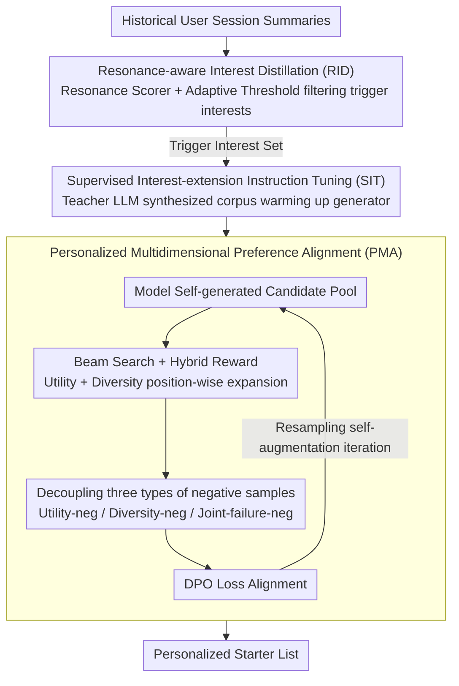

# IceBreaker for Conversational Agents: Breaking the First-Message Barrier with Personalized Starters

**Conference**: ACL 2026  
**arXiv**: [2604.18375](https://arxiv.org/abs/2604.18375)  
**Code**: None (Industrial deployment system)  
**Area**: Recommender Systems / Conversational Systems  
**Keywords**: Proactive Dialogue Initiation, Personalized Session Starters, Interest Distillation, Preference Alignment, Cold Start

## TL;DR
This paper proposes IceBreaker, which addresses the "first-message barrier" for conversational agents through a two-step "handshake"—Resonance-aware Interest Distillation to capture trigger interests and Interaction-oriented Starter Generation coupled with Personalized Preference Alignment. In A/B testing on one of the world's largest conversational products, it increased active user days by +1.84‰ and click-through rate (CTR) by +94.25‰.

## Background & Motivation

**Background**: Conversational agents (e.g., ChatGPT, Doubao) are shifting from passive response to proactive engagement. Prior studies focus on proactivity within dialogues, such as generating follow-up questions or topic guidance, but these occur after a conversation has already started.

**Limitations of Prior Work**: A neglected product bottleneck exists at the initiation stage—the "first-message barrier." Users may have vague needs without clear query intent and lack awareness of the agent's capabilities, leading to approximately 20% of users leaving the product without initiating any conversation.

**Key Challenge**: The initiation stage lacks immediate context to guide responses. Unlike the mid-dialogue stage, initiation must operate at "cold start" moments without explicit user intent. Furthermore, user preferences are highly personalized and follow a long-tail distribution; uniform alignment goals tend to generate generalized starters that fail to resonate with individuals.

**Goal**: Formalize proactive initiation as a "session starter generation" task, producing personalized starter questions to guide users into conversations.

**Key Insight**: Mimic how humans initiate conversations in cold-start scenarios—first identifying potential resonant interest points, then using appropriate phrasing to trigger interaction.

**Core Idea**: A two-step handshake framework—first extracting trigger interests from session summaries via Resonance-aware Interest Distillation (RID), then generating a list of starters via an Interaction-oriented Starter Generator (ISG), optimized for personalized interaction utility and intra-list diversity through list-level multidimensional preference alignment.

## Method

### Overall Architecture
IceBreaker decomposes "proactive dialogue initiation" into a two-step handshake. The first step is Resonance-aware Interest Distillation (RID): filtering "trigger interests" most likely to encourage conversation from historical session summaries, rather than overwhelming users with all historical interests. The second step is Interaction-oriented Starter Generation (ISG): generating a diverse list of starters conditioned on these trigger interests, then using list-level multidimensional preference alignment to ensure phrasing aligns with personal preferences while maintaining topic diversity. A supervised warm-up stage is included to provide a stable starting point for the generator.

### Key Designs

**1. Resonance-aware Interest Distillation (RID): Only keeping interests that truly trigger reconnection**

Not all historical interests are worth using as conversation starters—many are one-off functional queries that disturb users if mentioned again. The key insight of RID is using "interest revisit" as a proxy for resonance: if a user revisits a historical topic in a subsequent session, that session summary is a positive sample. Based on this, a personalized resonance scorer $s_\phi(u, h_t) = \cos(\mathbf{u}, \mathbf{z}_t)$ is trained, measuring the match between the user feature vector $\mathbf{u}$ and the session summary embedding $\mathbf{z}_t$ using contrastive learning with intra-user and cross-user negative samples.

During inference, instead of a global threshold, adaptive thresholds $\tau_u$ are set based on user activity levels to extract the trigger interest set $\mathcal{I}^*$: higher thresholds for active users (to avoid information overload) and lower thresholds for low-activity users (to increase recall). Interests distilled this way naturally lean toward long-tail, interactive topics rather than generalized head functions.

**2. Supervised Interest-extension Instruction Tuning (SIT): Providing a stable starting point with sufficient coverage**

Direct preference optimization on sparse observational data can cause the model to collapse into a few high-frequency topics. SIT first uses a teacher LLM to synthesize a high-quality starter instruction corpus $\mathcal{D}_{\text{cov}}$ from trigger interests $\mathcal{I}^*$, then fine-tunes the generator with standard language modeling loss. This expands the training distribution beyond limited real logs, ensuring subsequent preference alignment has a stable, well-covered initialization.

**3. Personalized Multidimensional Preference Alignment (PMA): Aligning utility and diversity under sparse feedback**

Relying solely on user feedback for preference pairs encounters extreme sparsity, and standard DPO focused only on interaction utility collapses list diversity (semantic diversity dropped from 5.59 to 2.37 in experiments). PMA allows the model to generate a candidate pool and uses hybrid reward list search to iteratively construct preference pairs: using beam search for position-wise expansion of the starter list, combining interaction utility reward $R_{\text{util}}$ and diversity reward $R_{\text{div}}$.

To prevent conflicts between utility and diversity, PMA constructs three types of negative samples—utility-neg, diversity-neg, and joint-failure-neg—decoupling preference signals across different dimensions before feeding them into the DPO loss. After each update, the latest policy is resampled for new preference pairs, forming a self-augmenting iterative optimization.

### Loss & Training
RID uses contrastive learning to train the resonance scorer; ISG is first preheated with SFT (SIT) and then aligned with DPO. DPO preference pairs are iteratively mined via hybrid reward search. Post-deployment, self-augmenting optimization is executed periodically to track user preference drift.

## Key Experimental Results

### Main Results (Online A/B Testing, > 1 Month)

| Method | Active Days ‰ | Avg Sessions ‰ | CTR ‰ | Initiation Rate ‰ |
|------|-----------|-----------|------|------------|
| PE (Direct Prompting) | -0.01 | -0.26 | -16.16* | -0.17 |
| SFT | +0.20 | +0.33 | +6.97* | -0.05 |
| SFT + DPO | +1.16 | +0.42* | +56.41* | +0.68 |
| **Ours (IceBreaker)** | **+1.84*** | **+1.59*** | **+94.25*** | **+1.27*** |

### Ablation Study (Offline, Doubao1.5-Lite backbone)

| Method | R-User ↑ | R-Score ↑ | Lexical Diversity ↑ | Semantic Diversity ↑ |
|------|---------|-----------|----------------|-----------------|
| PE | +0.56 | +0.08 | 29.45 | 6.23 |
| PE + RID | +0.71 | +0.38 | 25.13 | 4.86 |
| SFT | +0.78 | +0.44 | 28.97 | 5.59 |
| SFT + DPO | +0.79 | +0.52 | 12.94 | 2.37 |
| **Ours (IceBreaker)** | **+0.89** | **+0.80** | 28.83 | 5.28 |

### Key Findings
- RID distillation significantly improves personalization: ranking consistency and scores improved markedly from direct prompting to RID integration.
- Standard DPO improves utility but severely damages diversity (semantic diversity decreased from 5.59 to 2.37), which IceBreaker resolves through multidimensional preference alignment.
- Distribution analysis shows: RID filters out functional/generic head topics in favor of triggerable long-tail topics; ISG further leans toward interactive consumption topics (psychology, ACG, entertainment).
- All indicators in online A/B testing were significant (p<0.05), with the CTR gain of +94.25‰ being particularly prominent.

## Highlights & Insights
- Using "interest revisit" as a proxy for resonance is clever—topics users choose to discuss repeatedly naturally reflect deep interests. This signal construction can be transferred to interest modeling in recommender systems.
- The design of three types of negative samples (utility-neg, diversity-neg, joint-failure-neg) elegantly decouples multidimensional optimization goals, avoiding the "utility vs. diversity seesaw" common in DPO.
- Moving conversational systems from "passive response" to "proactive initiation" is a major paradigm shift. The fact that 20% of users drop off due to the first-message barrier identifies a high-value product bottleneck.

## Limitations & Future Work
- The paper lacks public code and reproducible offline datasets, as online experiments depend on industrial environments.
- Trigger interest quality depends heavily on the accuracy of session summaries; poor historical summaries affect the entire pipeline.
- The current system assumes users have sufficient historical interaction data; the cold-start scenario for entirely new users (zero history) is not discussed.
- Self-augmenting iterative optimization may carry a risk of bias accumulation.

## Related Work & Insights
- **vs Proactivity within dialogues**: Traditional proactive dialogue (follow-up, clarification, topic guidance) relies on existing context; IceBreaker resolves the foundational cold-start initiation before a dialogue begins.
- **vs General Preference Alignment (DPO/RLHF)**: General alignment goals cannot handle user-level personalization and feedback sparsity; IceBreaker's multidimensional preference alignment addresses these through self-generated candidates and hybrid reward search.
- **vs Recommender Systems**: Starter generation is essentially "recommending dialogue entries," but differs from traditional recommendation by requiring natural language generation rather than selecting fixed items.

## Rating
- Novelty: ⭐⭐⭐⭐ The "first-message barrier" problem definition is novel, and the two-step handshake with three types of negative samples is creative.
- Experimental Thoroughness: ⭐⭐⭐⭐⭐ Includes offline and online A/B testing over a month, with rich distribution and case analyses.
- Writing Quality: ⭐⭐⭐⭐ The product-perspective motivation is persuasive, and the methodology is clearly described.
- Value: ⭐⭐⭐⭐⭐ Already deployed in one of the world's largest conversational products, offering direct industrial application value.

<!-- RELATED:START -->

## Related Papers

- [\[ACL 2026\] From Recall to Forgetting: Benchmarking Long-Term Memory for Personalized Agents](from_recall_to_forgetting_benchmarking_long-term_memory_for_personalized_agents.md)
- [\[ACL 2026\] HARPO: Hierarchical Agentic Reasoning for User-Aligned Conversational Recommendation](harpo_hierarchical_agentic_reasoning_for_user-aligned_conversational_recommendat.md)
- [\[ACL 2026\] Intent-Driven Semantic ID Generation for Grounded Conversational News Recommendation](intent-driven_semantic_id_generation_for_grounded_conversational_news_recommenda.md)
- [\[ACL 2026\] Where and What: Reasoning Dynamic and Implicit Preferences in Situated Conversational Recommendation](where_and_what_reasoning_dynamic_and_implicit_preferences_in_situated_conversati.md)
- [\[ICLR 2026\] In Agents We Trust, but Who Do Agents Trust? Latent Source Preferences Steer LLM Generations](../../ICLR2026/recommender/in_agents_we_trust_but_who_do_agents_trust_latent_source_preferences_steer_llm_g.md)

<!-- RELATED:END -->
