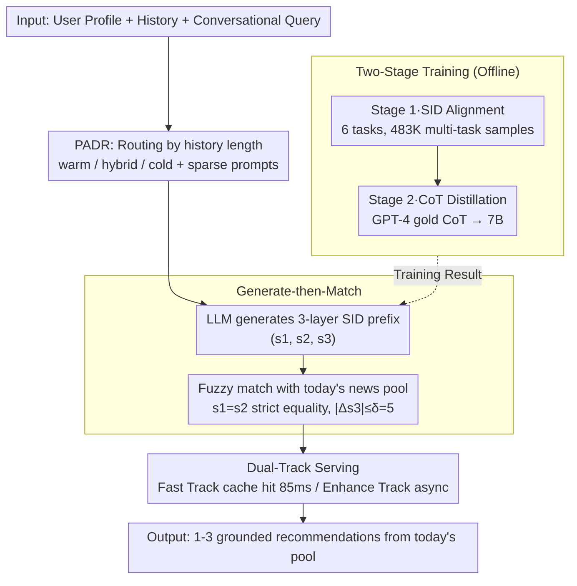

# Intent-Driven Semantic ID Generation for Grounded Conversational News Recommendation

**Conference**: ACL 2026 Oral  
**arXiv**: [2605.07613](https://arxiv.org/abs/2605.07613)  
**Code**: To be confirmed  
**Area**: Recommendation / Conversation / Generative Recommendation / Semantic ID  
**Keywords**: Semantic ID, Conversational Recommendation, Generative Recommendation, Cold Start, RQ-VAE

## TL;DR
This paper proposes NewsRec-Chat, which inverts conversational news recommendation from a "retrieve-then-generate" paradigm to "generate SID then fuzzy match." By utilizing two-stage SID alignment and GPT-4 CoT distillation, a 7B model directly generates hierarchical Semantic ID prefixes and performs fuzzy matching against the daily news pool. It achieves an L1 of 12.4% (4× random) in a 152K open generation space on the Tencent News platform with 0% hallucinations, while its Profile-Aware Dual-Signal Reasoning enables cold-start users (zero history) to reach 18.0% L1 (where other baselines fail).

## Background & Motivation

**Background**: Mainstream conversational recommendation systems are built on stable product catalogs (e.g., movies, goods). They typically convert conversational intent into keywords or embedding vectors for retrieval, followed by LLM-based ranking and explanation within the recalled set. Recently, generative recommendation has used SID (hierarchical tokens quantized via RQ-VAE) to encode items into learnable discrete sequences, though these models mostly assume rich click histories.

**Limitations of Prior Work**: News platforms differ significantly from stable catalogs—articles frequently go offline within 24 hours, new articles continuously flow in, and 20-30% of users have histories with fewer than 10 items. Implicit intents like "another one," "something different," or "no sports" dominate conversations (5 categories), lack keywords for RAG, and direct application of SID faces two open questions: (1) how to generate SID prefixes from intent rather than click sequences, and (2) how to handle cold-start users without click history.

**Key Challenge**: The retrieve-first paradigm requires explicit keys in the query. However, real-world conversational demands are often implicit and have short lifecycles, causing the assumptions of "query existence" and "static corpus" to fail.

**Goal**: (1) Map conversational intent directly to candidate items without relying on keywords, (2) structurally guarantee zero hallucinations (every recommendation must exist in today's pool), (3) enable meaningful recommendations for cold-start users via profiles, and (4) satisfy sub-100ms online latency.

**Key Insight**: It is observed that the first three layers of RQ-VAE SID are "semantic hierarchical encodings" ($s_1$ macro-category, $s_2$ meso-category, $s_3$ fine-grained cluster), while the 4th layer approximates the item ID and fluctuates daily. Allowing the LLM to generate only the first 3 layers expresses intent while decoupling the model from daily inventory changes.

**Core Idea**: Replace RAG with "Generate-then-Match." The LLM directly generates a 3-layer SID prefix $P = (s_1, s_2, s_3)$ based on (user profile, history, current intent), followed by a fuzzy match $\text{Match}(P, \mathcal{P}) \subseteq \mathcal{P}$ against today's news pool with a tolerance $\delta$, architecturally guaranteeing existence.

## Method

### Overall Architecture

Input: User profile $\mathbf{p}_u$ (25+ dimensional features), behavioral history $\mathbf{h}_u$, and current query $q$. Intermediate Process: (1) The PADR router selects the warm/hybrid/cold path and assembles the prompt based on $|\mathbf{h}_u|$; (2) A two-stage fine-tuned LLM generates the 3-layer SID prefix; (3) A fuzzy matching module compares the prefix with today's news pool with tolerance $\delta=5$, returning a small candidate set (mean 5.2, median 3.0 articles); (4) Online serving uses a Dual-Track architecture: the Fast Track hits the cache for 100ms results, while the Enhance Track runs full PADR reasoning asynchronously and updates the cache. Output: 1-3 grounded recommendations from today's pool.

### Key Designs

**1. Generate-then-Match: Inverting the RAG Paradigm to Architecturally Eliminate Hallucinations**

Implicit intents (e.g., "another one") lack keywords for retrieval. NewsRec-Chat inverts "using query to retrieve pool" into "LLM generates SID, then reverse-searches the pool": $\text{LLM}(u, h, q) \to \text{SID}$, followed by a fuzzy match $\text{Match}(\text{SID}, \mathcal{P}) = \{n \in \mathcal{P}: s_1' = s_1, s_2' = s_2, |s_3' - s_3| \leq \delta\}$. Strict equality for $s_1/s_2$ ensures semantic consistency, while the tolerance for $s_3$ captures fine-grained similar neighbors. Candidates are ranked by $1 - |s_3'-s_3|/(\delta+1)$, with $\delta=5$ chosen via grid search.

This inversion collapses item selection from "semantic retrieval + ranking" into "semantic generation + existence check," aligning better with LLM strengths. By ensuring recommendations fall on real SIDs in the pool, hallucination drops to zero. A key detail is generating only the first 3 SID layers, as the 4th layer is an unstable item-proximate ID. Generating only the first 3 layers decouples the model from inventory fluctuations.

**2. Profile-Aware Dual-Signal Reasoning (PADR): Enabling Recommendations for Cold-Start Users**

For the 20-30% of users with history $< 10$, traditional SID models often drop to 0% L1. PADR segments users into warm/hybrid/cold based on history length $|\mathbf{h}_u|$ and a threshold $\tau=10$. It inserts "sparse" or "no history" prompts, teaching the model differentiated reasoning via CoT: warm paths focus on behavior-profile correlation, cold paths on "demographics → interest" mapping, and hybrid paths on cross-validation.

This strategy distills the routing policy into the model itself, avoiding separate engineering fallback branches. Results show the cold path L1 reaching 18.0% (compared to 16.1% for OneRec-7B), making it the only solution that doesn't fail on cold start.

**3. Two-Stage Training: SID Alignment and CoT Distillation**

Alignment alone results in "SID repetition" without reasoning; distillation without intent differentiation causes the model to apply a single CoT to all scenarios. Training is thus split: Stage 1 uses 6 tasks (content↔SID mapping, behavioral summarization, next-item prediction, multi-turn recommendation) with 483K samples for multi-task alignment. Stage 2 uses GPT-4 to generate "gold CoT" for each (input, target SID) pair, distilling this into a 7B Qwen to teach intent-specific reasoning chains.

Stage 2 success is driven by: (i) including 31% cold-start samples; (ii) providing unique CoT structures for each intent (e.g., demographic-based for cold start, preference-shift for feedback); (iii) capping CoT length at 150-300 characters to prevent over-thinking. Removing Stage 2 causes the hallucination rate to jump from 0% to 18.4%.

### Loss & Training

Stage 1 multi-task alignment uses standard LM cross-entropy. Stage 2 uses instruction distillation from teacher (GPT-4 CoT) to student (Qwen2.5-7B-Instruct) using next-token loss on the "CoT + SID prefix" sequence. The backbone is Qwen2.5-7B-Instruct with LoRA, trained on 4×H20-96G. The RQ-VAE encoder is trained offline on new content embeddings (~2h on 1 GPU).

## Key Experimental Results

### Main Results (9982 Test Samples, 152K SID Generation Space)

| Method | Hit@1 (Rand) | Hit@1 (Align) | L1 | L2 | Category | Hallucination Rate |
|------|--------------|---------------|-----|-----|----------|--------|
| Random | 20.0 | 20.0 | 5.1 | 0.1 | 10.3 | – |
| Popular | 20.0 | 20.0 | 7.7 | 0.5 | 12.6 | – |
| Hist-Pop (Prod. Baseline) | – | – | 11.6 | 0.7 | 16.8 | – |
| Qwen-7B Direct | 28.1 | 26.0 | 2.4 | 0.0 | 6.9 | **70.0%** |
| GPT-4 Direct | 34.4 | 30.9 | 0.9 | 0.0 | 1.4 | **94.6%** |
| Qwen-7B + Hybrid RAG | 28.1 | 26.0 | 11.4 | 0.5 | 18.1 | 0% |
| GPT-4 + Hybrid RAG | 34.4 | 30.9 | 12.4 | 0.5 | 18.8 | 0% |
| **NewsRec-Chat (Ours, 7B)** | **59.3** | 30.8 | **12.4** | **1.0** | **20.0** | **0%** |

Cold-start L1: SASRec 0% / TIGER 0% / OneRec-7B 16.1% / **Ours 18.0%**. Ours is the only model covering all 6 intents.

### Ablation Study

| Configuration | Hit@1 | L1 | Hallucination Rate | Latency |
|------|-------|-----|--------|------|
| Full Model | 59.3% | 12.4% | 0% | 85ms |
| w/o Stage 2 | 51.6% | 8.9% | **18.4%** | 0.67s |
| w/o Fuzzy Match | 59.3% | 12.4% | 5.7% | 85ms |
| w/o Dual-Track | 59.3% | 12.4% | 0% | **3.7s** |

### Key Findings

- **Stage 2 PADR CoT distillation** is the single largest contributor; its removal increases hallucinations to 18.4% and latency to 670ms.
- **Fuzzy Match** is essential: without it, exact matching fails 5.7% of the time because specific $(s_1, s_2, s_3)$ triplets may not have items in the daily pool.
- **Cold-start user L1 is higher than warm-start**: the authors suggest profile-to-SID cluster mapping is more focused than reconciling extensive histories.
- **Cross-category generalization**: The model achieves an average L1 of 23.5% across 29 categories, including 9 zero-shot categories.
- **Pilot deployment**: A 38-day study with 300+ users reported zero hallucination complaints and a return rate of 22.8%.
- **Ours vs. GPT-4 + Hybrid RAG**: L1 is identical (12.4%), but Ours doubles L2 (1.0 vs 0.5) with 100× lower cost.

## Highlights & Insights

- The decision to generate 3 layers instead of 4 decouples semantic content from item identity, allowing the model to remain version-agnostic relative to the pool.
- **Generate-then-Match** solves hallucinations at the architectural level: instead of using constrained decoding or grounding loss, it treats output as "semantic slots" to be filled by the real pool.
- **PADR** teaches the model internal routing via prompt indicators rather than hard rules—a transferrable trick for multi-strategy systems.
- The high performance of cold-start users suggests that "profile → interest cluster" mapping may be more accurate than sequence-based reasoning in LLM-based recommendations.

## Limitations & Future Work

- Evaluation is limited to a single Chinese news platform; cross-domain transfer (e.g., e-commerce, short video) remains for future work.
- First-time cold-start latency is 3.7s without cache.
- The fixed $\delta=5$ value is not adaptive to local density in the SID space.
- Distillation relies on GPT-4, risking exposure to teacher bias or concept drift.

## Related Work & Insights

- **vs TIGER**: TIGER focuses on single-turn next-item prediction; ours extends to 6 conversational intents and PADR cold starts.
- **vs OneRec-7B**: Both use Qwen2.5-7B, but OneRec uses constrained decoding while ours uses post-matching, improving cold-start L1 (18.0 vs 16.1).
- **vs GPT-4 + Hybrid RAG**: Ours matches performance at 100× lower cost.
- **vs Constrained Decoding**: Unlike token-level constraints that limit expression, our post-matching preserves generation freedom.

## Rating
- **Novelty**: ⭐⭐⭐⭐ The combination of Generate-then-Match and PADR is a significant paradigm shift.
- **Experimental Thoroughness**: ⭐⭐⭐⭐⭐ Extensive baselines, pilot deployment, and p-value significance testing make this very robust.
- **Writing Quality**: ⭐⭐⭐⭐ Clear pipeline and intent categorization.
- **Value**: ⭐⭐⭐⭐⭐ Provides a reproducible SLM-based alternative to GPT-4 + RAG for short-lifecycle recommendations.

<!-- RELATED:START -->

## Related Papers

- [\[ACL 2026\] HARPO: Hierarchical Agentic Reasoning for User-Aligned Conversational Recommendation](harpo_hierarchical_agentic_reasoning_for_user-aligned_conversational_recommendat.md)
- [\[ACL 2026\] Bridging Language and Items for Retrieval and Recommendation: Benchmarking LLMs as Semantic Encoders](bridging_language_and_items_for_retrieval_and_recommendation_benchmarking_llms_a.md)
- [\[ACL 2026\] Where and What: Reasoning Dynamic and Implicit Preferences in Situated Conversational Recommendation](where_and_what_reasoning_dynamic_and_implicit_preferences_in_situated_conversati.md)
- [\[ACL 2026\] HSUGA: LLM-Enhanced Recommendation with Hierarchical Semantic Understanding and Group-Aware Alignment](hsuga_llm-enhanced_recommendation_with_hierarchical_semantic_understanding_and_g.md)
- [\[AAAI 2026\] From IDs to Semantics: A Generative Framework for Cross-Domain Recommendation with Adaptive Semantic Tokenization](../../AAAI2026/recommender/from_ids_to_semantics_a_generative_framework_for_cross-domain_recommendation_wit.md)

<!-- RELATED:END -->
