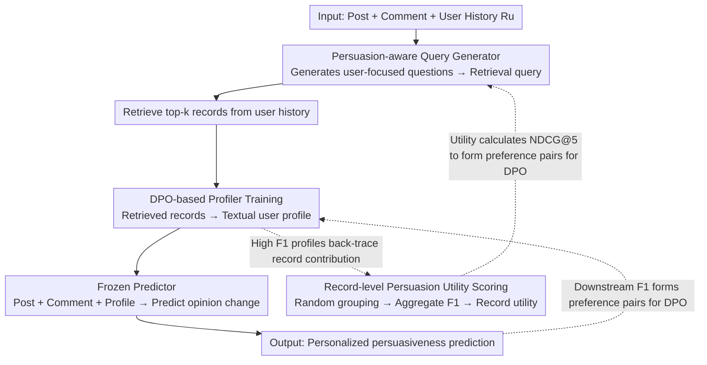

# Learning to Retrieve User History and Generate User Profiles for Personalized Persuasiveness Prediction

**Conference**: ACL 2026 Findings  
**arXiv**: [2601.05654](https://arxiv.org/abs/2601.05654)  
**Code**: [GitHub](https://github.com/holi-lab/ReCAP)  
**Area**: Personalized Recommendation and User Modeling  
**Keywords**: Persuasiveness Prediction, User Profile, Retrieval-Augmented, DPO Training, Personalization

## TL;DR

This paper proposes the ReCAP framework, which significantly improves personalized persuasiveness prediction by utilizing a trainable query generator and user profiler to retrieve persuasion-relevant information from user history and construct context-aware user profiles.

## Background & Motivation

**Background**: LLMs are increasingly utilized in decision-support applications to evaluate and generate persuasive messages, such as health coaching, educational tutoring, and targeted marketing. These scenarios require systems to predict the persuasive effect of a specific message on a specific user, known as **persuasiveness prediction**. Persuasion is inherently personalized—the same argument may be effective for one user but ineffective for another, depending on factors such as beliefs, values, experiences, and reasoning styles.

**Limitations of Prior Work**: Existing methods face three critical limitations: (1) dependence on predefined explicit user attributes (e.g., ideology, demographics) which are often unavailable and fail to capture deep persuasion-related factors; (2) use of heuristic retrieval methods (e.g., most recent records or random sampling) to select historical records, failing to adapt dynamically to the current persuasion context; (3) generic profiling techniques (e.g., demographic extraction) prove limited or even detrimental for persuasion prediction.

**Key Challenge**: Persuasiveness prediction requires **context-dependent** user information—which historical records are valuable for the current context depends on the topic and stance of the post. However, a systematic framework to optimize the utilization of user history is lacking.

**Goal**: Design a trainable user profiling framework to learn "what to retrieve" and "how to summarize." **Key Insight**: Decompose user profiling into two learnable modules: query generation and profile summarization, using downstream task performance as the supervisory signal. **Core Idea**: Effective user profiles are context-dependent and predictor-specific, rather than static attributes.

## Method

### Overall Architecture

ReCAP consists of a three-stage inference pipeline: (1) Retrieval stage—a trainable query generator $\phi^{\text{query}}$ generates user-focused retrieval queries to retrieve the top-k records from the user history $R_u$; (2) Profiling stage—a trainable profiler $\phi^{\text{prof}}$ summarizes retrieved records into a textual user profile $P_i$; (3) Prediction stage—a frozen predictor $\mathcal{M}^{\text{pred}}$ predicts opinion change based on the post, comment, and profile. This inference chain contains two trainable modules (query generator and profiler) without existing ground-truth labels; thus, training is bootstrapped via a feedback loop: downstream prediction F1 scores determine what constitutes a good profile (training the profiler), good profiles determine the utility of historical records (utility scoring), and record utility further determines what should be retrieved (training the query generator).

### Key Designs

**1. DPO-based Profiler Training: Transforming "what is a good profile" into an optimizable preference objective**

There are no ground-truth annotations for which user profiles are most helpful for persuasion prediction, making direct supervision impossible. ReCAP adopts a weak supervision approach: for the same user, multiple sets of historical records are randomly sampled to generate candidate profiles. The downstream prediction F1 score is then used as a proxy for profile quality. Preference pairs of "high F1 profile vs. low F1 profile" are constructed to train the profiler $\phi^{\text{prof}}$ via DPO to favor high F1 profiles. This translates an open-ended problem into a preference learning objective with explicit signals.

**2. Record-level Persuasion Utility Scoring: Estimating the marginal contribution of historical records**

To train the retriever on "which historical records to fetch," the utility of each record must be identified, yet no such annotations exist. ReCAP estimates this via marginal utility: user records are randomly grouped (5 records per group), repeated 3 times. For each group, the trained profiler generates 3 profiles at a temperature of 0.7. The F1 scores of all profiles containing a specific record are aggregated to serve as the utility score for that record. Records frequently appearing in high F1 profiles are deemed to have higher contributions.

**3. Persuasion-aware Query Generator: Retrieving "user attributes" instead of mirroring post text**

Post text typically contains topics and stances but lacks implicit user attributes like values or experiences. Using posts directly as queries fails to retrieve persuasion-relevant history. ReCAP designs the query generator $\phi^{\text{query}}$ with two-stage training: first, the model generates a user-focused question (e.g., "What are the user's core values regarding government intervention?"); then, the model generates the actual retrieval query based on the post and this question. Training signals originate from utility scores—NDCG@5 is calculated for retrieval results to form preference pairs for DPO.

### Loss & Training

Both the profiler and query generator are trained using DPO with Llama-3.1-8B-Instruct as the backbone. The predictor remains frozen (Llama-3.1-8B, Llama-3.3-70B, GPT-4o-mini) to ensure framework versatility. Training requires no ground-truth labels and is entirely driven by downstream task performance signals.

## Key Experimental Results

### Main Results

| Method | Llama-8B F1 | Llama-70B F1 | GPT-4o-mini F1 |
|------|------------|-------------|----------------|
| No Personalization | 0.346 | 0.328 | 0.253 |
| PAG | 0.257 | 0.314 | 0.083 |
| RecurSumm | 0.313 | 0.414 | 0.105 |
| HSumm | 0.324 | 0.406 | 0.113 |
| Retrieval-only | 0.295 | 0.418 | 0.132 |
| **Ours (ReCAP)** | **0.400** | **0.466** | **0.279** |

### Ablation Study

| Configuration | Llama-70B F1 | Description |
|------|-------------|------|
| Our retrieval + Our profiler | **0.466** | Full model |
| BGE retrieval + Our profiler | 0.445 | Swapping to semantic retrieval |
| Our retrieval + Base profiler | 0.393 | Swapping to untrained profiler |
| Our retrieval + Demographic | 0.384 | Swapping to demographic profiling |
| HyDE retrieval + Our profiler | 0.451 | Swapping to HyDE retrieval |

### Key Findings
- Existing personalization frameworks (PAG, HSumm, RecurSumm) transfer poorly to persuasiveness prediction; generic profiling may even degrade performance.
- The trained profiler consistently outperforms demographic and untrained profilers across all predictors.
- Effective profile dimensions vary by post topic and predictor—political posts rely on group identity, while social-moral posts rely on personal values.
- Different predictors prefer different user records (top-5 overlap only 0.24-0.28), indicating profiles should be predictor-specific.
- Inference costs are significantly reduced to 1/6 to 1/13 compared to full-history summarization methods.

## Highlights & Insights
- Transforming "what constitutes a good user profile" into DPO preference learning without explicit labels is a concise and effective methodology.
- The three-step training pipeline (Profiler → Utility Scoring → Query Generator) is delicately designed with clear optimization goals at each stage.
- The empirical finding that "profiles should be context-dependent and predictor-specific" provides broad insights, challenging the assumption of static user profiles.
- Generalization experiments on OpinionQA and PRISM suggest the framework is not limited to the Reddit context.

## Limitations & Future Work
- Primarily evaluated on the CMV Reddit dataset; extension to short-text conversations or real-time recommendations requires further validation.
- The record-level scoring phase consumes approximately 1.4B tokens (GPT-4o-mini), indicating significant training costs.
- The dynamic evolution of user profiles over time was not explored.
- Future work could extend the framework to multi-modal interaction histories and real-time personalization scenarios.

## Related Work & Insights
- **vs PAG (Richardson et al., 2023)**: PAG uses fixed retrieval and summarization; ReCAP dynamically adapts through a trainable query generator and profiler.
- **vs HSumm/RecurSumm**: Full-history summarization is costly and performs poorly on persuasion tasks; retrieval-based methods are more efficient.
- **vs Zhang et al. (2025)**: Fine-tuning predictors to encode user information requires retraining as new data arrives; ReCAP keeps the predictor frozen, making it more scalable.

## Rating
- Novelty: ⭐⭐⭐⭐ First systematic trainable user profiling framework for persuasiveness prediction, driven by DPO without labels.
- Experimental Thoroughness: ⭐⭐⭐⭐⭐ Multiple predictors × multiple retrieval strategies × multiple profiling methods × cross-dataset generalization × efficiency analysis.
- Writing Quality: ⭐⭐⭐⭐ Clear framework diagrams, rich hierarchical analysis, and rigorous experimental design.
- Value: ⭐⭐⭐⭐ The "context-aware + predictor-specific" user profiling concept is transferable to other personalized scenarios like recommendation and dialogue.

<!-- RELATED:START -->

## Related Papers

- [\[ACL 2026\] From Past To Path: Masked History Learning for Next-Item Prediction in Generative Recommendation](from_past_to_path_masked_history_learning_for_next-item_prediction_in_generative.md)
- [\[ACL 2026\] HORIZON: A Benchmark for in-the-wild User Behaviour Modeling](horizon_a_benchmark_for_in-the-wild_user_behaviour_modeling.md)
- [\[ACL 2026\] Mirroring Users: Towards Building Preference-aligned User Simulator with User Feedback in Recommendation](mirroring_users_towards_building_preference-aligned_user_simulator_with_user_fee.md)
- [\[ICLR 2026\] ProPerSim: Developing Proactive and Personalized AI Assistants through User-Assistant Simulation](../../ICLR2026/recommender/propersim_developing_proactive_and_personalized_ai_assistants_through_user-assis.md)
- [\[ACL 2026\] HARPO: Hierarchical Agentic Reasoning for User-Aligned Conversational Recommendation](harpo_hierarchical_agentic_reasoning_for_user-aligned_conversational_recommendat.md)

<!-- RELATED:END -->
