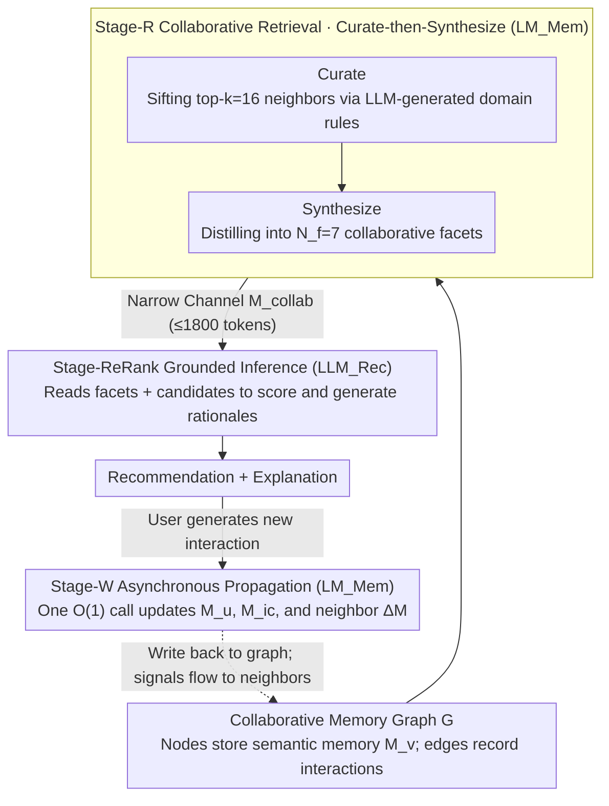

# MemRec: Collaborative Memory-Augmented Agentic Recommender System

**Conference**: ACL 2026  
**arXiv**: [2601.08816](https://arxiv.org/abs/2601.08816)  
**Code**: https://github.com/rutgerswiselab/memrec (Available)  
**Area**: Recommender Systems / LLM Agent / Collaborative Filtering  
**Keywords**: Collaborative Memory, Agentic RS, Memory Graph, Decoupled Architecture, Label Propagation

## TL;DR
MemRec employs a **lightweight LLM to specifically manage a dynamic "Collaborative Memory Graph"** (connecting semantic memories of multiple users and items via interaction edges), and feeds distilled "collaborative facets" to a heavy-duty reasoning LLM for final recommendation. By utilizing a "Curate-then-Synthesize" denoising strategy and asynchronous $O(1)$ label propagation updates, it achieves a relative H@1 improvement of **+15% to +29%** over the SOTA i2Agent across four benchmarks, with a significant **+91.4%** gain over Vanilla LLMs for sparse users.

## Background & Motivation
**Background**: The "form of memory" in recommender systems has undergone three stages of evolution: (1) sparse rating memory in the matrix factorization era; (2) dense embedding memory in the deep learning era; and (3) "semantic memory" in the LLM agentic RS era—where user preferences and item descriptions are written as natural language text for LLM reasoning. Recent research further categorizes semantic memory into three levels: "no memory → static memory → dynamic self-reflective memory" (e.g., i2Agent, AgentCF, RecBot for self-reflective updates of user/item profiles).

**Limitations of Prior Work**: All existing agentic RS rely on **"island memory"**—where the $M_u$ of each user and $M_i$ of each item are maintained independently. Recommendations for user $u$ only consider $M_u$, completely losing the core signals of the collaborative filtering era: **peer signals from similar users** and **transfer signals from co-occurring items**. This leads to poor performance for sparse users and cold-start items—reverting to pure individual memory whereas the GNN/LightGCN era successfully leveraged user-item graphs.

**Key Challenge**: Simply concatenating "all neighbor memories into the prompt" seems to fill the gap but immediately hits two walls: (1) **Cognitive Overload**: After stuffing massive text into the LLM context, the model is overwhelmed by noise (refer to the "Lost in the Middle" phenomenon), leading to a decline in ranking quality; (2) **Update Bottleneck**: Every new interaction requires cascading updates to the semantic memories of all neighbors. A naive implementation requires $O(|N_k|)$ LLM calls, which is cost-prohibitive for industrial deployment.

**Goal**: Re-inject "collaborative signals" into the agentic memory system while bypassing cognitive overload and update bottlenecks.

**Key Insight**: The authors draw inspiration from the Information Bottleneck theory—since raw neighbor information is excessive, a **compressed-but-task-relevant sub-representation** should be distilled. Furthermore, drawing on Label Propagation concepts, the "reflective updates for neighbors" are packaged into batch asynchronous tasks.

**Core Idea**: **Architectural Decoupling**—utilizing a lightweight $\text{LM}_{\text{Mem}}$ in the background to maintain the collaborative memory graph and perform curate-then-synthesize distillation, while a high-capacity foreground $\text{LLM}_{\text{Rec}}$ performs reasoning based only on the distilled high-concentration signals. This addresses overload while batching all updates into a single asynchronous LLM call ($O(1)$ per interaction).

## Method

### Overall Architecture
The core strategy of MemRec is to split "memory management" and "recommendation reasoning" between two LLMs of different scales, communicating only through a narrow channel. The system maintains a unified memory graph $G = (\mathcal{V}, E)$, where nodes $\mathcal{V} = \mathcal{U} \cup \mathcal{I}$ (users and items) store evolving semantic memories $M_v$, and edges $E$ record interactions and derivations. For each recommendation for $u$, the lightweight $\text{LM}_{\text{Mem}}$ first prunes and distills $u$'s neighbors into a small set of high-concentration "collaborative facets" $M_{\text{collab}}$ in the background. The heavy $\text{LLM}_{\text{Rec}}$ then processes these facets and candidates to generate scores and explanations. After an interaction, $\text{LM}_{\text{Mem}}$ asynchronously propagates the impact to relevant nodes in the graph. The stages are: Collaborative Retrieval (Stage-R), Grounded Inference (Stage-ReRank), and Asynchronous Collaborative Propagation (Stage-W).

### Key Designs

**1. Dual LLM Architecture Decoupling: Specialized Roles**

Concatenating all neighbor memories into a single model's prompt creates a cognitive bottleneck—LLMs struggle to balance "compression" and "inference" within a long raw context. Figure 6 demonstrates that a "Naive Agent" (a single model for both ingestion and ranking) quickly reaches a performance plateau. MemRec physically separates these roles: $\text{LM}_{\text{Mem}}$ ingests raw graph context for curation, synthesis, and propagation (using cost-effective models like gpt-4o-mini or local Qwen-2.5-7B / Llama-3-8B); $\text{LLM}_{\text{Rec}}$ is a heavy-duty model (gpt-4o-mini or gpt-4o) that only reads the distilled $M_{\text{collab}}$ for final ranking and rationale.

The two sides communicate only via the $M_{\text{collab}}$ narrow channel, aligning with the Information Bottleneck principle $T = \arg\max I(T; Y) - \beta I(T; X)$, where task-irrelevant $X$ is compressed while goal-relevant $Y$ is retained. This effectively separates System 1 (fast filtering) from System 2 (deep reasoning) and decouples their update frequencies. In the Books dataset, this decoupling yields a absolute **+34%** H@1 improvement over single-model solutions.

**2. Curate-then-Synthesize: Rule-Based Filtering and Facet Distillation**

Neighbors can number in the dozens, but the token budget for $\text{LLM}_{\text{Rec}}$ is limited to $\tau = 1800$. Traditional pruning methods like random-walk (lacking semantics) or GNN attention (requiring training/lacking interpretability) are unsuitable for zero-shot LLM agents. MemRec uses "LLM-as-Rule-Generator" as a compromise: $\text{LM}_{\text{Mem}}$ analyzes domain statistics $\mathcal{D}_{\text{domain}}$ offline to generate interpretable heuristic rules $R_{\text{domain}} \leftarrow \text{LM}_{\text{Mem}}(\mathcal{D}_{\text{domain}} \| P_{\text{meta}})$. For example, for "Books," it generates "prioritize similarity in genre/theme"; for "Yelp," "prioritize cuisine + price + recent visits." Online, these rules act as high-speed filters to sift $N(u)$ down to top-$k$ $N_k'(u)$ in milliseconds.

In the synthesize phase, the target user's **complete $M_u^{t-1}$** and the neighbors' **lightweight tiered representations** are fed to $\text{LM}_{\text{Mem}}$. It outputs $N_f = 7$ structured facets (each containing a theme, confidence score, and neighbor evidence). The tiered representation saves tokens by using truncated memories for item neighbors and only the titles of the last 3 interacted items as dense proxies for user neighbors.

**3. Asynchronous Collaborative Propagation: Compressing Complexity to $O(1)$**

The memory graph evolves with interactions. A naive synchronous approach—calling the LLM for each neighbor and repeatedly stuffing user context into prompts—results in $O(|N_k'|)$ calls and massive token redundancy. Borrowing from Label Propagation, MemRec treats an "interaction" as a "new label" spreading through similarity relations. When $u$ interacts with $i_c$ at time $t$, a unified prompt $P_{\text{update}}$ enables $\text{LM}_{\text{Mem}}$ to produce $(M_u^t, M_{i_c}^t, \{\Delta M_{\text{neigh}}\})$ in **a single call**. This updates the memories of both parties while outputting "incremental update segments" $\Delta M$ for every neighbor.

This process is asynchronous and does not block the online ranking path, reducing call complexity to $O(1)$ per interaction and significantly compressing total token usage. Crucially, "batch incremental" modeling ensures collaborative signals actually flow to neighbors.

### Key Experimental Results

### Main Results

**H@1 and N@5 across 4 benchmarks (Amazon Books / Goodreads / MovieTV / Yelp, N=10 candidates)**:

| Dataset | Method | H@1 | N@5 | H@1 Gain |
|---------|--------|-----|-----|----------|
| **Books** | i2Agent (SOTA) | 0.4453 | 0.6138 | — |
| | LightGCN | 0.1753 | 0.3592 | — |
| | **Ours (MemRec)** | **0.5117** | **0.6601** | **+14.91%** |
| **Goodreads** | i2Agent | 0.3099 | 0.5481 | — |
| | **Ours (MemRec)** | **0.3997** | **0.6112** | **+28.98%** |
| **MovieTV** | i2Agent | 0.4912 | 0.6672 | — |
| | **Ours (MemRec)** | **0.5882** | **0.7422** | **+19.75%** |
| **Yelp** | i2Agent | 0.4205 | 0.6007 | — |
| | **Ours (MemRec)** | **0.4868** | **0.6463** | **+15.77%** |

All improvements are statistically significant ($p < 0.05$). The largest gains are observed in the sparsest datasets (Books / Goodreads).

### Ablation Study (Books Dataset)

| Configuration | H@1 | H@5 | N@5 | H@1 Drop |
|---------------|-----|-----|-----|----------|
| MemRec (Full) | 0.527 | 0.803 | 0.670 | — |
| w/o Collab. Write (Disable async propagation) | 0.505 | 0.814 | 0.665 | **−4.2%** |
| w/o LLM Curation (Replace domain with general rules) | 0.498 | 0.788 | 0.648 | **−5.5%** |
| **w/o Collab. Read (Disable collab. retrieval)** | **0.475** | 0.769 | 0.624 | **−9.9%** |

### Key Findings
- **Collaborative Read > Collaborative Write > LLM Curation > Memory Alone**: The H@1 drop sequence confirms that "introducing neighbor information into the inference path" is the most beneficial design.
- **Sparse Users Benefit Most**: For low-activity users, MemRec achieves a **+91.4%** H@1 gain over Vanilla LLM, proving collaborative signals are the missing link for isolated agents.
- **Robustness to Noise**: MemRec maintains H@1=0.491 even under 30% noise injection, as LLM curation acts as a "semantic filter" to exclude irrelevant peers.
- **Pareto Frontier Expansion**: Standard (4o-mini) H@1=0.524 / ~16.5s latency; Ceiling (gpt-4o) H@1=0.580. The "Vector" configuration offers sub-millisecond latency.
- **Token I/O Ratio (3.9:1)**: MemRec exploits asymmetric commercial LLM pricing (output tokens are 3-4x more expensive) by keeping outputs concise and inputs detailed.
- **Rationale Quality**: specificity and relevance significantly improved ($p<0.001$) under GPT-4o-as-judge evaluation.

## Highlights & Insights
- **Decoupled Architecture as a Paradigm**: The separation of memory management and reasoning is applicable to any agent scenario involving overloaded context (e.g., long-form QA, code repository agents).
- **LLM-as-Rule-Generator**: Generating interpretable rules for offline sifting combines LLM semantic understanding with rule-based speed.
- **$O(1)$ Propagation Complexity**: This makes "collaborative updates" industrially viable for the first time in the LLM era by treating updates as label propagation.
- **Engineering for Token Pricing**: Optimizing for high input and low output volume is a crucial, often overlooked dimension of LLM product design.

## Limitations & Future Work
- **Limitations**: (1) Collaborative propagation is limited to 1-hop; (2) Domain rules are generated offline and may struggle with highly dynamic fields like news; (3) Ceiling performance still relies on commercial models like gpt-4o.
- **Future Directions**: (1) Federated memory updates with differential privacy; (2) Adaptive learning for $k$ and $N_f$; (3) Multi-hop propagation with trust-score gating; (4) Distilling $\text{LM}_{\text{Mem}}$ into a reward-tuned small model.

## Related Work & Insights
- **vs. i2Agent / AgentCF / RecBot**: These are "isolated" dynamic memory agents where updates are restricted to the interacting pair.
- **vs. LightGCN / SASRec**: Traditional CF fails on sparse data; MemRec reactivates collaborative graph ideas using LLM reasoning.
- **vs. MemGPT / Generative Agents**: These use decoupled memory but lack graph structures and collaborative propagation.
- **Insight**: Transitioning from No → Static → Dynamic → Collaborative memory levels leads to consistent H@1 gains. Classic graph algorithms (Label Propagation, PageRank) are valuable in the agent era.

## Rating
- Novelty: ⭐⭐⭐⭐ 
- Experimental Thoroughness: ⭐⭐⭐⭐⭐ 
- Writing Quality: ⭐⭐⭐⭐⭐ 
- Value: ⭐⭐⭐⭐⭐ 

<!-- RELATED:START -->

## Related Papers

- [\[ACL 2026\] ClusterRAG: Cluster-Based Collaborative Filtering for Personalized Retrieval-Augmented Generation](clusterrag_cluster-based_collaborative_filtering_for_personalized_retrieval-augm.md)
- [\[NeurIPS 2025\] Radial Neighborhood Smoothing Recommender System](../../NeurIPS2025/recommender/radial_neighborhood_smoothing_recommender_system.md)
- [\[ICML 2026\] Learning Design Skills as Memory Policies for Agentic Photonic Inverse Design](../../ICML2026/recommender/learning_design_skills_as_memory_policies_for_agentic_photonic_inverse_design.md)
- [\[ICML 2026\] Incentivized Exploration with Stochastic Covariates: A Two-Stage Mechanism Design for Recommender System](../../ICML2026/recommender/incentivized_exploration_with_stochastic_covariates_a_two-stage_mechanism_design.md)
- [\[ACL 2026\] HARPO: Hierarchical Agentic Reasoning for User-Aligned Conversational Recommendation](harpo_hierarchical_agentic_reasoning_for_user-aligned_conversational_recommendat.md)

<!-- RELATED:END -->
