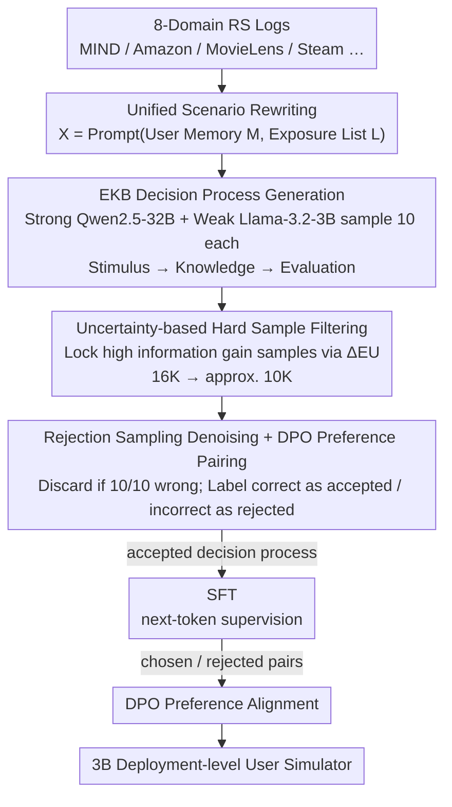

# Mirroring Users: Towards Building Preference-aligned User Simulator with User Feedback in Recommendation

**Conference**: ACL 2026  
**arXiv**: [2508.18142](https://arxiv.org/abs/2508.18142)  
**Code**: https://github.com/Joinn99/UserMirrorer  
**Area**: User Simulation / Recommendation Systems / RLHF / LLM Data Distillation  
**Keywords**: User Simulator, Recommendation Systems, Uncertainty Decomposition, DPO Preference Alignment, Decision Process Distillation

## TL;DR
The authors rewrite "user feedback logs" in recommendation systems into a unified simulation scenario of "User Memory + Exposure List" understandable by LLMs. They then generate explicit chain-of-thought decision processes as "clarifications" using the EKB consumer decision model. Through uncertainty decomposition and rejection sampling, 10K high-quality SFT/DPO data points are distilled, allowing a 3B Llama user simulator to outperform GPT-5 and Gemini-2.5-Flash in predicting real user behavior across 8 domains.

## Background & Motivation

**Background**: Recommendation system iteration relies on user feedback, but online A/B testing involves long cycles and privacy constraints. Consequently, academia has turned to user simulators—constructing "user digital twins" to replicate real behavior offline. Early versions were rule-based or RL-based simulators, while recent work uses LLM agents with prompt engineering to simulate user decision-making.

**Limitations of Prior Work**: (1) Existing LLM simulators are rarely fine-tuned on real user feedback, leading to weak task alignment; (2) High performance currently requires GPT-4 level models, making billion-user scaling costs prohibitive; (3) Raw user feedback possesses three characteristics that make fine-tuning difficult—**ambiguity** (lack of decision context; "clicks" alone do not explain why), **noise** (accidental clicks, click farming), and **massive volume** (filtering high-quality samples from millions of logs is a new challenge).

**Key Challenge**: High-quality decision reasoning can only be generated by powerful LLMs, but deployment requires small models. The challenge lies in "distilling" the decision-making capabilities of strong LLMs into lightweight LLMs while simultaneously managing the noise and ambiguity of the data itself.

**Goal**: To build a unified framework that transforms RS logs into trainable "Scenario—Decision—Behavior" triplets and automatically selects the subset that "maximizes alignment effectiveness."

**Key Insight**: The **EKB model** (Engel-Kollat-Blackwell) from consumer behavior naturally characterizes the purchase decision chain of stimulus → knowledge → evaluation. Using a strong LLM to generate explicit decision processes following EKB serves as a "clarification" for each sample. This allows for uncertainty decomposition using the input-clarification framework from Hou et al. 2024 to automatically identify samples with the "highest training value for the weak model."

**Core Idea**: Use EKB decision processes as clarifications + the epistemic uncertainty gap between strong and weak models to select difficult samples + rejection sampling for denoising + DPO preference alignment to distill 16K candidate scenarios into 10K high-quality data points.

## Method

### Overall Architecture
UserMirrorer is an end-to-end "data construction + model training" pipeline aimed at refining noisy, context-free RS logs into training data that teaches small models to align with real users. First, RS logs from 8 domains (MIND/Amazon/MovieLens/Steam/Goodreads/MobileRec/LastFM/KuaiRec2) are rewritten into a unified simulation scenario $\bm{X}=\text{Prompt}(\bm{M},\bm{L})$, where $\bm{M}$ is user memory (profile + history) and $\bm{L}$ is an exposure list of length $N+1$, with each item tagged [A]/[B]/[C]. Second, Qwen2.5-32B (strong) and Llama-3.2-3B (weak) each sample 10 EKB decision processes to identify "hard samples" that the strong model explains well but the weak model fails to grasp. Rejection sampling is then used for denoising and pairing into chosen/rejected preference sets. Finally, Llama-3.2-3B undergoes SFT followed by DPO, resulting in a 3B deployment-level user simulator.

### Key Designs

**1. EKB Decision Process Generation: Supplementing each click with explicit "why" reasoning**

Original logs only contain the result "user clicked [C]" without decision context, preventing the model from learning preferences by looking at results alone. This paper supplements each $(\bm{M}, \bm{L}, a)$ sample with a chain-of-thought based on the EKB model: first **Stimulus** (identifying external spatio-temporal/social factors and internal needs/emotions triggering the behavior), then **Knowledge** (extracting relevant attributes from the exposure list), and finally **Evaluation** (evaluating candidates using intuitive or logical styles, corresponding to Kahneman's System 1 / System 2). The strong LLM generates the decision process $\bm{D}$ first and then predicts the action $\bm{Y}$.

The value of this decision process extends beyond supplementing context: in the framework of Hou et al. 2024, clarification can decompose total uncertainty into aleatoric (data ambiguity) and epistemic (model capability deficiency). The EKB decision process serves as a natural clarification for "why the user chose this," enabling the quantification of epistemic uncertainty. This injects inductive biases from human psychology into LLM decision-making, making it more stable than free-form generation.

**2. Uncertainty-based Hard Sample Filtering: Locking samples with high training value via entropy difference**

Among 16K candidate scenarios, many samples are either too simple or too nonsensical; training on everything would hinder alignment. The authors generate $N=10$ decision processes each using strong/weak LLMs. The weak LLM is then used to predict behavior conditioned on both $\bm{D}$ types, calculating:

$$\Delta_{EU}(\bm{X}, (A,B)) = \mathbb{E}_{P(\bm{D}_A|\bm{X})}\mathcal{H}(P(\bm{Y}|\bm{X}\oplus \bm{D}_A)) - \mathbb{E}_{P(\bm{D}_B|\bm{X})}\mathcal{H}(P(\bm{Y}|\bm{X}\oplus \bm{D}_B))$$

A large $\Delta_{EU}$ means that once the strong model $A$ provides clarification, the prediction entropy of the weak model $B$ is significantly reduced. These "information gain" maximized samples are exactly the hard samples where the weak model must rely on strong model reasoning to align with real users. Entropy difference is used instead of accuracy difference because accuracy is prone to noise from randomness, while entropy difference accurately measures "how much epistemic signal the decision process provides," making it robust for alignment tasks with stochastic answers.

**3. Rejection Sampling Denoising + DPO Preference Pair Construction: Data-level sanity checks followed by contrastive signals**

Logs contain data-level noise like accidental clicks or click farming. Direct training would treat noise as true signal. For every hard sample, the authors match the predictions of the 10 decision processes against real user behavior: if none of the 10 match, the entire sample is discarded as noise. For remaining samples, "correct prediction" processes are labeled as accepted, and "incorrect" ones as rejected, with the most confident pair selected as a DPO preference pair. This process acts as a sanity check using "the ability to explain real behavior" for denoising, while DPO provides explicit "reason this way vs. not that way" contrastive signals, optimizing both "content quality" and "user behavior fit" simultaneously.

### Loss & Training
Two-stage training: (1) **SFT Phase** uses only accepted decision processes for next-token prediction; (2) **DPO Phase** uses the constructed preference pairs following the standard formula from Rafailov et al. 2023. GRPO (Shao et al. 2024) was also tested as a baseline, using matching with real behavior as a rule-based reward. 10K data points proved optimal (minimal gains beyond 10K-40K). Inference uses temperature=1.0 and top-p=0.9, averaging over 5 samples per scenario.

## Key Experimental Results

### Main Results: User Behavior Prediction Accuracy (Average across 8 domains, %)

| Model | Scale | Overall Acc. | Remarks |
|------|------|-------------|------|
| Llama-3.2-3B (base) | 3B | 22.7 | Baseline |
| Qwen2.5-32B-Instruct (Teacher) | 32B | 39.7 | Strong Teacher |
| GPT-5 (2025-08-07) | Closed | 42.2 | Commercial Flagship |
| Gemini-2.5-Flash | Closed | 42.5 | Commercial Flagship |
| Gemini-3.0-Pro-Preview | Closed | 47.7 | Strongest Commercial |
| Llama-3B + SFT | 3B | 46.0 | Base SFT > GPT-5 |
| Llama-3B + SFT + GRPO | 3B | 52.7 | RL gains |
| **Llama-3B + SFT + DPO** | **3B** | **55.0** | **+7.3 over Gemini-3.0-Pro** |
| Qwen2.5-3B + SFT + DPO | 3B | 54.7 | Robust across backbones |

### Ablation Study: Data Selection Strategy (MIND / Synthetic Overall, %)

| Strategy | MIND Acc. | Synthetic Overall |
|------|-----------|-------------------|
| Llama-3B base | 19.9 | 22.7 |
| Random (w/o Decisions) | 25.7 | 48.3 |
| Random (w/ Decisions) | 31.4 | 53.9 |
| High Accuracy filter | 32.4 | 53.3 |
| Low Accuracy filter | 30.9 | 54.5 |
| Diff. Accuracy filter | 30.1 | 53.9 |
| IFD Score | 29.9 | 52.7 |
| **Ours (Uncertainty + Rejection)** | **34.0** | **55.0** |

### Key Findings
- **EKB Decision Processes are decisive**: Switching "random selection without decisions" to "random selection with decisions" increased MIND accuracy from 25.7 to 31.4, showing that explicit chain-of-thought provides significant gains even without sample selection.
- **Uncertainty Gap > Accuracy Gap**: All accuracy-based heuristics and IFD scores were inferior to filtering based on epistemic uncertainty difference, proving that entropy differences are more effective at locking in high-value hard samples.
- **DPO > GRPO**: DPO attained 55.0 vs GRPO's 52.7. The authors suggest GRPO's binary reward is too coarse; the continuous supervision signal from preference pairs is more stable for "soft" tasks like user behavior.
- **3B outperforms 47B/GPT-5**: Real user feedback contains "domain implicit preferences" that base LLMs cannot learn. Strong models have reasoning but lack alignment. Filtering strong reasoning with real feedback for small model DPO is a cost-effective "distillation+alignment" strategy.
- **Downstream recommendation gains**: Using simulated feedback for incremental training of LightGCN/DiffRec/SASRec/NARM yielded up to +45.3% MRR@5 on Movielens (DiffRec), indicating simulation signals truly benefit recommendation models.

## Highlights & Insights
- **Dual utilization of "Decision Processes" as clarifications**: While Hou et al. 2024 used clarification solely for uncertainty estimation, this work cleverly uses the same decision process for (a) SFT supervision, (b) DPO preference pair contrast, and (c) uncertainty measurement for data filtering—achieving high data efficiency.
- **Effective migration of "Classical Consumer Behavior" to LLM agents**: EKB models inject human psychology inductive biases into LLM decisions (stimulus→knowledge→evaluation), stabilizing chain-of-thought more than free-form generation. This approach is transferable to other tasks requiring "why" modeling (dialogue policy, NPCs, exam answering).
- **Entropy difference for data filtering**: This serves as a general trick for alignment tasks with stochastic answers—using logits entropy bypasses ground truth noise.

## Limitations & Future Work
- The current model only supports text, lacking multimodal inputs (limiting short video or music cover scenarios) and only models "interaction upon viewing," ignoring "viewing but not interacting/leaving" (implicit feedback).
- The EKB model assumes a "rational consumer," which may not fit impulsive browsing behaviors. While 10K samples showed diminishing returns, whether this scales to millions across domains is unverified.
- Future improvements could include "hierarchical" decision processes (coarse-to-fine), combining process reward models to rate EKB stages independently, or using step-wise DPO for independent stimulus/knowledge/evaluation alignment.

## Related Work & Insights
- **vs. AgentCF / Agent4Rec / RecMind**: These rely on prompt engineering + memory for simulation without fine-tuning LLMs, limiting performance by the base LLM's ceiling. UserMirrorer leverages real feedback for SFT+DPO, allowing a 3B model to beat GPT-5.
- **vs. LLaVA-Critic / UnifiedReward**: These focus on "rating alignment," while UserMirrorer focuses on "behavior alignment." Both utilize the "small data quality filtering + DPO" paradigm, confirming that quality > quantity.
- **vs. Hou et al. 2024 (Input Clarification Ensembling)**: Original work used clarifications for LLM uncertainty estimation; this work concretizes them into EKB decision processes for RS user simulation, demonstrating an elegant transfer of theoretical tools to specific scenarios.

## Rating
- Novelty: ⭐⭐⭐⭐ The combination of EKB, uncertainty decomposition, and rejection sampling is ingenious and provides significant engineering aesthetic.
- Experimental Thoroughness: ⭐⭐⭐⭐⭐ 8 domains, 4 recommendation backbones, 6 filtering baselines, and data size ablations provide comprehensive coverage.
- Writing Quality: ⭐⭐⭐⭐ Motivation is clear with rigorous formulas; EKB introduction might be slightly abrupt for those without psychology backgrounds but is well-justified.
- Value: ⭐⭐⭐⭐⭐ Providing a deployable 3B simulator, public datasets, and framework code offers significant value to RS, agent, and data distillation communities.

<!-- RELATED:START -->

## Related Papers

- [\[ACL 2026\] HARPO: Hierarchical Agentic Reasoning for User-Aligned Conversational Recommendation](harpo_hierarchical_agentic_reasoning_for_user-aligned_conversational_recommendat.md)
- [\[ACL 2026\] Decisive: Guiding User Decisions with Optimal Preference Elicitation from Unstructured Documents](decisive_guiding_user_decisions_with_optimal_preference_elicitation_from_unstruc.md)
- [\[ACL 2026\] Learning to Retrieve User History and Generate User Profiles for Personalized Persuasiveness Prediction](learning_to_retrieve_user_history_and_generate_user_profiles_for_personalized_pe.md)
- [\[ACL 2026\] HORIZON: A Benchmark for in-the-wild User Behaviour Modeling](horizon_a_benchmark_for_in-the-wild_user_behaviour_modeling.md)
- [\[ACL 2026\] Personalizing LLMs with Binary Feedback: A Preference-Corrected Optimization Framework](personalizing_llms_with_binary_feedback_a_preference-corrected_optimization_fram.md)

<!-- RELATED:END -->
