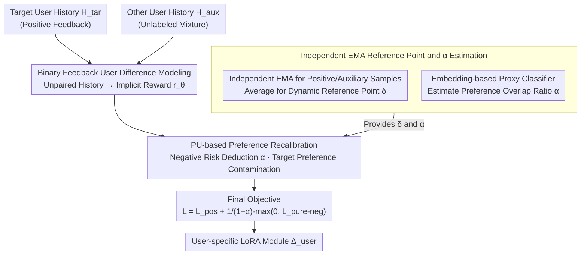

# Personalizing LLMs with Binary Feedback: A Preference-Corrected Optimization Framework

**Conference**: ACL2026  
**arXiv**: [2605.10043](https://arxiv.org/abs/2605.10043)  
**Code**: Not released  
**Area**: LLM Personalization / Preference Optimization / Recommendation & User Modeling  
**Keywords**: LLM Personalization, Binary Feedback, PU Learning, Preference Recalibration, User Diversity

## TL;DR
This paper proposes C-BPO, which treats target user history as positive feedback and other users' history as noisy unlabeled negative feedback. It utilizes PU learning to correct the mis-penalization caused by "preference overlap," allowing the LLM to learn unique user preferences without suppressing general task capabilities.

## Background & Motivation
**Background**: Common practices for LLM personalization fall into three categories: retrieving user history/profiles in prompts, training lightweight modules like LoRA on user history, or constructing preference pairs for DPO-style optimization. Their shared goal is to make model responses resemble content a specific user would write, select, or prefer.

**Limitations of Prior Work**: Many methods focus solely on the target user's own history, equating personalization to "mimicking what this user wrote in the past." However, the truly informative part of user preference often stems from cross-user differences: how this user differs from others. Furthermore, DPO requires paired winner/loser completions for the same input, whereas real-world user history typically consists of unpaired $(x, y)$ samples.

**Key Challenge**: Data from other users is both valuable and risky. It provides natural contrastive signals to help the model identify who the target user is "not" like; however, other users also share a vast amount of general task knowledge and group preferences. If all other user data is treated as negative samples, the model erroneously penalizes capabilities needed by everyone—such as news headlines being concise, academic titles being accurate, or reviews focusing on product attributes.

**Goal**: The authors aim to convert unpaired user history into optimizable preference signals while addressing three problems: replacing pairwise preferences with binary feedback, decoupling shared preferences from auxiliary user data, and maintaining stable training boundaries when target samples are scarce relative to auxiliary samples.

**Key Insight**: The paper borrows from Positive-Unlabeled (PU) learning: target user history is the positive class, while auxiliary user history is not a clean negative class but a mixture of positive preferences and true negative preferences. By estimating the proportion of "target-user-like" data within the auxiliary data, the positive bias can be subtracted from the negative risk.

**Core Idea**: Change "other user data = negative samples" to "other user data = unlabeled mixture samples," and use PU risk decomposition to derive a purified negative loss for binary preference optimization.

## Method
The premise of C-BPO is that personalization should not just fit what the target user has written, but model "the difference between the target user and the general population." Instead of manually constructing contrastive responses for each user, it uses user history directly as a signal—treating target user history $H_{\text{tar}}$ as positive feedback and auxiliary user history $H_{\text{aux}}$ as an auxiliary set. It then uses PU learning to deduct "preferences shared with the target user" from the auxiliary set to avoid penalizing commonalities.

### Overall Architecture
Given a base model $\pi_{\text{base}}$, the personalized model is denoted as $\pi_{\text{user}} = \pi_{\text{base}} + \Delta_{\text{user}}$, where $\Delta_{\text{user}}$ is a user-specific lightweight LoRA module. Training does not require paired responses for the same prompt; it only needs unpaired samples like target history $(x,y)$ and auxiliary history $(x,y)$. The model adopts the implicit reward framework from binary feedback preference optimization (e.g., BCO/KTO): $r_\theta(x,y) = \beta \log \frac{\pi_\theta(y|x)}{\pi_{\text{ref}}(y|x)}$, where positive samples aim for rewards above a reference point $\delta$, and negative samples aim for rewards below $\delta$. C-BPO introduces two key modifications: treating the auxiliary set as an unlabeled mixture distribution and using a correction term to subtract target preference contamination; and using the respective EMA reward means of positive/auxiliary samples to estimate the reference point, preventing decision boundary drift as negative sample volume changes. Inference requires only the trained user adapter.

### Key Designs

**1. Binary User Difference Modeling: Replacing Paired Preferences with Unpaired History**

Real-world personalization data is usually "content the user wrote" or "content the user liked," rather than standard RLHF preference pairs. The DPO requirement for "winner/loser pairs under the same input" cannot be met. C-BPO utilizes binary feedback: target user samples $H_{\text{tar}}$ are treated as positive feedback, and auxiliary user samples $H_{\text{aux}}$ serve as the source of implicit negative feedback. The loss follows the BCO form, where positive samples optimize $-\log\sigma(r_\theta(x,y)-\delta)$ and negative samples optimize $-\log\sigma(-(r_\theta(x,y)-\delta))$, allowing the model to learn directly from raw history without auxiliary contrastive responses.

**2. PU-based Preference Recalibration: Deducting Shared Knowledge from Negative Signals**

Treating all other user data as negative is hazardous—if everyone prefers concise headlines, penalizing other users' headlines forces the model to degrade its general capabilities. C-BPO treats $H_{\text{aux}}$ as an unlabeled set mixed with positive and true negative preferences. By estimating the proportion $\alpha$ of "target-like" data in the auxiliary set, the positive bias can be removed. The purified negative loss is defined as:

$$L_{\text{pure-neg}} = \mathbb{E}_{H_{\text{aux}}}[l(g,-1)] - \alpha\, \mathbb{E}_{H_{\text{tar}}}[l(g,-1)]$$

The final objective is $L_{\text{C-BPO}} = L_{\text{pos}} + \frac{1}{1-\alpha}\max(0, L_{\text{pure-neg}})$. After deducting shared preferences from the negative signal, the remaining gradients focus on user specificity, which is the core distinction from KTO/BCO (which assume clean negative samples).

**3. Independent EMA Reference Points and Alpha Estimation: Stabilizing Boundaries and Per-user Calibration**

Auxiliary data is often significantly larger than target data. Averaging reference points within a batch (as in BCO) causes the decision boundary $\delta$ to drift toward the dominant auxiliary distribution. C-BPO maintains separate EMAs for positive and auxiliary reward means, using their average as the dynamic $\delta_{\text{EMA}}$. $\alpha$ is estimated via a proxy classifier on user history embeddings: it distinguishes target vs. auxiliary users and sets the average "target-user-like" probability in the auxiliary set as the correction intensity. Thus, $\alpha$ is an interpretable "preference overlap ratio"—"Non-unique" users with high overlap require a larger $\alpha$ to filter out common preferences, while "Unique" users benefit from a lower $\alpha$.

### Loss & Training
The positive loss is $L_{\text{pos}} = \mathbb{E}_{H_{\text{tar}}}[l(g,+1)]$, where $l(g,+1) = -\log\sigma(r_\theta(x,y)-\delta)$. The negative term uses the purified $\max(0, L_{\text{pure-neg}})$ to prevent PU risk estimation from becoming negative under high-capacity models, which leads to overfitting. Implementation uses LoRA (rank 8, scaling 16); training lasts 3 epochs with AdamW, linear warmup, and a learning rate of $1\text{e-}6$.

## Key Experimental Results

### Main Results
Evaluation was conducted on five personalization generation tasks from LaMP and LongLaMP: News Headline, Scholarly Title, Abstract Gen, Review Writing, and Topic Writing. Mistral-7B-Instruct-v0.3 was used as the base model, with ROUGE-1 / ROUGE-L as metrics.

| Task | Base | OPPU | CoPE | BCO | C-BPO | Main Conclusion |
|------|------|------|------|-----|-------|----------|
| Abstract Gen. R-1 / R-L | 0.341 / 0.186 | 0.378 / 0.218 | 0.392 / 0.239 | 0.373 / 0.231 | 0.398 / 0.269 | C-BPO performs best, especially in R-L |
| Review Writing R-1 / R-L | 0.287 / 0.126 | 0.319 / 0.134 | 0.335 / 0.146 | 0.315 / 0.132 | 0.353 / 0.154 | Auxiliary contrast helps capture review style |
| Topic Writing R-1 / R-L | 0.246 / 0.105 | 0.278 / 0.112 | 0.281 / 0.120 | 0.272 / 0.112 | 0.291 / 0.118 | Best R-1, R-L slightly below CoPE |
| News Headline R-1 / R-L | 0.119 / 0.105 | 0.203 / 0.182 | 0.205 / 0.184 | 0.197 / 0.179 | 0.215 / 0.198 | Outperforms retrieval and SFT methods |
| Scholarly Title R-1 / R-L | 0.409 / 0.324 | 0.510 / 0.454 | 0.519 / 0.461 | 0.507 / 0.443 | 0.539 / 0.481 | Stable gains in academic titling |

| Dataset Statistics | Samples | Avg Input Len | Avg History Len | Avg Output Len |
|------|------|------|------|------|
| Abstract Generation | - | 233.1 ± 117.5 | 1296.7 ± 446.4 | 210.5 ± 92.8 |
| Review Writing | 19,649 | 407.2 ± 299.5 | 759.3 ± 324.2 | 511.8 ± 294.2 |
| Topic Writing | 21,119 | 358.3 ± 316.9 | 260.6 ± 314.0 | 358.3 ± 255.4 |
| News Headline Generation | 7,275 | 15.5 ± 6.0 | 270.1 ± 182.1 | 18.6 ± 5.2 |
| Scholarly Title Generation | 16,076 | 17.9 ± 6.1 | 444.0 ± 121.6 | 16.4 ± 5.8 |

### Ablation Study

| Analysis Item | Observation | Implication |
|------|------|------|
| Auxiliary Ratio `x = |H_aux| / |H_tar|` | When target history is < 50%, `x=1.5` underperforms; more auxiliary data is only beneficial when target history is sufficient. | Negative signals require enough positive anchoring to accurately decouple shared preferences. |
| Removing Indep. EMA | Performance drops significantly when `x` deviates from 1.0; falls below OPPU at `x=1.5` with low target history. | Reference points must not be dominated by the auxiliary distribution; EMA serves as a stabilizer. |
| User Uniqueness Groups | KTO/BCO degrade significantly in Non-unique groups; C-BPO utilizes auxiliary information stably across all groups. | Standard BPO fails to handle preference overlap; the correction term is vital. |
| Alpha Sensitivity | Non-unique users require higher `alpha` to filter shared preferences; Unique users have lower optimal `alpha`. | `alpha` is an interpretable preference overlap ratio rather than just a tuning hyperparameter. |
| Token-level Log-prob Shift | Compared to BCO, C-BPO reduces the over-suppression of shared preference tokens in auxiliary data. | PU correction successfully protects general task knowledge. |

### Key Findings
- Treating other user data as purely negative is unreliable. KTO and BCO performed worse than OPPU or CoPE on several tasks, indicating that binary feedback alone cannot solve personalization without addressing preference overlap.
- C-BPO outperforms CoPE on most metrics across 5 tasks without needing rejection-sampling to construct negative responses, using data formats closer to real user history.
- The most significant evidence comes from the user uniqueness analysis: when auxiliary users are similar to the target, standard BPO mis-penalizes shared preferences. C-BPO extracts personalization signals more effectively when differences are subtle.
- The EMA reference point is a crucial stabilizer for training under data imbalance, which is common in real-world scenarios where auxiliary pools far exceed target history.

## Highlights & Insights
- The paper shifts the perspective of personalization from "pure fitting of the target user" to "modeling the target user's relative difference from the population." Personalization is inherently relative.
- The migration of PU learning is elegant: auxiliary user history is modeled as an unlabeled mixture distribution containing target-like preferences. This is more realistic than assuming all other users represent what a user dislikes.
- The interpretability of `alpha` as a "preference overlap ratio" provides a more feasible deployment path than manual grid searches by using embedding-based proxy classifiers.
- C-BPO offers insights for recommendation systems: many implicit negative feedbacks are mixed signals. PU-style correction can be migrated to ranking and generative recommendation.

## Limitations & Future Work
- Evaluation relies heavily on ROUGE, which has limitations in capturing personalized style and user satisfaction. Future work should include human preference evaluation.
- `alpha` estimation depends on history embeddings. If embeddings fail to capture style or target history is too short, the correction coefficient may be unstable.
- Auxiliary data selection remains simple (random or embedding-based). Real systems need to consider user privacy, group bias, and cold-start scenarios.
- The model assumes all target history is positive feedback, which may not be true (e.g., accidental behavior or low-quality output). Integrating temporal decay or explicit feedback confidence is a future direction.
- Training per-user adapters poses storage and training costs at scale; exploring hyper-networks or user-cluster adapters is necessary.

## Related Work & Insights
- **vs RAG / PAG**: RAG/PAG add history to prompts without parameter changes; C-BPO trains user modules to absorb fine-grained style but incurs higher training costs.
- **vs OPPU / SFT**: OPPU fits target history through MLE, often learning common task patterns; C-BPO amplifies user differences via auxiliary contrast.
- **vs DPO / CoPE**: CoPE constructs negative samples via rejection sampling for DPO; C-BPO uses raw unpaired history directly, simplifying data processing.
- **vs KTO / BCO**: While KTO/BCO support binary feedback, they assume clean negatives. C-BPO's core improvement is acknowledging and correcting the positive bias in auxiliary data using PU risk decomposition.

## Rating
- Novelty: ⭐⭐⭐⭐☆ Solid use of PU learning to explain and fix preference overlap in personalization.
- Experimental Thoroughness: ⭐⭐⭐⭐☆ Covers 5 tasks and various baselines, though lacks real-world user preference tests.
- Writing Quality: ⭐⭐⭐⭐☆ Clear theoretical derivation and experimental narrative.
- Value: ⭐⭐⭐⭐⭐ Highly relevant for personalized LLMs, generative recommendation, and implicit feedback learning.

<!-- RELATED:START -->

## Related Papers

- [\[ACL 2026\] SenseJudge: Human-Centric Preference-Driven Judgment Framework](sensejudge_human-centric_preference-driven_judgment_framework.md)
- [\[ACL 2026\] Mirroring Users: Towards Building Preference-aligned User Simulator with User Feedback in Recommendation](mirroring_users_towards_building_preference-aligned_user_simulator_with_user_fee.md)
- [\[ICML 2026\] T-POP: Test-Time Personalization with Online Preference Feedback](../../ICML2026/recommender/t-pop_test-time_personalization_with_online_preference_feedback.md)
- [\[ACL 2026\] What Makes LLMs Effective Sequential Recommenders? A Study on Preference Intensity and Temporal Context](what_makes_llms_effective_sequential_recommenders_a_study_on_preference_intensit.md)
- [\[AAAI 2026\] Evaluating LLMs for Police Decision-Making: A Framework Based on Police Action Scenarios](../../AAAI2026/recommender/evaluating_llms_for_police_decision-making_a_framework_based_on_police_action_sc.md)

<!-- RELATED:END -->
