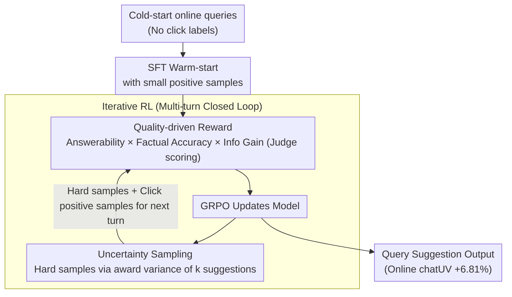

# Quality Over Clicks: Intrinsic Quality-Driven Iterative RL for Cold-Start E-Commerce Query Suggestion

**Conference**: ACL 2026  
**arXiv**: [2603.22922](https://arxiv.org/abs/2603.22922)  
**Code**: [GitHub](https://github.com/QiSun123/Cold-EQS)  
**Area**: E-Commerce / Reinforcement Learning  
**Keywords**: Cold-start, Query Suggestion, Quality-driven reward, Uncertainty sampling, E-commerce dialogue

## TL;DR

Ours propose Cold-EQS, a query suggestion framework for cold-start e-commerce scenarios. It utilizes answerability, factual accuracy, and information gain as intrinsic quality rewards to continuously optimize query suggestion quality through iterative reinforcement learning, achieving a 6.81% Gain in online chatUV.

## Background & Motivation

**Background**: Query Suggestion (QS) is a core component of e-commerce dialogue systems. In multi-turn interactions, AI assistants proactively provide clickable suggested queries to help users refine their needs with minimal effort. Existing generative methods typically use LLMs to generate queries and align them via CTR models.

**Limitations of Prior Work**: (1) Generative methods heavily rely on massive online click data to train effective CTR models (e.g., 20M+ interaction records), which is unavailable during the cold-start phase. (2) Existing methods primarily focus on the **relevance and diversity** of queries, neglecting the **intrinsic quality** of the query itself—generated queries may be unanswerable (beyond the downstream Agent's capabilities), contain hallucinated facts ("Buy iPhone for one dollar"), or merely repeat the user's original question without adding information.

**Key Challenge**: The cold-start phase cannot rely on click data to train CTR models, yet it still requires continuous optimization of query suggestion quality. Click signals themselves are also noisy—queries with high CTR do not necessarily generate high-quality multi-turn interactions.

**Goal**: Continuously optimize the quality of query suggestions through intrinsic quality signals during the cold-start phase without depending on large-scale click data.

**Core Idea**: Instead of using CTR as a reward, use three intrinsic quality dimensions—answerability, factual accuracy, and information gain—as RL reward signals. This is combined with uncertainty sampling to select hard samples from online data lacking click signals for iterative training.

## Method

### Overall Architecture

Cold-EQS is a four-stage iterative framework: (1) SFT warm start using a small amount of click data; (2) GRPO reinforcement learning using quality-driven rewards; (3) Selection of hard samples from no-click online data via uncertainty sampling; (4) Continuous optimization through multi-turn iterative RL training. The base model is Qwen3-4B.

### Key Designs

**1. Quality-driven Reward: Replacing unattainable cold-start CTR with intrinsic quality signals**

The cold-start phase lacks the 20M+ click records needed to train a CTR model, and click signals themselves are noisy—a query like "Buy iPhone for one dollar" might have high clicks but zero value. Cold-EQS ignores clicks and instead scores three intrinsic dimensions of the query: answerability $r_{\mathrm{ans}}(s_i)$ (whether the downstream agent can answer it), factual accuracy $r_{\mathrm{fact}}(s_i)$ (presence of hallucinations), and information gain $r_{\mathrm{info}}(s_i)$ (whether it brings new information compared to the user's original question). For each rollout of $k$ suggestions, the total reward is the format score $r_f$ multiplied by the mean of the product of the three dimensions for $k$ suggestions:

$$r_q = r_f \cdot \frac{1}{k}\sum_{i=1}^k r_{\mathrm{ans}}(s_i) \cdot r_{\mathrm{fact}}(s_i) \cdot r_{\mathrm{info}}(s_i)$$

Using multiplication instead of addition means that if any dimension collapses (unanswerable, hallucinated, or zero gain), the reward for that suggestion is pulled near zero, forcing the model to satisfy all three simultaneously. Reward evaluation is performed by Qwen-30B-A3B acting as a judge, requiring no online clicks.

**2. Uncertainty Sampling: Picking hard samples where the model is most unsure from unlabeled online data**

Massive online queries during the cold-start period lack click labels. Training on all of them introduces bias and wastes compute. Cold-EQS uses the model's own "disagreements" to filter samples: for each online query $q$, the model generates $k$ suggestions, scores them, and calculates the variance of these $k$ rewards as the uncertainty:

$$u_q = \frac{1}{k}\sum_{i=1}^k \Big(R(s_i) - \frac{1}{k}\sum_j R(s_j)\Big)^2$$

High variance indicates the model's judgment of query quality is unstable, marking a weak point. Selecting these high-uncertainty queries as hard samples for the next RL round increases data diversity and concentrates compute on the model's "blind spots" rather than idling on samples it already handles well.

**3. Iterative RL: Creating a "generation-sampling-retraining" loop to continuously probe model weaknesses**

A single RL training session cannot cover all scenarios. Cold-EQS forms a closed-loop multi-turn iteration: each turn uses the current model to generate suggestions on no-click data $\rightarrow$ selects hard samples via uncertainty sampling $\rightarrow$ mixes them with click positive samples for RL updates $\rightarrow$ uses the stronger model to re-sample in the next turn. With each iteration, the model's weaknesses are re-exposed and repaired, leading to continuous quality improvement throughout the process without ever depending on CTR.

### Loss & Training

RL training is conducted using the GRPO algorithm. Rewards are combined via three-dimensional multiplication (Answerability × Factual Accuracy × Info Gain × Format) to ensure all dimensions are met. The SFT stage uses click positive samples, while the RL stage uses quality-driven rewards. The base model is Qwen3-4B, and the reward evaluator is Qwen-30B-A3B.

## Key Experimental Results

### Main Results

| Model | Strict Accuracy | Valid Rate | Description |
|------|----------------|------------|------|
| GPT-4.1-mini | 70.5 | 79.2 | One of the best closed-source models |
| Qwen-flash | 75.4 | 81.3 | Best closed-source model |
| Qwen3-4B(base) | 36.7 | 53.2 | Open-source baseline |
| Cold-EQS(Qwen3-4B) | Significant Gain | Significant Gain | Approaches or exceeds closed-source models |
| **Online Metric** | **+6.81% chatUV** | | Verified real-world deployment effect |

### Key Findings
- Offline metrics show a strong positive correlation with online performance, validating the effectiveness of intrinsic quality assessment.
- In cold-start scenarios, quality-driven rewards are more reliable than click-driven rewards.
- Uncertainty sampling effectively mitigates the bias associated with relying solely on click data.
- Iterative RL training leads to sustained performance Gains.
- The 4B model, after Cold-EQS training, can approach or even surpass large closed-source models.

## Highlights & Insights
- **Paradigm Shift from Clicks to Quality**: Replacing CTR signals with intrinsic quality rewards is robust and suitable for cold-start scenarios.
- **Rationality of Three-dimensional Quality Assessment**: Answerability, factual accuracy, and information gain precisely cover the core quality dimensions of query suggestions.
- **Offline-Online Consistency**: The strong positive correlation between offline quality metrics and online chatUV makes offline iteration reliable.
- **Industrial Deployment Validation**: Verified in Alibaba's international e-commerce systems, demonstrating practical value beyond academic experiments.
- **Contribution of EQS-Benchmark**: Provides a standardized evaluation benchmark for e-commerce query suggestion.

## Limitations & Future Work
- The reward evaluator (Qwen-30B-A3B) itself may introduce bias; evaluator quality directly impacts training results.
- Experiments were primarily conducted on Alibaba's international e-commerce platform; generalization across different platforms/languages remains unknown.
- Uncertainty sampling uses a simple variance metric; more complex uncertainty estimation methods (e.g., Bayesian methods) might be more effective.
- The EQS-Benchmark scale is relatively small (16,949 records); larger-scale benchmarks need to be constructed.

## Related Work & Insights
- **vs CTR-based QS (Min et al., 2025)**: CTR methods require 20M+ online records, whereas Cold-EQS works effectively during the cold-start phase.
- **vs Retrieval-based methods**: Retrieval methods are limited by the historical query pool and cannot generate novel suggestions; Cold-EQS can generate diverse new queries.
- **vs Standard SFT**: Pure SFT amplifies click noise (e.g., "Buy iPhone for one dollar"), which RL with quality rewards avoids.

## Rating
- Novelty: ⭐⭐⭐⭐ The intrinsic quality-driven cold-start RL framework is novel in the e-commerce QS field.
- Experimental Thoroughness: ⭐⭐⭐⭐ Includes offline and online experiments with multi-model comparisons, though ablation details could be more extensive.
- Writing Quality: ⭐⭐⭐ Well-structured, though author anonymization was incomplete and some descriptions could be clearer.
- Value: ⭐⭐⭐⭐ Addresses a practical industrial problem; the 6.81% online Gain verifies its utility.

<!-- RELATED:START -->

## Related Papers

- [\[CVPR 2025\] FineVQ: Fine-Grained User Generated Content Video Quality Assessment](../../CVPR2025/recommender/finevq_fine-grained_user_generated_content_video_quality_assessment.md)
- [\[ACL 2025\] LOTUS: A Leaderboard for Detailed Image Captioning from Quality to Societal Bias and User Preferences](../../ACL2025/recommender/lotus_a_leaderboard_for_detailed_image_captioning_from_quality_to_societal_bias_.md)
- [\[ACL 2026\] Intent-Driven Semantic ID Generation for Grounded Conversational News Recommendation](intent-driven_semantic_id_generation_for_grounded_conversational_news_recommenda.md)
- [\[ACL 2026\] SenseJudge: Human-Centric Preference-Driven Judgment Framework](sensejudge_human-centric_preference-driven_judgment_framework.md)
- [\[ICML 2026\] Position: Stop Preaching and Start Practising Data Frugality for Responsible Development of AI](../../ICML2026/recommender/position_stop_preaching_and_start_practising_data_frugality_for_responsible_deve.md)

<!-- RELATED:END -->
