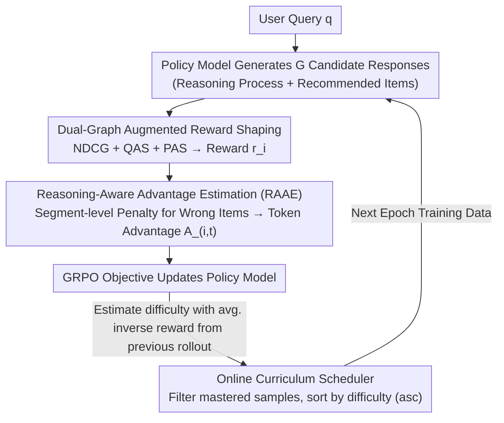

# ReRec: Reasoning-Augmented LLM-based Recommendation Assistant via Reinforcement Fine-tuning

**Conference**: ACL 2026  
**arXiv**: [2604.07851](https://arxiv.org/abs/2604.07851)  
**Code**: [GitHub](https://github.com/jiani-huang/ReRec)  
**Area**: Reinforcement Learning  
**Keywords**: Recommendation Assistant, Reinforcement Fine-tuning, Reasoning Augmentation, Reward Shaping, Curriculum Learning

## TL;DR

This paper proposes ReRec, a Reinforcement Fine-tuning (RFT) framework for recommendation assistants. It provides fine-grained reward signals through dual-graph augmented reward shaping, differentiated supervision of reasoning steps via Reasoning-Aware Advantage Estimation (RAAE), and dynamic adjustment of training difficulty via an online curriculum scheduler. ReRec enables LLMs to handle complex multi-step reasoning recommendation queries, significantly outperforming existing methods on the RecBench+ benchmark.

## Background & Motivation

**Background**: Traditional recommendation systems (Matrix Factorization, GNN, etc.) rely on historical interaction data and cannot process natural language queries. The emergence of LLMs has brought new possibilities for intelligent recommendation assistants. Recent research has explored LLM-based Conversational Recommendation Systems (CRS), but most only handle simple and direct queries, such as "recommend a sci-fi movie."

**Limitations of Prior Work**: (1) Real-world user queries are often complex and require multi-step reasoning. For instance, "Recommend other movies featuring the lead actor from the movie about a man stranded on an island" requires first inferring *Cast Away*, then identifying Tom Hanks, and finally recommending his other films. Existing LLM recommendation systems lack this deep reasoning capability. (2) Applying RFT directly to recommendation tasks faces two major challenges: reward signals are too coarse (NDCG only considers exact matches; reasonable but non-exact recommendations receive zero points); and the reasoning process lacks supervision (all tokens share the same reward score, making it impossible to distinguish between correct and incorrect reasoning steps).

**Key Challenge**: Precision matching metrics like NDCG are too harsh and sparse as reward signals—recommendations that satisfy query constraints but do not match the ground truth receive the same zero reward as completely irrelevant ones, leading to low exploration efficiency for the policy model.

**Goal**: Design an RFT framework tailored for recommendation tasks to address the issues of insufficient reward granularity and lack of supervision in the reasoning process.

**Key Insight**: Improve RFT for recommendation from three dimensions: (1) Enrich the reward space using item-attribute graphs and collaborative filtering signals; (2) Segment the reasoning process and impose penalties on erroneous steps; (3) Adjust the training curriculum based on the model's dynamic capabilities.

**Core Idea**: Expand the rewards for recommendation tasks from coarse-grained exact matches to fine-grained signals combining query alignment and preference alignment, while providing differentiated supervision at the reasoning step level to help LLMs learn reasoning instead of memorization.

## Method

### Overall Architecture

ReRec is based on the GRPO reinforcement learning framework. Given a user query $q$, the LLM policy model generates multiple candidate responses $\{o_1, ..., o_G\}$, each containing a reasoning process and recommended items. Three core modules act on reward calculation, advantage estimation, and training scheduling: Dual-Graph Augmented Reward Shaping calculates the reward $r_i$ for each response; Reasoning-Aware Advantage Estimation distributes rewards to token-level advantages $A_{i,t}$ at the reasoning step level; and the Online Curriculum Scheduler dynamically adjusts the training data order and difficulty for each epoch.

### Key Designs

**1. Dual-Graph Augmented Reward Shaping: Expanding "binary" exact match rewards into fine-grained signals considering both query constraints and user preferences**

NDCG@K only recognizes exact hits on the ground truth. A recommendation that satisfies "Sci-Fi + Tom Hanks" but is not the specific gold answer would receive the same zero score as an irrelevant one, providing no direction for the policy model. ReRec supplements NDCG with two auxiliary scores. **Query Alignment Score (QAS)** utilizes the item-attribute graph $G_{attr}$ to measure the overlap ratio of attribute relationships between recommended items and the ground truth: $S_{QAS}(p_i, gt) = |R_{p_i}^{G_{attr}} \cap R_{gt}^{G_{attr}}| / |R_{gt}^{G_{attr}}|$. Thus, reasonable but non-exact recommendations receive partial rewards. **Preference Alignment Score (PAS)** uses pre-trained lightweight recommendation models (like LightGCN) to extract embeddings from the user-item interaction graph and calculates cosine similarity: $S_{PAS}(p_i, gt) = \mathcal{M}(p_i) \cdot \mathcal{M}(gt) / (\|\mathcal{M}(p_i)\| \|\mathcal{M}(gt)\|)$. This introduces implicit preferences from collaborative filtering to prevent the model from aligning with attributes while losing personalization. The final reward is a weighted sum:

$$r_i = \text{NDCG} + w_1 S_{QAS} + w_2 S_{PAS}$$

QAS handles explicit constraints while PAS handles implicit preferences; together, they densify the sparse reward space, significantly improving exploration efficiency for "Hard" queries.

**2. Reasoning-Aware Advantage Estimation (RAAE): Providing step-level supervision for the reasoning process by specifically penalizing segments containing incorrect items**

Traditional RFT assigns the same reward to all tokens in a response, so the model cannot distinguish which reasoning step was wrong. RAAE slices the output $o_i$ into $K$ reasoning steps (segments) $\mathcal{S}_i = \{s_{i,1}, ..., s_{i,K}\}$ and checks each segment: if a segment discusses an item that was ultimately mis-recommended ($p_i \neq gt$ and $p_i \in s_{i,k}$), it indicates the model failed to exclude it at that step. The reward for that segment is then discounted to $r_{s_{i,k}} = (1 - w_{penalty}) \cdot r_i$, while others maintain the original reward. These are then expanded to token-level rewards with group normalization to obtain advantages $A_{i,t} = (r_{i,t} - \text{mean}(\mathbf{r})) / \text{std}(\mathbf{r})$. This achieves process-level supervision using a simple "segment contains incorrect item" rule, avoiding the high cost of training a specialized Process Reward Model.

**3. Online Curriculum Scheduler: Zero-cost difficulty estimation using previous rollouts to reorder training data from easy to hard**

Recommendation tasks lack pre-defined difficulty levels like math or code, and static curricula cannot keep up with a model that improves during training. ReRec reuses the rollouts produced by RFT: at the start of epoch $t$, it uses the average inverse reward of each query from the previous round as the difficulty metric: $d^{t-1} = \frac{1}{G}\sum_{i=1}^G (1 - r_i)$. Lower rewards indicate higher difficulty. It then filters out "mastered" samples below a threshold $\tau$ and sorts the remainder in ascending order of difficulty to form the new dataset $\mathcal{D}^t$. This process repeats every epoch, ensuring the curriculum remains dynamically aligned with the model's current capability without additional inference costs.

### Loss & Training

The framework uses the GRPO objective function with a clipped probability ratio: $\mathcal{J}(\theta) = \mathbb{E}[\frac{1}{N}\sum_{i=1}^G \sum_{t=1}^{|o_i|} \min(h_{i,t}(\theta) A_{i,t}, \text{clip}(h_{i,t}(\theta), 1-\varepsilon, 1+\varepsilon) A_{i,t})]$. Backbone models used are Qwen-2.5-3B-Instruct and Llama-3.2-3B-Instruct.

## Key Experimental Results

### Main Results

**Recommendation Accuracy on RecBench+ (Llama-3.2-3B-Instruct Backbone)**

| Method | Movie-Simple | Movie-Medium | Movie-Hard | Movie-Interest | Book-Simple | Book-Hard | Book-Interest |
|------|-------------|-------------|-----------|---------------|-------------|----------|--------------|
| Original Llama | 0.107 | 0.052 | 0.029 | 0.097 | 0.215 | 0.106 | 0.254 |
| GPT-4o | 0.554 | 0.519 | 0.188 | 0.550 | 0.554 | 0.160 | 0.458 |
| GRPO | 0.686 | 0.600 | 0.644 | 0.651 | 0.664 | 0.713 | 0.786 |
| REINFORCE++ | 0.699 | 0.623 | 0.597 | 0.676 | 0.661 | 0.697 | 0.795 |
| **ReRec** | **0.748** | **0.700** | **0.729** | **0.719** | **0.671** | **0.750** | **0.811** |

### Ablation Study

| Configuration | Effect |
|------|------|
| ReRec (Full) | Best performance across all dimensions |
| w/o RAAE | Largest performance drop; reasoning step supervision is a core contribution |
| w/o QAS | Significant drop; query constraint alignment is crucial for Hard queries |
| w/o PAS | Slight drop; implicit preferences are more critical for personalized scenarios |
| w/o Curriculum | Moderate drop; training stability is affected |

### Key Findings

- ReRec improves recommendation accuracy on Movie-Hard by approximately 2414% (0.029 $\rightarrow$ 0.729) compared to the base model, demonstrating that RFT greatly enhances the LLM's reasoning capability for misleading queries.
- With only 3B parameters, ReRec outperforms GPT-4o and DeepSeek-R1 on most tasks.
- Ablation shows RAAE has the most impact, proving process-level supervision is essential.
- Cross-domain generalization: A model trained on Movies achieves 0.494 on Books (Llama baseline 0.168, a 194% Gain), surpassing GPT-4o (0.453).
- Cross-task generalization: Reaches 88.4% of the performance of the specialized model SASRec on sequential recommendation tasks.
- Compared to SFT, ReRec maintains reasoning capability (+21.6%), whereas SFT shows an 80% decline in knowledge capabilities.

## Highlights & Insights

- The dual-graph reward shaping is practical: QAS uses item-attribute graphs to solve the "harshness of exact matching," and PAS uses collaborative filtering embeddings to capture implicit preferences. These dimensions enrich the reward signal and are transferable to other RFT tasks needing fine-grained feedback.
- The RAAE segment-level penalty mechanism provides a lightweight alternative to process supervision: it avoids training a specialized reward model by simply checking if reasoning segments contain incorrect items.
- The online curriculum scheduler cleverly utilizes existing rollout data from RFT to estimate difficulty at zero additional inference cost.

## Limitations & Future Work

- Currently supports only single-turn dialogues; context accumulation and dynamic requirement adjustments in multi-turn dialogues are not considered.
- The candidate set is limited to a multiple-choice format (1 positive, 19 negative), which differs from open-ended recommendation scenarios.
- RAAE's segment decomposition relies on simple paragraph splitting, which might be inaccurate for unstructured or hybrid reasoning outputs.
- Evaluation was limited to 3B models; efficacy on larger models remains unverified.
- Weights $w_1, w_2$ for QAS and PAS require manual tuning; sensitivity analysis is not fully discussed.

## Related Work & Insights

- **vs GRPO/REINFORCE++**: These general RFT methods use exact match as a reward, which is too sparse for recommendation; ReRec provides richer signals via dual-graph shaping, showing a clear advantage on Hard queries.
- **vs TallRec/InteRecAgent**: These systems based on SFT or tool-calling handle simple queries well but lack deep reasoning; ReRec stimulates reasoning via RFT, showing significant improvements on complex queries.
- **vs Process Reward Models**: Traditional PRMs require additional training or expensive LLM calls to score reasoning steps; RAAE implements lightweight step-level supervision through simple item-matching rules.

## Rating

- Novelty: ⭐⭐⭐⭐ Systematically adapts RFT for recommendation with highly targeted modules.
- Experimental Thoroughness: ⭐⭐⭐⭐ Covers cross-domain, cross-task, personalization, and capability preservation.
- Writing Quality: ⭐⭐⭐⭐ Clear motivation, complete methodology, and standardized formulas.
- Value: ⭐⭐⭐⭐ A practical guide for RFT in recommendation systems; dual-graph rewards and RAAE are highly reusable.

<!-- RELATED:START -->

## Related Papers

- [\[NeurIPS 2025\] Transformer Copilot: Learning from The Mistake Log in LLM Fine-tuning](../../NeurIPS2025/recommender/transformer_copilot_learning_from_the_mistake_log_in_llm_fine-tuning.md)
- [\[ACL 2026\] HARPO: Hierarchical Agentic Reasoning for User-Aligned Conversational Recommendation](harpo_hierarchical_agentic_reasoning_for_user-aligned_conversational_recommendat.md)
- [\[ACL 2026\] Where and What: Reasoning Dynamic and Implicit Preferences in Situated Conversational Recommendation](where_and_what_reasoning_dynamic_and_implicit_preferences_in_situated_conversati.md)
- [\[AAAI 2026\] TraveLLaMA: A Multimodal Travel Assistant with Large-Scale Dataset and Structured Reasoning](../../AAAI2026/recommender/travellama_a_multimodal_travel_assistant_with_large-scale_dataset_and_structured.md)
- [\[AAAI 2026\] Tool4POI: A Tool-Augmented LLM Framework for Next POI Recommendation](../../AAAI2026/recommender/tool4poi_a_tool-augmented_llm_framework_for_next_poi_recommendation.md)

<!-- RELATED:END -->
