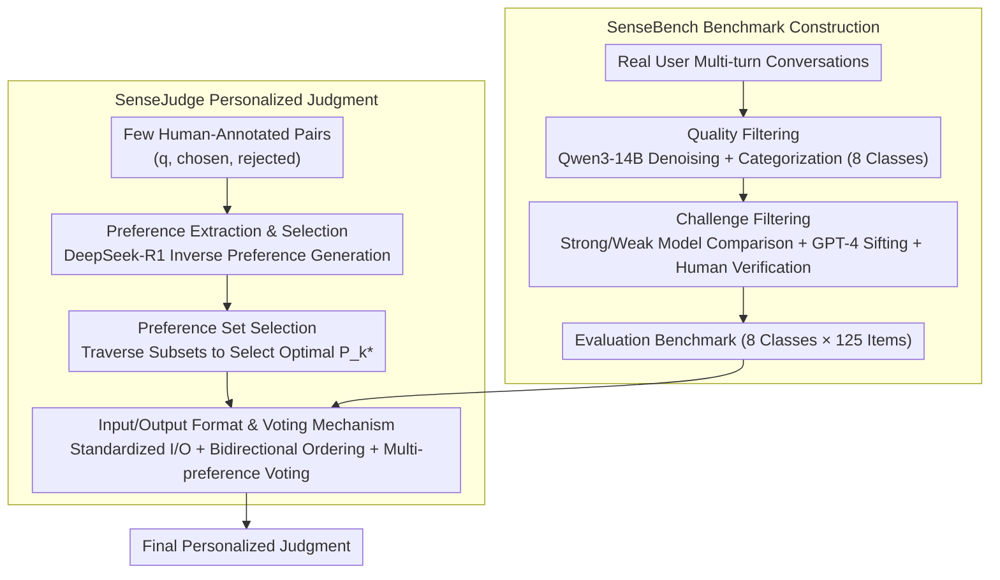

<!-- Generated automatically by src/gen_stubs.py -->
# SenseJudge: Human-Centric Preference-Driven Judgment Framework

**Conference**: ACL 2026 Findings  
**arXiv**: [2606.03189](https://arxiv.org/abs/2606.03189)  
**Code**: [GitHub](https://github.com/qiongrenpiqida/SenseJudge)  
**Area**: Recommender Systems  
**Keywords**: LLM Evaluation, Personalized Judgment, Preference-Driven, Multi-turn Conversation, Model Ranking

## TL;DR
This paper proposes SenseJudge, a customizable LLM judgment framework based on explicit human preferences, along with SenseBench, a real-world multi-turn conversation benchmark. In personalized judgment tasks, the framework achieves an average accuracy 16.08% higher than baselines, with model rankings consistent with real human rankings.

## Background & Motivation
**Background**: The LLM-as-a-Judge paradigm is increasingly popular for evaluating model responses, generating preference data, and ranking models.

**Limitations of Prior Work**: (1) Existing judgment methods (PandaLM, Auto-j, reward models) rely on training with fixed preference data, learning homogenized standards that ignore the diversity of user preferences. (2) Existing benchmarks (MT-Bench, Auto-j) primarily focus on single or double-turn conversations, which are disconnected from real-world multi-turn human-computer interaction scenarios. (3) Trained reward models show limited generalization capabilities when faced with diverse real-world scenarios.

**Key Challenge**: User preferences are multifaceted and context-dependent (e.g., some prioritize creativity, others format, and others accuracy), yet existing judges only learn a single, fixed preference standard.

**Goal**: To build a customizable LLM judgment framework capable of adapting to different user preferences, as well as an evaluation benchmark that truly reflects the complexity of human-computer interaction.

**Key Insight**: Extract explicit preference text from a small amount of human annotations and employ a multi-preference voting mechanism to enable small models to make accurate personalized judgments.

**Core Idea**: Preference extraction + Preference set selection + Multi-preference voting = Training-free personalized LLM judgment.

## Method

### Overall Architecture
SenseBench constructs a multi-turn evaluation benchmark from real user dialogues using quality and challenge filtering. SenseJudge extracts preference texts from a few human-annotated pairs, selects the optimal preference subset, and generates final judgments through multi-preference voting during inference.

### Key Designs
**1. SenseBench Benchmark Construction: Filtering real multi-turn dialogues into a discriminative evaluation set (8 classes × 125 items) via two steps.**

Existing benchmarks are mostly single-turn simple tasks, failing to reflect the multi-turn context dependencies of real interactions. SenseBench starts with real user dialogues, first applying **Quality Filtering**—using Qwen3-14B for denoising and categorization into 8 domains (Math, Logic, Code, Creative Writing, Roleplay, Translation, QA, NLU). This is followed by **Challenge Filtering**—comparing responses from strong and weak models, combined with GPT-4 automated sifting and manual verification to remove items where both models perform equally well, ensuring the benchmark can effectively differentiate the capabilities of judges.

**2. Preference Extraction and Selection: Distilling a set of explicit preference texts from a few annotations, then selecting and voting with the optimal subset.**

Judges trained on fixed preferences only follow a single homogenized standard, whereas real users exhibit diverse priorities (creativity, formatting, or accuracy). SenseJudge avoids model training and follows a three-step process: **Preference Generation** uses DeepSeek-R1 to infer an explicit preference text (e.g., "prioritize logical rigor" or "prioritize comprehensive answers") from each annotated pair $(q, \text{chosen}, \text{rejected})$; **Preference Set Selection** traverses all preference subsets $\mathcal{P}_k \subseteq P$, calculating accuracy on the annotation set via multi-preference voting to retain the best performing subset $\mathcal{P}_k^*$; **Preference Application** allows each preference in $\mathcal{P}_k^*$ to judge independently, followed by a majority vote. Since different preferences capture different facets of annotation decisions, their combination is more robust than relying on a single preference, enabling small models to achieve accurate personalized judgments.

**3. Input/Output Format and Voting Mechanism: Standardizing judgment processes to suppress Position Bias in LLM-as-a-Judge.**

Judges often exhibit a tendency to favor the first or last response regardless of quality. SenseJudge fixes the input as $I = \{q, (r_1, r_2), p\}$ and the output as a judgment with analysis while **forbidding "tie" options** to force differentiation. Each pair of responses is evaluated in both **original and reversed order** to detect position bias. This is combined with the aforementioned multi-preference voting to obtain stable judgments. Bidirectional evaluation cancels out order-based preferences, while voting further smooths fluctuations in single judgments, providing significant consistency improvements for small models.

## Key Experimental Results

### Main Results (LLM-as-a-Personalized-Judge Accuracy %)

| Method | Math | Code | Logic | QA | Write | Role | NLU | Trans | Overall |
|------|------|------|-------|-----|-------|------|-----|-------|---------|
| GPT-4o | 66.00 | 61.60 | 65.47 | 72.93 | 60.80 | 63.20 | 65.47 | 56.40 | 63.98 |
| DeepSeek-V3 | 72.80 | 62.27 | 66.67 | 77.07 | 62.67 | 64.40 | 64.80 | 61.87 | 66.57 |
| Skywork-Reward-Gemma2-27B | 70.40 | 61.60 | 66.10 | 74.10 | 64.00 | 60.00 | 62.70 | 58.40 | 64.70 |
| Qwen2.5-14B + **Ours** | **73.45** | **80.90** | **72.44** | **85.67** | **72.89** | **75.24** | **76.80** | **74.21** | **76.88** |
| Qwen2.5-72B + **Ours** | **82.30** | **89.01** | **79.76** | **89.87** | **79.82** | **82.12** | **78.10** | **75.23** | **81.99** |
| Qwen3-14B + **Ours** | **86.53** | **87.96** | **83.69** | **92.24** | **75.27** | **81.04** | **78.72** | **75.78** | **82.65** |

### Consistency and Position Bias

| Model | Original Consistency | +SenseJudge Consistency |
|------|-----------|------------------|
| Qwen2.5-14B-Instruct | 69.97% | **74.17%** |
| Llama3.1-8B-Instruct | 60.36% | **68.19%** |
| Qwen2.5-72B-Instruct | 78.86% | 78.79% |
| Qwen3-14B-Instruct | 81.23% | 81.30% |

### Key Findings
- SenseJudge improves accuracy by an average of +16.08% over baselines, allowing small models (8B/14B) to surpass direct judgments by powerful models like GPT-4o.
- Improvements were observed across all 8 categories, with the largest gains in Code (+20.10) and Trans (+18.84).
- Reward models (INF-ORM-70B, QRM-27B) achieved <65% accuracy on personalized datasets, indicating that fixed preferences generalize poorly.
- SenseJudge significantly mitigates position bias, particularly for smaller models.
- The framework reached 90.55% on RewardBench, close to the specialized Skywork-Critic (92.2%), verifying its general effectiveness.
- Model rankings produced by the framework align with Arena human rankings: DeepSeek-R1 > Claude-3-7-Sonnet > GPT-4o > Qwen2.5-72B > GPT-3.5.

## Highlights & Insights
- The three-step workflow of preference extraction, subset selection, and voting is simple and elegant, enabling personalization without training a judge model.
- The strategy of learning from failures—inferring preferences inversely from a small set of annotations—is more data-efficient than directly training reward models.
- The construction methodology for SenseBench (strong/weak model comparison + manual verification) ensures high discriminative power.
- The results demonstrate that Small Model + Good Preferences > Large Model + No Preferences, providing a new path for low-cost deployment.

## Limitations & Future Work
- Preference construction relies on strong models like DeepSeek-R1; preference quality is limited by the generator model's capabilities (ablations show weaker models produce poorer preferences).
- Only 3 annotators were used with a limited scale (1,000 items each); larger-scale annotation might reveal richer preference patterns.
- Selection of the preference subset requires traversing the combination space, leading to exponential growth in computation as the preference set grows.
- Cross-domain preference transfer shows varying effectiveness (e.g., Math → Logic 78.62% vs. Math → Translation 61.83%).

## Related Work & Insights
- Unlike training-based judges such as Auto-j or PandaLM that learn fixed preferences, SenseJudge's explicit preference texts are more flexible and interpretable.
- While personalized LLMs (OPPU, multi-granularity interest prediction) focus on response personalization, SenseJudge focuses on judgment personalization—complementary directions.
- The preference voting mechanism can be extended to any evaluation scenario requiring multi-perspective aggregation (e.g., code review, content moderation).

## Rating
- Novelty: ⭐⭐⭐⭐ Explicit preference-driven personalized judgment is a meaningful new direction.
- Experimental Thoroughness: ⭐⭐⭐⭐ Multi-model comparisons, consistency/bias analysis, ablations, cross-domain tests, and RewardBench validation.
- Writing Quality: ⭐⭐⭐ Structurally sound, though some mathematical expressions could be more concise.
- Value: ⭐⭐⭐⭐ Highly practical with significant potential for implementing low-cost personalized evaluation.

<!-- RELATED:START -->

## Related Papers

- [\[ACL 2026\] Personalizing LLMs with Binary Feedback: A Preference-Corrected Optimization Framework](personalizing_llms_with_binary_feedback_a_preference-corrected_optimization_fram.md)
- [\[AAAI 2026\] Preference is More Than Comparisons: Rethinking Dueling Bandits with Augmented Human Feedback](../../AAAI2026/recommender/preference_is_more_than_comparisons_rethinking_dueling_bandits_with_augmented_hu.md)
- [\[ACL 2026\] Intent-Driven Semantic ID Generation for Grounded Conversational News Recommendation](intent-driven_semantic_id_generation_for_grounded_conversational_news_recommenda.md)
- [\[ACL 2026\] Quality Over Clicks: Intrinsic Quality-Driven Iterative RL for Cold-Start E-Commerce Query Suggestion](quality_over_clicks_intrinsic_quality-driven_iterative_reinforcement_learning_fo.md)
- [\[AAAI 2026\] Evaluating LLMs for Police Decision-Making: A Framework Based on Police Action Scenarios](../../AAAI2026/recommender/evaluating_llms_for_police_decision-making_a_framework_based_on_police_action_sc.md)

<!-- RELATED:END -->
