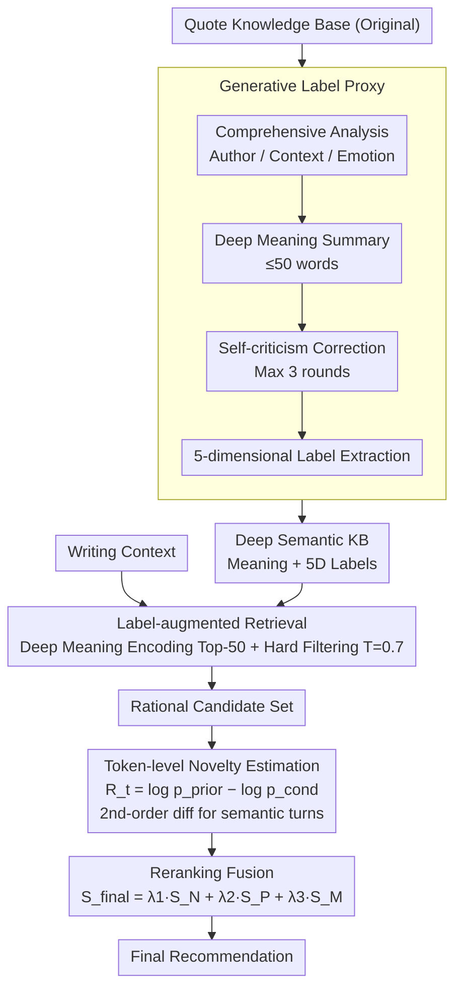

# What Makes an Ideal Quote? Recommending "Unexpected yet Rational" Quotations via Novelty

**Conference**: ACL 2026  
**arXiv**: [2602.22220](https://arxiv.org/abs/2602.22220)  
**Code**: None  
**Area**: Recommender Systems / Natural Language Generation  
**Keywords**: Quote Recommendation, Novelty Estimation, Defamiliarization Theory, Deep Semantic Retrieval, Completion Bias

## TL;DR

NOVELQR proposes a novelty-driven quote recommendation framework that constructs a deep semantic knowledge base via generative label proxies for rational retrieval, and utilizes a token-level novelty estimator to mitigate auto-regressive completion bias, significantly enhancing recommendation quality across bilingual benchmarks.

## Background & Motivation

**Background**: Quote recommendation systems aim to suggest appropriate aphorisms for a given writing context. Existing systems (e.g., QuoteR, QUILL) primarily optimize semantic relevance, achieving matching through text embedding retrieval.

**Limitations of Prior Work**: Two critical issues exist: (1) Current systems focus solely on surface semantic matching while ignoring the aesthetic value and novelty of quotes, recommending "correct but stale" quotes (e.g., "Failure is the mother of success") rather than "unexpected yet rational" ones (e.g., Dante's "Beauty awakens the soul to act"); (2) LLMs struggle to grasp the deep meaning of a quote when provided with only the text, and logit-based novelty metrics (e.g., surprisal) suffer from auto-regressive completion bias—common phrases are "inertially" completed once the beginning is predicted, leading to distorted novelty estimation.

**Key Challenge**: Ideal quotes should be "unexpected yet rational"—initially surprising to the reader but logical upon considering the context. Existing systems perform well on "rationality" but largely ignore the "unexpectedness" dimension.

**Goal**: (1) To perform retrieval in a deep semantic space to ensure the rationality of quotes; (2) To estimate quote novelty without introducing completion bias.

**Key Insight**: Based on defamiliarization theory ("art aims to make the familiar strange") and large-scale user surveys (964 questionnaires + controlled experiments), it is confirmed that users prefer "unexpected yet rational" quotes. On this basis, label augmentation compensates for LLM deficiencies in quote understanding, while token-level novelty focuses on "novel tokens" to mitigate completion bias.

**Core Idea**: First, map quotes to a deep semantic space using a label proxy to ensure "rationality," then rerank through token-level novelty to ensure they are "unexpected," collaborating in two steps to achieve "unexpected yet rational" results.

## Method

### Overall Architecture

NOVELQR recommends quotes that are "unexpected yet rational" by splitting this goal into a serial process of "guaranteeing rationality first, then ensuring surprise." Given a writing context, the system first use a generative label proxy to "translate" each quote in the knowledge base from surface text into deep semantic explanations and multi-dimensional labels. Retrieval is then performed in this deep semantic space to produce a candidate set, which is finally reranked by a token-level novelty estimator combined with popularity and semantic matching signals.

### Key Designs

**1. Generative Label Proxy: Translating surface text into retrievable deep semantics**

When presented only with the original quote text, LLMs often fail to comprehend the underlying message—experimental results show that GPT-4o's understanding score even on the EASY subset is below the high-quality threshold. This implies that direct semantic matching on raw text leads to "literally relevant but misaligned" recommendations. The label proxy (based on Qwen3-8B) addresses this in four steps: comprehensive analysis involving author background and cultural context; distilling a summary of deep meaning (≤50 words); up to 3 rounds of self-criticism to check for over-interpretation or logic gaps (~4.6% of outputs are regenerated); and finally extracting structured labels across five dimensions (Domain, Insight, Value, Audience, Tone). This helps the understanding score on the HARD subset reach nearly 9.0.

**2. Label-augmented Retrieval: Retrieving in the deep meaning space**

Standard embedding retrieval on original quotes only captures surface lexical patterns, causing old systems to recommend "stale" quotes. NOVELQR encodes the generated deep meaning instead, using embedding similarity to select the Top-N ($N=50$) candidates. A hard filter is applied using label similarity (threshold $T=0.7$) across "Core Domain," "Value," and "Insight" to prune irrational candidates. This simulates the human process of "understanding context before selecting a quote"; manual verification shows the distortion rate of generated labels is below 3%.

**3. Token-level Novelty Estimation: Using semantic turning points to bypass completion bias**

To quantify "unexpectedness" without the distortion of completion bias (where predictable endings like "...99% perspiration" are incorrectly counted as highly novel), NOVELQR defines token-level novelty as the difference between unconditional and conditional logits: $R_t = \log p_{\text{prior}}(x_t) - \log p_{\text{cond}}(x_t)$. The innovation lies in identifying true "novel tokens" by taking the second-order difference $|\delta_2(t)|$ of the self-perplexity sequence to find mutation points (indicating semantic turns). High weights are assigned to these points, while smooth completion segments—the primary source of bias—are downweighted. The final novelty score is $S_N = \sum_t \tilde{w}_t R_t$.

### Mechanism

Using a writing context as input: the label proxy first parses quotes in the database into deep meanings and 5D labels. During retrieval, 50 semantically similar candidates are retrieved in the deep meaning space, and those with misaligned labels are filtered out. During reranking, token-level novelty is calculated for each candidate by identifying semantic turning points via second-order differences. Quotes like "Failure is the mother of success" receive low $S_N$ due to lack of surprise, while quotes like Dante's "Beauty awakens the soul to act" are promoted for being both rational and unexpected.

### Loss & Training

The final reranking score is $S_{\text{final}} = \lambda_1 \cdot S_N + \lambda_2 \cdot S_P + \lambda_3 \cdot S_M$, where $S_N$ is novelty, $S_P$ is popularity based on Bing search frequency (to avoid overly obscure quotes), and $S_M$ is the cosine similarity of deep meanings. Weights are $\lambda_1=0.70, \lambda_2=0.20, \lambda_3=0.10$.

## Key Experimental Results

### Main Results

**Quote Recommendation Quality Comparison (NOVELQR-BENCH)**

| Method | Novelty | Match | HR@5 | nDCG@5 |
|------|---------|-------|------|--------|
| QR + No Rerank | 3.14 | 3.99 | 0.35 | 0.26 |
| QUILL | 3.08 | 4.15 | 0.15 | 0.12 |
| LR + No Rerank | 3.40 | **4.55** | 0.55 | 0.44 |
| LR + GPT Rerank | 3.75 | 4.50 | 0.66 | 0.47 |
| **LR + Ours** | **3.81** | 4.50 | **0.70** | **0.51** |

### Ablation Study

| Configuration | Novelty | Match | HR@5 | Description |
|------|---------|-------|------|------|
| Self-BLEU | 3.55 | 4.48 | 0.50 | Lexical novelty is insufficient |
| Surprisal | 3.66 | 4.31 | 0.55 | Suffers from completion bias |
| + Novelty-token | **3.73** | **4.39** | **0.62** | Effective mitigation of bias |

### Key Findings

- Moving from QR to LR (Label-augmented Retrieval) significantly improves Match from 3.99 to 4.55, validating the advantage of deep semantic retrieval.
- The novel token mechanism increases the HR@5 of Surprisal from 0.55 to 0.62, directly verifying the effect of mitigating completion bias.
- In human multiple-choice studies, 78% of preferences favored recommendations from the NOVELQR system.
- Removing the popularity signal led to a decline in consistency, indicating its necessity as a regularizer to avoid obscure quotes.

## Highlights & Insights

- The use of defamiliarization theory combined with large-scale user studies to justify "novel quotes" turns a subjective aesthetic requirement into an operational engineering goal.
- Identifying "semantic turning points" via second-order differences of self-perplexity is a clever strategy for mitigating completion bias, which could be transferred to other novelty estimation tasks.
- The four-step processing flow of the label proxy (Analysis → Generation → Correction → Extraction) provides a general paradigm for LLMs to understand complex texts.

## Limitations & Future Work

- The label proxy depends on metadata (author, source); performance may degrade for anonymous or obscure quotes.
- The definition of novelty leans toward "semantic unexpectedness" and does not fully account for aesthetic effects from rhetorical devices like irony or puns.
- The popularity signal relies on search engines, and its portability across different languages or cultures remains to be tested.
- The test set size is relatively small (100 entries per dataset).

## Related Work & Insights

- **vs QuoteR/QUILL**: These systems optimize for semantic relevance, whereas NOVELQR additionally optimizes for novelty.
- **vs Surprisal/KL-divergence**: These standard novelty metrics are distorted by completion bias, which NOVELQR's token-level approach explicitly addresses.

## Rating

- Novelty: ⭐⭐⭐⭐⭐ Formulates a complete loop from theory to user study to technical implementation.
- Experimental Thoroughness: ⭐⭐⭐⭐ Covers bilingual domains with human evaluation, though test sets are small.
- Writing Quality: ⭐⭐⭐⭐⭐ Problem definition ("unexpected yet rational") is compelling and narrative is smooth.
- Value: ⭐⭐⭐⭐ Significant contribution to quote recommendation; the discovery of completion bias is applicable to broader scenarios.

<!-- RELATED:START -->

## Related Papers

- [\[ACL 2026\] What Makes LLMs Effective Sequential Recommenders? A Study on Preference Intensity and Temporal Context](what_makes_llms_effective_sequential_recommenders_a_study_on_preference_intensit.md)
- [\[ACL 2026\] Where and What: Reasoning Dynamic and Implicit Preferences in Situated Conversational Recommendation](where_and_what_reasoning_dynamic_and_implicit_preferences_in_situated_conversati.md)
- [\[ACL 2025\] CoVE: Compressed Vocabulary Expansion Makes Better LLM-based Recommender Systems](../../ACL2025/recommender/cove_compressed_vocabulary_expansion_makes_better_llm-based_recommender_systems.md)
- [\[NeurIPS 2025\] Measuring What Matters: Construct Validity in Large Language Model Benchmarks](../../NeurIPS2025/recommender/measuring_what_matters_construct_validity_in_large_language_model_benchmarks.md)
- [\[ACL 2026\] Mirroring Users: Towards Building Preference-aligned User Simulator with User Feedback in Recommendation](mirroring_users_towards_building_preference-aligned_user_simulator_with_user_fee.md)

<!-- RELATED:END -->
