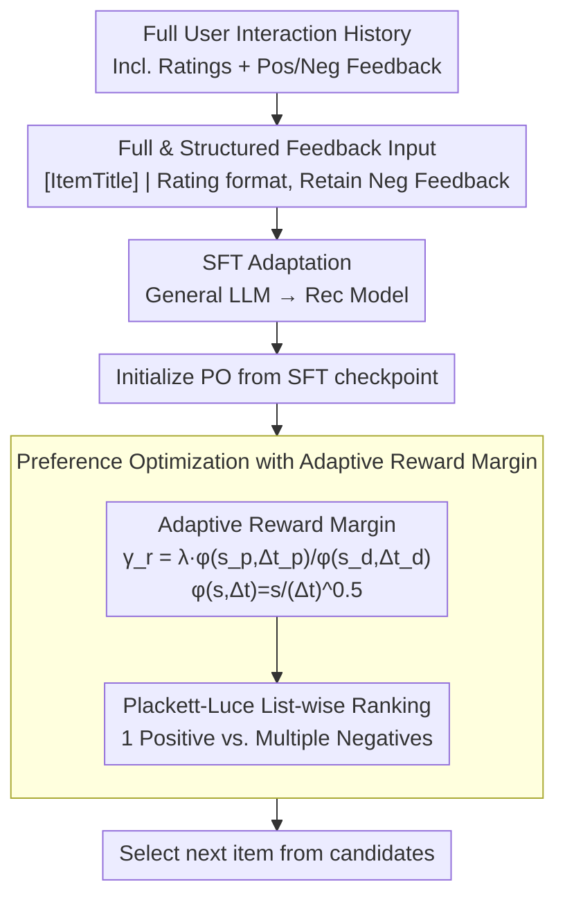

# What Makes LLMs Effective Sequential Recommenders? A Study on Preference Intensity and Temporal Context

**Conference**: ACL 2026  
**arXiv**: [2506.02261](https://arxiv.org/abs/2506.02261)  
**Code**: [https://github.com/zyouyang/RecPO](https://github.com/zyouyang/RecPO)  
**Area**: Recommender Systems  
**Keywords**: Sequential Recommendation, Preference Alignment, Preference Intensity, Temporal Context, DPO

## TL;DR

This paper reveals that existing LLM-based recommendation systems lose critical information—preference intensity and temporal context—due to binary preference modeling. It proposes the RecPO framework, which incorporates these two factors into preference optimization through an adaptive reward margin, significantly outperforming baselines like S-DPO across five datasets.

## Background & Motivation

**Background**: Large Language Models (LLMs) are being widely utilized for sequential recommendation tasks, predicting the user's next likely interaction via textualized interaction histories. Current mainstream methods employ preference alignment techniques such as DPO/S-DPO for training.

**Limitations of Prior Work**: Existing preference alignment methods (DPO, S-DPO) unify all preferences into binary pairwise comparisons—distinguishing only between "liked" and "disliked"—thus discarding substantial valuable information. In real-world user behavior, structured preference intensity exists (e.g., ratings from 1 to 5, strongly liked vs. slightly liked), and more recent interactions better reflect current user intent.

**Key Challenge**: The fundamental mismatch between binary preference modeling and human decision-making behavior—humans exhibit structured preferences (varying intensities) and time-sensitive preferences (recency matters), both of which are entirely ignored by existing methods.

**Goal**: (1) Systematically verify the importance of preference intensity and temporal context for LLM recommendation; (2) Design a preference optimization framework capable of leveraging these two factors.

**Key Insight**: Starting from known characteristics of human decision-making in behavioral economics and cognitive science, this study proves through controlled experiments that retaining negative feedback and structured ratings substantially improves recommendation performance, providing an empirical foundation for method design.

**Core Idea**: Encode preference intensity and interaction recency into the DPO objective function via an adaptive reward margin, allowing the model to learn preference representations that better align with human decision-making patterns.

## Method

### Overall Architecture

RecPO involves a two-stage training process: first, adapting a general LLM into a recommendation model via SFT; second, further alignment using preference optimization with an "adaptive reward margin." The input consists of the user's full interaction history (including positive/negative feedback and ratings), and the output is the next item selected from a candidate set. The primary difference from S-DPO is that RecPO no longer discards negative interactions but retains the full sequence and treats ratings as structured preference intensity signals fed into the training objective.

### Key Designs

**1. Full and Structured Feedback Input: Recovering Intensity Information Discarded by S-DPO**

S-DPO compresses all preferences into binary pairwise comparisons, distinguishing only "like/dislike" and discarding rating levels and negative feedback. Conversely, RecPO retains the user's full interaction sequence, where each historical item carries a preference signal formatted as `[ItemTitle] | Rating: [ItemRating]`. For datasets without explicit ratings, proxies such as gameplay duration or play counts are used. Proof-of-concept experiments demonstrate that recommendation is optimal only when both full feedback and structured ratings are retained; retaining negative interactions without ratings introduces noise and degrades performance.

**2. Adaptive Reward Margin: Differentiating Optimization Intensity for "5 vs. 1" and "4 vs. 3"**

A uniform margin cannot distinguish the inherent differences between preference pairs or reflect interaction recency. RecPO defines a margin $\gamma_r = \lambda \cdot \phi(s_p, \Delta t_p) / \phi(s_d, \Delta t_d)$ for each preference pair $(y_p, y_d)$, where the utility function is $\phi(s, \Delta t) = s / (\Delta t)^{0.5}$, $s$ is the preference score, and $\Delta t$ is the temporal distance from the decision point. Larger preference gaps and more recent interactions yield larger margins and stronger optimization signals. The ratio form amplifies training gradients in scenarios with low rating volatility.

**3. Plackett-Luce List-wise Ranking Extension: Expanding from Single to Multiple Negative Samples**

A single negative sample often fails to cover the user's complete "dislike" space. RecPO uses the PL model to embed the adaptive margin into a list-wise preference distribution, pairing each positive sample with multiple negative samples to learn their relative ranking. This extension is a natural superset of S-DPO; when $\lambda=0$, the margin becomes ineffective, and the method reverts to standard S-DPO.

### Loss & Training

The final loss incorporates the adaptive margin term $\gamma_r$ into the S-DPO framework, with $\lambda$ controlling the impact of the margin (default $\lambda=2$). Training proceeds via SFT followed by preference optimization initialized from the SFT checkpoint. For negative sampling and historical interactions without explicit feedback, default preference scores and temporal delays are assigned.

## Key Experimental Results

### Main Results

| Dataset | Metric | RecPO (LLaMA3-8B) | S-DPO | Gain |
|--------|------|------|----------|------|
| MovieLens | HR@1 | 0.3451 | 0.2902 | +18.9% |
| Amazon-Books | HR@1 | 0.5802 | 0.5065 | +14.6% |
| BeerAdvocate | HR@1 | 0.5771 | 0.4698 | +22.8% |
| Steam | HR@1 | 0.4672 | 0.3588 | +30.2% |
| LastFM | HR@1 | 0.6830 | 0.5719 | +19.4% |

RecPO similarly outperforms all baselines on Qwen-7B, with HR@1 gains ranging between 10% and 30%.

### Ablation Study

| Configuration | MovieLens | Amazon-Books | BeerAdvocate | Steam | LastFM |
|------|---------|------|------|------|------|
| –I –T (=S-DPO) | 0.2902 | 0.5065 | 0.4698 | 0.3588 | 0.5719 |
| –T (Preference Intensity Only) | 0.3343 | 0.5661 | 0.6143 | 0.4202 | 0.6544 |
| RecPO (Full) | 0.3451 | 0.5802 | 0.5771 | 0.4672 | 0.6830 |

### Key Findings

- **Preference intensity contributes the most**: Simply adding preference intensity (–T) yields significant improvements, indicating that structured preference signals are the most critical factor.
- **Temporal context provides complementary gains**: Adding temporal context on top of preference intensity further improves results on 4 out of 5 datasets (with Steam showing the largest jump from 0.4202 to 0.4672).
- **Margin function form**: The ratio form (default) outperforms alternatives like Log Diff and Log Ratio.
- **Human alignment behavior**: RecPO learns four human decision patterns: prioritization of immediate gratification, resistance to temptation, implicit aversion modeling, and robustness across context lengths (HR@1 variance of 8.7% vs. S-DPO's 17.8%).

## Highlights & Insights

- **Empirical-first methodology**: The study first proves the importance of intensity and temporal context through controlled experiments before designing the method. This hypothesis-driven paradigm is noteworthy.
- **Simple and effective margin design**: The form $\phi(s, \Delta t) = s / (\Delta t)^{0.5}$ is concise, and a single hyperparameter $\lambda$ controls the influence, making it easy to replicate.
- **Emergence of implicit aversion modeling**: The model learns to identify users' most disliked items even without explicit aversion labels, suggesting that structured preference signals can implicitly encode negative preferences.

## Limitations & Future Work

- Only simplified sequential preference structures and delay-to-satisfaction were considered as contextual factors; real-world human decision-making involves more complex preference hierarchies.
- Gains on implicit feedback datasets are relatively small, as the homogeneity of proxy signals limits the method's advantages.
- Future work could explore the application of cognitively plausible preference modeling in preference tasks beyond recommendation.

## Related Work & Insights

- **vs S-DPO**: S-DPO uses list-wise optimization with multiple negative samples but employs a uniform margin. RecPO is a natural extension of S-DPO (reverting to S-DPO when $\lambda=0$) that introduces preference intensity and temporal information via an adaptive margin.
- **vs SimPO**: SimPO uses a fixed margin and length normalization, but a fixed margin fails to capture differences between preference pairs, and its lower Valid Ratio can impact deployment.

## Rating

- Novelty: ⭐⭐⭐⭐ Approaching recommendation system preference alignment from a cognitive science perspective is insightful.
- Experimental Thoroughness: ⭐⭐⭐⭐⭐ Comprehensive evaluation across five datasets, two backbones, multiple ablations, and behavioral analyses.
- Writing Quality: ⭐⭐⭐⭐⭐ Clear, empirical-first narrative structure.
- Value: ⭐⭐⭐⭐ Provides a practical direction for improving preference alignment in LLM recommendation systems.

<!-- RELATED:START -->

## Related Papers

- [\[ACL 2026\] What Makes an Ideal Quote? Recommending "Unexpected yet Rational" Quotations via Novelty](what_makes_an_ideal_quote_recommending_34unexpected_yet_rational34_quotations_vi.md)
- [\[ACL 2026\] Personalizing LLMs with Binary Feedback: A Preference-Corrected Optimization Framework](personalizing_llms_with_binary_feedback_a_preference-corrected_optimization_fram.md)
- [\[ACL 2026\] Where and What: Reasoning Dynamic and Implicit Preferences in Situated Conversational Recommendation](where_and_what_reasoning_dynamic_and_implicit_preferences_in_situated_conversati.md)
- [\[ACL 2026\] Bridging Language and Items for Retrieval and Recommendation: Benchmarking LLMs as Semantic Encoders](bridging_language_and_items_for_retrieval_and_recommendation_benchmarking_llms_a.md)
- [\[ACL 2026\] Mirroring Users: Towards Building Preference-aligned User Simulator with User Feedback in Recommendation](mirroring_users_towards_building_preference-aligned_user_simulator_with_user_fee.md)

<!-- RELATED:END -->
