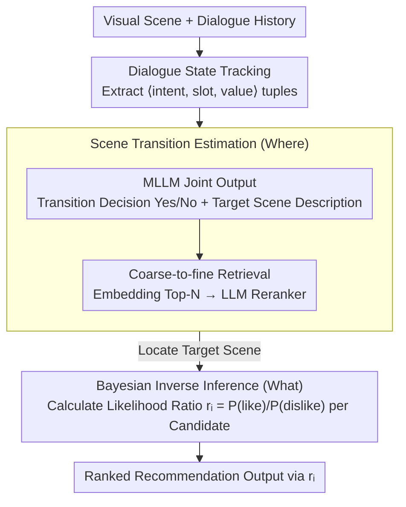

# Where and What: Reasoning Dynamic and Implicit Preferences in Situated Conversational Recommendation

**Conference**: ACL 2026  
**arXiv**: [2604.20749](https://arxiv.org/abs/2604.20749)  
**Code**: [https://github.com/DongdingLin/SiPeR](https://github.com/DongdingLin/SiPeR)  
**Area**: Recommendation Systems / Conversational Recommendation  
**Keywords**: Situated Conversational Recommendation, Scene Transition, Bayesian Inverse Reasoning, Implicit Preferences, Multimodal

## TL;DR

SiPeR addresses the challenges of dynamic user preferences and implicit expressions in situated conversational recommendation through Scene Transition Estimation ("Where") and Bayesian Inverse Inference ("What"), achieving performance gains of 10.9% and 10.6% on SIMMC 2.1 and SCREEN, respectively.

## Background & Motivation

**Background**: Conversational Recommendation Systems (CRS) provide recommendations through natural language interaction, but most focus only on text, ignoring visual information and environmental factors. Situated Conversational Recommendation (SCR) utilizes visual scenes and dialogue to provide context-aware recommendations, which aligns more closely with real-world shopping scenarios.

**Limitations of Prior Work**: SCR faces two unique challenges—(1) User preferences are dynamic and vary with changes in the scene: when a user in a formal wear area expresses interest in "outdoor hiking," the system must proactively guide them to the outdoor area, yet existing work ignores scene transition decisions; (2) User preferences are often implicit: a user stating "the size is right" while asking to see other options implies the recommended blue jeans do not meet their true preference, requiring the system to infer that the user actually wants gray pants.

**Key Challenge**: SCR must simultaneously resolve two decisions—"Where" (in which scene to recommend) and "What" (which items to recommend), but existing research focuses primarily on dataset construction rather than framework design.

**Goal**: (1) Design a scene transition estimation mechanism to determine when and where to transition scenes; (2) Utilize Bayesian inverse inference to deduce users' true implicit preferences from dialogue.

**Key Insight**: Treat the user as a rational actor (inspired by Bayesian Inverse Planning), where their utterances are "actions" performed to achieve underlying goals; preferences are reasoned by comparing the likelihood ratio of "like" versus "dislike" hypotheses.

**Core Idea**: For scene transitions, use a "generate-retrieve" strategy (generating a target scene description before retrieving matching scenes); for item preferences, use Bayesian inverse inference (treating user utterances as observed signals of latent goals).

## Method

### Overall Architecture

SiPeR decomposes situated conversational recommendation into a sequence of "Where" and "What" decisions. Given the visual scene and dialogue history, the system first uses Dialogue State Tracking to compress the natural language dialogue into structured intention tuples, providing a clean input for subsequent probabilistic reasoning. Next, Scene Transition Estimation (STE) determines whether to change the scene and which scene to transition to, guiding the user to the correct "shelf." Finally, Bayesian Inverse Inference (BI-INF) deduces the items the user truly wants from the dialogue and ranks the candidates within the current scene.

### Key Designs

**1. Dialogue State Tracking: Compressing Dialogue into Structured Intentions**

Performing Bayesian inference directly in natural language space is highly uncontrollable and requires convergence into a structured representation. This step instructs a strong LLM to extract $\langle \text{intent, slot, value} \rangle$ tuples from the dialogue history, achieving a manual validation accuracy of 98.8%. With these structured intentions, subsequent scene transition judgments and likelihood calculations do not need to unfold over open text, making the reasoning space more manageable—serving as shared input preprocessing for both "Where" and "What" mechanisms.

**2. Scene Transition Estimation (STE): Determining When and Where to Transition**

User interests drift with the scene—if "outdoor hiking" is mentioned in a formal wear area, the system should proactively lead the user to an outdoor area, a decision previously ignored. Since direct semantic reasoning over large-scale candidate scenes is computationally expensive, STE uses a three-step "generate-retrieve" decomposition: first, an MLLM converts each candidate scene into a text description (situated profile); then, given the dialogue history and current scene, the MLLM jointly outputs a transition decision (Yes/No) and a text description of the target scene, with the transition probability derived from the normalized logit of the Yes/No tokens; finally, coarse-to-fine retrieval is performed—taking Top-N candidates via embedding similarity followed by fine-ranking with a trained LLM reranker. Generating a target description before retrieval decouples semantic reasoning from computational overhead for "Where to recommend."

**3. Bayesian Inverse Inference (BI-INF): Inferring Implicit Preferences as Actions**

Users often do not state their true preferences directly—saying "the size is right" but asking for other options is actually a rejection of the current blue jeans in favor of gray ones, a subtle signal difficult for LLMs to distinguish from surface-level dialogue. BI-INF borrows from Bayesian Inverse Planning, formalizing the user as a rational agent in a POMDP where utterances are "actions" to achieve latent goals. For each candidate item $m_i$, it compares the likelihood ratio $r_i = \mathbb{P}(\text{like} \mid \text{dialogue}) / \mathbb{P}(\text{dislike} \mid \text{dialogue})$: using a fine-tuned MLLM, it calculates the probability of generating the observed dialogue state under the two hypotheses of "user wants the item" and "user does not want the item." Items with higher likelihood ratios are what the user truly desires, which is more rigorous than a direct heuristic judgment of "like/dislike."

### An Illustrative Example

Suppose a user is in the formal wear area and mentions looking for "outdoor hiking" items: Dialogue State Tracking first extracts this as $\langle \text{intent=browse, slot=scene, value=outdoor} \rangle$. STE then determines that the current formal wear scene is a mismatch, generates a target scene description "Outdoor/Hiking Gear Area," retrieves the best matching outdoor scene, and completes the transition—this is "Where." Once in the outdoor area, the user says "the size is right, but I want to see other options." BI-INF treats this as an action and calculates the likelihood ratio $r_i$ for each candidate item: the probability of generating this dialogue state under the "like" hypothesis for the current blue pants is low, resulting in a small $r_i$ and a lower rank, while gray pants matching the user's implicit intent receive a high $r_i$ and are ranked at the top—this is "What." The two mechanisms work in tandem to recommend the "right item in the right scene."

### Loss & Training

The Reranker is optimized using Negative Log-Likelihood (NLL). MLLM fine-tuning is used for dialogue state generation and likelihood calculation.

## Key Experimental Results

### Main Results

| Method | SIMMC 2.1 R@1 | SCREEN R@1 |
|------|--------------|------------|
| GPT-4o (CoT) | 28.12 | 33.45 |
| Qwen2.5-VL (CoT) | 16.72 | 21.05 |
| **Ours (SiPeR)** | **~39** | **~44** |

### Ablation Study

| Configuration | Key Metric | Description |
|------|---------|------|
| SiPeR (Full) | Optimal | STE + BI-INF |
| Remove STE | Decrease | Unable to handle scene transitions |
| Remove BI-INF | Decrease | Unable to infer implicit preferences |
| Replace BI-INF with CoT | Significant Decrease | Probabilistic reasoning outperforms heuristic reasoning |

### Key Findings

- SiPeR improves by an average of 10.9% and 10.6% over the best baselines on SIMMC 2.1 and SCREEN.
- The likelihood ratio method in Bayesian inverse inference significantly outperforms simple CoT reasoning, validating the utility of the probabilistic framework for implicit preference inference.
- Scene transition estimation is crucial for recommendation amid dynamic scene changes—without STE, the system cannot recommend within the correct context.

## Highlights & Insights

- Applying Bayesian Inverse Planning from cognitive science to conversational recommendation by treating user utterances as "actions" rather than "statements" provides an elegant theoretical framework.
- The "Where + What" problem decomposition clearly maps to the two core challenges of SCR.
- The "generate-retrieve" scene transition strategy skillfully balances semantic reasoning capability with computational efficiency.

## Limitations & Future Work

- Experiments were validated only on simulated datasets; real-world e-commerce scenarios involve higher complexity.
- Bayesian inference assumes the user is a "rational agent," but real-world user behavior may be irrational.
- Dialogue state tracking relies on strong LLMs, which may not be applicable in low-resource scenarios.

## Related Work & Insights

- **vs. Traditional CRS**: Traditional systems handle only text; SiPeR processes visual scenes + text dialogue.
- **vs. BIP/Theory of Mind**: SiPeR introduces Bayesian Inverse Planning from computational cognitive science into recommendation systems.

## Rating

- Novelty: ⭐⭐⭐⭐⭐ Application of Bayesian Inverse Planning in SCR and the decomposition into Where+What is highly novel.
- Experimental Thoroughness: ⭐⭐⭐⭐ Validated on two benchmarks with multiple baselines and thorough ablations, though lacking real-world validation.
- Writing Quality: ⭐⭐⭐⭐ Motivation and methodology are clearly articulated.
- Value: ⭐⭐⭐⭐ Provides the first systematic framework for situated conversational recommendation.

<!-- RELATED:START -->

## Related Papers

- [\[ACL 2026\] HARPO: Hierarchical Agentic Reasoning for User-Aligned Conversational Recommendation](harpo_hierarchical_agentic_reasoning_for_user-aligned_conversational_recommendat.md)
- [\[ICLR 2026\] More Than What Was Chosen: LLM-based Explainable Recommendation Beyond Noisy User Preferences](../../ICLR2026/recommender/more_than_what_was_chosen_llm-based_explainable_recommendation_beyond_noisy_user.md)
- [\[ACL 2026\] ReRec: Reasoning-Augmented LLM-based Recommendation Assistant via Reinforcement Fine-tuning](rerec_reasoning-augmented_llm-based_recommendation_assistant_via_reinforcement_f.md)
- [\[ACL 2026\] What Makes an Ideal Quote? Recommending "Unexpected yet Rational" Quotations via Novelty](what_makes_an_ideal_quote_recommending_34unexpected_yet_rational34_quotations_vi.md)
- [\[ACL 2026\] Intent-Driven Semantic ID Generation for Grounded Conversational News Recommendation](intent-driven_semantic_id_generation_for_grounded_conversational_news_recommenda.md)

<!-- RELATED:END -->
