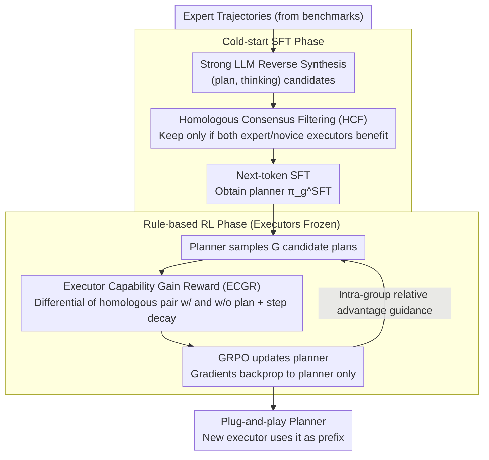

# A Goal Without a Plan Is Just a Wish: Efficient and Effective Global Planner Training for Long-Horizon Agent Tasks (EAGLET)

**Conference**: ACL 2026  
**arXiv**: [2510.05608](https://arxiv.org/abs/2510.05608)  
**Code**: Public link not provided in the abstract  
**Area**: Reinforcement Learning / LLM Agent  
**Keywords**: plan-and-execute, GRPO, Global Planner, Long-horizon tasks, executor capability gain reward

## TL;DR
EAGLET decomposes long-horizon agent tasks into two modules: a "global planner + local executor." It trains a plug-and-play planner through a two-step process: "cold-start SFT using homologous consensus filtering" and "GRPO fine-tuning using executor capability gain as a reward." It achieves new SOTA on three long-horizon tasks and reduces training costs to 1/8 of RL baselines.

## Background & Motivation
**Background**: LLM agents currently handle long-horizon tasks (multi-turn interaction, dynamic environments like ScienceWorld, ALFWorld, WebShop) via two main paradigms: implicit planning (ReAct series + SFT/RL, where planning is hidden within each reasoning step) and explicit planning (KnowAgent constructing knowledge bases, MPO training a specific planner).

**Limitations of Prior Work**: Implicit methods treat the agent solely as an executor, relying on local reason-action interleaving for planning. This leads to frequent brainless trial-and-error and planning hallucinations in long-horizon tasks. SFT requires large amounts of expert trajectories (data-inefficient), while RL suffers from sparse/delayed rewards and long episodes, making training slow and unstable. Explicit methods, while providing visible plans, require extensive human effort for verifying or modifying collected plan data, leading to high cross-environment migration costs.

**Key Challenge**: Planner training faces a trade-off between quality (plans must effectively guide the executor rather than being "pretty but useless"), efficiency (avoiding manual plan labeling), and generalization (a single planner must drive executors with varying capabilities).

**Goal**: (1) Automatically synthesize high-quality global plan data without human intervention; (2) Design RL reward signals that generalize across executors; (3) Enable a plug-and-play planner that can be directly utilized by any new executor.

**Key Insight**: The authors observe that strong LLMs (e.g., GPT-5, DeepSeek-V3.1-Think) can synthesize data by reverse-generating plans and thinking from existing expert trajectories. This can be refined through "homologous executor dual verification" to both denoise the data and prevent plan quality from being contaminated by the capability bias of a specific executor.

**Core Idea**: Use "homologous expert/novice executor pairs" for both data filtering (HCF) and RL rewards (ECGR). The reward quantifies "whether the plan truly improves the executor," followed by GRPO optimization to achieve high efficiency, quality, and cross-executor utility.

## Method

### Overall Architecture
EAGLET reformulates agent tasks $\pi_\theta(e \mid u) = \prod_t \pi_\theta(a_t \mid u, a_{<t}, o_{<t})$ into a plan-conditioned version: $\pi_\theta(e \mid u, p) = \pi_g(p \mid u) \cdot \prod_t \pi_\theta(a_t \mid u, p, a_{<t}, o_{<t})$, introducing a trainable global planner $\pi_g$. The pipeline consists of two stages:

1. **Cold-start SFT**: Reverse-synthesize (plan, thinking) from expert trajectories using strong reasoning LLMs, filter via HCF, and perform next-token SFT to obtain $\pi_g^\text{SFT}$.
2. **Rule-based RL**: Optimize $\pi_g^\text{SFT}$ using GRPO. The reward signals include ECGR (Executor Capability Gain Reward) and format rewards. Executors remain frozen throughout, with gradients flowing only to the planner.

During inference, a new executor uses the plan generated by $\pi_g$ as a prefix to the task instruction without requiring any additional training.

### Key Designs

**1. Homologous Consensus Filtering (HCF): Replacing human annotation with homologous executor consensus**

Plans reverse-synthesized by strong LLMs vary in quality. Some appear logical but mislead the executor. SFT would be contaminated by this noise without filtering, while manual verification is too costly. HCF pairs each candidate plan $p$ with a **homologous** executor pair: an expert $\hat\pi_\theta$ (e.g., GiGPO-Llama-3.1) and a novice $\hat\pi_\tau$ (original Llama-3.1). These share the same base model and architecture, differing only after post-training. The pair runs twice (with and without the plan). $p$ is kept only if $r(u, e_{p; \hat\pi_\theta}) \geq r(u, e_{\hat\pi_\theta})$ **and** $r(u, e_{p; \hat\pi_\tau}) \geq r(u, e_{\hat\pi_\tau})$, defined as $F_\text{quality}(p) = \mathbb{I}\{\text{neither executor is hindered by the plan}\}$.

A homologous pair is used instead of a single executor because a single executor’s assessment is biased: a strong executor might complete a task even with a poor plan. Using models with the same base eliminates confounding factors like context window or parameter size, ensuring the filtering signal reflects the "marginal contribution of the plan."

**2. Executor Capability Gain Reward (ECGR): Quantifying "net plan gain" as RL reward**

Using only task success rate as a reward fails to distinguish the plan's specific contribution and is biased by executor strength. ECGR uses a differential signal: for each (task, plan), the homologous pair $\hat\pi_\theta, \hat\pi_\tau$ runs with and without the plan. The base reward $R(p, \pi_\theta) = \mathbb{I}\{r(u, e_{p; \pi_\theta}) > r(u, e_{\pi_\theta})\}$ credits the planner only when the plan yields actual improvement. This is multiplied by a step decay factor $\hat R = R \cdot (1+\alpha)^{n-m}$ ($n$ is steps without plan, $m$ is steps with plan, $\alpha$ is a hyperparameter), rewarding plans that shorten execution. The finalized reward is $R_\text{ECGR} = \hat R(p, \hat\pi_\theta) + \hat R(p, \hat\pi_\tau)$, with $R_\text{Final} = R_\text{ECGR} + R_\text{Format}$.

This "differential + dual executor" approach anchors the reward to the net contribution of the plan, penalizing "pretty but useless" plans. The decay factor implicitly encourages the planner to find shortcuts, counteracting brainless trial-and-error.

**3. GRPO with frozen executors: Optimizing via gradients to the planner only**

The planner samples $G$ candidate plans $\{p_1, \dots, p_G\}$ for each task. Each is scored using ECGR and updated via intra-group relative advantage $A_i$. The loss is $\mathcal{L}_\text{GRPO} = \mathbb{E}[\frac{1}{G}\sum_i \mathcal{L}_i - \beta \mathbb{D}_\text{KL}(\pi_g \Vert \pi_g^\text{ref})]$, with standard PPO clipping $\mathcal{L}_i = \min(w_i A_i, \text{clip}(w_i, 1-\epsilon, 1+\epsilon) A_i)$. Compared to PPO, GRPO eliminates reward model training, fitting the low-noise, rule-based reward setting. Crucially, executors are frozen during ECGR calculation; RL costs scale linearly with the small planner, shifting the bottleneck from "LLM multi-step rollout" to "one-time planner generation + evaluation," achieving 8× acceleration.

### Loss & Training
SFT Phase: $\mathcal{L}_\text{SFT} = -\mathbb{E}_{(u, t, p) \sim \mathcal{D}}[\log \pi_g(t, p \mid u)]$, learning both thinking $t$ and plan $p$.
RL Phase: GRPO + ECGR + Format reward. KL regularization coefficient $\beta$ controls deviation from the reference model. Expert trajectories are sourced from existing agent benchmarks (ScienceWorld / ALFWorld / WebShop).

## Key Experimental Results

### Main Results: Three Long-Horizon Agent Benchmarks (Success Rate, EAGLET vs. Baselines)

| Setting | ScienceWorld Seen | ScienceWorld Unseen | ALFWorld Seen | ALFWorld Unseen | WebShop Seen | Average |
|------|-------------------|---------------------|---------------|-----------------|--------------|------|
| Executor w/o training (Base LLM) | Low baseline | — | — | — | — | — |
| SFT-only baseline (Implicit) | Medium | Lower than Seen | Medium | Lower than Seen | Medium | Significant Split Gap |
| GiGPO (RL on executor, SOTA prior) | High | Mid-High | High | Mid-High | High | Strong but expensive |
| **EAGLET (Plug-in planner)** | **New SOTA** | **New SOTA** | **New SOTA** | **New SOTA** | **New SOTA** | Comprehensive Lead |

Note: EAGLET consistently sets new SOTAs across all 5 splits. Its lead over implicit SFT is most pronounced in the "Unseen" split, demonstrating that explicit planning offers superior generalization.

### Efficiency Comparison

| Method | Training Time (Relative) | Manual Plan Labeling | Extra Data Required |
|------|-----------------|---------------------|----------------|
| GiGPO (RL on executor) | 1× (baseline) | No | No |
| MPO (Explicit planner, prior) | ~ | Yes (Verification) | Yes |
| **EAGLET** | **1/8 ×** | **No** | **No** |

### Key Findings
- HCF filtering is critical for SFT: unfiltered synthetic plans caused a **negative** contribution in several splits, proving that consensus filtering is a necessity.
- Both components of the "homologous pair" are essential: using only the expert leads to plans over-optimized for strong models (harmful to weak ones), while using only the novice results in over-simplification. The pair minimizes the generalization gap.
- The decay factor $\alpha$ significantly reduced average interaction steps, suppressing brainless trials.
- Decoupling planner and executor allows a trained planner to provide gains even when paired with an **untrained** new executor, confirming the "plug-and-play" property.

## Highlights & Insights
- **Dual utility of "homologous pairs"**: They serve as both a data filter and an RL reward signal. This reuse is elegant: it filters noise at the SFT stage and provides dense, discriminative signals during RL.
- **Engineering significance of decoupling**: Separating planning from execution means that as base LLMs (executors) evolve, the planner does not necessarily need retraining. Likewise, planner improvements benefit all downstream agents immediately.
- **Reward for execution efficiency**: While many RL agents focus only on success, EAGLET rewards path efficiency via $(1+\alpha)^{n-m}$, a simple term that can be applied to other multi-step decision tasks.
- **Scalability through 8× acceleration**: Restricting RL to a small planner while freezing the executor shifts the computational burden from "multi-step large LLM rollouts" to "small model generation," providing a scalable paradigm for RL agents.

## Limitations & Future Work
- Dependency on the existence of "homologous pairs," which may be unavailable for languages or tasks without mature model ecosystems.
- Plans are fixed in natural language (with think/plan tags); structured planning (e.g., PDDL, code) remains unexplored.
- Focused on single-agent benchmarks; utility in multi-agent collaboration is not verified.
- Heavy reliance on GPT-5 / DeepSeek-V3.1-Think for SFT data synthesis, inheriting the limitations of these models.
- The relationship between plan length and executor context windows in ultra-long tasks (>100 steps) was not discussed.

## Related Work & Insights
- **vs. ReAct / Implicit RL agent**: EAGLET extracts planning into an explicit module to provide global foresight, fundamentally suppressing hallucinations seen in ReAct.
- **vs. KnowAgent**: KnowAgent relies on manually constructed knowledge bases; EAGLET uses automated synthesis and filtering, reducing migration costs across environments.
- **vs. MPO**: MPO requires manual plan verification; EAGLET replaces this with homologous executor consensus, improving efficiency by orders of magnitude.
- **vs. GiGPO**: GiGPO conducts fine-grained RL on the executor requiring long rollouts; EAGLET moves RL to the planner (small model, short output) for an 8× speedup.
- **vs. GRPO (DeepSeek)**: EAGLET adapts GRPO from mathematical reasoning to agent planning with the task-specific ECGR reward, demonstrating successful cross-domain generalization.

## Rating
- Novelty: ⭐⭐⭐⭐ "Dual-use homologous pairs" is a clean conceptual innovation.
- Experimental Thoroughness: ⭐⭐⭐⭐ Proven across three benchmarks and Seen/Unseen splits with 8× speedup; lacks real-world task validation.
- Writing Quality: ⭐⭐⭐⭐⭐ Clear motivation, formal notation, and well-executed ablation studies.
- Value: ⭐⭐⭐⭐⭐ The decoupling of planner/executor and 8× acceleration provide high practical value for long-horizon agent deployment.

<!-- RELATED:START -->

## Related Papers

- [\[ICML 2026\] InftyThink+: Effective and Efficient Infinite-Horizon Reasoning via Reinforcement Learning](../../ICML2026/reinforcement_learning/inftythink_effective_and_efficient_infinite-horizon_reasoning_via_reinforcement_.md)
- [\[ICML 2026\] Long-Horizon Model-Based Offline Reinforcement Learning Without Explicit Conservatism](../../ICML2026/reinforcement_learning/long-horizon_model-based_offline_reinforcement_learning_without_explicit_conserv.md)
- [\[ACL 2026\] LoVeC: Reinforcement Learning for Better Verbalized Confidence in Long-Form Generations](lovec_reinforcement_learning_for_better_verbalized_confidence_in_long-form_gener.md)
- [\[ICLR 2026\] Don't Just Fine-tune the Agent, Tune the Environment](../../ICLR2026/reinforcement_learning/dont_just_fine-tune_the_agent_tune_the_environment.md)
- [\[NeurIPS 2025\] Reinforcement Learning for Long-Horizon Multi-Turn Search Agents](../../NeurIPS2025/reinforcement_learning/reinforcement_learning_for_long-horizon_multi-turn_search_agents.md)

<!-- RELATED:END -->
