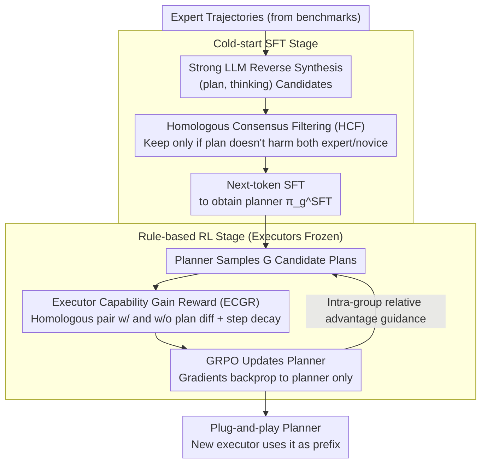

# A Goal Without a Plan Is Just a Wish: Efficient and Effective Global Planner Training for Long-Horizon Agent Tasks (EAGLET)

**Conference**: ACL 2026  
**arXiv**: [2510.05608](https://arxiv.org/abs/2510.05608)  
**Code**: No public link provided in the abstract  
**Area**: Reinforcement Learning / LLM Agent  
**Keywords**: plan-and-execute, GRPO, global planner, long-horizon tasks, executor capability gain reward

## TL;DR
EAGLET decouples long-horizon agent tasks into "global planner + local executor" modules. It trains a plug-and-play planner through a two-step pipeline: "cold-start SFT with homologous consensus filtering" followed by "GRPO fine-tuning using executor capability gain as reward." It achieves new SOTA on three long-horizon benchmarks while reducing training costs to 1/8 of RL baselines.

## Background & Motivation
**Background**: LLM agents for long-horizon tasks (multi-turn interactions, dynamic environments such as ScienceWorld, ALFWorld, WebShop) currently follow two main paths: implicit planning (ReAct series + SFT/RL, where planning is hidden within each step of reasoning) and explicit planning (KnowAgent for knowledge base construction, MPO for planner training).

**Limitations of Prior Work**: Implicit methods treat the agent as an executor relying solely on local reason-action interleaving for planning, which leads to frequent "brainless trial-and-error" and planning hallucinations in long-horizon tasks. SFT requires large-scale expert trajectories (data-inefficient), while RL suffers from sparse and delayed rewards and long episodes, making training extremely slow and unstable. Explicit methods, though providing explicit plans, require intensive human labor to verify/modify collected plan data, resulting in high cross-environment migration costs.

**Key Challenge**: Planner training requires a trade-off between quality (the plan must truly guide the executor to complete the task, rather than being "pretty but useless talk"), efficiency (avoiding manual per-item plan labeling), and generalization (a single planner should drive executors with varying capabilities).

**Goal**: (1) Automatically synthesize high-quality global plan data without human intervention; (2) Design an RL reward signal that generalizes across executors; (3) Ensure the trained planner is plug-and-play and compatible with any new executor.

**Key Insight**: The authors observe that strong LLMs (e.g., GPT-5, DeepSeek-V3.1-Think) can synthesize (plan, thinking) pairs from existing expert trajectories via reverse engineering. By applying "homologous executor dual verification" for filtering, noise can be removed while preventing plan quality from being contaminated by the capability bias of a specific executor.

**Core Idea**: Use "homologous expert/novice executor pairs" for both data filtering (HCF) and RL reward (ECGR). This quantifies "whether the plan truly improves the executor" as a direct reward, followed by GRPO optimization to achieve fast training, high quality, and cross-executor utility.

## Method

### Overall Architecture
EAGLET reformulates the agent task $\pi_\theta(e \mid u) = \prod_t \pi_\theta(a_t \mid u, a_{<t}, o_{<t})$ into a plan-conditioned version: $\pi_\theta(e \mid u, p) = \pi_g(p \mid u) \cdot \prod_t \pi_\theta(a_t \mid u, p, a_{<t}, o_{<t})$, introducing a trainable global planner $\pi_g$. The pipeline consists of two stages:

1. **Cold-start SFT**: A strong reasoning LLM synthesizes (plan, thinking) from expert trajectories, which is then filtered via HCF and used for next-token SFT to obtain $\pi_g^\text{SFT}$.
2. **Rule-based RL**: GRPO optimizes $\pi_g^\text{SFT}$ using ECGR (Executor Capability Gain Reward) and format rewards. The executors remain frozen throughout, with gradients backpropagated only to the planner.

During inference, a new executor simply uses the plan generated by $\pi_g$ as a prefix to the task instruction, requiring no executor-specific training.

### Key Designs

**1. Homologous Consensus Filtering (HCF): Using homologous executors to replace manual labeling**

Plans synthesized by strong LLMs vary in quality; some look polished but actually mislead executors. HCF pairs each candidate plan $p$ with a **homologous** executor set—an expert $\hat\pi_\theta$ (e.g., GiGPO-Llama-3.1) and a novice $\hat\pi_\tau$ (original Llama-3.1). They share the same base model and architecture, differing only in post-training capabilities. Each executor runs twice (with/without plan). The plan is retained only if $r(u, e_{p; \hat\pi_\theta}) \geq r(u, e_{\hat\pi_\theta})$ **and** $r(u, e_{p; \hat\pi_\tau}) \geq r(u, e_{\hat\pi_\tau})$, defined as $F_\text{quality}(p) = \mathbb{I}\{\text{both executors are not harmed by the plan}\}$. This excludes extraneous variables like context window or parameter count, ensuring the signal reflects the marginal contribution of the plan.

**2. Executor Capability Gain Reward (ECGR): Quantifying plan net gain as RL reward**

Instead of using task success rate as a reward (which fails to isolate the plan's contribution), ECGR uses a differential signal. For each (task, plan), the homologous pair $\hat\pi_\theta, \hat\pi_\tau$ runs twice (with/without plan). The base reward $R(p, \pi_\theta) = \mathbb{I}\{r(u, e_{p; \pi_\theta}) > r(u, e_{\pi_\theta})\}$ is given only when the plan provides a genuine improvement. This is multiplied by a step-decay factor $\hat R = R \cdot (1+\alpha)^{n-m}$ (where $n$ is steps without plan, $m$ is steps with plan, and $\alpha$ is a hyperparameter), rewarding plans that make execution more efficient. The final reward is $R_\text{ECGR} = \hat R(p, \hat\pi_\theta) + \hat R(p, \hat\pi_\tau)$.

**3. GRPO with frozen executors: Optimizing efficiency**

The planner samples $G$ candidate plans $\{p_1, \dots, p_G\}$ for each task, scored via ECGR, and updated using intra-group relative advantage $A_i$. The loss is $\mathcal{L}_\text{GRPO} = \mathbb{E}[\frac{1}{G}\sum_i \mathcal{L}_i - \beta \mathbb{D}_\text{KL}(\pi_g \Vert \pi_g^\text{ref})]$. Since executors are frozen during ECGR calculation, RL costs scale only with the small planner, shifting the bottleneck from "multi-step LLM rollouts" to "one-time planner generation and evaluation," resulting in an 8× speedup.

### Loss & Training
SFT Stage: $\mathcal{L}_\text{SFT} = -\mathbb{E}_{(u, t, p) \sim \mathcal{D}}[\log \pi_g(t, p \mid u)]$, learning thinking $t$ and plan $p$ simultaneously.
RL Stage: GRPO + ECGR + Format reward. Expert trajectories are sourced from standard agent benchmarks (ScienceWorld / ALFWorld / WebShop).

## Key Experimental Results

### Main Results: Three Long-Horizon Agent Benchmarks (Success Rate)

| Setup | ScienceWorld Seen | ScienceWorld Unseen | ALFWorld Seen | ALFWorld Unseen | WebShop Seen | Average |
|------|-------------------|---------------------|---------------|-----------------|--------------|------|
| Executor w/o training (Base LLM) | Low Baseline | — | — | — | — | — |
| SFT-only baseline (implicit) | Medium | Sig. lower than Seen | Medium | Sig. lower than Seen | Medium | Large gap across splits |
| GiGPO (RL on executor, prior SOTA) | High | Med-High | High | Med-High | High | Strong but expensive |
| **EAGLET (plug-in planner)** | **New SOTA** | **New SOTA** | **New SOTA** | **New SOTA** | **New SOTA** | Comprehensive lead |

### Training Efficiency Comparison

| Method | Training Time (Relative) | Manual Plan Labeling | Extra Data Required |
|------|-----------------|---------------------|----------------|
| GiGPO (RL on executor) | 1× (baseline) | No | No |
| MPO (explicit planner) | ~ | Yes (validation/edit) | Yes |
| **EAGLET** | **1/8 ×** | **No** | **No** |

### Key Findings
- HCF filtering is crucial for SFT: unfiltered synthetic plans can lead to **negative** contributions, where having a plan is worse than none.
- The dual-executor setup in ECGR prevents bias: using only an expert leads to plans that over-optimize for strong executors (harming weak ones), while using only a novice results in over-simplified plans.
- The decay factor $\alpha$ significantly reduces average interaction steps, suppressing brainless trial-and-error.
- Decoupling allows a planner to provide gains to **unseen** executors, verifying the "plug-and-play" property.

## Highlights & Insights
- **Dual-use Homologous Pairs**: Leveraging the same pair for both data filtering and RL reward is an elegant way to maintain consistency across training stages.
- **Engineering Decoupling**: Decoupling the planner from the executor means that when the base LLM is upgraded, only the executor needs to be swapped, not the planner. This is highly practical for deployment.
- **Rewarding Efficiency**: By injecting $(1+\alpha)^{n-m}$ into the reward, the model is explicitly taught to reduce path length, which is vital for long-horizon decision-making.
- **8× Training Acceleration**: Moving the RL bottleneck away from massive LLM rollouts to small planner updates provides a scalable paradigm for agent training.

## Limitations & Future Work
- Dependence on the availability of "homologous pairs," which may be difficult to find for specialized or low-resource tasks.
- Plans are restricted to natural language; structured plans (e.g., PDDL, code) were not explored.
- Lack of multi-agent collaboration validation.
- Indirectly constrained by the upper-bound capabilities of the teacher models (GPT-5/DeepSeek) used for SFT data synthesis.
- Potential context window issues for extremely long tasks (>100 steps) where the plan itself might consume significant token space.

## Related Work & Insights
- **vs ReAct / Implicit RL agent**: ReAct lacks global foresight; EAGLET provides explicit global plans to suppress hallucinations.
- **vs KnowAgent**: KnowAgent relies on manual knowledge base construction; EAGLET is fully automated.
- **vs MPO**: MPO requires manual intervention for data collection; EAGLET uses HCF for automated consensus.
- **vs GiGPO**: GiGPO trains the executor directly with long rollouts; EAGLET trains a small planner, gaining 8× speedup.
- **vs GRPO (DeepSeek)**: EAGLET adapts the GRPO framework from mathematical reasoning to agent planning by designing the task-specific ECGR reward.

## Rating
- Novelty: ⭐⭐⭐⭐ The "dual-use homologous pair" is a clean conceptual innovation.
- Experimental Thoroughness: ⭐⭐⭐⭐ Strong results across multiple splits and benchmarks.
- Writing Quality: ⭐⭐⭐⭐⭐ Clear motivation, formal definitions, and insightful ablations.
- Value: ⭐⭐⭐⭐⭐ Decoupling plus 8× speedup offers significant practical utility for long-horizon agent deployment.

<!-- RELATED:START -->

## Related Papers

- [\[ICML 2026\] InftyThink+: Effective and Efficient Infinite-Horizon Reasoning via Reinforcement Learning](../../ICML2026/reinforcement_learning/inftythink_effective_and_efficient_infinite-horizon_reasoning_via_reinforcement_.md)
- [\[ICML 2026\] Long-Horizon Model-Based Offline Reinforcement Learning Without Explicit Conservatism](../../ICML2026/reinforcement_learning/long-horizon_model-based_offline_reinforcement_learning_without_explicit_conserv.md)
- [\[ICLR 2026\] RD-HRL: Generating Reliable Sub-Goals for Long-Horizon Sparse-Reward Tasks](../../ICLR2026/reinforcement_learning/rd-hrl_generating_reliable_sub-goals_for_long-horizon_sparse-reward_tasks.md)
- [\[ICLR 2026\] Don't Just Fine-tune the Agent, Tune the Environment](../../ICLR2026/reinforcement_learning/dont_just_fine-tune_the_agent_tune_the_environment.md)
- [\[ACL 2026\] LoVeC: Reinforcement Learning for Better Verbalized Confidence in Long-Form Generations](lovec_reinforcement_learning_for_better_verbalized_confidence_in_long-form_gener.md)

<!-- RELATED:END -->
