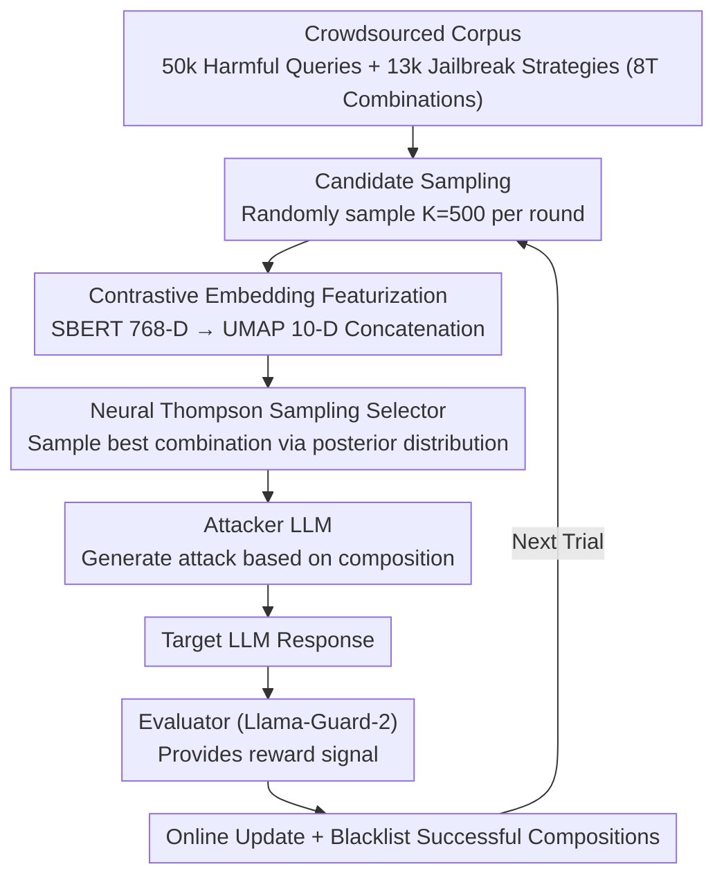

# Adaptive Instruction Composition for Automated LLM Red-Teaming

**Conference**: ACL 2026  
**arXiv**: [2604.21159](https://arxiv.org/abs/2604.21159)  
**Code**: None  
**Area**: AI Safety / Reinforcement Learning  
**Keywords**: LLM Red-Teaming, Adaptive Instruction Composition, Contextual Bandits, Jailbreak Attacks, Diversity-Efficiency Trade-off

## TL;DR
The authors propose the Adaptive Instruction Composition (AIC) framework, which utilizes Neural Thompson Sampling to adaptively select attack instructions within the combinatorial space of crowdsourced harmful queries and jailbreak strategies. It optimizes both attack success rate and diversity, significantly outperforming existing methods on Harmbench.

## Background & Motivation

**Background**: Automated LLM red-teaming is a critical method for enhancing model safety. Existing approaches are primarily divided into two categories: one where an attacker LLM discovers jailbreak strategies through trial-and-error (e.g., PAIR, TAP), and another that uses crowdsourced data to randomly combine attack instructions (e.g., WildTeaming).

**Limitations of Prior Work**: Successful attacks discovered by trial-and-error methods often have limited semantic diversity, exploring only a finite strategy space. Although WildTeaming utilizes a massive corpus of over 50,000 harmful queries and 13,000 jailbreak strategies, it relies on random combinations and fails to leverage historical attack results for adaptive optimization, resulting in low success rates against well-defended models.

**Key Challenge**: The instruction composition space defined by WildTeaming exceeds 8 trillion possibilities ($50000 \times 13000^2$). Random search is extremely inefficient in such a vast space, while trial-and-error methods lack systematic coverage of the known attack space. An adaptive method is required to balance the exploration of diverse attacks with the exploitation of success signals.

**Goal**: To design an adaptive instruction composition mechanism that balances exploration and exploitation in large-scale combinatorial spaces, optimizing both attack effectiveness and diversity.

**Key Insight**: Red-teaming is modeled as a Combinatorial Neural Bandit problem, using reinforcement learning for adaptive selection within a combinatorial space of textual samples.

**Core Idea**: Neural Thompson Sampling is utilized as an adaptive selector. By using contrastive pre-trained sentence embeddings, the combinatorial space is mapped to low-dimensional features, allowing a lightweight network to generalize and learn rapidly across a massive space.

## Method

### Overall Architecture
The system consists of four models: an Attacker LLM (generates attacks), a Target LLM (the victim), an Evaluator (safety judgment), and a Neural Bandit (adaptively selects instruction compositions). In each trial, the bandit selects the optimal combination from $K=500$ candidates. The attacker generates an attack based on this, the evaluator provides a reward signal as feedback, and the bandit is updated online while successful combinations are blacklisted.

### Key Designs

**1. Contextual Embedding Featurization: Compressing text combinations into compact feature vectors for cross-semantic generalization**

Managing 8 trillion combinations as discrete arms is infeasible. This work uses SBERT (all-mpnet-base-v2) to map queries and strategies into 768-D embeddings, reduced to 10-D via UMAP. Concatenating these embeddings provides the network input. Contrastive pre-training ensures that semantically similar texts stay close in embedding space, allowing the bandit to extrapolate reward signals and infer attack probabilities across entire semantic neighborhoods from limited samples. Ablations confirm that SBERT achieves faster learning and higher Attack Success Rate (ASR) than BERT.

**2. Neural Thompson Sampling Selector: Balancing exploration and exploitation via posterior sampling**

Random combinations ignore success signals, while deterministic greedy approaches converge prematurely. This work maintains a two-layer feed-forward network ($\approx 2201$ parameters) to calculate a Gaussian posterior reward distribution for each candidate:
$$\hat{r}_{t,k} \sim \mathcal{N}(\mu_{t,k}, \sigma^2_{t,k})$$
The mean is the network output, and the variance is calculated via the Neural Tangent Kernel (NTK). Posterior sampling naturally explores high-uncertainty regions while exploiting high-mean regions. The hyperparameter $\lambda$ scales the variance, serving as an interpretable "knob": larger values favor diversity, while smaller values favor success rate.

**3. Deduplication and Candidate Sampling: Forcing discovery of new regions while maintaining scalability**

Without constraints, the network might exploit the same successful combination repeatedly (diversity collapse), and scoring 8 trillion combinations is computationally impossible. To address this, successful compositions are blacklisted, forcing the network to generalize to new effective regions in the feature space. Additionally, only $K=500$ candidates are randomly sampled for scoring each round (a many-armed bandit approach), making the search tractable.

### Loss & Training
The bandit network is trained online using $\ell_2$-regularized squared loss with a learning rate of 0.01 and increasing weight decay. After each trial, network parameters and the uncertainty matrix $U$ are updated using the chosen combination's embedding and the evaluator's reward.

## Key Experimental Results

### Main Results

| Target Model | WildTeaming ASR | AIC Subtle ASR | AIC Aggressive ASR |
|----------|----------------|---------------|-------------------|
| Mistral-7B | 0.252 | 0.363 | 0.567 |
| Llama-3-70B | 0.088 | 0.155 | 0.450 |
| Llama-3.3-70B | 0.183 | 0.247 | 0.558 |

| Harmbench Strategy | Mistral-7B ASR | Llama-3-70B ASR |
|---------------|---------------|----------------|
| GCG-T | 0.645 | 0.238 |
| PAIR | 0.525 | 0.215 |
| AutoDAN-Turbo | 0.976 | 0.672 |
| **Ours (AIC)** | **1.000** | **0.934** |

### Ablation Study

| Configuration | Key Effect | Description |
|------|---------|------|
| SBERT vs BERT | Significant ASR Gain | Contrastive embeddings support rapid generalization |
| λ=1 (subtle) vs λ=0.01 (aggr.) | Diversity↑ vs ASR↑ | λ provides interpretable exploration-exploitation control |
| 1 Strategy vs 3 Strategies | Improved Diversity | More strategy slots enhance content variety |

### Key Findings
- AIC achieves near-perfect ASR on Harmbench (1.0 for Mistral, 0.934 for Llama-3), significantly outperforming all baselines.
- Strong cross-model transferability: strategies trained on Mistral maintain an ASR of 0.184-0.254 when transferred to Llama-3 (vs. 0.088 for WildTeaming).
- The "Subtle" bandit significantly improves ASR while maintaining diversity levels comparable to WildTeaming.

## Highlights & Insights
- Modeling red-teaming as a combinatorial bandit problem is elegant, mapping the exploration-exploitation trade-off directly to the diversity-effectiveness trade-off. This is applicable to any search task in massive prompt composition spaces.
- The combination of contrastive pre-trained embeddings and a lightweight network achieves "minimal parameters, maximal generalization," enabling effective learning within an 8-trillion-combination space with only 2201 parameters.
- The $\lambda$ hyperparameter provides an intuitive "knob" for controlling the balance between diversity and effectiveness.

## Limitations & Future Work
- Experiments were limited to three open-source target models; generalization to commercial API models remains unverified.
- Dependency on Llama-Guard-2 as an evaluator may introduce false positives/negatives.
- High computational cost: 10K trials require approximately 70-120 GPU hours.
- Future work could extend to red-teaming image generators and autonomous agents.

## Related Work & Insights
- **vs WildTeaming**: WildTeaming uses random composition; AIC uses adaptive RL selection, yielding a 40-400% gain in ASR.
- **vs PAIR/TAP**: Trial-and-error methods suffer from limited diversity; AIC ensures coverage via crowdsourced corpora.
- **vs AutoDAN-Turbo**: AutoDAN-Turbo discovers new strategies from scratch but has lower ASR than AIC; the two could be complementary.

## Rating
- Novelty: ⭐⭐⭐⭐ Combination bandit is a novel modeling perspective for red-teaming.
- Experimental Thoroughness: ⭐⭐⭐⭐⭐ Comprehensive evaluation across target models, baselines, transferability, ablations, and Harmbench.
- Writing Quality: ⭐⭐⭐⭐ Clear structure and detailed algorithmic descriptions.
- Value: ⭐⭐⭐⭐ High practical value for LLM safety research.

<!-- RELATED:START -->

## Related Papers

- [\[AAAI 2026\] MARS: Multi-Agent Adaptive Reasoning with Socratic Guidance for Automated Prompt Optimization](../../AAAI2026/reinforcement_learning/mars_multi-agent_adaptive_reasoning_with_socratic_guidance_f.md)
- [\[ACL 2026\] ImpRIF: Stronger Implicit Reasoning Leads to Better Complex Instruction Following](imprif_stronger_implicit_reasoning_leads_to_better_complex_instruction_following.md)
- [\[ACL 2026\] LENS: Less Noise, More Voice — Reinforcement Learning for Reasoning via Instruction Purification](less_noise_more_voice_reinforcement_learning_for_reasoning_via_instruction_purif.md)
- [\[ACL 2026\] ARGUS: Policy-Adaptive Ad Governance via Evolving Reinforcement with Adversarial Umpiring](argus_policy-adaptive_ad_governance_via_evolving_reinforcement_with_adversarial_.md)
- [\[ACL 2026\] Deliberative Searcher: Improving LLM Reliability via Reinforcement Learning with Constraints](deliberative_searcher_improving_llm_reliability_via_reinforcement_learning_with_.md)

<!-- RELATED:END -->
