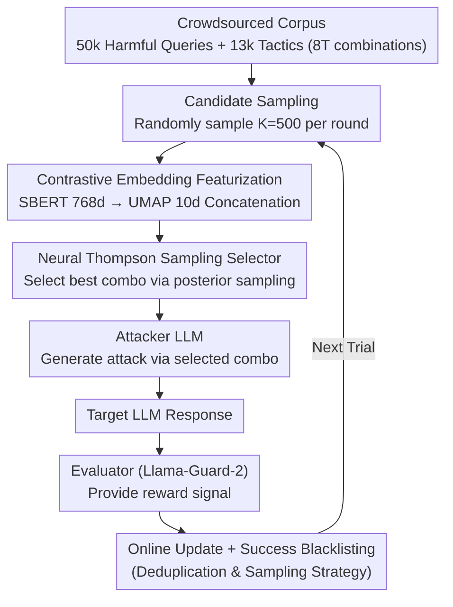

# Adaptive Instruction Composition for Automated LLM Red-Teaming

**Conference**: ACL 2026  
**arXiv**: [2604.21159](https://arxiv.org/abs/2604.21159)  
**Code**: None  
**Area**: AI Safety / Reinforcement Learning  
**Keywords**: LLM Red-teaming, Adaptive Instruction Composition, Contextual Bandits, Jailbreak Attacks, Diversity-Effectiveness Trade-off

## TL;DR
The Adaptive Instruction Composition (AIC) framework is proposed, utilizing Neural Thompson Sampling to adaptively select attack instructions within a combinatorial space of crowdsourced harmful queries and jailbreak tactics. By simultaneously optimizing attack success rate and diversity, it significantly outperforms existing methods on Harmbench.

## Background & Motivation

**Background**: Automated LLM red-teaming is a critical means of enhancing model safety. Existing methods generally fall into two categories: trial-and-error approaches where an attacker LLM discovers jailbreak tactics (e.g., PAIR, TAP), and random composition approaches using crowdsourced data (e.g., WildTeaming).

**Limitations of Prior Work**: Trial-and-error methods often find successful attacks with limited semantic diversity, exploring only a narrow strategy space. While WildTeaming leverages a massive corpus of 50k+ harmful queries and 13k+ jailbreak tactics, its random composition fails to utilize historical attack results for adaptive optimization, leading to low success rates against well-defended models.

**Key Challenge**: The instruction composition space defined by WildTeaming exceeds 8 trillion possibilities ($50000 \times 13000^2$). Random search is highly inefficient in such a vast space, yet trial-and-error methods lack systematic coverage of the known attack space. An adaptive method is needed to explore diverse attacks while exploiting success signals.

**Goal**: Design an adaptive instruction composition mechanism that balances exploration and exploitation in large-scale combinatorial spaces to optimize both attack effectiveness and diversity.

**Key Insight**: Model red-teaming as a Combinatorial Neural Bandit problem, using reinforcement learning for adaptive selection within the combinatorial space of text samples.

**Core Idea**: Use Neural Thompson Sampling as an adaptive selector. By mapping the composition space into low-dimensional features via contrastive pre-trained sentence embeddings, a lightweight network can achieve rapid generalization and learning across a massive space.

## Method

### Overall Architecture
The system consists of four components: an attacker LLM (generates attacks), a target LLM (the victim), an evaluator (safety judgment), and a neural bandit (adaptively selects instruction compositions). In each trial, the bandit selects the optimal combination from $K=500$ candidates. The attacker generates an instruction based on this choice, the evaluator provides a reward signal based on the target's response, and this signal is used to update the bandit online while the successful combination is blacklisted.

### Key Designs

**1. Contrastive Embedding Featurization: Compressing text combinations into compact vectors for bandit generalization**

Directly learning from 8 trillion discrete combinations as arms is impossible. This work uses SBERT (all-mpnet-base-v2) to map queries and tactics into 768-dimensional embeddings, then reduces them to 10 dimensions using UMAP. The concatenated embeddings serve as network input. Contrastive pre-training ensures semantically similar texts are close in embedding space, allowing the bandit to extrapolate rewards to entire semantic neighborhoods after seeing only a few samples. Ablations confirm that SBERT learns faster and achieves higher ASR than BERT.

**2. Neural Thompson Sampling Selector: Balancing exploration and exploitation via posterior sampling**

Random composition ignores success signals, while deterministic greedy selection converges prematurely. This method maintains a two-layer feedforward network (~2201 parameters) to calculate a Gaussian posterior reward distribution $\hat{r}_{t,k} \sim \mathcal{N}(\mu_{t,k}, \sigma^2_{t,k})$ for each candidate. The mean is derived from the network output, and the variance is calculated via the Neural Tangent Kernel. Combinations are selected via posterior sampling. High-uncertainty regions are naturally explored, while low-uncertainty, high-mean regions are exploited. The hyperparameter $\lambda$ scales the variance, acting as an interpretable "knob": increasing it favors diversity, while decreasing it favors success rate.

**3. Deduplication and Candidate Sampling: Forcing continuous discovery and scalable search**

Without constraints, the network would exploit the same successful combinations, causing diversity collapse. To prevent this, successful combinations are blacklisted, forcing the network to generalize in the feature space to remain effective. Furthermore, only $K=500$ candidates are randomly sampled from the full space for scoring each round (a many-armed bandit approach), making search across the massive space computationally feasible.

### Loss & Training
The bandit network is trained online using squared loss with $\ell_2$ regularization, a learning rate of 0.01, and weight decay that increases with the number of trials. After each trial, the network parameters and the uncertainty matrix $U$ are updated using the selected combination's embedding and the evaluator's reward.

## Key Experimental Results

### Main Results

| Target Model | WildTeaming ASR | AIC Subtle ASR | AIC Aggressive ASR |
|----------|----------------|---------------|-------------------|
| Mistral-7B | 0.252 | 0.363 | 0.567 |
| Llama-3-70B | 0.088 | 0.155 | 0.450 |
| Llama-3.3-70B | 0.183 | 0.247 | 0.558 |

| Harmbench Strategy | Mistral-7B ASR | Llama-3-70B ASR |
|---------------|---------------|----------------|
| GCG-T | 0.645 | 0.238 |
| PAIR | 0.525 | 0.215 |
| AutoDAN-Turbo | 0.976 | 0.672 |
| **AIC** | **1.000** | **0.934** |

### Ablation Study

| Configuration | Key Effect | Description |
|------|---------|------|
| SBERT vs BERT | Significant ASR Gain | Contrastive embeddings support rapid generalization |
| λ=1 (subtle) vs λ=0.01 (aggr.) | Diversity↑ vs Success Rate↑ | λ provides interpretable exploration-exploitation control |
| 1 Tactic vs 3 Tactics | Improved Diversity Metrics | More tactic slots increase content variety |

### Key Findings
- AIC achieves nearly perfect ASR on Harmbench (Mistral: 1.0, Llama-3: 0.934), significantly outperforming all existing baselines.
- Strong cross-model transferability: Strategies trained on Mistral maintain an ASR of 0.184-0.254 when transferred to Llama-3 (vs. 0.088 for WildTeaming).
- The "Subtle" bandit significantly improves success rates while maintaining diversity levels comparable to WildTeaming.

## Highlights & Insights
- Modeling red-teaming as a combinatorial bandit problem is elegant, naturally mapping the exploration-exploitation trade-off to the diversity-effectiveness trade-off. This is applicable to any search task in large-scale prompt spaces.
- The combination of contrastive embeddings and a lightweight network achieves "minimal parameters, maximal generalization," enabling effective learning in an 8-trillion-sized space with only 2201 parameters.
- The $\lambda$ hyperparameter provides an intuitive "knob" for controlling the trade-off between attack diversity and effectiveness.

## Limitations & Future Work
- Experiments were limited to three open-source models; performance on commercial API models remains unverified.
- Dependency on Llama-Guard-2 as an evaluator may introduce false positives/negatives.
- Computational costs are high, requiring 70-120 GPU hours for 10K trials.
- Future work could extend this to red-teaming for image generators and agents.

## Related Work & Insights
- **vs WildTeaming**: WildTeaming uses random composition; AIC uses RL for adaptive selection, improving ASR by 40-400%.
- **vs PAIR/TAP**: Trial-and-error methods suffer from limited diversity; AIC ensures coverage via a crowdsourced corpus.
- **vs AutoDAN-Turbo**: While AutoDAN-Turbo discovers new tactics from scratch, its ASR is lower than AIC; the two could be complementary.

## Rating
- Novelty: ⭐⭐⭐⭐ Combinatorial bandits offer a novel modeling perspective for red-teaming.
- Experimental Thoroughness: ⭐⭐⭐⭐⭐ Comprehensive coverage across target models, baselines, transferability, ablations, and Harmbench.
- Writing Quality: ⭐⭐⭐⭐ Clear structure and detailed algorithmic descriptions.
- Value: ⭐⭐⭐⭐ High practical value for LLM safety research.

<!-- RELATED:START -->

## Related Papers

- [\[ICLR 2026\] APC-RL: Exceeding Data-Driven Behavior Priors with Adaptive Policy Composition](../../ICLR2026/reinforcement_learning/apc-rl_exceeding_data-driven_behavior_priors_with_adaptive_policy_composition.md)
- [\[AAAI 2026\] MARS: Multi-Agent Adaptive Reasoning with Socratic Guidance for Automated Prompt Optimization](../../AAAI2026/reinforcement_learning/mars_multi-agent_adaptive_reasoning_with_socratic_guidance_f.md)
- [\[ACL 2026\] ImpRIF: Stronger Implicit Reasoning Leads to Better Complex Instruction Following](imprif_stronger_implicit_reasoning_leads_to_better_complex_instruction_following.md)
- [\[ACL 2026\] LENS: Less Noise, More Voice — Reinforcement Learning for Reasoning via Instruction Purification](less_noise_more_voice_reinforcement_learning_for_reasoning_via_instruction_purif.md)
- [\[ICLR 2026\] Composition of Memory Experts for Diffusion World Models](../../ICLR2026/reinforcement_learning/composition_of_memory_experts_for_diffusion_world_models.md)

<!-- RELATED:END -->
