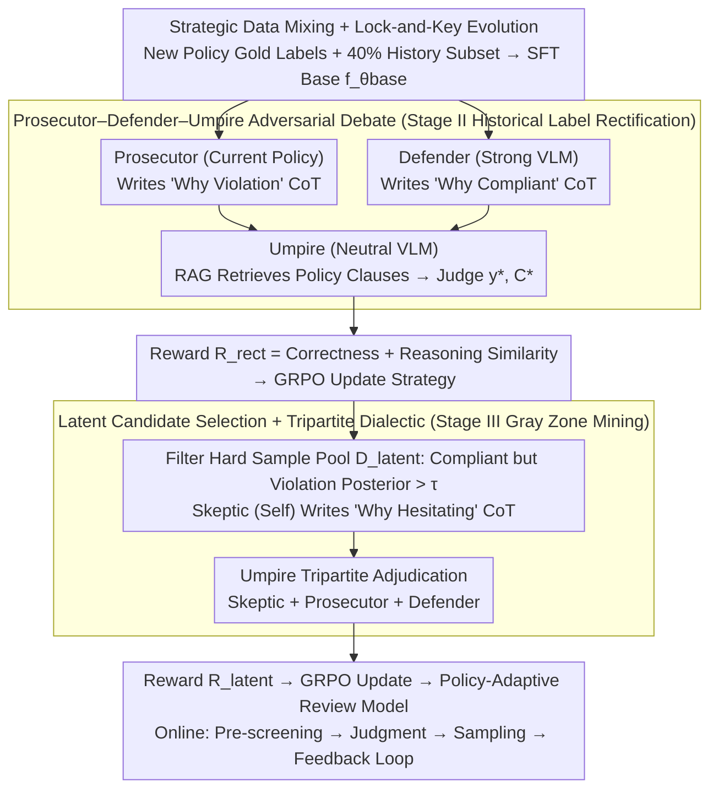

# ARGUS: Policy-Adaptive Ad Governance via Evolving Reinforcement with Adversarial Umpiring

**Conference**: ACL 2026  
**arXiv**: [2605.02200](https://arxiv.org/abs/2605.02200)  
**Code**: None  
**Area**: Reinforcement Learning / Ad Governance / Multimodal  
**Keywords**: Policy Adaptation, Multi-Agent Debate, GRPO, Label Updating, Industrial Deployment

## TL;DR
ARGUS utilizes a Prosecutor–Defender–Umpire three-agent debate combined with GRPO reinforcement learning. This enables the ad-review VLM to correct historical "outdated labels" and uncover latent violations in gray zones when policies are updated. Industrial A/B testing shows a relative 35.2% reduction in the Violation Leakage Rate (VLR).

## Background & Motivation

**Background**: Internet advertisement moderation relies heavily on large models. However, traditional approaches (SFT + static rules) assume that policies are static. Existing RL/CoT frameworks (RAVEN, Hi-Guard, BLM-Guard) also operate under the assumption of fixed rules.

**Limitations of Prior Work**: Regulatory policies are updated frequently (e.g., new bans on K12 exam anxiety, appearance anxiety, or information asymmetry scams), while massive historical samples are annotated based on old policies. Directly fine-tuning models with this data causes three problems: (1) **Label Inconsistency**—historical "compliant" samples might be violations under new policies; (2) **Reasoning Ambiguity**—new policies contain gray zones where binary labels are insufficient for the model to learn decision logic; (3) **Hard Sample Recall**—covert violations are hidden within massive compliant traffic.

**Key Challenge**: Vanilla SFT faces "gradient conflict" from old labels when learning new policies, leading to catastrophic forgetting (historical recall plummeting from 0.858 to 0.432). Continual learning methods like EWC preserve old knowledge but lack the capacity to absorb new policies effectively.

**Goal**: To implement a three-stage reinforcement learning pipeline that "establishes a foundation, rectifies history, and mines gray zones," ensuring historical compliance performance while continuously absorbing new policies.

**Key Insight**: Upgrade the reward signal from a "single judge" to a "multi-agent structured debate"—where a Prosecutor finds violation reasons, a Defender finds compliance justifications, and an Umpire uses RAG to retrieve specific policy clauses for the final verdict. The debate itself serves as the source for reward shaping.

**Core Idea**: Use the "Prosecutor-Defender-Umpire" tripartite debate + RAG-enhanced judgment + GRPO to transform verdicts into policy rewards, achieving synchronization between "policy evolution" and "strategy evolution."

## Method

### Overall Architecture
ARGUS is a GRPO-driven three-stage pipeline: **Stage I Policy Seeding** uses $\mathcal{D}_\text{gold}$ (scarce gold labels of new policies) + a 40% historical subset $\mathcal{D}_\text{hist}'$ for SFT to obtain the base model $f_{\theta_\text{base}}$; **Stage II Adversarial Label Rectification** uses the Prosecutor–Defender–Umpire debate to generate new rewards $R_\text{rect}$ for historical data, overwriting noisy old labels; **Stage III Latent Knowledge Discovery** introduces a Skeptic (the model itself) to propose doubts, which undergo a tripartite adjudication by the Umpire alongside the Prosecutor and Defender to uncover covert violations. All three stages share the same adversarial debate mechanism, with reward signals evolving alongside policies.

### Key Designs

**1. Strategic Data Mixing + Lock-and-Key Evolution: Seed with Scarce Gold Labels, then Evolve Rewards with Policies**

The first step addresses the contradiction where sparse gold labels of new policies are drowned out by massive old noise. Stage I uses $\mathcal{D}_\text{gold} \cup \mathcal{D}_\text{hist}'$ (a 40% historical subset) for SFT seeding, giving the model a basic perception of new policies. Stages II/III then use the output of the Umpire to replace old labels as the primary GRPO reward. The key is decoupling "data replacement" from "reward replacement": SFT provides the model with basic policy awareness, while subsequent RL stages truly embed evolving policies into the reasoning paths. Scarce gold labels act as seeds, while massive history acts as a capacity buffer (lock-and-key), preserving historical compliance rates while creating learning space for new policies.

**2. Prosecutor–Defender–Umpire Adversarial Debate: Washing Out Old Label Noise via Debate**

Stage II targets the conflict between old labels in historical samples and new policies; training directly on these samples would contaminate gradients. Instead of a single judge, ARGUS lets three roles debate each historical sample: the Prosecutor (current policy) writes a "why violation" CoT based on the new policy $\Delta\mathcal{P}$; the Defender (a strong VLM) writes a "why compliant" counter-argument CoT; and the Umpire (a neutral VLM) utilizes RAG to retrieve specific clauses of $\Delta\mathcal{P}$ and uses $\mathcal{D}_\text{gold}$ as a reference to output a corrected label $y^*$ and a standard reasoning chain $\mathcal{C}^*$. The reward signal considers both correctness and reasoning path similarity:

$$R_\text{rect}(y,\mathcal{C}) = \mathbf{1}(y=y^*) + \text{sim}(\mathcal{C},\mathcal{C}^*)$$

This injects semantic-level supervision into GRPO beyond binary labels. The adversarial defense is necessary because a single judge may lean toward being overly conservative or overly lax; forcing a Defender to take the compliant side compels the Umpire to find a rational midpoint, rectifying old labels without sacrificing tolerance for creative advertising.

**3. Latent Candidate Selection + Tripartite Dialectic: Converting Model Hesitation into Gray Zone Signals**

Stage II corrects "obvious conflicts," but covert violations are hidden within compliant traffic without ground truth. Stage III identifies a pool of hard samples—those that are labeled compliant but have a high internal posterior probability for violations:

$$\mathcal{D}_\text{latent} = \{x\in\mathcal{D}_\text{hist} \mid y^{(k)}=0\ \text{and}\ P(y^{(k)}=1|x)>\tau\}$$

A Skeptic (the current model $f_\theta$ itself) provides a CoT for "why I am hesitating," which is fed to the Umpire along with the Prosecutor and Defender perspectives for a tripartite adjudication. The resulting $y^*, \mathcal{C}^*$ are used for GRPO according to $R_\text{latent}$. Using the model's own doubt as a third-party perspective treats "uncertainty" as a training signal, pushing the decision boundary into hard sample areas more precisely than simple threshold filtering.

### Loss & Training
- Stage I: SFT using $\mathcal{L}_\text{stage1}(\theta) = -\sum \log P(\mathbf{y}, \mathcal{C} | x, \mathcal{P}_\text{new}; \theta)$.
- Stage II/III: GRPO (the algorithm proposed by DeepSeekMath) using $R_\text{rect}$ and $R_\text{latent}$ as rewards, with Qwen3-VL-8B / Qwen2.5-VL-7B as backbones.

## Key Experimental Results

### Main Results (Industrial Dataset, 5 New Policies $\Delta\mathcal{P}$)

| Method (Qwen3-VL-8B Backbone) | Hist. Prec. | Hist. Rec. | Avg $\Delta\mathcal{P}$ Prec. | Avg $\Delta\mathcal{P}$ Rec. |
| :--- | :--- | :--- | :--- | :--- |
| Historical Expert (SFT on $\mathcal{D}_\text{hist}$) | 0.842 | 0.858 | 0.374 | 0.443 |
| GPT-4o (zero-shot) | 0.485 | 0.612 | 0.450 | 0.593 |
| Qwen3-235B-A22B (zero-shot) | 0.512 | 0.635 | 0.487 | 0.631 |
| Vanilla SFT (on $\mathcal{D}_\text{gold}$) | 0.454 | **0.432†** | 0.774 | 0.748 |
| SFT + Replay (40%) | 0.791 | 0.785 | 0.753 | 0.733 |
| EWC | 0.802 | 0.794 | 0.760 | 0.741 |
| **Ours (ARGUS)** | **0.828** | **0.841** | **0.795** | **0.836** |

†= Catastrophic forgetting; ARGUS-8B's historical recall is only 1.7% lower than the Historical Expert, but its $\Delta\mathcal{P}$ recall is 9.5 percentage points higher than EWC. On the public ToxiCN MM dataset, ARGUS increased recall for the "Sang Culture" category from GPT-4o's 0.365 to 0.482. Online A/B: VLR reduced by 35.2%, AAR (Automatic Approval Rate) increased by 11.2%, and FPR decreased from 0.35% to 0.32%.

### Ablation Study (By Stage and By Agent)

| Configuration | Hist. Rec. | Avg $\Delta\mathcal{P}$ Prec. | Avg $\Delta\mathcal{P}$ Rec. |
| :--- | :--- | :--- | :--- |
| Stage I only | 0.785 | 0.753 | 0.733 |
| + Stage II (Rectification) | 0.824 | 0.758 | 0.792 |
| + Stage III (Latent Discovery) | **0.841** | **0.795** | **0.836** |

| Agent Ablation | Avg $\Delta\mathcal{P}$ Prec. | Avg $\Delta\mathcal{P}$ Rec. |
| :--- | :--- | :--- |
| Full ARGUS | 0.795 | 0.836 |
| w/o Prosecutor | 0.732 | 0.695 |
| w/o Defender | 0.684 | 0.812 |
| w/o Rationale (labels only, no CoT) | 0.715 | 0.742 |

### Key Findings
- **Clear marginal gains per stage**: Stage II primarily repairs historical recall (+3.9 points) and $\Delta\mathcal{P}$ recall (+5.9 points); Stage III mainly improves $\Delta\mathcal{P}$ precision (+3.7 points).
- **Prosecutor handles recall, Defender handles precision**: Removing the Defender drops precision from 0.795 to 0.684 while recall rises to 0.812 (becoming overly censorious)—proving the two agents act as adversarial balances.
- **CoT rationale is the soul of policy-level rewards**: Treating agents as binary label generators only drops precision from 0.795 to 0.715 and recall from 0.836 to 0.742, indicating that "debate text" is more effective than "final voting results."
- **Robustness against adversarial evasion**: On 2k samples with homophanous character replacement and blurring, standard SFT recall plummeted from 0.711 to 0.440 (-38.1%), while ARGUS only dropped by 6.2% (0.835→0.783).

## Highlights & Insights
- **Synchronization of "Policy Evolution" and "Reward Evolution"** is the paper's most valuable concept: While traditional RLHF assumes a stable reward function, this work treats the reward as a dynamic object synthesized in real-time by LLM debates, providing a template for industrial applications where rules change (finance, content safety, healthcare audit).
- **The "Skeptic = Current Strategy" design in the Tripartite Dialectic is clever**: Incorporating the model's own skepticism into the adjudication loop converts uncertainty into a training signal, which is more refined than simple threshold-based hard sample mining.
- **Lock-and-Key in data evolution**: Using scarce gold labels as seeds and massive history as a capacity buffer prevents new policies from being overwhelmed by old gradients—a method transferable to any "continual learning + label drift" scenario.

## Limitations & Future Work
- Currently validated only on "image-text ads"; video dimensions (temporal violations) are not covered and are noted as future work.
- The framework relies heavily on the Umpire VLM's capabilities; a weak Umpire might give biased verdicts. The systemic contagion of Umpire bias has not been verified.
- The cost of three-stage + multi-agent reasoning is high; offline training + online inference overhead is much larger than SFT. Industrial deployment requires cascaded filtering to control latency.

## Related Work & Insights
- **vs. RAVEN / Hi-Guard / BLM-Guard**: These treat policies as static and perform RL under fixed rules; ARGUS is the first multi-agent framework to support dynamic policy evolution.
- **vs. EWC / Replay**: Continual learning methods passively protect old knowledge but have limited capacity for new policy learning; ARGUS actively rewrites historical rewards using an Umpire, achieving 9.5% higher $\Delta\mathcal{P}$ recall than EWC.
- **vs. Constitutional AI**: CAI uses a single set of principles for self-correction. ARGUS uses RAG + multi-agents to turn the principle set into a searchable, updatable dynamic object—more realistic for regulatory scenarios.

## Rating
- Novelty: ⭐⭐⭐⭐ Combination of multi-agent debate + three-stage GRPO + evolving policies is a first for ad governance.
- Experimental Thoroughness: ⭐⭐⭐⭐ Industrial + Public + Online A/B + various ablations are comprehensive; validation on more than two datasets would be better.
- Writing Quality: ⭐⭐⭐⭐ Case tables (Table 1) are intuitive, allowing readers to immediately grasp the multi-agent reasoning process.
- Value: ⭐⭐⭐⭐⭐ A rare paper that is directly deployed in industry, providing a reusable blueprint for "policy compliance" businesses.

<!-- RELATED:START -->

## Related Papers

- [\[ACL 2026\] Free Energy-Driven Reinforcement Learning with Adaptive Advantage Shaping for Unsupervised Reasoning in LLMs](free_energy-driven_reinforcement_learning_with_adaptive_advantage_shaping_for_un.md)
- [\[ICML 2026\] Metis: Learning to Jailbreak LLMs via Self-Evolving Metacognitive Policy Optimization](../../ICML2026/reinforcement_learning/metis_learning_to_jailbreak_llms_via_self-evolving_metacognitive_policy_optimiza.md)
- [\[ICLR 2026\] Adaptive Scaling of Policy Constraints for Offline Reinforcement Learning](../../ICLR2026/reinforcement_learning/adaptive_scaling_of_policy_constraints_for_offline_reinforcement_learning.md)
- [\[ACL 2026\] LANG: Reinforcement Learning for Multilingual Reasoning with Language-Adaptive Hint Guidance](lang_reinforcement_learning_for_multilingual_reasoning_with_language-adaptive_hi.md)
- [\[ICLR 2026\] SPELL: Self-Play Reinforcement Learning for Evolving Long-Context Language Models](../../ICLR2026/reinforcement_learning/spell_self-play_reinforcement_learning_for_evolving_long-context_language_models.md)

<!-- RELATED:END -->
