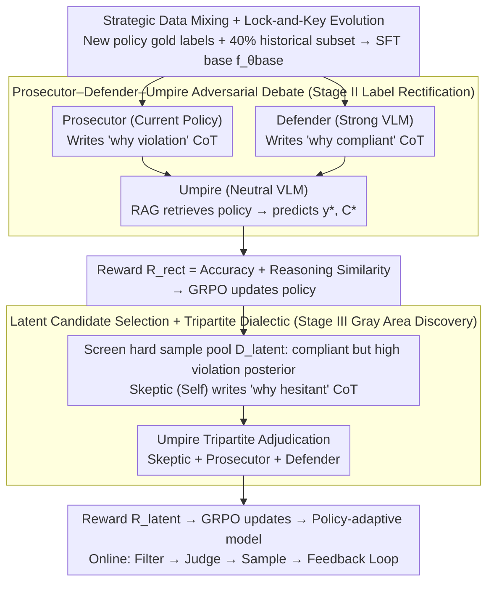

# ARGUS: Policy-Adaptive Ad Governance via Evolving Reinforcement with Adversarial Umpiring

**Conference**: ACL 2026  
**arXiv**: [2605.02200](https://arxiv.org/abs/2605.02200)  
**Code**: None  
**Area**: Reinforcement Learning / Ad Governance / Multimodal  
**Keywords**: Policy Adaptation, Multi-Agent Debate, GRPO, Label Updating, Industrial Deployment

## TL;DR
ARGUS utilizes a Prosecutor–Defender–Umpire tripartite debate mechanism combined with GRPO reinforcement learning. This approach enables the ad-reviewing VLM to correct historical "outdated labels" while identifying potential gray-area violations as policies continuously evolve. Industrial A/B testing demonstrated a relative reduction in the Violation Leakage Rate (VLR) by 35.2%.

## Background & Motivation

**Background**: Internet advertisement governance relies heavily on Large Vision-Language Models (VLMs). However, traditional approaches (SFT + static rules) assume that policies are stationary. Current RL/CoT frameworks (RAVEN, Hi-Guard, BLM-Guard) also operate under the assumption of fixed regulations.

**Limitations of Prior Work**: Regulatory policies frequently introduce new restrictions (e.g., prohibiting K12 test anxiety, appearance anxiety, or information asymmetry scams), yet massive historical samples are labeled according to outdated policies. Directly fine-tuning models on this data leads to three issues: (1) **Label Inconsistency**—historical "compliant" samples might be considered violations under new policies; (2) **Fuzzy Reasoning**—new policies include gray areas where binary labels are insufficient for learning judgment logic; (3) **Hard Sample Recall**—covert violations are hidden within massive volumes of compliant traffic.

**Key Challenge**: When learning new policies via vanilla SFT, "gradient conflicts" from old labels lead to catastrophic forgetting (historical recall plummeting from 0.858 to 0.432). While continual learning methods like EWC preserve old knowledge, they lack the capacity to sufficiently absorb new policies.

**Goal**: To implement a three-stage reinforcement learning framework that builds a foundation, rectifies historical data, and discovers gray areas, allowing the model to continuously evolve with new policies while maintaining historical performance.

**Key Insight**: The reward signal is upgraded from a "single judge" to a "structured multi-agent debate." A Prosecutor identifies violation reasons, a Defender provides compliance justification, and an Umpire makes the final decision using RAG to retrieve specific policy clauses. The debate itself serves as the source for reward shaping.

**Core Idea**: By combining the "Prosecutor-Defender-Umpire" tripartite debate with RAG-enhanced adjudication and GRPO, the judgment is transformed into a policy reward, synchronizing "policy evolution" with "strategy evolution."

## Method

### Overall Architecture
ARGUS is a three-stage pipeline driven by GRPO: **Stage I Policy Seeding** uses $\mathcal{D}_\text{gold}$ (scarce gold labels of new policies) + a 40% historical subset $\mathcal{D}_\text{hist}'$ for SFT to obtain the base model $f_{\theta_\text{base}}$; **Stage II Adversarial Label Rectification** utilizes the Prosecutor–Defender–Umpire debate to generate a new reward $R_\text{rect}$ for historical data, overriding old label noise; **Stage III Latent Knowledge Discovery** introduces a Skeptic role where the current model expresses "doubt," which is then adjudicated alongside the Prosecutor and Defender by the Umpire to uncover hidden violations. All three stages share the same adversarial debate mechanism, ensuring reward signals evolve alongside policies.

### Key Designs

**1. Strategic Data Mixing + Lock-and-Key Evolution: Seeding with Gold Labels followed by Reward Evolution**

The first step addresses the conflict where scarce new policy gold labels are overwhelmed by massive historical noise. Stage I uses $\mathcal{D}_\text{gold} \cup \mathcal{D}_\text{hist}'$ for SFT to give the model basic awareness of new policies. Subsequent stages replace old labels with the Umpire's output as the primary GRPO reward. By decoupling "data replacement" from "reward replacement," SFT provides the baseline perception, while RL embeds the evolved policy into the reasoning path. Scarce gold labels serve as seeds, and historical data acts as capacity buffer (lock-and-key), preserving historical compliance while creating space for new learning.

**2. Prosecutor–Defender–Umpire Adversarial Debate: Scrubbing Label Noise via Dialectic**

Stage II resolves the contradiction between historical labels and new policies. Rather than a single judge, ARGUS employs three roles: the Prosecutor (the current policy) generates a CoT for "why it violates," the Defender (a strong VLM) creates an opposing CoT for "why it complies," and the Umpire (a neutral VLM) utilizes RAG to fetch specific clauses of $\Delta\mathcal{P}$ and $\mathcal{D}_\text{gold}$ references to output a rectified label $y^*$ and standard reasoning chain $\mathcal{C}^*$. The reward signal considers both accuracy and reasoning alignment:

$$R_\text{rect}(y,\mathcal{C}) = \mathbf{1}(y=y^*) + \text{sim}(\mathcal{C},\mathcal{C}^*)$$

This injects semantic-level supervision into GRPO. Adversarial defense prevents the model from becoming overly conservative or lenient, forcing the Umpire to find a rational midpoint.

**3. Latent Knowledge Discovery: Converting Policy Hesitation into Discovery Signals**

While Stage II corrects explicit conflicts, hidden violations remain in the compliant traffic. Stage III targets hard samples where the model predicts "compliance" but exhibits a high internal posterior for "violation":

$$\mathcal{D}_\text{latent} = \{x\in\mathcal{D}_\text{hist} \mid y^{(k)}=0\ \text{and}\ P(y^{(k)}=1|x)>\tau\}$$

A Skeptic role (the model $f_\theta$ itself) writes a "why I am hesitant" CoT, which is combined with the Prosecutor/Defender perspectives for tripartite adjudication by the Umpire. Treating the model's own uncertainty as a third-party perspective allows the decision boundary to advance into difficult territories more precisely than simple thresholding.

### Loss & Training
- Stage I: SFT using $\mathcal{L}_\text{stage1}(\theta) = -\sum \log P(\mathbf{y}, \mathcal{C} | x, \mathcal{P}_\text{new}; \theta)$.
- Stage II/III: GRPO (algorithm proposed by DeepSeekMath) using $R_\text{rect}$ and $R_\text{latent}$ as rewards, based on Qwen3-VL-8B or Qwen2.5-VL-7B backbones.

## Key Experimental Results

### Main Results (Industrial Dataset, 5 New Policies $\Delta\mathcal{P}$)

| Method (Qwen3-VL-8B backbone) | Hist. Prec. | Hist. Rec. | Avg $\Delta\mathcal{P}$ Prec. | Avg $\Delta\mathcal{P}$ Rec. |
|:---|:---:|:---:|:---:|:---:|
| Historical Expert (SFT on $\mathcal{D}_\text{hist}$) | 0.842 | 0.858 | 0.374 | 0.443 |
| GPT-4o (zero-shot) | 0.485 | 0.612 | 0.450 | 0.593 |
| Qwen3-235B-A22B (zero-shot) | 0.512 | 0.635 | 0.487 | 0.631 |
| Vanilla SFT (on $\mathcal{D}_\text{gold}$) | 0.454 | **0.432†** | 0.774 | 0.748 |
| SFT + Replay (40%) | 0.791 | 0.785 | 0.753 | 0.733 |
| EWC | 0.802 | 0.794 | 0.760 | 0.741 |
| **ARGUS (Ours)** | **0.828** | **0.841** | **0.795** | **0.836** |

†= catastrophic forgetting. ARGUS-8B maintains historical recall within 1.7% of the Historical Expert while exceeding EWC's $\Delta\mathcal{P}$ recall by 9.5 points. On the public ToxiCN MM, ARGUS improved the recall of the "Sang Culture" category from 0.365 (GPT-4o) to 0.482. Online A/B: VLR decreased by 35.2%, AAR (Auto-Audit Rate) increased by 11.2%, and FPR decreased from 0.35% to 0.32%.

### Ablation Study (By Stage & Agent)

| Configuration | Hist. Rec. | Avg $\Delta\mathcal{P}$ Prec. | Avg $\Delta\mathcal{P}$ Rec. |
|:---|:---:|:---:|:---:|
| Stage I only | 0.785 | 0.753 | 0.733 |
| + Stage II (Rectification) | 0.824 | 0.758 | 0.792 |
| + Stage III (Latent Discovery) | **0.841** | **0.795** | **0.836** |

| Agent Ablation | Avg $\Delta\mathcal{P}$ Prec. | Avg $\Delta\mathcal{P}$ Rec. |
|:---|:---:|:---:|
| Full ARGUS | 0.795 | 0.836 |
| w/o Prosecutor | 0.732 | 0.695 |
| w/o Defender | 0.684 | 0.812 |
| w/o Rationale (Labels only, no CoT) | 0.715 | 0.742 |

### Key Findings
- **Clear Marginal Gains**: Stage II primarily improves historical recall (+3.9 points) and $\Delta\mathcal{P}$ recall (+5.9 points); Stage III mainly boosts $\Delta\mathcal{P}$ precision (+3.7 points).
- **Prosecutor Controls Recall, Defender Controls Precision**: Removing the Defender drops precision from 0.795 to 0.684 while recall rises, proving the two agents serve as opposing checks.
- **CoT Rationale is the Soul of Strategy-level Rewards**: Replacing debate with binary label generation drops precision by 8.0 points and recall by 9.4 points, indicating that the debate text is the primary driver of performance.
- **Robustness to Adversarial Evasion**: On 2k samples with homoglyph replacements and blurring, vanilla SFT recall dropped by 38.1%, while ARGUS only dropped by 6.2%.

## Highlights & Insights
- **Synchronized Policy and Reward Evolution**: Traditionally, RLHF assumes a stable reward function. This paper treats the reward as a dynamic synthesis of LLM debates, providing a template for industrial applications with fluid rules (finance, safety, medical audit).
- **Skeptic Design**: Incorporating the model's own hesitation into the adjudication loop converts uncertainty into a training signal, refining the decision boundary more effectively than simple thresholding.
- **Lock-and-Key Data Evolution**: Using scarce gold labels as seeds and historical data as a buffer prevents new policy gradients from being drowned out, enabling effective continual learning under label drift.

## Limitations & Future Work
- The current work is limited to image-text ads; temporal video violations are not covered.
- Dependency on the Umpire's capability is high; bias in the Umpire VLM can propagate through the system.
- Inference costs for the three-stage multi-agent framework are high; industrial deployment requires cascaded filtering to manage latency.

## Related Work & Insights
- **vs. RAVEN / Hi-Guard / BLM-Guard**: These frameworks treat policies as static. ARGUS is the first multi-agent framework to support dynamic policy evolution.
- **vs. EWC / Replay**: Continual learning methods passively protect old knowledge. ARGUS actively rewrites historical rewards, achieving 9.5% higher recall on new policies than EWC.
- **vs. Constitutional AI**: While CAI uses a fixed set of principles for self-correction, ARGUS uses RAG and multi-agent systems to turn principles into searchable, updateable dynamic objects.

## Rating
- Novelty: ⭐⭐⭐⭐ Tripartite debate + 3-stage GRPO for evolving policies is a first in ad governance.
- Experimental Thoroughness: ⭐⭐⭐⭐ Includes industrial and public datasets, online A/B tests, and comprehensive ablations.
- Writing Quality: ⭐⭐⭐⭐ Use of clear case tables and intuitive stages makes the mechanism easy to grasp.
- Value: ⭐⭐⭐⭐⭐ Highly practical paper for industrial deployment, providing a reusable blueprint for policy-compliance scenarios.

<!-- RELATED:START -->

## Related Papers

- [\[ACL 2026\] Free Energy-Driven Reinforcement Learning with Adaptive Advantage Shaping for Unsupervised Reasoning in LLMs](free_energy-driven_reinforcement_learning_with_adaptive_advantage_shaping_for_un.md)
- [\[ICML 2026\] Metis: Learning to Jailbreak LLMs via Self-Evolving Metacognitive Policy Optimization](../../ICML2026/reinforcement_learning/metis_learning_to_jailbreak_llms_via_self-evolving_metacognitive_policy_optimiza.md)
- [\[ACL 2026\] LANG: Reinforcement Learning for Multilingual Reasoning with Language-Adaptive Hint Guidance](lang_reinforcement_learning_for_multilingual_reasoning_with_language-adaptive_hi.md)
- [\[AAAI 2026\] InfiGUI-G1: Advancing GUI Grounding with Adaptive Exploration Policy Optimization](../../AAAI2026/reinforcement_learning/infigui-g1_advancing_gui_grounding_with_adaptive_exploration_policy_optimization.md)
- [\[ICLR 2026\] SPELL: Self-Play Reinforcement Learning for Evolving Long-Context Language Models](../../ICLR2026/reinforcement_learning/spell_self-play_reinforcement_learning_for_evolving_long-context_language_models.md)

<!-- RELATED:END -->
