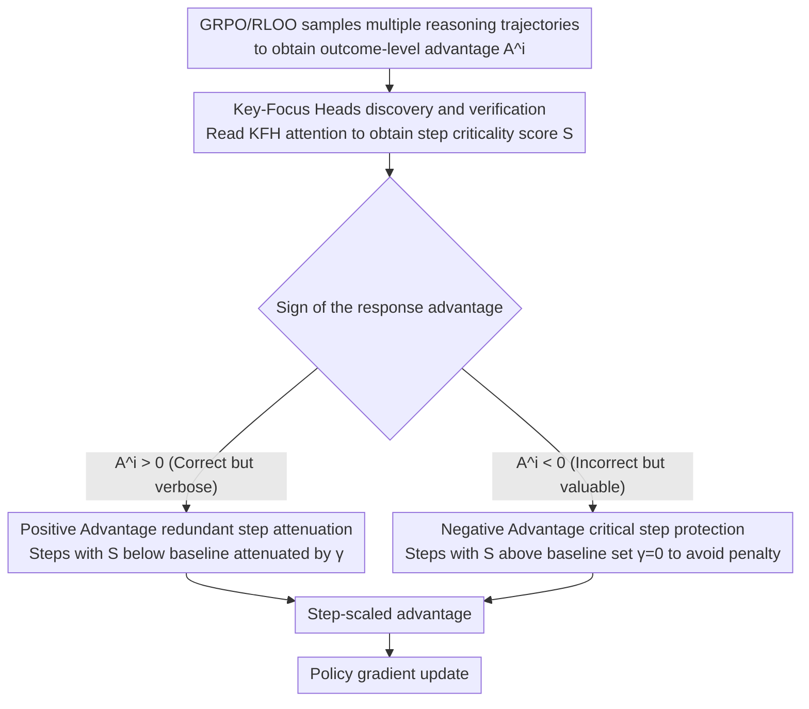

# AttnPO: Attention-Guided Process Supervision for Efficient Reasoning

**Conference**: ACL 2026  
**arXiv**: [2602.09953](https://arxiv.org/abs/2602.09953)  
**Code**: [GitHub](https://github.com/NieSYsc20/AttnPO)  
**Area**: Reinforcement Learning / Efficient Reasoning  
**Keywords**: Overthinking, Process Supervision, Attention Mechanism, Reinforcement Learning, Reasoning Efficiency

## TL;DR

Ours proposes AttnPO, a low-overhead process-supervised RL framework that leverages the model's intrinsic attention signals for step-level credit assignment. By identifying Key-Focus Heads (KFH) to distinguish between redundant and critical reasoning steps, AttnPO significantly reduces reasoning length while substantially improving accuracy.

## Background & Motivation

**Background**: Large Reasoning Models (LRM) trained on RLVR, such as DeepSeek-R1, perform exceptionally well on complex reasoning tasks but suffer from severe "overthinking"—generating lengthy reasoning processes even for simple operations, which wastes computational resources.

**Limitations of Prior Work**: (1) Trajectory-level length penalties treat all reasoning steps uniformly, failing to distinguish between redundant and necessary steps, often leading to a drop in accuracy; (2) Sampling-based process supervision methods (Monte Carlo sampling) are computationally expensive; (3) Model-based methods (training a reward model to locate the first correct answer position) provide imprecise credit assignment.

**Key Challenge**: There is a need for fine-grained step-level supervision to distinguish between redundant and critical steps, but existing methods are either computationally expensive (requiring extra sampling/models) or inaccurate in credit assignment.

**Goal**: Achieve precise step-level process supervision relying solely on intrinsic model signals with almost zero additional resource cost.

**Key Insight**: An in-depth analysis of the model's attention mechanism reveals that specific attention heads naturally focus on critical steps during the generation of the final answer.

**Core Idea**: Key-Focus Heads (KFH) naturally assign high attention to critical reasoning steps and low attention to redundant steps when generating the final answer. These can be directly used for step-level credit assignment.

## Method

### Overall Architecture

Based on the GRPO/RLOO framework, AttnPO utilizes KFH attention scores to scale outcome-level advantages at the step level: for correct responses with a positive advantage, the positive advantage of redundant steps is attenuated (reducing over-encouragement); for correct responses with a negative advantage, the negative advantage of critical steps is attenuated (avoiding over-punishment).

### Key Designs

**1. Key-Focus Heads (KFH) Discovery and Verification: Reading critical steps from the model's own attention**

The main obstacle to step-level supervision is determining step criticality without extra computation. AttnPO observes that when an LRM generates the final answer, it must select key information from the lengthy reasoning; the attention mechanism acts as a natural information selector. The attention score of the final answer toward a reasoning step $s_k$ is defined as:

$$\mathcal{S}_{s_k}^{l,h} = \frac{1}{|s_k|}\sum_{m \in \mathcal{F}}\sum_{n \in s_k} a_{m \to n}^{l,h}$$

where $\mathcal{F}$ is the set of tokens in the final answer. Using Step Ranking Accuracy (SRA, which measures how well the head's attention-based step ranking aligns with ground-truth criticality), a small group of attention heads is found with SRA as high as 95–96%. These are the Key-Focus Heads, which can be directly used for step-level credit assignment.

**2. Positive Advantage Redundant Step Attenuation: Do not over-reward verbose steps in correct responses**

The outcome-level advantage in GRPO/RLOO acts uniformly on all steps. A positive advantage reinforces the entire trajectory indiscriminately, including redundant steps, which is the root of overthinking. AttnPO's approach is: when a response has $A^i > 0$ and a step's KFH attention is below a baseline ($\mathcal{S}_{s_k}^i < \mathcal{S}_{\text{base}^i}$), it is judged as redundant. A scaling factor is applied:

$$\gamma_{s_k}^i = (1-\delta) \cdot p_i^\lambda \cdot (\mathcal{S}_{s_k}^i / \mathcal{S}_{\text{base}}^i) + \delta$$

This attenuates the positive advantage of that step. The baseline score $\mathcal{S}_{\text{base}}^i = p_i^\beta \cdot \frac{|\mathcal{F}_i|}{|o_i|}$ is difficulty-aware (higher difficulty $p_i$ leads to a more relaxed threshold), ensuring that exploration steps are not mistakenly deleted for hard problems.

**3. Negative Advantage Critical Step Protection: Avoid penalizing critical steps in incorrect responses**

A negative advantage suppresses the probability of an entire trajectory. However, an incorrect response often contains correct critical steps; penalizing them harms reasoning ability. AttnPO reverses this: when $A^i < 0$ and a step's attention is above the baseline ($\mathcal{S}_{s_k}^i > \mathcal{S}_{\text{base}}^i$), it is judged critical. Setting $\gamma_{s_k}^i = 0$ completely waives the penalty, concentrating the negative gradient on redundant steps. These two strategies complement each other to reduce length while improving accuracy.

### Loss & Training

The reward function is $r_i = \mathbb{I}[o_i \text{ correct}](1 - \alpha \cdot \sigma(f(o_i)))$, where $f(o_i) = \sigma((\text{len}(o_i) - \text{mean}(q)) / \text{std}(q))$. The RLOO advantage estimator $A^i = r_i - \frac{1}{G-1}\sum_{j \neq i} r_j$ is used. KFHs are selected from the top N heads by SRA and remain stable during RL training (Pearson correlation > 0.85).

## Key Experimental Results

### Main Results (1.5B Model)

| Method | GSM8K Acc | MATH500 Acc | AIME24 Acc | AIME25 Acc | Avg. Acc | Avg. Tokens |
|------|----------|------------|-----------|-----------|---------|-----------|
| DS-R1-1.5B Baseline | 78.8 | 82.1 | 28.1 | 22.8 | 54.5 | 8005 |
| AutoThink | 83.0 | 84.0 | 34.6 | 21.8 | 57.0 | 5056 |
| AdaptThink | 83.1 | 82.0 | - | - | - | - |
| AttnPO (Ours) | **Significant Improvement** | **Significant Improvement** | **Significant Improvement** | - | **+7.3pts** | **-60%** |

### Ablation Study

| Configuration | Effect |
|------|------|
| Pos-Adv Attenuation Only | Effectively reduces length but limited accuracy gain |
| Neg-Adv Protection Only | Effectively protects accuracy but limited length reduction |
| Combination (AttnPO) | Achieves both significant length reduction and accuracy improvement |
| Remove high SRA steps vs. low SRA steps | Removing high SRA steps significantly reduces pass@32; low SRA steps have minor impact |

### Key Findings

- KFHs are primarily located in the middle and late layers; a small number of heads (SRA > 0.9) is sufficient.
- KFH behavior is highly stable during the RL training process, with robust functional roles.
- KFHs identified on non-difficult problems generalize well to difficult problems (e.g., AIME24).
- On DeepSeek-R1-Distill-Qwen-1.5B, Ours achieved an average +7.3 points accuracy improvement and a 60% reduction in reasoning length across 6 math benchmarks.

## Highlights & Insights

- First to reveal the existence of Key-Focus Heads in LRMs—naturally focusing on critical steps during final answer generation.
- Almost zero extra overhead: Does not require additional sampling or reward models; uses only existing intrinsic attention scores.
- Two complementary strategies (Pos-Adv attenuation + Neg-Adv protection) are elegantly designed to handle redundancy and preserve reasoning quality separately.
- The difficulty-aware mechanism ($p_i^\beta$ and delayed scheduling $t > T \cdot p_i$) ensures sufficient exploration space for difficult problems.

## Limitations & Future Work

- Reasoning step segmentation relies on predefined special phrases, which may lack generalizability.
- Performance of KFH on larger models (>7B) has not been fully verified.
- Evaluated only on mathematical reasoning; tasks like coding or logic are yet to be explored.
- Calculation of attention scores introduces some overhead during inference (though negligible during training).

## Related Work & Insights

- GRPO / DeepSeek-R1 (Guo et al., 2025): Foundation of outcome-supervised RL.
- TLMRE (Arora & Zanette, 2025): Trajectory-level length penalty methods.
- Monte Carlo Sampling methods (Dai et al., 2025; Yue et al., 2025): High-overhead process supervision.
- Attention Head Differentiation (Zheng et al., 2024; Li et al., 2025): Research on functional specialization of attention heads.
- The discovery of KFH provides a new perspective for understanding the internal working mechanisms of LRMs.

## Rating

- Novelty: ⭐⭐⭐⭐⭐ The discovery of KFH is highly insightful, and the idea of using intrinsic signals for process supervision is innovative.
- Experimental Thoroughness: ⭐⭐⭐⭐ 9 benchmarks with sufficient probing analysis and ablation studies.
- Writing Quality: ⭐⭐⭐⭐⭐ Smooth narrative from discovery to application with rigorous formulas.
- Value: ⭐⭐⭐⭐⭐ +7.3pts accuracy + 60% length reduction, offering extremely high practical value.

<!-- RELATED:START -->

## Related Papers

- [\[ICLR 2026\] Attention as a Compass: Efficient Exploration for Process-Supervised RL in Reasoning Models](../../ICLR2026/reinforcement_learning/attention_as_a_compass_efficient_exploration_for_process-supervised_rl_in_reason.md)
- [\[ICLR 2026\] From Narrow to Panoramic Vision: Attention-Guided Cold-Start Reshapes Multimodal Reasoning](../../ICLR2026/reinforcement_learning/from_narrow_to_panoramic_vision_attention-guided_cold-start_reshapes_multimodal_.md)
- [\[ACL 2026\] SpiralThinker: Latent Reasoning through an Iterative Process with Text-Latent Interleaving](spiralthinker_latent_reasoning_through_an_iterative_process_with_text-latent_int.md)
- [\[ACL 2026\] Good Reasoning Makes Good Demonstrations: Implicit Reasoning Quality Supervision via In-Context Reinforcement Learning](good_reasoning_makes_good_demonstrations_implicit_reasoning_quality_supervision_.md)
- [\[ACL 2026\] Visually-Guided Policy Optimization for Multimodal Reasoning](visually-guided_policy_optimization_for_multimodal_reasoning.md)

<!-- RELATED:END -->
