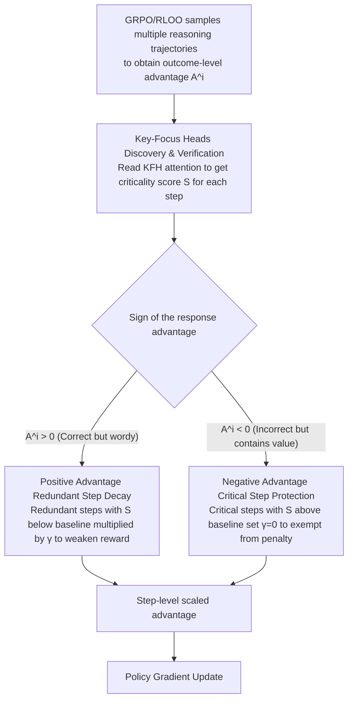

# AttnPO: Attention-Guided Process Supervision for Efficient Reasoning

**Conference**: ACL 2026  
**arXiv**: [2602.09953](https://arxiv.org/abs/2602.09953)  
**Code**: [GitHub](https://github.com/NieSYsc20/AttnPO)  
**Area**: Reinforcement Learning / Efficient Reasoning  
**Keywords**: Overthinking, Process Supervision, Attention Mechanism, Reinforcement Learning, Reasoning Efficiency

## TL;DR

Ours proposes AttnPO, a low-overhead process-supervised RL framework that utilizes the model's intrinsic attention signals for step-level credit assignment. By identifying Key-Focus Heads (KFH) to distinguish between redundant and critical reasoning steps, it significantly improves accuracy while drastically reducing reasoning length.

## Background & Motivation

**Background**: Large Reasoning Models (LRMs) like DeepSeek-R1, trained based on RLVR, perform exceptionally well on complex reasoning tasks but suffer from severe "overthinking"—generating lengthy reasoning processes even for simple operations, which wastes computational resources.

**Limitations of Prior Work**: (1) Trajectory-level length penalties treat all reasoning steps uniformly and fail to distinguish between redundant and necessary steps, often leading to a drop in accuracy; (2) Sampling-based process supervision methods (e.g., Monte Carlo sampling) involve high computational overhead; (3) Model-based methods (training a reward model to locate the first correct answer) provide imprecise credit assignment.

**Key Challenge**: There is a need for fine-grained step-level supervision to distinguish redundant from critical steps, but existing methods are either computationally expensive (extra sampling/models) or inaccurate in credit assignment.

**Goal**: To achieve fine-grained step-level process supervision with almost zero additional resource cost, relying solely on the model's intrinsic signals.

**Key Insight**: In-depth analysis of the model's attention mechanism reveals that special attention heads naturally focus on critical steps during final answer generation.

**Core Idea**: Key-Focus Heads (KFH) naturally assign high attention to critical reasoning steps and low attention to redundant steps when generating the final answer, which can be directly used for step-level credit assignment.

## Method

### Overall Architecture

Based on the GRPO/RLOO framework, AttnPO utilizes the attention scores of KFH to perform step-level scaling of the outcome-level advantage: for correct responses with a positive advantage, it decays the positive advantage of redundant steps (reducing over-encouragement); for incorrect responses with a negative advantage, it decays the negative advantage of critical steps (avoiding over-punishment).

### Key Designs

**1. Key-Focus Heads (KFH) Discovery & Verification: Reading which steps are critical from the model's own attention**

The biggest obstacle to step-level supervision is "how to identify which steps are critical or redundant without spending extra compute." AttnPO observes that when an LRM generates the final answer, it must select key information from the lengthy reasoning; the attention mechanism itself is a natural information selector. Thus, the attention score of the final answer toward a reasoning step $s_k$ is defined as:

$$\mathcal{S}_{s_k}^{l,h} = \frac{1}{|s_k|}\sum_{m \in \mathcal{F}}\sum_{n \in s_k} a_{m \to n}^{l,h}$$

where $\mathcal{F}$ is the set of tokens in the final answer. By filtering heads using Step Ranking Accuracy (SRA, which measures the consistency between the attention-based ranking of steps and their true criticality), it is found that a small subset of attention heads achieves an SRA as high as 95–96%. These are the Key-Focus Heads; they naturally assign high attention to critical steps and low attention to redundant steps during final answer generation and can be directly used for step-level credit assignment.

**2. Positive Advantage Redundant Step Decay: Stop rewarding redundant steps in correct but verbose responses**

The outcome-level advantage of GRPO/RLOO acts uniformly across all steps. A positive advantage indiscriminately reinforces the entire trajectory, including redundant steps, which is the root cause of overthinking. AttnPO's approach is: when a response has $A^i > 0$ and the KFH attention for a certain step is below the baseline ($\mathcal{S}_{s_k}^i < \mathcal{S}_{\text{base}}^i$, judged as redundant), it scales down the positive advantage of that step using a scaling factor:

$$\gamma_{s_k}^i = (1-\delta) \cdot p_i^\lambda \cdot (\mathcal{S}_{s_k}^i / \mathcal{S}_{\text{base}}^i) + \delta$$

The baseline score $\mathcal{S}_{\text{base}}^i = p_i^\beta \cdot \frac{|\mathcal{F}_i|}{|o_i|}$ is difficulty-aware ($p_i$ is harder, the threshold is more relaxed), ensuring that exploration steps are not mistakenly deleted for difficult problems. In this way, the model is only encouraged to retain steps that truly contribute, rather than reinforcing the entire long chain.

**3. Negative Advantage Critical Step Protection: Don't penalize critical steps in incorrect responses**

A negative advantage indiscriminately suppresses the generation probability of the entire trajectory. However, an "eventually incorrect" response often still contains correct critical steps; punishing them together would damage the model's reasoning ability. AttnPO performs the reverse operation: when $A^i < 0$ and the attention for a certain step is above the baseline ($\mathcal{S}_{s_k}^i > \mathcal{S}_{\text{base}}^i$, judged as critical), it sets $\gamma_{s_k}^i = 0$ to fully exempt the step from penalty, concentrating the negative gradient on redundant steps. Designs 2 and 3 complement each other: the former suppresses redundancy in "correct but wordy" outputs, while the latter protects critical steps in "incorrect but valuable" outputs. Together, they simultaneously reduce length and improve accuracy.

### Loss & Training

The reward function is $r_i = \mathbb{I}[o_i \text{ correct}](1 - \alpha \cdot \sigma(f(o_i)))$, where $f(o_i) = \sigma((\text{len}(o_i) - \text{mean}(q)) / \text{std}(q))$. The RLOO advantage estimator $A^i = r_i - \frac{1}{G-1}\sum_{j \neq i} r_j$ is used. KFH are selected from the top N heads by SRA, and their behavior remains stable during RL training (Pearson correlation > 0.85).

## Key Experimental Results

### Main Results (1.5B Model)

| Method | GSM8K Acc | MATH500 Acc | AIME24 Acc | AIME25 Acc | Avg Acc | Avg Token |
|------|----------|------------|-----------|-----------|---------|-----------|
| DS-R1-1.5B Baseline | 78.8 | 82.1 | 28.1 | 22.8 | 54.5 | 8005 |
| AutoThink | 83.0 | 84.0 | 34.6 | 21.8 | 57.0 | 5056 |
| AdaptThink | 83.1 | 82.0 | - | - | - | - |
| AttnPO (Ours) | **Significant Gain** | **Significant Gain** | **Significant Gain** | - | **+7.3pts** | **-60%** |

### Ablation Study

| Configuration | Effect |
|------|------|
| Pos-Adv Decay Only | Effectively shortens length but accuracy gain is limited |
| Neg-Adv Protection Only | Effectively protects accuracy but length reduction is limited |
| Both Combined (AttnPO) | Achieves both dramatic shortening and accuracy improvement |
| Remove High SRA steps vs Low SRA steps | Removing high SRA steps significantly reduces pass@32; low SRA steps have minor impact |

### Key Findings

- KFH are mainly located in middle-to-late layers; a few heads (SRA > 0.9) are sufficient, with diminishing returns for more heads.
- KFH behavior is highly stable during the RL training process, with robust functional roles.
- KFH identified on non-difficult problems generalize well to difficult problems (AIME24).
- Achieved an average +7.3 points accuracy gain and 60% reasoning length reduction on DeepSeek-R1-Distill-Qwen-1.5B across 6 math benchmarks.

## Highlights & Insights

- First to reveal the existence of Key-Focus Heads in LRMs—naturally focusing on critical steps during final answer generation.
- Almost zero additional overhead: No need for extra sampling or reward models, utilizing only the model's existing attention scores.
- The two complementary strategies (Pos-Adv Decay + Neg-Adv Protection) are elegantly designed and serve distinct purposes.
- The difficulty-aware mechanism ($p_i^\beta$ and delayed scheduling $t > T \cdot p_i$) ensures sufficient exploration space for difficult problems.

## Limitations & Future Work

- Reasoning step segmentation depends on predefined special phrases, which may not be universal.
- Performance of KFH on larger models (>7B) has not been fully verified.
- Evaluated only on mathematical reasoning tasks; coding/logic and other tasks remain to be explored.
- Calculation of attention scores introduces extra overhead during inference (though negligible during training).

## Related Work & Insights

- GRPO / DeepSeek-R1 (Guo et al., 2025): The foundation for outcome-supervised RL.
- TLMRE (Arora & Zanette, 2025): Trajectory-level length penalty methods.
- Monte Carlo sampling methods (Dai et al., 2025; Yue et al., 2025): High-overhead process supervision.
- Functional differentiation of attention heads (Zheng et al., 2024; Li et al., 2025): Research on function specialization of attention heads.
- The discovery of KFH provides a new perspective for understanding the internal working mechanisms of LRMs.

## Rating

- Novelty: ⭐⭐⭐⭐⭐ The discovery of KFH is highly insightful, and the idea of using intrinsic signals for process supervision is novel.
- Experimental Thoroughness: ⭐⭐⭐⭐ 9 benchmarks, with sufficient probing analysis and ablation studies.
- Writing Quality: ⭐⭐⭐⭐⭐ Fluent narrative from discovery to application, with rigorous formulas.
- Value: ⭐⭐⭐⭐⭐ +7.3pts accuracy + 60% length reduction, offering extremely high practical value.

<!-- RELATED:START -->

## Related Papers

- [\[ICLR 2026\] From Narrow to Panoramic Vision: Attention-Guided Cold-Start Reshapes Multimodal Reasoning](../../ICLR2026/reinforcement_learning/from_narrow_to_panoramic_vision_attention-guided_cold-start_reshapes_multimodal_.md)
- [\[ACL 2026\] SpiralThinker: Latent Reasoning through an Iterative Process with Text-Latent Interleaving](spiralthinker_latent_reasoning_through_an_iterative_process_with_text-latent_int.md)
- [\[ACL 2026\] Visually-Guided Policy Optimization for Multimodal Reasoning](visually-guided_policy_optimization_for_multimodal_reasoning.md)
- [\[ACL 2026\] Good Reasoning Makes Good Demonstrations: Implicit Reasoning Quality Supervision via In-Context Reinforcement Learning](good_reasoning_makes_good_demonstrations_implicit_reasoning_quality_supervision_.md)
- [\[ICLR 2026\] Regret-Guided Search Control for Efficient Learning in AlphaZero](../../ICLR2026/reinforcement_learning/regret-guided_search_control_for_efficient_learning_in_alphazero.md)

<!-- RELATED:END -->
