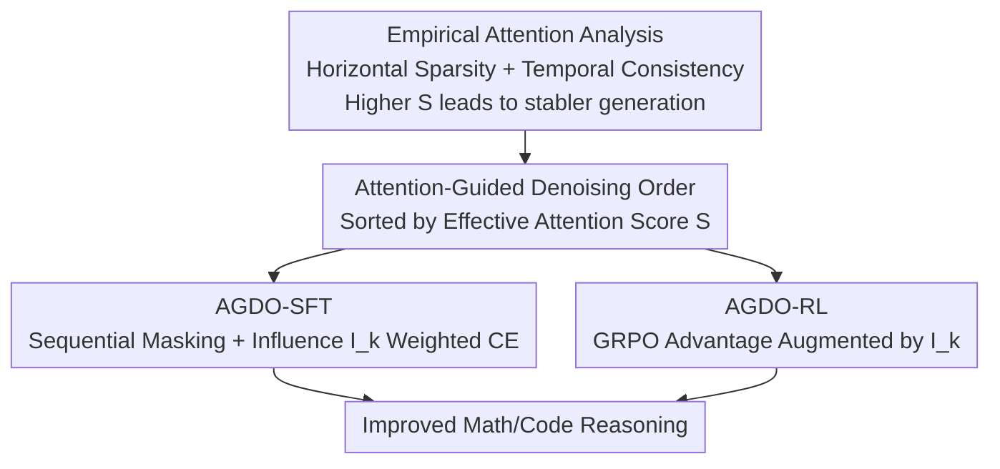

# Beyond Fully Random Masking: Attention-Guided Denoising and Optimization for Diffusion Language Models

**Conference**: ACL 2026  
**arXiv**: [2606.12273](https://arxiv.org/abs/2606.12273)  
**Code**: TBD  
**Area**: Diffusion Language Models / Post-training (SFT+RL)  
**Keywords**: Diffusion Language Models, Attention-Guided Denoising, Masking Strategy, GRPO, Reasoning Enhancement

## TL;DR
This paper identifies that in diffusion language models (dLLMs), "tokens that attend more to determined contexts exhibit more stable generation and are more critical for reasoning." Consequently, it proposes AGDO—a method that derives denoising order from attention and emphasizes these "attention hub" tokens via weighting during supervised fine-tuning (SFT) and reinforcement learning (RL). This approach consistently outperforms existing post-training methods for dLLMs that rely on random masking in mathematical and code reasoning tasks.

## Background & Motivation
**Background**: Diffusion language models (dLLMs, such as LLaDA and Dream) replace the token-by-token generation of autoregressive (AR) models with parallel denoising. They offer significant efficiency advantages during inference, and their performance has approached that of AR models of comparable scale. Enhancing the reasoning capabilities of dLLMs relies heavily on **post-training**.

**Limitations of Prior Work**: Existing post-training methods for dLLMs (e.g., diff-GRPO, wd1) almost exclusively rely on **random masking**, where a random set of positions is masked and optimized. While simple and efficient, this does not align with the actual denoising dynamics during dLLM inference, causing a training-inference discrepancy. Subsequent works attempted to mitigate this using blockwise SFT (semi-autoregressive unmasking order) or left-to-right orders, but these impose an **external** decoding order that ignores a critical property of full-attention dLLMs: under bidirectional attention, dependencies between tokens are **not determined by positional order** but emerge dynamically through attention interactions.

**Key Challenge**: The masking/unmasking order used in training is artificially prescribed (random, left-to-right, blockwise), whereas what truly determines whether a token can be reliably generated during inference is **which determined contexts it depends on via attention**. Order mismatch leads to training signals that are misaligned with the actual generation trajectory.

**Goal**: Align the training denoising trajectory **explicitly with attention-induced token dependencies** rather than imposing an external order.

**Key Insight**: The authors first perform an empirical attention analysis (see "Overall Architecture" below) and find that attention distributions are **sparse and stable across steps**, and **tokens that direct more attention toward unmasked tokens exhibit more stable generation probabilities**. This provides a data-driven, natural signal for denoising order.

**Core Idea**: Calculate an "Effective Attention Score" to derive the denoising order and use "Influence Scores" to weight critical hub tokens during SFT and RL, thereby coupling training dynamics with the model's internal attention structure.

## Method

### Overall Architecture
AGDO is a two-stage post-training framework built upon empirical attention analysis. By observing the denoising process in the final layer of Dream-v0-Instruct-7B, two phenomena were noted: **horizontal sparsity** (each token primarily attends to itself, neighbors, and a few "hub columns" attended by many positions) and **temporal consistency** (tokens attend to similar objects across different denoising steps). An "Effective Attention Score" $S_i$ (the total attention token $i$ directs toward the unmasked set) was defined. It was found that a higher $S_i$ correlates with more stable subsequent probabilities (smaller probability drop $\Delta P$).

Based on this, AGDO integrates three components: ① An **attention-guided denoising order** derived from $S$; ② **AGDO-SFT**, which masks tokens according to this order and weights the loss using an "Influence Score" $I_k$; ③ **AGDO-RL**, which augments advantage estimation in GRPO using $I_k$. Both SFT and RL share the same attention-guided denoising order.

### Key Designs

**1. Attention-Guided Denoising Order: Unmasking tokens with sufficient context support first**

The limitation of existing methods is the disconnection between unmasking orders (random/L2R/blockwise) and the attention dependency structure. The authors address this by using the **Effective Attention Score** $S_i$, which measures how much attention token $i$ directs toward the **already unmasked** context:

$$S_i = \sum_{k\in\mathcal{U}}\left(\frac{1}{H}\sum_{h=1}^{H} A^{(L,h)}_{i,k}\right)$$

where $\mathcal{U}$ is the set of unmasked tokens, and $A^{(L,h)}_{i,k}$ is the attention from token $i$ to $k$ in the $L$-th layer and $h$-th head. $S$ is used because empirical findings show it correlates positively with probability stability: defining change in probability as $\Delta P_i = P_i^{\min} - P_i^{\text{denoise}}$ (the difference between probability at unmasking and the minimum subsequent probability), a larger $S_i$ results in $\Delta P_i$ closer to 0. During sorting, a **single forward pass** at the final denoising step is sufficient to obtain the last-layer attention. $\mathcal{U}$ is initialized with prompt tokens, and in each step, the top-$n$ tokens with the highest $S$ are added to $\mathcal{U}$, with $S$ recalculated for remaining tokens until all are ordered. This ensures unmasking only when attention support is sufficient, aligning the generation trajectory with dependencies captured by attention.

**2. Attention-Guided SFT: Matching unmasking order + Loss weighting via Influence Scores**

Existing SFT methods use random or fixed blockwise masks on a subset of tokens for cross-entropy, ignoring attention dependencies. AGDO-SFT introduces two changes. First, **masking alignment with denoising order**: at time $t$, only tokens "assigned to that denoising step" are randomly masked, mirroring the expected inference trajectory during training. Second, **weighting via Influence Score $I_k$**: inspired by "attention centrality" in AR models, $I_k$ is defined as the total attention token $k$ **receives** from all other tokens:

$$I_k = \sum_i\left(\frac{1}{H}\sum_{h=1}^{H} A^{(L,h)}_{i,k}\right)$$

Tokens with high $I_k$ are "attention hubs" that disproportionately influence the generation of other tokens. The cross-entropy at step $t$ is weighted by $(1+\gamma_k I_k)$:

$$-\mathbb{E}_{t,x_0,x_t}\left[\frac{1}{|\mathcal{U}_t|}\sum_{k\in\mathcal{U}_t}(1+\gamma_k I_k)\,\log f_\theta(x_0^k\mid x_t)\right]$$

This forces the model to focus learning on hub tokens critical for global consistency. Ablations show that even with $\gamma=0$ (no weighting, only order alignment), it outperforms blockwise SFT by ~2%.

**3. Attention-Guided RL: Augmenting GRPO advantages with Hub Scores**

The same concept is applied to reinforcement learning. AGDO-RL follows the same attention-guided denoising order under the GRPO framework and augments the **advantage estimation** with the hub score $I$, allowing central tokens to receive larger policy updates:

$$\hat{A}'_k = \hat{A}_k + \mathrm{sign}(\hat{A}_k)\cdot\delta\cdot I_k$$

$\delta$ controls the strength of attention guidance, and $\mathrm{sign}(\hat{A}_k)$ ensures the augmentation direction matches the original advantage. Incorporating this into the GRPO objective biases policy updates toward central tokens in the attention map, aligning preference optimization with the intrinsic reasoning structure of the dLLM.

### Loss & Training
The SFT loss utilizes the weighted ELBO from Design 2. RL employs GRPO (group relative advantage normalization $\hat{A}_t^i = (R^i - \mathrm{mean}(\{R^j\}))/\mathrm{std}(\{R^j\})$) combined with the augmented advantage from Design 3. Since dLLMs cannot decompose tokens sequentially like AR models, token-level likelihood ratios and KL divergence are estimated in a single pass using mean-field approximation. Inference uses static decoding with temperature 0.1, unmasking 1 token per step, and a max length of 1024. Attention signals are extracted from the **final layer**.

## Key Experimental Results

### Main Results
Experiments were conducted on Dream-v0-Instruct-7B across mathematics (GSM8K / MATH500 / Minerva) and code (LiveBench / LiveCodeBench-v2) tasks. Results are averaged over 8 runs.

| Method | GSM8K | MATH500 | Minerva | LiveBench | LiveCodeBench-v2 | Average |
|------|------|------|------|------|------|------|
| Dream-7B (Baseline) | 69.4 | 38.9 | 11.6 | 10.7 | 10.7 | 28.3 |
| SFT (Random Mask) | 83.5 | 48.3 | 14.8 | 11.3 | 11.5 | 33.9 |
| blockwise SFT | 86.0 | 51.7 | 12.3 | 10.2 | 11.8 | 34.4 |
| **AGDO-SFT (Ours)** | 85.3 | 53.7 | 15.3 | 12.5 | 13.1 | **36.0** |
| Diff-GRPO | 85.0 | 45.5 | 15.3 | 15.2 | 13.9 | 35.0 |
| TraceRL | 86.3 | 52.8 | 16.4 | 14.0 | 13.0 | 36.5 |
| **AGDO-RL (Ours)** | 87.7 | 53.7 | 16.1 | 18.3 | 14.7 | **38.1** |
| **AGDO (Ours, SFT+RL)** | 86.9 | 56.2 | 17.0 | 18.4 | 15.6 | **38.8** |

AGDO-SFT achieved 36.0%, surpassing blockwise SFT (34.4%) and providing a 3.0% gain on the challenging Minerva dataset. AGDO-RL reached 38.1%, with a significant lead on LiveBench (18.3%) over Diff-GRPO (15.2%). The full AGDO reached 38.8% with more stable training curves.

### Ablation Study

| Configuration | Key Finding |
|------|------|
| $\gamma=0$ (Order only) | Still outperforms blockwise SFT by ~2%, proving "order alignment" is effective; $\gamma=100$ is best for MATH500. |
| $\delta=0$ (RL Order only) | Accuracy remains higher than TraceRL; $\delta < 10$ provides further gains, while $\delta=20$ degrades performance. |
| Context $L=512$ + block size | blockwise SFT drops to 45.8%, whereas AGDO-SFT (49.6%) outperforms standard SFT. |
| Transfer to LLaDA-8B | AGDO-SFT (39.6% on MATH500) exceeds baseline. AGDO reaches 85.3/42.8 on GSM8K/MATH500. |
| Layer / Head Selection | Using the **last layer** results in highest accuracy, aligning with the "deep layers capture semantic dependencies" hypothesis. |

### Key Findings
- **"Aligning Denoising Order" is the primary contributor**: Even when $\gamma=0$ and $\delta=0$, the attention-guided order alone outperforms baselines. Weighting ($I_k$) provides marginal improvements, confirming that train-inference order mismatch is the main bottleneck.
- **Strong Robustness**: Performance is consistently superior across tight contexts ($L=512$), varying block sizes, and different base models (LLaDA). blockwise SFT degrades in short contexts, while AGDO does not.
- **Excessive $\delta$ harms training**: Attention augmentation must be moderated; otherwise, aggressive gradient updates violate PPO trust-region constraints.

## Highlights & Insights
- **Empirical link between $S$ and stability**: The discovery that "Effective Attention Score $S$ predicts generation stability" transforms abstract bidirectional dependencies into a computable scalar that drives the denoising order.
- **Efficiency**: The method derives the entire unmasking sequence from a single forward pass on the last layer. It requires no repeated attention calculations or additional learnable modules.
- **Unified SFT and RL signals**: Using $S$ for order and $I$ for weighting provides a consistent framework that generalizes across full-attention dLLMs, as verified on LLaDA.

## Limitations & Future Work
- **Concentrated Analysis**: Focus is limited to the last layer and simple head aggregation. Whether multi-head or cross-layer dependency structures could be further exploited remains unexplored.
- **Hyperparameter Sensitivity**: $\gamma$ and $\delta$ require tuning ($\delta=20$ causes collapse). There is no automated strategy yet for cross-task parameter selection.
- **Static Estimation**: Denoising order is estimated from a "single forward pass at the final moment." Whether this approximation holds for extremely long sequences or branched reasoning is not fully tested.
- **Scalability**: Evaluation was limited to 7-8B models on math/code tasks; benefits for larger models or open-ended tasks are unknown.

## Related Work & Insights
- **vs. Random Masking (diff-GRPO / wd1)**: These methods use random positions, leading to dynamic mismatch. AGDO aligns trajectories using attention-derived orders.
- **vs. blockwise SFT / L2R Order**: These impose external orders. AGDO's order is **endogenously** derived from attention and is more robust in short contexts.
- **vs. GRPO (Shao et al.)**: AGDO augments GRPO advantages with a $\mathrm{sign}(\hat{A}_k)\delta I_k$ term, injecting structural priors into policy optimization.
- **vs. AR Attention Centrality**: This work migrates the "hub token influence" observation from AR to bidirectional dLLMs to design denoising orders and loss weighting.

## Rating
- Novelty: ⭐⭐⭐⭐ Naturally deriving denoising order from attention is a novel way to inject structural priors.
- Experimental Thoroughness: ⭐⭐⭐⭐ Solid results across two base models, multiple tasks, repeating 8 times, and extensive ablations.
- Writing Quality: ⭐⭐⭐⭐ Clear progression from analysis to methodology and experiments.
- Value: ⭐⭐⭐⭐ Provides a portable principle for aligning dependencies in dLLM post-training.

<!-- RELATED:START -->

## Related Papers

- [\[ACL 2026\] d-TreeRPO: Towards More Reliable Policy Optimization for Diffusion Language Models](d-treerpo_towards_more_reliable_policy_optimization_for_diffusion_language_model.md)
- [\[ACL 2026\] AttnPO: Attention-Guided Process Supervision for Efficient Reasoning](attnpo_attention-guided_process_supervision_for_efficient_reasoning.md)
- [\[ICML 2026\] Noise-Guided Transport: Imitation Learning from Random Priors](../../ICML2026/reinforcement_learning/noise-guided_transport_for_imitation_learning.md)
- [\[ICML 2026\] Learning Unmasking Policies for Diffusion Language Models](../../ICML2026/reinforcement_learning/learning_unmasking_policies_for_diffusion_language_models.md)
- [\[NeurIPS 2025\] MRO: Enhancing Reasoning in Diffusion Language Models via Multi-Reward Optimization](../../NeurIPS2025/reinforcement_learning/mro_enhancing_reasoning_in_diffusion_language_models_via_multi-reward_optimizati.md)

<!-- RELATED:END -->
