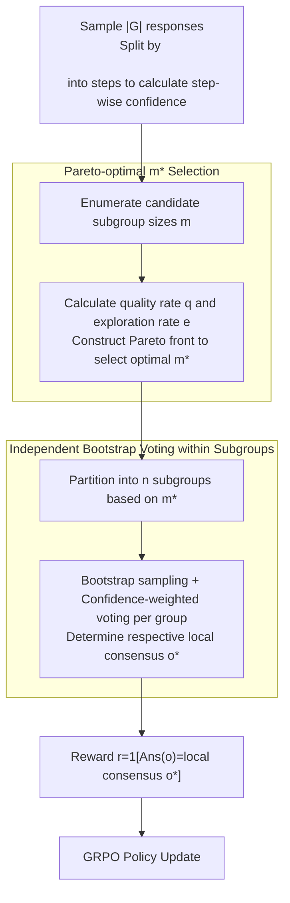

# Beyond Majority Voting: Towards Fine-grained and More Reliable Reward Signal for Test-Time Reinforcement Learning

**Conference**: ACL 2026  
**arXiv**: [2512.15146](https://arxiv.org/abs/2512.15146)  
**Code**: <https://github.com/szu-tera/SCOPE>  
**Area**: Reinforcement Learning / LLM Inference / Test-Time Training / Reward Models  
**Keywords**: TTRL, majority voting, step-wise confidence, subgroup partition, Pareto optimization

## TL;DR
Addressing the "confirmation bias + sparse reward" issues in TTRL caused by using majority voting for pseudo-labels, SCOPE proposes step-wise confidence-weighted voting (moving beyond frequency-based selection) and Pareto-optimal dynamic subgroup partitioning (bootstrapping local consensus in independent subgroups). On Qwen3-8B, it improves AIME 2024 from 47.13 → 52.70 and AIME 2025 from 27.40 → 31.00.

## Background & Motivation

**Background**: RLVR (RL with Verifiable Rewards) is a core training paradigm for top reasoning models like R1, Qwen3, and o1, but it relies on extensive human annotation. TTRL (Test-Time Reinforcement Learning) proposes label-free training at test time—using majority voting on multiple sampled responses to obtain a "consensus answer" as a pseudo-label for GRPO training.

**Limitations of Prior Work**: (1) **Confirmation Bias**: Majority voting treats all votes equally; if a model-confident but incorrect answer happens to have the most votes, it is repeatedly reinforced, exacerbating errors. (2) **Sparse Reward**: A whole group of $|\mathcal{G}|$ samples shares a single global consensus label, leading to all-or-nothing rewards lacking fine-grained signals to distinguish the degree of error.

**Key Challenge**: Majority voting violently discards token-level confidence information. In reality, LLMs possess confidence levels at each reasoning step. A correct solution might be a "minority vote with high confidence at every step," while an error might be a "majority vote that falters in middle steps." Simultaneously, a single consensus flattens within-group diversity, making it difficult to balance quality and exploration.

**Goal**: To inject two types of signals into TTRL without introducing human labels: (a) fine-grained step-wise confidence to allow correct minority solutions to emerge, and (b) subgroup partitioning to obtain both dense rewards and diverse supervision.

**Key Insight**: It is observed that step-wise confidence (the mean negative log probability of top-k tokens within a reasoning step) reflects the LLM's certainty over segments of its reasoning chain. Furthermore, partitioning the candidate pool into subgroups of size $m$ and voting independently within each group generates $n=|\mathcal{G}|/m$ different local consensuses, automatically providing diverse supervision targets.

**Core Idea**: Replace "equal-weight voting" with "confidence-weighted voting" and "single global consensus" with "adaptively selected subgroup sizes" to make TTRL reward signals more accurate (debiasing) and denser (alleviating sparsity).

## Method

### Overall Architecture
The SCOPE training iteration consists of four steps: (1) Sample $|\mathcal{G}|$ responses, partitioned by `\n\n` into reasoning steps, and calculate the average step confidence $\mathcal{C}_{AvgStep}^{(i)}$ for each response; (2) Evaluate various candidate subgroup sizes $m \in \mathcal{M}$, calculate the quality rate $q$ and exploration rate $e$ for each $m$, construct a Pareto front, and select the optimal $m^*$; (3) Partition responses into $n$ subgroups according to $m^*$, obtaining local consensus $o_j^*$ for each group via bootstrap sampling and confidence-weighted voting; (4) Calculate rewards as $r(o, o_j^*) = \mathds{1}[\text{Ans}(o) = o_j^*]$ and update the policy using GRPO.

### Key Designs

**1. Step-wise Confidence-weighted Voting: Overcoming Weak Majority with Confident Minority**

Majority voting assigns equal weight to all votes, causing incorrect "majority but uncertain" answers to be reinforced—this is confirmation bias. SCOPE instead uses the average step-wise confidence of each response for weighted voting. First, token confidence is calculated as $\mathcal{C}_t = -\frac{1}{k}\sum_{j=1}^{k}\log P_t(j)$ (average negative log probability of top-k), then averaged per step $\mathcal{C}_{s_k} = \frac{1}{N_k}\sum_{t=1}^{N_k}\mathcal{C}_t$. The weight for the entire response is the average of these step-wise means $\mathcal{C}_{AvgStep}^{(i)} = \frac{1}{|\mathcal{L}|}\sum_{k=1}^{|\mathcal{L}|}\mathcal{C}_{s_k}$. The consensus label is no longer based solely on frequency:

$$o^* = \operatorname{argmax}_y \sum_{i=1}^{|\mathcal{G}|} \mathcal{C}_{AvgStep}^{(i)} \cdot \mathds{1}[\text{Ans}(o_i) = y]$$

The step granularity is chosen because token-level data is too noisy (high-frequency function words distort signals), while trace-level data is too coarse (one error is buried by correct segments). Steps are natural structural units of reasoning that maintain structural precision while avoiding noise. Alternatives like targeting only the weakest step (bottom-10%) were found to penalize "difficult but correct" reasoning.

**2. Independent Bootstrap Voting in Subgroups: Densifying Rewards via Local Truths**

TTRL applies a single global consensus label to all $|\mathcal{G}|$ samples, resulting in extremely sparse rewards and zero exploration diversity. SCOPE partitions the pool into subgroups $\mathcal{S} = \{S_j = \{o_{(j-1)m+1}, \dots, o_{jm}\}\}_{j=1}^{n}$ of size $m$. Each subgroup undergoes bootstrap sampling from the global pool to determine its own local consensus $o_j^*$ via confidence-weighted voting. Rewards are calculated based on these local targets: $r(o, o_j^*) = \mathds{1}[\text{Ans}(o) = o_j^*]$. Consequently, $n=|\mathcal{G}|/m$ subgroups hold potentially different "local truths," injecting diverse supervision targets for GRPO advantage calculation and encouraging exploration of multiple reasoning paths. Subgroup size is a double-edged sword: $m=1$ relies on single samples (high noise), while $m=|\mathcal{G}|$ reverts to global consensus. This necessitates an adaptive selection mechanism.

**3. Pareto-optimal $m^*$ Selection: Dynamically Balancing Quality and Exploration**

A fixed $m$ is sub-optimal across different training stages—early stages require the diversity of small $m$ for exploration, while later stages require the stability of large $m$. SCOPE defines two opposing metrics: quality $q = \frac{1}{|\mathcal{G}|} \sum_{j=1}^{n}\sum_{l=1}^{m} \mathds{1}[\text{Ans}(o_{(j-1)m+l}) = o_j^*]$ (intra-group consistency) and exploration $e = \frac{|\{o_1^*, \dots, o_n^*\}|}{n}$ (ratio of unique consensuses). Enumerating $m \in \{1, 2, 4, \dots\}$ yields a set of $(q_k, e_k)$ points forming a Pareto front. The optimal $m^*$ is selected by minimizing the z-norm weighted distance:

$$d_k = \sqrt{\lambda(1-\hat{q}_k)^2 + (1-\lambda)(1-\hat{e}_k)^2}$$

with $\lambda = 0.7$ empirically optimal. This transforms the quality-exploration trade-off into an adaptive surface, adjusting to the current distribution at each step without manual scheduling.

### Loss & Training
The standard GRPO objective is utilized: $\mathcal{J}_{GRPO}(\theta) = \mathbb{E}\left[\frac{1}{|\mathcal{G}|}\sum_i \frac{1}{|o_i|}\sum_t \min[\rho_{i,t}\mathcal{A}_i, \text{clip}(\rho_{i,t}, 1-\epsilon, 1+\epsilon)\mathcal{A}_i] - \beta \mathbb{D}_{KL}[\pi_\theta \| \pi_{ref}]\right]$, where advantage $\mathcal{A}_i = (r(o_i) - \mu_g)/(\sigma_g + \epsilon)$. SCOPE's primary modification is the source of $r(\cdot)$—moving from "global majority vote" to "subgroup-specific confidence-weighted vote." Pareto evaluation adds approximately 10% computational overhead.

## Key Experimental Results

### Main Results (4 Models × 4 Math Benchmarks)

| Model | Method | AIME 2024 | AIME 2025 | AMC | MATH-500 | Avg |
|------|------|-----------|-----------|-----|----------|-----|
| Qwen2.5-Math-1.5B | TTRL | 16.48 | 9.86 | 48.87 | 72.58 | 36.95 |
| Qwen2.5-Math-1.5B | **SCOPE** | **22.50** | **14.90** | **51.20** | **76.85** | **41.36** |
| Qwen3-1.7B | TTRL | 19.37 | 19.23 | 50.45 | 78.18 | 41.91 |
| Qwen3-1.7B | **SCOPE** | **21.66** | **19.71** | **53.46** | **81.27** | **44.02** |
| LLaMA3.1-8B-Inst | TTRL | 9.56 | 0.96 | 32.08 | 62.93 | 26.38 |
| LLaMA3.1-8B-Inst | **SCOPE** | **14.37** | **1.44** | **35.24** | 61.67 | **28.18** |
| Qwen3-8B | TTRL | 47.13 | 27.40 | 68.55 | 89.74 | 58.21 |
| Qwen3-8B | **SCOPE** | **52.70** | **31.00** | **74.09** | 91.01 | **62.20** |

On Qwen3-8B, AIME 2025 improved by 13.1% (relative) and AMC by 8.1%. On LLaMA3.1-8B, AIME 2024 saw a 50.3% relative improvement.

### Ablation Study (Qwen3-8B / Qwen2.5-Math-1.5B)

| Configuration | Qwen3-8B AIME 2024 | Qwen3-8B AIME 2025 |
|------|---------------------|---------------------|
| TTRL | 47.13 | 27.40 |
| **SCOPE Full** | **52.70** | **31.00** |
| w/o Conf (Pure majority voting) | 47.70 (-5.00) | 28.36 (-2.64) |
| w/o Subgroup (Single global consensus) | 47.91 (-4.79) | 26.92 (-4.08) |

Analysis of Pseudo-Label Accuracy (PLA): TTRL (25.42) → SCOPE (30.71, +20.81%). Subgroup partitioning actually **reduces** pseudo-label drift rather than exacerbating it.

### Key Findings
- **Both modules are essential**: Removing confidence dropped performance by 5 points, and removing subgroups dropped it by 4-6 points, indicating that "precise signals" and "dense signals" are independent dimensions requiring joint optimization.
- **Step-wise confidence is superior**: Trace-level averages suffer from error masking, while bottom-10% logic penalizes "difficult but correct" steps, providing no gain on AIME 2024.
- **Adaptive $m^*$ selection outperforms fixed $m$**: Fixed sizes like $m=1$ or $m=8$ converge quickly but saturate early; $m=|\mathcal{G}|$ is stable but slow. Dynamic selection achieves both fast convergence and high peak performance.
- **$\lambda$ facilitates the quality-exploration trade-off**: $\lambda=0$ (pure exploration) causes the model to drift from correct trajectories, while $\lambda=1$ (pure consistency) saturates at sub-optimal levels. The sweet spot is $\lambda=0.5$-$0.7$.
- **Causality between PLA and performance**: SCOPE's 20% improvement in PLA led to significant downstream gains, confirming that the confirmation bias of majority voting is a genuine bottleneck.

## Highlights & Insights
- Weighting "voting power" with the LLM's own internal step-wise confidence is an intuitive yet previously unused idea in TTRL—externalizing internal reasoning signals as reward signals.
- Transitioning from "single consensus → multiple local consensuses" via subgrouping transforms the binary 0/1 group-relative advantage in GRPO into a finer distribution, densifying rewards while preserving diversity.
- Pareto dynamic $m^*$ selection is an elegant engineering solution—it eliminates the need for manual scheduling or hyperparameter searches by adapting to the distribution at each step.
- Step definitions based on `\n\n` are sufficient, suggesting that modern reasoning LLMs possess inherent paragraph-structuring habits that can be harvested at low cost.

## Limitations & Future Work
- Step partitioning relies on newline heuristics, assuming the model output has a clear paragraph structure; this may not apply to base models without reasoning post-training.
- Pareto evaluation introduces a ~10% computational overhead, which, while manageable, could be a burden when scaling to ultra-large models.
- Validation is limited to math competition benchmarks; generalizability to open-ended generation, multi-modal tasks, or agentic scenarios remains to be tested.
- Slight performance drop on MATH-500 for LLaMA3.1-8B (-1.26), possibly due to high noise in the confidence signals of inherently weaker models.

## Related Work & Insights
- **vs. TTRL**: Shares the same basic paradigm (sampling + voting + GRPO) but replaces frequency-only voting with step-wise confidence and single global consensus with subgroups, addressing major pitfalls while retaining label-free advantages.
- **vs. INTUITOR**: While INTUITOR uses self-certainty as an intrinsic reward, it remains a single signal. SCOPE uses confidence as a voting weight rather than a direct reward, leveraging both collective consensus and individual certainty.
- **vs. Co-rewarding / EVOL-RL**: Those methods enhance diversity through semantic consistency or novelty; SCOPE approaches diversity through independent consensuses within subgroups, targeting the "reward signal space structure" rather than just the "response space structure."

## Rating
- Novelty: ⭐⭐⭐⭐ Combining step-wise confidence and Pareto-optimal subgroups in TTRL is a first, though individual components have precedents.
- Experimental Thoroughness: ⭐⭐⭐⭐ 4 models × 4 benchmarks + complete ablation + confidence granularity comparison + $\lambda$ sweep + PLA analysis.
- Writing Quality: ⭐⭐⭐⭐ Core ideas are clearly illustrated via examples and the pipeline diagram; formulas are well-organized.
- Value: ⭐⭐⭐⭐ High relevance for unsupervised RL and self-improvement research; the engineering application of confidence signals is highly transferable to other reasoning model scenarios.

<!-- RELATED:START -->

## Related Papers

- [\[ACL 2026\] d-TreeRPO: Towards More Reliable Policy Optimization for Diffusion Language Models](d-treerpo_towards_more_reliable_policy_optimization_for_diffusion_language_model.md)
- [\[ACL 2026\] SCRL: What If Consensus Lies? Selective-Complementary Reinforcement Learning at Test Time](what_if_consensus_lies_selective-complementary_reinforcement_learning_at_test_ti.md)
- [\[CVPR 2026\] Specificity-aware Reinforcement Learning for Fine-grained Open-world Classification](../../CVPR2026/reinforcement_learning/specificity-aware_reinforcement_learning_for_fine-grained_open-world_classificat.md)
- [\[ICLR 2026\] P-GenRM: Personalized Generative Reward Model with Test-time User-based Scaling](../../ICLR2026/reinforcement_learning/p-genrm_personalized_generative_reward_model_with_test-time_user-based_scaling.md)
- [\[ICLR 2026\] DiVE-k: Differential Visual Reasoning for Fine-grained Image Recognition](../../ICLR2026/reinforcement_learning/dive-k_differential_visual_reasoning_for_fine-grained_image_recognition.md)

<!-- RELATED:END -->
