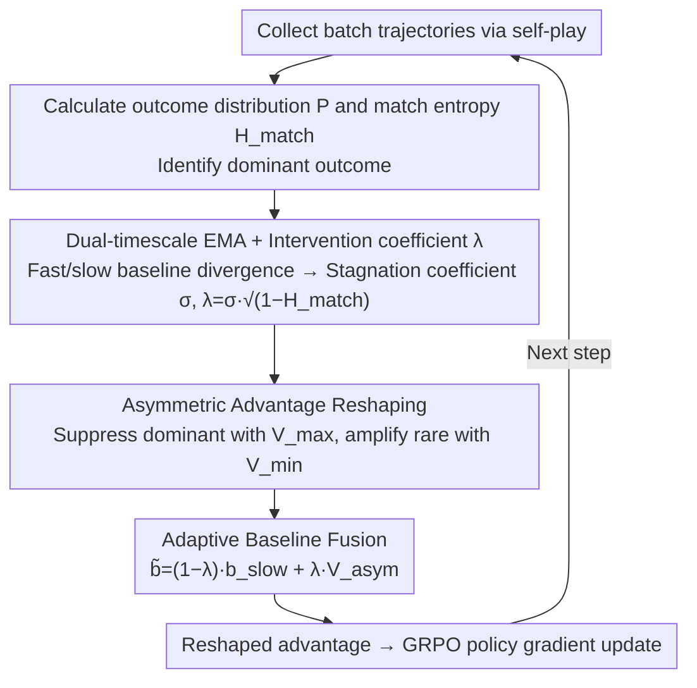

# Breaking the Impasse: Dual-Scale Evolutionary Policy Training for Social Language Agents

**Conference**: ACL 2026  
**arXiv**: [2605.08721](https://arxiv.org/abs/2605.08721)  
**Code**: TBD  
**Area**: Reinforcement Learning / Self-play RLVR / Social Language Agents  
**Keywords**: self-play RLVR, evolution impasse, dual-timescale baseline, asymmetric advantage, social games

## TL;DR
To address the "evolution impasse" in open-ended social language games (Negotiation / Don't Say It / Two Dollar Game) within self-play RLVR—where agent behavior homogenization leads to deterministic match outcome distributions and vanishing gradient signals—this paper proposes DEPT. It utilizes a fast/slow dual-timescale EMA baseline to detect stagnation and applies asymmetric advantage reshaping to suppress dominant outcomes while amplifying rare trajectories. This method boosts the negotiation win rate on Qwen3-4B/8B-Base from 16-20% to 32%, with simultaneous benefits observed on OOD math and reasoning benchmarks.

## Background & Motivation

**Background**: RLVR has been validated in closed-ended tasks like mathematics and coding (e.g., DeepSeek-R1 / Kimi K1.5). Extending it to multi-agent self-play to train social language capabilities is a natural progression (e.g., SPIRAL / MARS). The appeal of self-play lies in its automatic curriculum and the elimination of human-annotated data, theoretically allowing for infinite scaling under zero-shot conditions.

**Limitations of Prior Work**: The authors observed a failure mode when running standard self-play RLVR on Qwen3-4B-Base: while training rewards and game lengths increased (indicating mastery of game mechanics), the win rate against a fixed Gemini-2 opponent declined and stagnated at a sub-optimal level. Diagnostics revealed that match outcome distributions rapidly collapsed into determinism (e.g., always drawing or always losing), leading to match entropy $H_{match}^{(t)} \to 0$.

**Key Challenge**: When $H_{match}^{(t)} \to 0$, the value baseline $b_p$ converges to a constant $R_t$, causing the advantage $A_p(\tau) = R_p(\tau) - b_p \to 0$, which makes the policy gradient vanish. This mechanism locks the agent in a sub-optimal state. Given the vast strategy space of open-ended social language games (much larger than Tic-Tac-Toe or Kuhn Poker), agents cannot escape local optima through random exploration alone.

**Goal**: (1) Design a metric capable of "real-time detection of evolution impasses" to distinguish "true convergence to optimality" from "stagnation at sub-optimality"; (2) design an intervention mechanism to "restore gradient signals" and restart exploration without disrupting normal training dynamics.

**Key Insight**: Standard baselines (single-timescale EMA) are naturally reactive—they only track current expected returns and cannot distinguish between "stable optimality" and "stagnation." The authors introduce the divergence between dual-timescale baselines as a differential indicator of "training speed," which is combined with match entropy to determine "whether to intervene."

**Core Idea**: The divergence between the fast and slow EMA, multiplied by $1 - \text{match entropy}$, serves as an intervention coefficient $\lambda^{(t)}$ to dynamically switch the baseline. During normal training, a slow baseline (standard advantage) is used; when an impasse occurs, it switches to asymmetric values (suppressing dominant outcomes with $V_{max}$ and elevating rare outcomes with $V_{min}$), artificially injecting synthetic variance to restore gradients.

## Method

### Overall Architecture
DEPT maintains two fast/slow EMA baselines for each role $p \in \{0,1\}$ plus global $V_{max}/V_{min}$ historical bounds on top of GRPO/role-conditioned advantage estimation. Each training step includes: (1) collecting batch trajectories via self-play; (2) calculating the match outcome distribution $P = \{p_{win}, p_{draw}, p_{loss}\}$ and match entropy $H_{match}^{(t)}$ to identify the dominant outcome; (3) updating both baselines and calculating the stagnation coefficient $\sigma^{(t)}$ and intervention coefficient $\lambda^{(t)}$; (4) performing linear fusion of the slow baseline and asymmetric value using $\lambda^{(t)}$ to obtain the reshaped baseline $\tilde{b}_p(\tau)$; (5) updating the policy using the reshaped advantage via policy gradient.

### Key Designs

**1. Dual-timescale EMA + Intervention Coefficient $\lambda^{(t)}$: Detecting Impasses via Baseline Divergence**

The problem with a single EMA baseline is that it appears as a flat curve both when "stably converging to the optimum" and when "stuck at a sub-optimum." DEPT maintains two baselines: $b_p^{fast,t} = \alpha_{fast} b_p^{fast,t-1} + (1-\alpha_{fast}) R_p(\tau)$ and $b_p^{slow,t}$, with $\alpha_{fast} = 0.5 < \alpha_{slow} = 0.95$. The fast line tracks recent returns closely, while the slow line preserves long-term trends. Prop A.1 in the paper proves that the divergence between the two is proportional to the rate of change of expected returns $\mathbb{E}[|b_p^{fast} - b_p^{slow}|] \propto |d\mu/dt|$. Thus, divergence becomes a natural differential indicator of training speed: it is large when the agent is improving and approaches zero when improvement stops.

The stagnation coefficient is defined as $\sigma^{(t)} = 1 - \tanh(|b_p^{fast} - b_p^{slow}|)$, measuring "training stagnation." Combined with match entropy, the intervention coefficient is $\lambda^{(t)} = \sigma^{(t)} \cdot \sqrt{1 - H_{match}^{(t)}}$. $\lambda$ approaches 1 only when training stagnates and the outcome distribution collapses.

**2. Asymmetric Advantage Reshaping + Global Historical Bounds: Asymmetric Suppression and Amplification**

The root of an impasse is the baseline's convergence to the dominant return, causing the advantage of dominant samples to approach zero. Since rare samples are scarce, the total gradient vanishes. When $\lambda^{(t)} \to 1$, DEPT uses asymmetric target values to widen the advantage gap. Constant historical bounds $V_{max}^{(t)} = \max_{i \leq t} b_p^{fast,i}$ and $V_{min}^{(t)} = \min_{i \leq t} b_p^{fast,i}$ are maintained. The asymmetric value is defined as $V_{asym}(\tau, b_p^{fast}) = \mathbb{I}(o_\tau = o_{dom}) \cdot V_{max}^{(t)} + \mathbb{I}(o_\tau \neq o_{dom}) \cdot V_{min}^{(t)}$.

This creates a push-pull structure: the advantage of dominant trajectories ($R - V_{max}$) is strongly suppressed (often non-positive), while the advantage of rare trajectories ($R - V_{min}$) is maximized. Thm A.3 proves this is equivalent to injecting synthetic variance $\nu_{syn} \propto (V_{max} - V_{min})^2$ when natural variance vanishes, ensuring $\|\nabla J\| > 0$.

**3. Adaptive Baseline Fusion: Smooth Transition via Continuous Scalars**

Using a binary switch for intervention would cause the baseline to jump between values due to oscillations in $\sigma$, destabilizing training. DEPT uses $\lambda^{(t)}$ as a continuous weight for linear fusion: $\tilde{b}_p(\tau) = (1 - \lambda^{(t)}) \cdot b_p^{slow,(t)} + \lambda^{(t)} \cdot V_{asym}(\tau, b_p^{fast})$. When $\lambda \approx 0$, it reduces to the standard slow baseline; when $\lambda \to 1$, it is dominated by the asymmetric value.

### Loss & Training
The base loss is a self-play GRPO-style policy gradient $\nabla_\theta J(\theta) = \mathbb{E}_\tau [\sum_{p,t} \tilde{A}_p(\tau) \cdot \nabla_\theta \log \pi_\theta(y_t^{(p)} | o_t, p)]$, where $A_p$ is replaced by the reshaped $\tilde{A}_p = R_p - \tilde{b}_p$. A format reward enforces a reasoning-then-acting structure ($\langle \text{think} \rangle ... \langle \text{act} \rangle ...$). Rewards are $\{+1, -1, 0\}$ for win/lose/draw, with a -1.5 penalty for format errors. Parameters: $\alpha_{fast}=0.5, \alpha_{slow}=0.95$, training for 400 steps with a batch size of 128 and lr 1e-6.

## Key Experimental Results

### Main Results: Win Rates in Three Social Games (Avg. % vs. Three Evaluator Opponents)

| Backbone | Method | Don't Say It AVG | Negotiation AVG | Two Dollar AVG |
|----------|--------|------------------|------------------|----------------|
| Qwen3-4B | VANILLA | 3.39 | 1.04 | 1.56 |
| Qwen3-4B | SPAG | 26.17 | 16.76 | 25.52 |
| Qwen3-4B | GRPO | 42.01 | 19.21 | 27.91 |
| Qwen3-4B | MARS | 40.89 | 20.73 | 27.69 |
| Qwen3-4B | SPIRAL | 45.88 | 16.84 | 27.65 |
| Qwen3-4B | **DEPT (Ours)** | **56.73** | **32.35** | **34.07** |
| Qwen3-8B | VANILLA | 15.17 | 5.69 | 2.13 |
| Qwen3-8B | SPIRAL | 37.89 | 17.30 | 26.22 |
| Qwen3-8B | MARS | 40.62 | 16.10 | 29.04 |
| Qwen3-8B | **DEPT (Ours)** | **54.56** | **31.88** | **36.50** |

DEPT nearly doubles the performance on the Negotiation task—increasing from 16-17% (SPIRAL) to 32%, demonstrating the power of unlocking evolutionary impasses.

### OOD Reasoning Benchmarks (Zero-shot Transfer, AVG@16-32)

| Backbone | Method | Math500 | AIME24 | AIME25 | Olympiad | GPQA-D | MMLU-Pro | Average |
|----------|--------|---------|--------|--------|----------|--------|----------|---------|
| Qwen3-4B | VANILLA | 65.80 | 9.58 | 6.88 | 34.52 | 28.79 | 39.36 | 31.07 |
| Qwen3-4B | MARS | 69.25 | 9.41 | 8.47 | 35.18 | 34.01 | 53.34 | 35.59 |
| Qwen3-4B | SPIRAL | 67.95 | 9.55 | 7.81 | 34.15 | 34.18 | 51.32 | 34.73 |
| Qwen3-4B | **DEPT** | **74.64** | **11.22** | **10.03** | **38.79** | **37.04** | **56.45** | **38.68** |
| Qwen3-8B | **DEPT** | 74.98 | 13.06 | 12.43 | 40.83 | 38.72 | 57.60 | **41.21** |

OOD gains prove that DEPT learns generalizable reasoning capabilities rather than shortcuts for specific games.

### Ablation Study

| Configuration | Description |
|------|------|
| Full DEPT | Complete method |
| w/o Stagnation Coefficient | Frequent intervention during non-stationary phases distorts advantage estimation |
| w/o Match Entropy gating | Penalizes even when outcomes are diverse, forcing invalid exploration |
| w/o Asymmetric value | Fails to selectively suppress over-represented outcomes, stalls at low entropy sub-optima |
| w/o Dual-baseline | Both single-baseline versions underperform, proving synergy is necessary |

### Key Findings
- **Impasse is a specific failure mode of open-ended social games**: In Negotiation, win rates for SPIRAL/MARS actually decreased compared to the early training phase, suggesting that better adherence to a sub-optimal baseline can be detrimental.
- **Intervention Coefficient is an interpretable dynamic signal**: $\lambda$ stays near 0 early in training (healthy exploration) and rises to 0.5+ later (active intervention).
- **Hyperparameter Insensitivity**: Results are robust to $\alpha_{fast}$ in the range [0.4, 0.6].
- **Negligible Overhead**: Dual-baseline and reshaping add < 0.0016% to per-iteration training time.

## Highlights & Insights
- **Theoretical analysis of "Dual-scale divergence ≈ Training speed"**: The authors provide a rigorous proof in Appendix A.1 using EMA expansion and first-order Taylor approximation: $\mathbb{E}[|b_p^{fast} - b_p^{slow}|] \propto (\mathcal{T}_{slow} - \mathcal{T}_{fast}) |\dot\mu(t)|$.
- **Synthetic variance perspective on Asymmetric Push-Pull**: Reshaping is interpreted as injecting synthetic variance $\nu_{syn} \propto (V_{max} - V_{min})^2$ when natural variance $\nu(t) \to 0$. This "signal engineering" perspective is applicable to any sparse reward or mode collapse problem in RL.
- **OOD Math/Reasoning Gains**: The fact that social game self-play transfers to AIME/MATH500 supports the hypothesis that "game-based self-play elicits reasoning."

## Limitations & Future Work
- **Training Cost**: 30 hours on 8×A800 is still relatively expensive for academia.
- **Inference Latency**: The reasoning-then-acting template significantly slows down long-horizon tasks.
- **Zero-sum restrictiveness**: Only evaluated on two-player zero-sum games. Whether the intervention coefficient is well-defined in non-zero-sum scenarios remains an open question.
- **Opponent Diversification**: Training only against the current self might limit the performance ceiling compared to using historical checkpoints or populations.

## Related Work & Insights
- **vs SPIRAL (Liu et al. 2025a)**: While SPIRAL addresses role asymmetry, DEPT identifies the more fundamental "outcome distribution collapse."
- **vs MARS (Yuan et al. 2025)**: MARS uses turn-level advantages and role-specific normalization; DEPT is orthogonal and can be combined with these techniques.
- **vs Entropy Regularization**: Traditional entropy bonuses applied at the token level struggle with "outcome-level collapse." DEPT directly diagnoses and intervenes at the outcome distribution level.

## Rating
- Novelty: ⭐⭐⭐⭐⭐ "Evolution impasse" is formally characterized as a unique failure mode for open-ended self-play RLVR, and the dual-timescale diagnostic-intervention loop is novel.
- Experimental Thoroughness: ⭐⭐⭐⭐⭐ Extensive evaluation across multiple games, backbones, evaluators, and OOD benchmarks.
- Writing Quality: ⭐⭐⭐⭐ Clear narrative arc from problem diagnosis to theoretical grounding and empirical validation.
- Value: ⭐⭐⭐⭐⭐ Provides a generalizable toolset ("dual-timescale divergence + asymmetric reshaping") for all self-play RLVR tasks.

<!-- RELATED:START -->

## Related Papers

- [\[ICLR 2026\] Breaking Safety Paradox with Feasible Dual Policy Iteration](../../ICLR2026/reinforcement_learning/breaking_safety_paradox_with_feasible_dual_policy_iteration.md)
- [\[ACL 2026\] DPEPO: Diverse Parallel Exploration Policy Optimization for LLM-based Agents](dpepo_diverse_parallel_exploration_policy_optimization_for_llm-based_agents.md)
- [\[ICML 2026\] ALSO: Adversarial Online Strategy Optimization for Social Agents](../../ICML2026/reinforcement_learning/also_adversarial_online_strategy_optimization_for_social_agents.md)
- [\[ACL 2026\] d-TreeRPO: Towards More Reliable Policy Optimization for Diffusion Language Models](d-treerpo_towards_more_reliable_policy_optimization_for_diffusion_language_model.md)
- [\[ACL 2026\] The Stackelberg Speaker: Optimizing Persuasive Communication in Social Deduction Games](the_stackelberg_speaker_optimizing_persuasive_communication_in_social_deduction_.md)

<!-- RELATED:END -->
