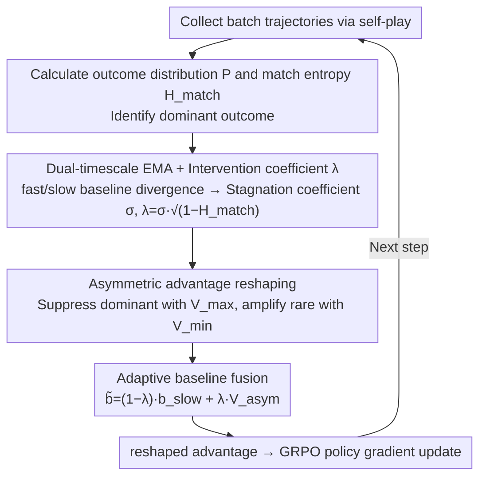

# Breaking the Impasse: Dual-Scale Evolutionary Policy Training for Social Language Agents

**Conference**: ACL 2026  
**arXiv**: [2605.08721](https://arxiv.org/abs/2605.08721)  
**Code**: To be confirmed  
**Area**: Reinforcement Learning / Self-play RLVR / Social Language Agent  
**Keywords**: self-play RLVR, evolution impasse, dual-timescale baseline, asymmetric advantage, social games

## TL;DR
Addressing the "evolutionary impasse" in open-ended social language games (Negotiation / Don't Say It / Two Dollar Game) where agent behavior homogenization leads to deterministic outcome distributions and vanishing gradient signals, this paper proposes DEPT. It utilizes a fast/slow dual-timescale EMA baseline to detect stagnation and applies asymmetric advantage reshaping to suppress dominant outcomes while amplifying rare trajectories. Evaluated on Qwen3-4B/8B-Base, it increases the negotiation win rate from 16-20% to 32% and concurrently benefits OOD math/reasoning benchmarks.

## Background & Motivation

**Background**: RLVR has been validated as effective in closed-ended tasks like mathematics and code (e.g., DeepSeek-R1 / Kimi K1.5). Extending it to multi-agent self-play to train social language capabilities is a natural progression (e.g., SPIRAL / MARS). The appeal of self-play lies in its automatic curriculum and the lack of need for human-annotated data, theoretically allowing for infinite scaling under zero-shot conditions.

**Limitations of Prior Work**: The authors observed a failure mode when running standard self-play RLVR on Qwen3-4B-Base: while training rewards and game lengths increased (indicating mastery of game mechanics), the win rate against a fixed Gemini-2 opponent decreased and plateaued at a sub-optimal level. Diagnosis revealed that the match outcome distribution rapidly collapsed into determinism (e.g., always drawing or always losing), with match entropy $H_{match}^{(t)} \to 0$.

**Key Challenge**: When $H_{match}^{(t)} \to 0$, the value baseline $b_p$ converges to a constant $R_t$, causing the advantage $A_p(\tau) = R_p(\tau) - b_p \to 0$, which leads to the disappearance of the policy gradient. This mechanism locks the agent in a sub-optimal state. Since the strategy space of open-ended social language games is vast (significantly larger than Tic-Tac-Toe or Kuhn Poker), agents cannot escape local optima through random exploration alone.

**Goal**: (1) Design a metric capable of "detecting evolutionary impasse in real-time" to distinguish between "true convergence to optimality" and "being stuck in sub-optimality"; (2) Design an intervention mechanism to "restore gradient signals" and restart exploration without disrupting normal training dynamics.

**Key Insight**: Standard baselines (single-timescale EMA) are naturally reactive—they only track the current expected return and cannot distinguish between "stable optimality" and "stagnation." The authors introduce the divergence of dual-timescale baselines as a differential indicator for "training speed," which is combined with match entropy to determine "whether to intervene."

**Core Idea**: Use the "divergence of fast EMA - slow EMA $\times$ (1 - match entropy)" as the intervention coefficient $\lambda^{(t)}$ to dynamically switch the baseline. During normal training, the slow baseline (standard advantage) is used. When an impasse is detected, the system switches to asymmetric values (suppressing dominant outcomes with $V_{max}$ and amplifying rare outcomes with $V_{min}$), manually injecting synthetic variance to restore gradients.

## Method

### Overall Architecture
DEPT maintains two fast/slow EMA baselines for each role $p \in \{0,1\}$ plus global $V_{max}/V_{min}$ historical bounds on top of GRPO/role-conditioned advantage estimation. Each training step includes: (1) self-play to collect a batch of trajectories; (2) calculating the match outcome distribution $P = \{p_{win}, p_{draw}, p_{loss}\}$ and match entropy $H_{match}^{(t)}$ to identify the dominant outcome; (3) updating the two baselines to calculate the stagnation coefficient $\sigma^{(t)}$ and intervention coefficient $\lambda^{(t)}$; (4) using $\lambda^{(t)}$ to linearly fuse the slow baseline with asymmetric values to obtain the reshaped baseline $\tilde{b}_p(\tau)$; (5) using the reshaped advantage for policy gradient updates, looping to the next step.

### Key Designs

**1. Dual-timescale EMA + Intervention Coefficient $\lambda^{(t)}$: Real-time identification of impasse using baseline divergence**

The problem with a single EMA baseline is that it appears as a flat curve whether the model has "stably converged to the optimum" or is "stuck in sub-optimality." The former should not be intervened with, while the latter must be. DEPT addresses this by maintaining two baselines: $b_p^{fast,t} = \alpha_{fast} b_p^{fast,t-1} + (1-\alpha_{fast}) R_p(\tau)$ and $b_p^{slow,t}$, with $\alpha_{fast} = 0.5 < \alpha_{slow} = 0.95$. The fast line closely tracks recent returns, while the slow line retains long-term trends. Proposition A.1 proves that the divergence between the two is proportional to the rate of change of the expected return $\mathbb{E}[|b_p^{fast} - b_p^{slow}|] \propto |d\mu/dt|$. Thus, divergence naturally serves as a differential indicator of "training speed": it is large when the baseline is flat but still improving rapidly, and shrinks to zero when the baseline is flat and no longer changing.

This leads to the stagnation coefficient $\sigma^{(t)} = 1 - \tanh(|b_p^{fast} - b_p^{slow}|)$ to measure "training stagnation." Combined with match entropy, the intervention coefficient is $\lambda^{(t)} = \sigma^{(t)} \cdot \sqrt{1 - H_{match}^{(t)}}$—$\lambda$ only approaches 1 when training is both stagnant and the outcome distribution has collapsed. Superimposing these two signals allows for precise identification of the impasse, avoiding false interventions during normal learning phases.

**2. Asymmetric Advantage Reshaping + Global Historical Bounds: Asymmetric suppression and amplification of dominant and rare outcomes**

The root of the impasse is that the baseline converges to the batch-averaged dominant return, causing the advantage of dominant samples to approach zero. Since rare samples are too infrequent, the total gradient vanishes. DEPT switches to asymmetric target values to manually widen the advantage gap between these two types of trajectories when $\lambda^{(t)} \to 1$. It maintains historical bounds $V_{max}^{(t)} = \max_{i \leq t} b_p^{fast,i}$ and $V_{min}^{(t)} = \min_{i \leq t} b_p^{fast,i}$ (specifically using the extremum-sensitive fast baseline) and defines $V_{asym}(\tau, b_p^{fast}) = \mathbb{I}(o_\tau = o_{dom}) \cdot V_{max}^{(t)} + \mathbb{I}(o_\tau \neq o_{dom}) \cdot V_{min}^{(t)}$.

Consequently, the advantage of dominant trajectories $R - V_{max}$ is consistently non-positive and strongly suppressed, while the advantage of rare trajectories $R - V_{min}$ is maximized and strongly amplified, creating a push-pull structure. Theorem A.3 proves that this is equivalent to injecting synthetic variance $\nu_{syn} \propto (V_{max} - V_{min})^2$ when natural variance disappears, ensuring $\|\nabla J\| > 0$ and "recreating" the missing gradient signal.

**3. Adaptive Baseline Fusion: Smooth transitions via a continuous scalar to avoid switching jitter**

Using a binary switch for intervention would cause $\sigma$ fluctuations to trigger jumps between baseline values, undermining training stability. DEPT uses $\lambda^{(t)}$ as a continuous weight to linearly fuse the two baselines: $\tilde{b}_p(\tau) = (1 - \lambda^{(t)}) \cdot b_p^{slow,(t)} + \lambda^{(t)} \cdot V_{asym}(\tau, b_p^{fast})$. When $\lambda$ is near 0, it reverts to the standard slow baseline for normal advantage; as $\lambda \to 1$, the asymmetric value dominates. The intervention intensity thus scales smoothly with the degree of stagnation.

### Loss & Training
The base loss is a self-play GRPO-style policy gradient $\nabla_\theta J(\theta) = \mathbb{E}_\tau [\sum_{p,t} \tilde{A}_p(\tau) \cdot \nabla_\theta \log \pi_\theta(y_t^{(p)} | o_t, p)]$, with the only modification being the replacement of $A_p$ with the reshaped $\tilde{A}_p = R_p - \tilde{b}_p$. A format reward enforces a reasoning-then-acting structure ($\langle \text{think} \rangle ... \langle \text{act} \rangle ...$); rewards are $\{+1, -1, 0\}$ for win/lose/draw, and -1.5 for format errors. Parameters include $\alpha_{fast}=0.5, \alpha_{slow}=0.95$. Training lasted 400 steps with a batch size of 128 and a learning rate of 1e-6, taking approximately 30 GPU-hours on 8×A800.

## Key Experimental Results

### Main Results: Win Rates in Three Social Games (Avg. win rate % vs. three evaluator opponents)

| Backbone | Method | Don't Say It AVG | Negotiation AVG | Two Dollar AVG |
|----------|--------|------------------|------------------|----------------|
| Qwen3-4B | VANILLA | 3.39 | 1.04 | 1.56 |
| Qwen3-4B | SPAG | 26.17 | 16.76 | 25.52 |
| Qwen3-4B | GRPO | 42.01 | 19.21 | 27.91 |
| Qwen3-4B | MARS | 40.89 | 20.73 | 27.69 |
| Qwen3-4B | SPIRAL | 45.88 | 16.84 | 27.65 |
| Qwen3-4B | **DEPT (Ours)** | **56.73** | **32.35** | **34.07** |
| Qwen3-8B | VANILLA | 15.17 | 5.69 | 2.13 |
| Qwen3-8B | SPIRAL | 37.89 | 17.30 | 26.22 |
| Qwen3-8B | MARS | 40.62 | 16.10 | 29.04 |
| Qwen3-8B | **DEPT (Ours)** | **54.56** | **31.88** | **36.50** |

In the Negotiation task, DEPT nearly doubled the win rate from SPIRAL's 16-17% to 32%, demonstrating the power of unlocking the impasse.

### OOD Reasoning Benchmarks (zero-shot transfer, AVG@16-32)

| Backbone | Method | Math500 | AIME24 | AIME25 | Olympiad | GPQA-D | MMLU-Pro | Average |
|----------|--------|---------|--------|--------|----------|--------|----------|---------|
| Qwen3-4B | VANILLA | 65.80 | 9.58 | 6.88 | 34.52 | 28.79 | 39.36 | 31.07 |
| Qwen3-4B | MARS | 69.25 | 9.41 | 8.47 | 35.18 | 34.01 | 53.34 | 35.59 |
| Qwen3-4B | SPIRAL | 67.95 | 9.55 | 7.81 | 34.15 | 34.18 | 51.32 | 34.73 |
| Qwen3-4B | **DEPT** | **74.64** | **11.22** | **10.03** | **38.79** | **37.04** | **56.45** | **38.68** |
| Qwen3-8B | **DEPT** | 74.98 | 13.06 | 12.43 | 40.83 | 38.72 | 57.60 | **41.21** |

OOD gains demonstrate that DEPT learns genuine, transferable reasoning capabilities rather than task-specific shortcuts.

### Ablation Study

| Configuration | Description |
|------|------|
| Full DEPT | Complete method |
| w/o Stagnation Coefficient | Continuous intervention during non-stationary phases confuses advantage estimation |
| w/o Match Entropy gating | Penalties applied even when outcomes are diverse, forcing invalid exploration |
| w/o Asymmetric value | Fails to selectively suppress over-represented outcomes, stuck in low-entropy sub-optimality |
| w/o Dual-baseline | Both single-baseline alternatives perform worse, proving necessity of synergy |

Performance drops in all ablation variants, proving the necessity of the four components.

### Key Findings
- **Impasse is a failure mode unique to open-ended social games**: In Negotiation, the win rates of SPIRAL/MARS actually declined compared to early training, showing that the stronger the baseline, the "more stuck" the model becomes—a phenomenon absent in closed-ended RL.
- **Intervention Coefficient is an interpretable dynamic signal**: Early in training, $\lambda$ is near 0 (healthy exploration), and later rises to 0.5+ (active intervention) as it adjusts adaptively to match entropy.
- **Hyperparameter $\alpha_{fast}$ is robust**: Macro-F1 remains stable within the range [0.4, 0.6], indicating that DEPT does not require fine-tuning of parameters.
- **Negligible extra overhead**: The dual-baseline + reshaping adds < 0.0016% to per-iteration training time.

## Highlights & Insights
- **Theoretical analysis of "dual-timescale divergence $\approx$ training speed differential"**: In Appendix A.1, the authors strictly prove using EMA expansion and first-order Taylor approximation that $\mathbb{E}[|b_p^{fast} - b_p^{slow}|] \propto (\mathcal{T}_{slow} - \mathcal{T}_{fast}) |\dot\mu(t)|$. This provides a mathematical basis for the "divergence = speed" intuition, which can be applied to other RL scenarios needing to distinguish stability from stagnation.
- **Asymmetric Push-Pull from a synthetic variance perspective**: Interpreting reshaping as injecting synthetic variance $\nu_{syn} \propto (V_{max} - V_{min})^2$ when natural variance $\nu(t) \to 0$. This "signal engineering" perspective is transferable to any RL problem involving sparse rewards or mode collapse.
- **OOD Math/Reasoning Gains**: The capability learned from game-based self-play transfers to AIME and MATH500, supporting the hypothesis that game-based self-play elicits reasoning. This is key evidence that DEPT is more than just a task-specific method.

## Limitations & Future Work
- **30 GPU-hour training cost**: 30 hours on 8×A800 remains expensive for some academic settings.
- **Reasoning-then-acting template increases inference latency**: Generating a chain-of-thought before every action significantly slows down long-horizon tasks.
- **Validated only on zero-sum two-player games**: N-player collaboration or mixed-motive scenarios remain untested; whether the intervention coefficient remains well-defined in non-zero-sum settings is an open question.
- **More complex timescales beyond fast/slow EMA**: Could multi-scale wavelet baselines or attention-based baselines further improve detection accuracy?
- **Lack of opponent diversification**: Self-play is strictly against the current self, without utilizing historical checkpoints or population-based training, which might limit the performance ceiling.

## Related Work & Insights
- **vs SPIRAL (Liu et al. 2025a)**: Both use self-play RLVR, but SPIRAL assumes role asymmetry is the primary issue. DEPT reveals the more fundamental problem of "outcome distribution collapse."
- **vs MARS (Yuan et al. 2025)**: MARS modifies GRPO with turn-level advantage and role-specific normalization; DEPT goes further at the advantage level by introducing dual-timescale and asymmetric reshaping, making the methods orthogonal and stackable.
- **vs SPAG (Cheng et al. 2024)**: SPAG utilizes offline RL and discounted rewards; DEPT employs online training and dynamic intervention, making it better suited for open-ended games.
- **vs General exploration techniques like entropy regularization**: Traditional entropy regularization adds bonuses to token-level entropy, which struggles to solve "outcome-level collapse." DEPT directly diagnoses and intervenes at the outcome distribution level, addressing the root cause.

## Rating
- Novelty: ⭐⭐⭐⭐⭐ "Evolutionary impasse" is formally characterized as a unique failure mode of open-ended self-play RLVR, and the combination of dual-timescale and asymmetric reshaping is a novel diagnosis-intervention loop.
- Experimental Thoroughness: ⭐⭐⭐⭐⭐ 3 games $\times$ 2 backbones $\times$ 3 evaluators + 6 OOD reasoning benchmarks + 3 OOD games + full ablation + theoretical analysis + significance testing.
- Writing Quality: ⭐⭐⭐⭐ Clear storyline (impasse $\to$ diagnosis $\to$ intervention $\to$ experiment $\to$ theory) with close alignment between mathematical formulas and empirical phenomena.
- Value: ⭐⭐⭐⭐⭐ Beyond solving social language games, "dual-timescale divergence + asymmetric reshaping" is a general tool applicable to all self-play RLVR tasks.

<!-- RELATED:START -->

## Related Papers

- [\[ICML 2026\] ALSO: Adversarial Online Strategy Optimization for Social Agents](../../ICML2026/reinforcement_learning/also_adversarial_online_strategy_optimization_for_social_agents.md)
- [\[ACL 2026\] DPEPO: Diverse Parallel Exploration Policy Optimization for LLM-based Agents](dpepo_diverse_parallel_exploration_policy_optimization_for_llm-based_agents.md)
- [\[ACL 2026\] d-TreeRPO: Towards More Reliable Policy Optimization for Diffusion Language Models](d-treerpo_towards_more_reliable_policy_optimization_for_diffusion_language_model.md)
- [\[ICLR 2026\] Breaking Barriers: Do Reinforcement Post Training Gains Transfer To Unseen Domains?](../../ICLR2026/reinforcement_learning/breaking_barriers_do_reinforcement_post_training_gains_transfer_to_unseen_domain.md)
- [\[ICLR 2026\] How Far Can Unsupervised RLVR Scale LLM Training?](../../ICLR2026/reinforcement_learning/how_far_can_unsupervised_rlvr_scale_llm_training.md)

<!-- RELATED:END -->
