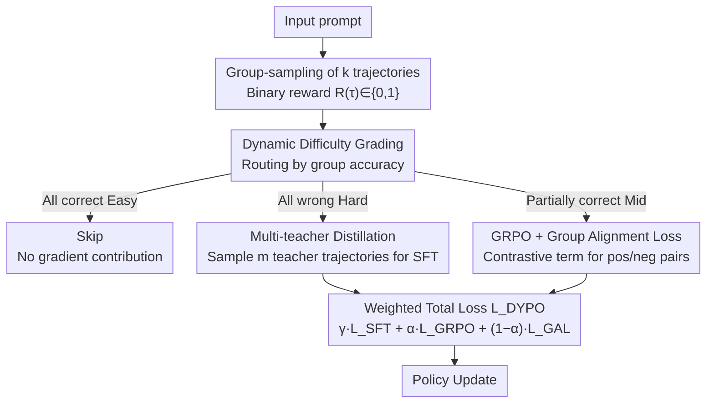

# Bridging SFT and RL: Dynamic Policy Optimization for Robust Reasoning

**Conference**: ACL 2026 Findings  
**arXiv**: [2604.08926](https://arxiv.org/abs/2604.08926)  
**Code**: [GitHub](https://github.com/Tocci-Zhu/DYPO)  
**Area**: Reinforcement Learning  
**Keywords**: SFT and RL integration, Bias-variance tradeoff, Dynamic difficulty grading, Multi-teacher distillation, Gradient variance reduction

## TL;DR
Ours proposes DYPO (Dynamic Policy Optimization), which routes samples to different optimization paths based on dynamic difficulty grading—Hard samples utilize multi-teacher distillation to reduce SFT bias, while Mid samples use Group Alignment Loss to reduce RL variance. This achieves an average gain of 4.8% on mathematical reasoning benchmarks and 13.3% on OOD tasks.

## Background & Motivation

**Background**: LLM post-training primarily follows SFT and RL routes. SFT is stable (low variance) but limited by fitting bias from static data; RL exhibits high exploration (low bias) but suffers from high gradient variance due to sampling randomness. The industry typically adopts a sequential "SFT→RL" pipeline.

**Limitations of Prior Work**: (1) SFT bias in sequential pipelines misleads subsequent RL exploration (bias propagation); (2) existing integration strategies (e.g., SuperRL, CHORD) only mix SFT and RL via simple loss weighting, ignoring the fundamental statistical conflicts between their gradient signals; (3) a uniform optimization strategy is applied to samples of varying difficulty—easy samples provide marginal signals, while hard samples suffer from extremely sparse rewards, leaving only medium-difficulty samples as the most informative.

**Key Challenge**: The statistical conflict between the high-bias, low-variance SFT gradients and the low-bias, high-variance RL gradients cannot be resolved by simple weighting due to multi-dimensional mismatch.

**Goal**: Propose a structured solution to simultaneously mitigate SFT fitting bias and RL gradient variance, achieving efficient and stable unified post-training.

**Key Insight**: From the theoretical perspective of bias-variance decomposition, samples of different difficulty levels require distinct optimization strategies—Hard samples require knowledge injection (SFT direction), Mid samples require reinforcement learning (RL direction), and Easy samples can be bypassed.

**Core Idea**: Dynamically categorize samples into Easy/Hard/Mid tiers based on group rollout results and route them to Skip/Multi-teacher distillation SFT/GAL-enhanced RL optimization paths, respectively.

## Method

### Overall Architecture
For each prompt, a group of $k$ trajectories is generated and categorized into Easy (all correct), Hard (all incorrect), or Mid (partially correct) based on accuracy. Easy samples are skipped; Hard samples utilize multi-teacher distillation for low-bias supervision; Mid samples employ a hybrid objective of GRPO+GAL for low-variance RL. Total loss: $\mathcal{L}_{DYPO} = \mathbb{I}_\mathcal{H} \cdot \gamma \mathcal{L}_{SFT} + \mathbb{I}_\mathcal{M} \cdot (\alpha \mathcal{L}_{GRPO} + (1-\alpha) \mathcal{L}_{GAL})$.

### Key Designs

**1. Dynamic Difficulty Grading: Routing samples to the most appropriate optimization path via rollout accuracy**

Uniform optimization strategies fail to handle disparate sample difficulties: easy samples have gradients approaching zero, wasting compute, while hard samples provide sparse reward signals, causing RL gradient variance to explode. DYPO does not use external classifiers or reward models; instead, it reuses group rollouts—sampling $k$ trajectories per query and evaluating each via binary rewards $R(\tau_i) \in \{0,1\}$.

Queries are routed into three paths: Easy (all correct) are skipped to avoid ineffective updates from saturated samples; Hard (all incorrect) are assigned to multi-teacher distillation to avoid blind RL exploration in the absence of positive examples; Mid (partially correct) are most informative and assigned to RL optimization. This routing is achieved with minimal overhead.

**2. Multi-Teacher Distillation: Eliminating idiosyncratic bias through teacher ensembles**

The fitting bias of single-teacher SFT is a root cause of restricted RL exploration—the student model inherits the teacher's bias. DYPO maintains an inference trajectory set from $m$ teacher models for Hard samples. When a Hard query is encountered, a trajectory is sampled from the ensemble as the SFT target.

Theoretically, a single teacher introduces bias $\|\mathbf{b}_{sys} + \mathbf{b}_i\|$. Assuming uncorrelated teacher biases, an ensemble of $m$ teachers reduces idiosyncratic bias to $\sigma_{bias}^2/m$. In practice, using DeepSeek-R1 and Qwen3-235B significantly lowers this bias, providing more reliable supervision for Hard samples.

**3. Group Alignment Loss (GAL): Adding a contrastive term with decaying variance for GRPO**

The gradient variance of GRPO, $\approx \Sigma_s/k$, is limited by the group size $k$. DYPO introduces an additional contrastive loss for Mid samples by pairing successful and failed trajectories within the same group using a DPO-style objective: $\mathcal{L}_{GAL} = -\log\sigma(\beta_{GAL} \cdot d(\tau_s, \tau_f))$. Unlike standard DPO, GAL uses on-policy rollouts rather than static preference data.

Variance reduction occurs because the gradient weight $w_d = 1 - \sigma(\beta_{GAL} d)$ is strictly bounded in $(0,1)$, while GRPO advantages $\hat{A}_i$ are unbounded. Furthermore, as the model learns to distinguish pairs ($\sigma \to 1$), GAL variance naturally decays to zero, acting as an adaptive regulator. The hybrid $Var(g_{mix}) < Var(g_{GRPO})$ stabilizes RL gradients without sacrificing low bias.

### Loss & Training
The total loss is a weighted combination based on graded routing. Hard samples: standard NLL loss for multi-teacher distillation (weight $\gamma$). Mid samples: $\alpha \cdot \mathcal{L}_{GRPO} + (1-\alpha) \cdot \mathcal{L}_{GAL}$. Sampling uses 8 trajectories per prompt, max response length 8192, learning rate $1 \times 10^{-6}$, trained via the verl framework on 2×8 A800 GPUs.

## Key Experimental Results

### Main Results (Qwen2.5-Math-7B)

| Benchmark | DYPO | SFT→RL | CHORD | SRFT | Gain (vs. strongest) |
|-----------|------|--------|-------|------|-------------|
| AIME 24 | 36.0 | 25.8 | 31.2 | 30.7 | +4.8 |
| AIME 25 | 28.7 | 23.1 | 24.4 | 26.0 | +2.7 |
| AMC | 67.0 | 62.7 | 66.8 | 69.8 | -2.8 |
| MATH-500 | 89.2 | 87.2 | 89.4 | 88.4 | -0.2 |
| ID Avg | 52.5 | 47.7 | 50.2 | 50.9 | +1.6 |
| ARC-c (OOD) | 81.8 | 72.4 | 81.1 | 81.6 | +0.2 |
| GPQA-D (OOD) | 41.4 | 24.2 | 40.4 | 40.4 | +1.0 |
| OOD Avg | 61.6 | 48.3 | 60.8 | 61.0 | +0.6 |

### Ablation Study

| Config | ID Avg | OOD Avg | Description |
|------|--------|---------|------|
| SFT only | 44.1 | 50.0 | High bias, low variance |
| RL only | 45.2 | 61.4 | Low bias, high variance |
| SFT→RL | 47.7 | 48.3 | Sequential pipeline |
| DYPO | 52.5 | 61.6 | Dynamic grading + dual mitigation |

### Key Findings
- DYPO outperformed the strongest baseline (SRFT) by +5.3 points and pure RL by +10.9 points on AIME 24, demonstrating that dynamic grading and GAL effectively mitigate RL instability.
- OOD generalization is prominent: a +16.7% improvement over the SFT baseline on GPQA-D proves that DYPO enhances reasoning strategies rather than merely memorizing templates.
- Cross-model generalization was validated on Qwen3-4B-Base (ID Avg +18.8% vs. SFT).

## Highlights & Insights
- **Bias-Variance Decomposition Perspective**: Analyzing the fundamental conflicts of SFT-RL integration via statistical learning theory provides deeper insights than engineering-led "simple weighting" schemes.
- **Adaptive Variance Decay of GAL**: As the model improves, GAL gradient variance naturally decays to zero, making it an "adaptive regularizer" rather than a fixed-weight auxiliary loss.
- **Simplicity of Dynamic Grading**: Classifying samples into Easy/Hard/Mid using only rollout accuracy eliminates the need for external classifiers or reward models, ensuring low implementation cost.

## Limitations & Future Work
- Dependency on binary rewards (correct/incorrect) limits direct applicability to partially correct open-ended generation tasks.
- Multi-teacher distillation requires inference trajectories from multiple strong models, increasing data preparation costs.
- The use of hard boundaries for Easy/Hard/Mid (all/none correct) might lose information from marginal samples.
- Evaluation was limited to mathematical reasoning; efficacy in NLP understanding, code, and other reasoning tasks remains to be confirmed.

## Related Work & Insights
- **vs. SuperRL**: While SuperRL performs binary switching between SFT and RL, DYPO utilizes instance-level routing and optimizes bias and variance separately.
- **vs. CHORD**: CHORD uses dynamic soft weights for objective mixing, but remains a uniform optimization; DYPO assigns completely different loss functions based on difficulty.
- **vs. LUFFY**: LUFFY integrates SFT+RL with a fixed mixing ratio; DYPO's dynamic grading allows for sample-adaptive hybrid strategies.

## Rating
- Novelty: ⭐⭐⭐⭐ The bias-variance analysis perspective is novel and GAL is elegantly designed, though dynamic grading itself is not entirely new.
- Experimental Thoroughness: ⭐⭐⭐⭐ Tested on 5 ID and 2 OOD benchmarks across two base models; however, lacks non-mathematical tasks.
- Writing Quality: ⭐⭐⭐⭐⭐ Rigorous theoretical analysis with complete derivation of the bias-variance decomposition and comprehensive experimental comparisons.

<!-- RELATED:START -->

## Related Papers

- [\[ACL 2026\] Visually-Guided Policy Optimization for Multimodal Reasoning](visually-guided_policy_optimization_for_multimodal_reasoning.md)
- [\[ACL 2026\] RL-PLUS: Countering Capability Boundary Collapse of LLMs in Reinforcement Learning with Hybrid-policy Optimization](rl-plus_countering_capability_boundary_collapse_of_llms_in_reinforcement_learnin.md)
- [\[ICLR 2026\] FAPO: Flawed-Aware Policy Optimization for Efficient and Reliable Reasoning](../../ICLR2026/reinforcement_learning/fapo_flawed-aware_policy_optimization_for_efficient_and_reliable_reasoning.md)
- [\[ICLR 2026\] RuleReasoner: Reinforced Rule-based Reasoning via Domain-aware Dynamic Sampling](../../ICLR2026/reinforcement_learning/rulereasoner_reinforced_rule-based_reasoning_via_domain-aware_dynamic_sampling.md)
- [\[ICLR 2026\] Thinking on the Fly: Test-Time Reasoning Enhancement via Latent Thought Policy Optimization](../../ICLR2026/reinforcement_learning/thinking_on_the_fly_test-time_reasoning_enhancement_via_latent_thought_policy_op.md)

<!-- RELATED:END -->
