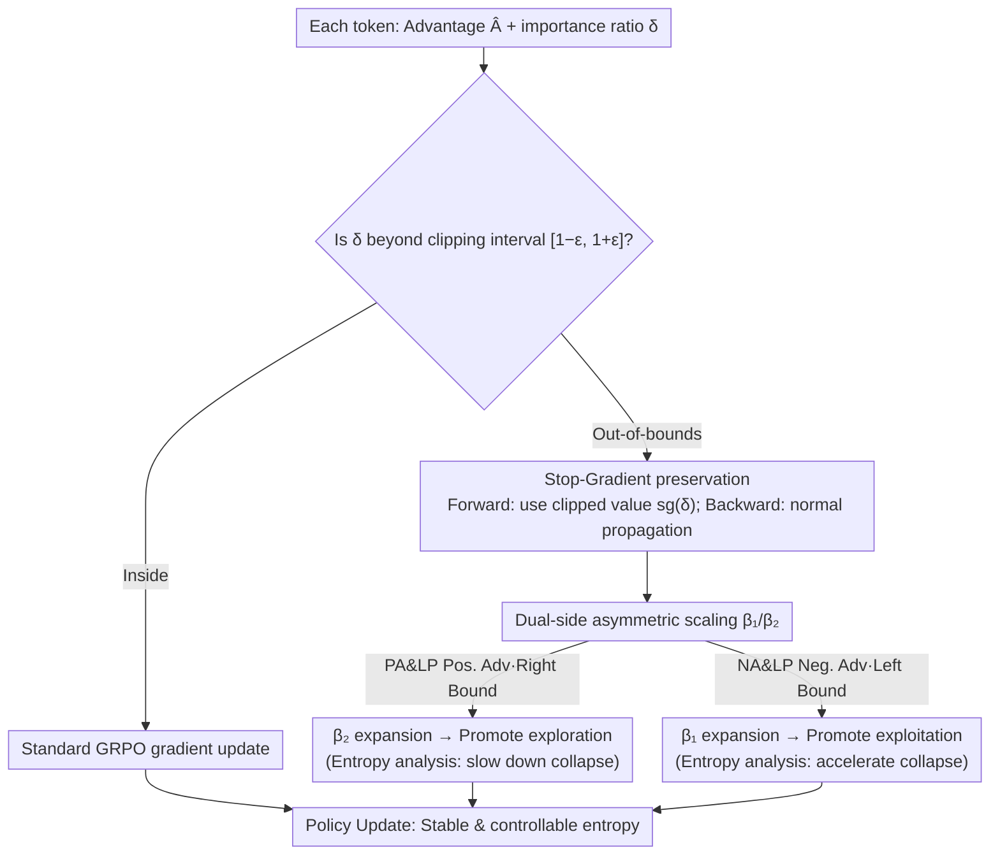

# CE-GPPO: Coordinating Entropy via Gradient-Preserving Clipping Policy Optimization in Reinforcement Learning

**Conference**: ACL 2026  
**arXiv**: [2509.20712](https://arxiv.org/abs/2509.20712)  
**Code**: None  
**Area**: Reinforcement Learning  
**Keywords**: Policy Optimization, Entropy Dynamic Control, Gradient Preservation, PPO Improvements, Mathematical Reasoning

## TL;DR

Proposes the CE-GPPO algorithm, which re-introduces gradient signals from low-probability tokens outside the PPO clipping range through a stop-gradient operation. This achieves fine-grained coordinated control of policy entropy and a better balance between exploration and exploitation.

## Background & Motivation

**Background**: Reinforcement Learning (RL) has become a core paradigm for optimizing LLM reasoning capabilities, with PPO and its variants (GRPO, DAPO) being widely used.

**Limitations of Prior Work**: The clipping mechanism in PPO discards gradient signals for low-probability tokens, leading to two types of problems: (1) PA&LP (Positive Advantage & Low Probability) tokens are clipped, leading to entropy collapse; (2) NA&LP (Negative Advantage & Low Probability) tokens are clipped, leading to entropy explosion.

**Key Challenge**: The clip-higher strategy in DAPO only alleviates upper-bound clipping (preventing entropy collapse) but is powerless against lower-bound clipping (preventing entropy explosion), leading to over-exploration in early training stages.

**Goal**: Achieve stable and controllable evolution of policy entropy by uniformly managing token gradients on both sides of the clipping interval.

**Key Insight**: Redefining entropy dynamic control as a management problem of gradients for tokens outside the clipping interval.

**Core Idea**: Decouple forward and backward propagation through stop-gradient, using adjustable coefficients $\beta_1$ and $\beta_2$ to respectively control the magnitude of gradients beyond the left and right clipping boundaries, thereby finely tuning the rhythm of entropy fluctuations.

## Method

### Overall Architecture

Based on GRPO, CE-GPPO no longer completely discards gradients for tokens outside the clipping interval but re-introduces them in a controlled manner. For PA&LP tokens (right-side out-of-bounds, positive advantage), $\beta_2$ is used for amplification to promote exploration; for NA&LP tokens (left-side out-of-bounds, negative advantage), $\beta_1$ is used for amplification to promote exploitation. When $\beta_1 = \beta_2 = 0$, the method degrades to standard PPO.

### Key Designs

**1. Stop-Gradient mechanism: Clipping for forward pass while preserving backward gradients**

PPO clipping discards the entire gradient of out-of-bounds tokens. However, directly removing clipping for these tokens causes large policy shifts and training instability. CE-GPPO finds a balance using stop-gradient: applying $\text{sg}(\delta)$ to the importance ratio $\delta$ for out-of-bounds tokens ensures the forward pass uses the clipped value (maintaining stability), while the backward pass allows gradients to flow normally, scaled by a coefficient. 

This keeps gradient magnitudes strictly within the $\beta \cdot (1 \pm \epsilon)$ range—re-incorporating signals from discarded low-probability tokens without pushing the policy too far.

**2. Asymmetric Gradient Scaling ($\beta_1 / \beta_2$): Independent control of exploration and exploitation**

Out-of-bounds tokens on different sides of the interval represent distinct meanings: clipped PA&LP (Positive Advantage, Low Probability) tokens on the right cause entropy collapse, while clipped NA&LP (Negative Advantage, Low Probability) tokens on the left cause entropy explosion. Handling them with a single coefficient fails to manage bidirectional entropy drift. CE-GPPO assigns independent coefficients: $\beta_2$ amplifies PA&LP gradients to promote exploration, and $\beta_1$ amplifies NA&LP gradients to promote exploitation.

These two independent knobs allow fine-tuning of entropy rhythms. Experiments show $\beta_2 > \beta_1$ better maintains exploration; for instance, $\beta_1=0.75, \beta_2=1$ is optimal for 7B models. When $\beta_1=\beta_2=0$, the method reverts to standard PPO.

**3. Theoretical Entropy Dynamics: Transitioning from empirical observation to theory**

The effectiveness of the first two designs requires an explanation beyond hyperparameter tuning. The authors prove, based on the entropy change formula (covariance between policy probability and advantage functions), that PA&LP tokens slow down entropy reduction (promoting exploration), while NA&LP tokens accelerate it (promoting exploitation). 

This analysis clarifies how amplifying gradients on either side affects entropy, providing a theoretical basis for selecting $\beta_1 / \beta_2$: increase $\beta_2$ to preserve entropy or increase $\beta_1$ to accelerate convergence.

### Loss & Training

The objective function modifies the GRPO loss into a three-branch structure: out-of-bounds negative advantage $\rightarrow \beta_1 \cdot (1-\epsilon)/\text{sg}(\delta) \cdot \delta \cdot \hat{A}$; out-of-bounds positive advantage $\rightarrow \beta_2 \cdot (1+\epsilon)/\text{sg}(\delta) \cdot \delta \cdot \hat{A}$; others remain unchanged. Training uses the KlearReasoner-MathSub-30K dataset, $lr=1e-6$, $rollout=8$, $\epsilon=0.2$, for a maximum of 1000 steps (~10 epochs).

## Key Experimental Results

### Main Results

| Method | AIME24 | AIME25 | HMMT25 | MATH500 | AMC23 | HumanEval | LCB v6 |
|------|--------|--------|--------|---------|-------|-----------|--------|
| DS-R1-1.5B (base) | 29.2 | 24.1 | 13.1 | 86.0 | 73.7 | 70.4 | 25.1 |
| + GRPO | 33.4 | 28.1 | 16.6 | 88.3 | 79.3 | 67.5 | 27.1 |
| + DAPO | 40.0 | 28.4 | 19.2 | 90.0 | 84.4 | 73.2 | 30.5 |
| + CE-GPPO ($\beta_1$=0.5) | 42.0 | 33.9 | 21.6 | 91.0 | 85.9 | 76.5 | 31.7 |
| DS-R1-7B (base) | 54.5 | 39.1 | 26.2 | 93.6 | 90.6 | 89.6 | 49.0 |
| + GRPO | 55.3 | 40.3 | 24.5 | 93.7 | 88.8 | 88.6 | 49.2 |
| + DAPO | 59.7 | 48.7 | 25.6 | 95.1 | 93.4 | 92.5 | 52.2 |
| + CE-GPPO ($\beta_1$=0.75) | **66.0** | **51.4** | **30.5** | **95.6** | **93.8** | **93.0** | **53.6** |

### Ablation Study

| $\beta_1/\beta_2$ Config | Entropy Trend | 1.5B AIME24 | 7B AIME25 |
|------------|--------|-------------|-----------|
| $\beta_1=1, \beta_2=0.5$ | Rapid collapse | Performance rise then drop | — |
| $\beta_1=0, \beta_2=1$ | Consistent rise | Good | Unstable |
| $\beta_1=0.5, \beta_2=1$ | High stability | 42.0 | 49.1 |
| $\beta_1=0.75, \beta_2=1$ | Slow decline | 43.6 | **51.4** |

### Key Findings

- GRPO suffers from severe entropy collapse; while DAPO mitigates this, it exhibits excessive entropy in early training (over-exploration).
- CE-GPPO maintains steady entropy throughout training, with no abnormal fluctuations in KL divergence or gradient norms.
- Larger $\beta_2$ (amplifying exploration gradients) combined with moderate $\beta_1$ (limiting exploitation gradients) favors performance; $\beta_1=0.75, \beta_2=1$ is the recommended default.
- Comparison with CISPO: CISPO experiences model collapse in late-stage training, whereas CE-GPPO remains stable. CE-GPPO significantly outperforms GSPO on AIME25/HMMT25.

## Highlights & Insights

- Systematically explains entropy dynamics in RL through the interaction between token probability and advantage functions, providing a novel and profound perspective.
- Clever stop-gradient design: maintains clipping stability in the forward pass while recovering gradient information in the backward pass.
- Highly efficient and concise: only involves element-wise re-weighting of the loss, with no extra forward passes or auxiliary modules required.
- Robust to hyperparameters: configurations like $\beta_1=0.5, \beta_2=1$ or $\beta_1=0.75, \beta_2=1$ are effective across different model scales.

## Limitations & Future Work

- While robust, the optimal $\beta_1/\beta_2$ values may still require fine-tuning for different models.
- Validated primarily on mathematical reasoning tasks; generalization to code generation or instruction following needs further investigation.
- Although claimed to be complementary to GSPO, joint tests within the same framework were not conducted.
- Optimal entropy trajectories may vary by task/model; an adaptive adjustment mechanism represents an important future direction.

## Related Work & Insights

- Relationship with DAPO: DAPO only addresses upper-bound clipping; CE-GPPO provides a more complete solution by handling both sides.
- Comparison with entropy regularization: Traditional entropy regularization is highly sensitive to coefficients (e.g., $\alpha=0.001$ is ineffective, $\alpha=0.003$ causes explosion), whereas CE-GPPO is more stable.
- Kimi K2 training experience (early exploration + late exploitation) aligns with this paper's findings, and can be implemented via phased $\beta$ adjustment.

## Rating

- Novelty: ⭐⭐⭐⭐ Unique perspective on entropy control via out-of-bounds gradients with theoretical support.
- Experimental Thoroughness: ⭐⭐⭐⭐ Tested across various model scales, multiple baselines, and detailed hyperparameter/stability analysis.
- Writing Quality: ⭐⭐⭐⭐ Rigorous logic from problem analysis to method design, supported by intuitive charts.

<!-- RELATED:START -->

## Related Papers

- [\[ICLR 2026\] Entropy-Preserving Reinforcement Learning (REPO / ADAPO)](../../ICLR2026/reinforcement_learning/entropy-preserving_reinforcement_learning.md)
- [\[ACL 2026\] RL-PLUS: Countering Capability Boundary Collapse of LLMs in Reinforcement Learning with Hybrid-policy Optimization](rl-plus_countering_capability_boundary_collapse_of_llms_in_reinforcement_learnin.md)
- [\[ACL 2026\] DPEPO: Diverse Parallel Exploration Policy Optimization for LLM-based Agents](dpepo_diverse_parallel_exploration_policy_optimization_for_llm-based_agents.md)
- [\[ACL 2026\] d-TreeRPO: Towards More Reliable Policy Optimization for Diffusion Language Models](d-treerpo_towards_more_reliable_policy_optimization_for_diffusion_language_model.md)
- [\[ICLR 2026\] Exploration vs Exploitation: Rethinking RLVR through Clipping, Entropy, and Spurious Reward](../../ICLR2026/reinforcement_learning/exploration_vs_exploitation_rethinking_rlvr_through_clipping_entropy_and_spuriou.md)

<!-- RELATED:END -->
