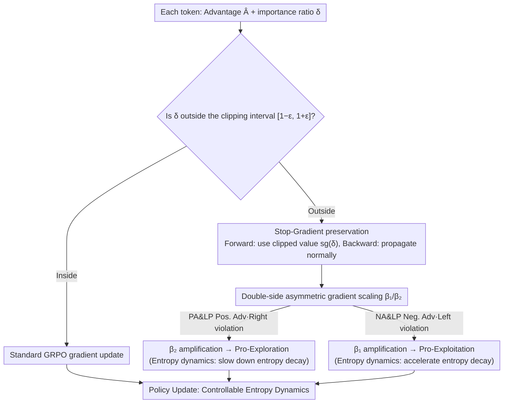

# CE-GPPO: Coordinating Entropy via Gradient-Preserving Clipping Policy Optimization in Reinforcement Learning

**Conference**: ACL 2026  
**arXiv**: [2509.20712](https://arxiv.org/abs/2509.20712)  
**Code**: None  
**Area**: Reinforcement Learning  
**Keywords**: Policy Optimization, Entropy Dynamic Control, Gradient Preservation, PPO Improvement, Mathematical Reasoning

## TL;DR

The CE-GPPO algorithm is proposed. By reintroducing gradient signals for low-probability tokens outside the PPO clipping interval through stop-gradient operations, it achieves fine-grained coordinated control of policy entropy and attains a better balance between exploration and exploitation.

## Background & Motivation

**Background**: Reinforcement Learning (RL) has become the core paradigm for optimizing the reasoning capabilities of LLMs, with PPO and its variants (GRPO, DAPO) being widely used.

**Limitations of Prior Work**: The clipping mechanism in PPO discards gradient signals of low-probability tokens, leading to two categories of problems: (1) PA&LP (Positive Advantage & Low Probability) tokens are clipped $\rightarrow$ entropy collapse; (2) NA&LP (Negative Advantage & Low Probability) tokens are clipped $\rightarrow$ entropy explosion.

**Key Challenge**: The clip-higher strategy in DAPO only mitigates upper-bound clipping (preventing entropy collapse) but is ineffective against lower-bound clipping (preventing entropy explosion), resulting in over-exploration during early training stages.

**Goal**: Achieve stable and controllable evolution of policy entropy by unifying the management of token gradients on both sides of the clipping interval.

**Key Insight**: Redefine entropy dynamic control as a management problem of gradients for tokens located outside the clipping interval.

**Core Idea**: Decouple forward and backward propagation via stop-gradient, using adjustable coefficients $\beta_1/\beta_2$ to controlled the magnitude of gradients beyond the left and right clipping boundaries respectively, thereby finely regulating the rhythm of entropy changes.

## Method

### Overall Architecture

Compared to GRPO, CE-GPPO no longer completely discards gradients for tokens outside the clipping interval but reintroduces them in a controlled manner. $\beta_2$ is used to amplify the gradients of PA&LP tokens (right-side violation, positive advantage) to promote exploration; $\beta_1$ is used to amplify the gradients of NA&LP tokens (left-side violation, negative advantage) to promote exploitation. When $\beta_1=\beta_2=0$, the method degenerates into standard PPO.

### Key Designs

**1. Stop-Gradient Gradient Preservation: Clipping values forward, preserving gradients backward**

PPO clipping discards the entire gradient for out-of-bounds tokens. However, directly removing clipping and allowing full updates leads to large policy shifts and training instability. CE-GPPO finds a balance using stop-gradient: applying $\mathrm{sg}(\delta)$ to the importance ratio $\delta$ of out-of-bounds tokens ensures the forward pass uses the clipped value (maintaining stability), while the backward pass allows gradients to flow normally, multiplied by a scaling coefficient. This keeps gradient magnitudes within the $\beta \cdot (1 \pm \varepsilon)$ range—reincorporating signals from discarded low-probability tokens without pushing the policy too far.

**2. Dual-side Asymmetric Gradient Scaling ($\beta_1$ / $\beta_2$): Independent control of exploration and exploitation intensity**

Tokens violating different sides of the clipping interval have distinct meanings: PA&LP (Positive Advantage & Low Probability) tokens on the right cause entropy collapse when clipped, while NA&LP (Negative Advantage & Low Probability) tokens on the left cause entropy explosion. Using a single coefficient cannot manage this bidirectional drift. CE-GPPO assigns independent coefficients: $\beta_2$ amplifies PA&LP gradients to promote exploration, and $\beta_1$ amplifies NA&LP gradients to promote exploitation. Experiments suggest $\beta_2 > \beta_1$ is better for maintaining exploration; e.g., $\beta_1=0.75, \beta_2=1$ works best for 7B models.

**3. Entropy Dynamic Theoretical Analysis: Advancing from empirical observation to theory**

The authors prove via entropy change formulas (covariance of policy probability and advantage functions) how PA&LP tokens slow down entropy decay (promoting exploration) and NA&LP tokens accelerate it (promoting exploitation). This analysis clarifies how amplifying specific gradients affects entropy, providing a theoretical basis for selecting $\beta_1$ / $\beta_2$ instead of relying on trial and error.

### Loss & Training

The objective function modifies the three-branch loss based on GRPO: Outside negative advantage $\rightarrow \beta_1 \cdot (1-\varepsilon)/\mathrm{sg}(\delta) \cdot \delta \cdot \hat{A}$; Outside positive advantage $\rightarrow \beta_2 \cdot (1+\varepsilon)/\mathrm{sg}(\delta) \cdot \delta \cdot \hat{A}$; others remain unchanged. Training uses the KlearReasoner-MathSub-30K dataset, lr=1e-6, rollout=8, ε=0.2, max 1000 steps (~10 epochs).

## Key Experimental Results

### Main Results

| Method | AIME24 | AIME25 | HMMT25 | MATH500 | AMC23 | HumanEval | LCB v6 |
|------|--------|--------|--------|---------|-------|-----------|--------|
| DS-R1-1.5B (base) | 29.2 | 24.1 | 13.1 | 86.0 | 73.7 | 70.4 | 25.1 |
| + GRPO | 33.4 | 28.1 | 16.6 | 88.3 | 79.3 | 67.5 | 27.1 |
| + DAPO | 40.0 | 28.4 | 19.2 | 90.0 | 84.4 | 73.2 | 30.5 |
| + CE-GPPO ($\beta_1$=0.5) | 42.0 | 33.9 | 21.6 | 91.0 | 85.9 | 76.5 | 31.7 |
| DS-R1-7B (base) | 54.5 | 39.1 | 26.2 | 93.6 | 90.6 | 89.6 | 49.0 |
| + GRPO | 55.3 | 40.3 | 24.5 | 93.7 | 88.8 | 88.6 | 49.2 |
| + DAPO | 59.7 | 48.7 | 25.6 | 95.1 | 93.4 | 92.5 | 52.2 |
| + CE-GPPO ($\beta_1$=0.75) | **66.0** | **51.4** | **30.5** | **95.6** | **93.8** | **93.0** | **53.6** |

### Ablation Study

| $\beta_1/\beta_2$ Configuration | Entropy Trend | 1.5B AIME24 | 7B AIME25 |
|------------|--------|-------------|-----------|
| $\beta_1=1, \beta_2=0.5$ | Fast collapse | Performance peaks then drops | — |
| $\beta_1=0, \beta_2=1$ | Continuous rise | Good | Unstable |
| $\beta_1=0.5, \beta_2=1$ | Stable high | 42.0 | 49.1 |
| $\beta_1=0.75, \beta_2=1$ | Slow decay | 43.6 | **51.4** |

### Key Findings

- GRPO suffers from severe inherent entropy collapse; DAPO mitigates this but shows excessive entropy (over-exploration) in early training.
- CE-GPPO maintains stable entropy throughout training, with no abnormal fluctuations in KL divergence or gradient norms.
- Larger $\beta_2$ (amplifying exploration gradients) + smaller $\beta_1$ (restricting exploitation gradients) favors performance; $\beta_1=0.75, \beta_2=1$ is the recommended default.
- Comparison with CISPO: CISPO suffers from model collapse in late training, while CE-GPPO remains stable. Comparison with GSPO: CE-GPPO significantly outperforms GSPO on AIME25/HMMT25.

## Highlights & Insights

- Systematically explains entropy dynamics in RL training from the perspective of token probability-advantage interaction, providing a novel and profound viewpoint.
- The stop-gradient design is ingenious: it maintains clipping stability in the forward pass while recovering gradient information in the backward pass.
- Highly efficient and concise: only changes element-wise reweighting of the loss, without additional forward passes or auxiliary modules.
- Good robustness to hyperparameters: $\beta_1=0.5, \beta_2=1$ and $\beta_1=0.75, \beta_2=1$ are effective across different model scales.

## Limitations & Future Work

- While hyperparameter robustness is shown, the optimal $\beta_1/\beta_2$ for different models may still require tuning.
- Validated only on mathematical reasoning tasks; generalization to code generation or instruction following remains to be explored.
- Claims to be complementary to GSPO, but was not tested within the same framework.
- The optimal entropy trajectory may vary by task/model; adaptive adjustment mechanisms are an important future direction.

## Related Work & Insights

- Relationship with DAPO (clip-higher): DAPO only addresses upper-bound clipping, while CE-GPPO handles both sides, providing a more complete solution.
- Comparison with entropy regularization: Traditional entropy regularization is extremely sensitive to coefficients ($\alpha=0.001$ is ineffective, $\alpha=0.003$ causes explosion); CE-GPPO is more stable.
- Kimi K2 training experiences (early exploration + late exploitation) are consistent with the findings here, which can be implemented by phase-based $\beta$ adjustments.

## Rating

- Novelty: ⭐⭐⭐⭐ Unique perspective on entropy control via gradients of out-of-bounds tokens with theoretical support.
- Experimental Thoroughness: ⭐⭐⭐⭐ Multi-scale models, multiple baseline comparisons, detailed hyperparameter analysis, and stability verification.
- Writing Quality: ⭐⭐⭐⭐ Rigorous logic from problem analysis to method design, with intuitive and rich visualizations.

<!-- RELATED:START -->

## Related Papers

- [\[ICLR 2026\] Entropy-Preserving Reinforcement Learning (REPO / ADAPO)](../../ICLR2026/reinforcement_learning/entropy-preserving_reinforcement_learning.md)
- [\[ICLR 2026\] BAPO: Stabilizing Off-Policy Reinforcement Learning for LLMs via Balanced Policy Optimization with Adaptive Clipping](../../ICLR2026/reinforcement_learning/bapo_stabilizing_off-policy_reinforcement_learning_for_llms_via_balanced_policy_.md)
- [\[ICLR 2026\] Relative Entropy Pathwise Policy Optimization](../../ICLR2026/reinforcement_learning/relative_entropy_pathwise_policy_optimization.md)
- [\[ACL 2026\] RL-PLUS: Countering Capability Boundary Collapse of LLMs in Reinforcement Learning with Hybrid-policy Optimization](rl-plus_countering_capability_boundary_collapse_of_llms_in_reinforcement_learnin.md)
- [\[ICLR 2026\] Exploration vs Exploitation: Rethinking RLVR through Clipping, Entropy, and Spurious Reward](../../ICLR2026/reinforcement_learning/exploration_vs_exploitation_rethinking_rlvr_through_clipping_entropy_and_spuriou.md)

<!-- RELATED:END -->
