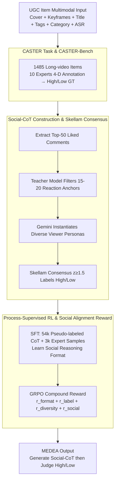

# Community-Aware Assessment of Social Textual Engagement and Resonance: A Human-Centric Perspective on User-Generated Content Evaluation

**Conference**: ACL2026  
**arXiv**: [2606.01897](https://arxiv.org/abs/2606.01897)  
**Code**: TBD  
**Area**: Multimodal Evaluation / RL Alignment  
**Keywords**: UGC Quality Assessment, Social-CoT, Community Resonance, GRPO, Multimodal Reasoning

## TL;DR
This paper introduces the CASTER task and CASTER-Bench, and proposes MEDEA which simulates community reactions through Social-CoT, SFT, and process-supervised Reinforcement Learning (RL) with Social Alignment Reward. MEDEA improves High-Quality F1 to 0.650 and Macro-F1 to 0.749 on CASTER-Bench, significantly outperforming traditional VQA and general LMM baselines.

## Background & Motivation
**Background**: Traditional video quality assessment (VQA) primarily measures clarity, distortion, aesthetics, and technical quality. Recently, Large Multimodal Models (LMMs) have been applied to UGC quality estimation, but most still treat textual information as static features or use standard CoT for logical analysis.

**Limitations of Prior Work**: "Good content" on real-world UGC platforms is not determined solely by image quality. A video might have mediocre technical quality but receive strong positive feedback due to its narrative, emotional resonance, knowledge value, or community culture. Conversely, high-view items might gain traffic through clickbait, vulgarity, or induced comments. Relying only on visual signals or general multimodal reasoning makes it difficult to distinguish between content that "looks good" and content that "truly resonates positively with the community."

**Key Challenge**: Platforms must judge the intrinsic quality of content during early recommendation and moderation stages, yet newly uploaded content often lacks sufficient comments. Models must infer potential community reactions from covers, keyframes, titles, tags, ASR, and metadata. This requires the model to possess social reasoning similar to Theory of Mind, rather than just signal quality regression.

**Goal**: The authors propose CASTER, redefining UGC quality assessment as "whether content achieves positive community resonance." To this end, they construct CASTER-Bench and propose MEDEA, which simulates diverse viewer personas via Social-CoT then aggregates them into a final High/Low quality judgment.

**Key Insight**: Instead of making the model directly output a binary classification, the authors require it to generate multiple "community comment-style" empathetic reasoning paths. During training, these paths are constrained by real high-interaction comments and expert labels, enabling the model to learn judgment standards closer to real community perception.

**Core Idea**: Use Social-CoT to explicitly simulate the "community mind," then align the generated social reasoning paths with real user comments via Social Alignment Reward, shifting UGC quality assessment from image quality judgment to community resonance modeling.

## Method

### Overall Architecture
The paper presents two core contributions. The first is CASTER-Bench, containing 1,485 long-video UGC items across 30 major categories. Each item includes multimodal inputs such as video frames, covers, titles, tags, categories, and ASR transcripts, annotated by 10 professional content experts across four dimensions: Production Quality, Perceived Value, Information Utility, and Narrative Excellence. The second is MEDEA, a multimodal assessment framework. It first mines Social-CoT training data from community comments, uses SFT to learn social reasoning formats, and finally optimizes the reasoning process via GRPO and Social Alignment Reward. The overall pipeline follows three key designs: expert ground truth provided by CASTER-Bench, supervisable social reasoning paths constructed from comments, and process-supervised RL to align the model with real community judgments.

### Key Designs

**1. CASTER Task and CASTER-Bench: Shifting Quality Assessment from Image Quality to Community Resonance**

Most traditional VQA datasets consist of 8–20 second short clips, which only measure signal quality like clarity and aesthetics. They fail to cover the value sources of long videos, such as narrative, knowledge density, and emotional resonance. CASTER redefines the task: given textual and visual metadata, the model predicts whether content can achieve positive community feedback (High-Quality) rather than regressing a technical quality score. CASTER-Bench contains 1,485 items with an average duration of 442 seconds. The label distribution is Excellent (10.6%), Good (17.0%), Average (38.6%), and Poor (33.7%), making the High-Quality class naturally sparse, which underscores the importance of the High-Quality F1 metric.

**2. Social-CoT Construction and Skellam Consensus Aggregation: Creating Supervisable Social Reasoning Paths from Real Comments**

To train a model to "simulate how the community thinks," supervision signals from community reactions are required. The system takes top-50 liked comments from unlabeled UGC, uses a teacher model to filter 15–20 reaction anchors related to creativity, emotion, or narrative, and then uses Gemini-2.5-Flash to instantiate diverse viewer personas explaining which elements triggered these reactions. Each simulated comment is assigned a support or against stance. Let $X$ be the number of supporting comments and $Y$ the opposing ones. The Skellam-normalized consensus is calculated as $z=(X-Y)/\sqrt{X+Y}$. Content is labeled High-Quality if $z\geq1.5$. This normalization is superior to simple majority voting as it mitigates bias from comment volume and identifies statistically significant community support.

**3. Process-Supervised RL and Social Alignment Reward: Aligning Reasoning Paths with Real Community Language**

Simply prompting a general LMM to write Social-CoT often fails to capture specific platform standards and can collapse into generic praise like "so beautiful." MEDEA first utilizes SFT on 54k pseudo-labels and 3k human-annotated samples. It then employs GRPO to optimize a compound reward $r=r_{format}+r_{label}+r_{diversity}+r_{social}$. While $r_{format}$ and $r_{label}$ ensure structure and accuracy, $r_{social}$ provides "social grounding" by calculating the average cosine similarity between generated personas and held-out real high-interaction comments. This avoids Social Mode Collapse and ensures the model's generated reactions match the emotional granularity and linguistic style of the actual community.

### Loss & Training
Training is conducted in two stages. In the SFT stage, the batch size is 256 with a learning rate of $5e^{-6}$ and a cosine schedule (decay ratio 0.2). In the RL stage, the batch size is 64 with a learning rate of $1e^{-6}$ and a cosine schedule. Hyperparameters include a PPO clip ratio of 0.2, KL coefficient of 0.001, entropy coefficient of 0.001, rollout number 8, and rollout temperature 0.6. During inference, top-k is 50, top-p is 0.7, and temperature is 0.6. The paper emphasizes that RL only uses human-curated samples to ensure reinforcement signals are anchored to expert labels rather than amplifying teacher model biases.

## Key Experimental Results

### Main Results
Due to the sparsity of the High-Quality class in CASTER-Bench, High-Quality F1 is the core metric. MEDEA significantly outperforms traditional VQA, standard LMMs, Long-CoT LMMs, and prompt-based Social-CoT simulations.

| Method | HQ Precision | HQ Recall | HQ F1 | Macro-F1 | Notes |
|:---|---:|---:|---:|---:|:---|
| FastVQA | 0.347 | 0.440 | 0.388 | 0.554 | Traditional VQA |
| MaxVQA | 0.345 | 0.518 | 0.414 | 0.552 | Strong traditional VQA |
| Qwen3-VL-Plus | 0.366 | 0.893 | 0.519 | 0.542 | High recall, low precision |
| GPT-5.2 reasoning | 0.401 | 0.903 | 0.555 | 0.595 | Strongest Long-CoT baseline |
| Qwen3-VL-Plus social-CoT | 0.380 | 0.766 | 0.508 | 0.578 | Prompt-based Social-CoT |
| Claude-4.5-opus social-CoT| 0.371 | 0.810 | 0.510 | 0.561 | Prompt-based Social-CoT |
| **MEDEA** | **0.603** | **0.705** | **0.650** | **0.749** | Our full method |

### Ablation Study
| Configuration | HQ F1 | Low-Quality F1 | Macro-F1 | Description |
|:---|---:|---:|---:|:---|
| SFT-pseudo-label | 0.487 | 0.686 | 0.587 | Format learned, weak judgment |
| SFT-human-label | 0.371 | 0.710 | 0.541 | Insufficient recall due to small data |
| SFT-w/o-social-CoT | 0.510 | 0.638 | 0.574 | High HQ recall but unstable |
| RL-pseudo+human | 0.536 | 0.848 | 0.692 | RL improves overall performance |
| RL-w/o-social-reward | 0.613 | 0.836 | 0.725 | Prone to templated reasoning |
| RL-w/o-social-CoT | 0.421 | 0.821 | 0.621 | Significant drop without social paths |
| **MEDEA (RL-human-label)** | **0.650** | **0.847** | **0.749** | Full method |

### Key Findings
- General LMMs exhibit "generosity bias": Models like GPT-5.2 and Claude-4.5-opus achieve over 90% High-Quality recall but only 30%-40% precision, over-interpreting average content as high-quality.
- Traditional VQA is biased toward the Low-Quality class; its High-Quality F1 is low (0.33-0.41), indicating signal quality is insufficient for detecting community resonance.
- Prompting Social-CoT cannot replace training; Qwen3-VL-Plus with social-CoT prompts yields an HQ F1 of 0.508, far below MEDEA's 0.650.
- Social Alignment Reward not only improves classification but also reduces repetitive, vacuous "so beautiful" template reasoning.

## Highlights & Insights
- **Redefinition of UGC Quality**: Shifting the target from signal quality to community resonance makes the task setting more relevant to platform needs.
- **Social-CoT as an Interpretable Layer**: The model simulates audience reactions rather than just providing labels, making error analysis easier by tracing back to specific narratives or emotional triggers.
- **Reward Design for Authenticity**: Use of real high-interaction comments as anchors for $r_{social}$ constrains the reasoning process better than label accuracy alone.
- **Long-Video Focus**: With an average duration of 442 seconds, the dataset design addresses challenges distinct from short-clip technical datasets.

## Limitations & Future Work
- Social-CoT introduces significant inference overhead. While MEDEA is smaller than some API LMMs, real-time recommendation requires distillation or early-exit mechanisms.
- Social alignment is optimized for specific platform dynamics; transferring to different cultures or community norms may require re-annotation.
- Binary High/Low classification is relatively coarse; community resonance is multi-dimensional and temporal.
- Success currently relies on rich multimodal metadata; performance in sparse data scenarios (e.g., title-only) remains to be verified.

## Related Work & Insights
- **Vs. Traditional VQA (FastVQA, etc.)**: Traditional methods focus on signal/aesthetic quality; CASTER focuses on positive community feedback.
- **Vs. Long-CoT LMMs**: Reasoning models provide detailed analysis but lack specific community standards, leading to over-generosity.
- **Vs. Prompt-only Social-CoT**: Prompting helps, but RL-based training and rewards are necessary to internalize distinguishable reaction patterns.
- **Insight**: For recommendation and feedback systems, simulating group reactions serves as a strong interpretable layer, but must be anchored to expert standards to avoid hollow generation.

## Rating
- Novelty: ⭐⭐⭐⭐⭐ (Task redefinition and Social Alignment Reward are highly distinctive).
- Experimental Thoroughness: ⭐⭐⭐⭐☆ (Covers main results, cost, and modality; cross-platform generalization is pending).
- Writing Quality: ⭐⭐⭐⭐☆ (Clear logic; uses futuristic model names like "GPT-5.2" as per paper setting).
- Value: ⭐⭐⭐⭐☆ (Highly applicable to recommendation systems, though cost and platform bias require care).

<!-- RELATED:START -->

## Related Papers

- [\[AAAI 2026\] Object-Centric World Models for Causality-Aware Reinforcement Learning](../../AAAI2026/reinforcement_learning/object-centric_world_models_for_causality-aware_reinforcement_learning.md)
- [\[AAAI 2026\] A Multi-Agent Conversational Bandit Approach to Online Evaluation and Selection of User-Aligned LLM Responses](../../AAAI2026/reinforcement_learning/a_multi-agent_conversational_bandit_approach_to_online_evaluation_and_selection_.md)
- [\[AAAI 2026\] G-UBS: Towards Robust Understanding of Implicit Feedback via Group-Aware User Behavior Simulation](../../AAAI2026/reinforcement_learning/g-ubs_towards_robust_understanding_of_implicit_feedback_via_group-aware_user_beh.md)
- [\[ACL 2026\] The Stackelberg Speaker: Optimizing Persuasive Communication in Social Deduction Games](the_stackelberg_speaker_optimizing_persuasive_communication_in_social_deduction_.md)
- [\[ICLR 2026\] PreferThinker: Reasoning-based Personalized Image Preference Assessment](../../ICLR2026/reinforcement_learning/preferthinker_reasoning-based_personalized_image_preference_assessment.md)

<!-- RELATED:END -->
