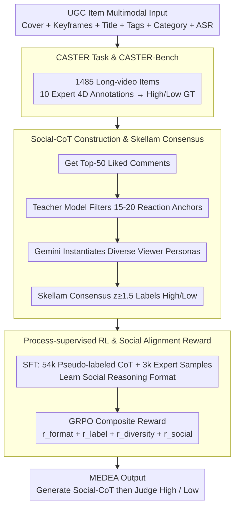

# Community-Aware Assessment of Social Textual Engagement and Resonance: A Human-Centric Perspective on User-Generated Content Evaluation

**Conference**: ACL2026  
**arXiv**: [2606.01897](https://arxiv.org/abs/2606.01897)  
**Code**: To be confirmed  
**Area**: Multimodal Evaluation / RL Alignment  
**Keywords**: UGC Quality Assessment, Social-CoT, Community Resonance, GRPO, Multimodal Reasoning

## TL;DR
This paper introduces the CASTER task and CASTER-Bench, proposing MEDEA to simulate community responses via Social-CoT, SFT, and process-supervised Reinforcement Learning (RL) with Social Alignment Reward. MEDEA improves High-Quality F1 to 0.650 and Macro-F1 to 0.749 on CASTER-Bench, significantly outperforming traditional VQA and general LMM baselines.

## Background & Motivation
**Background**: Traditional video quality assessment primarily measures clarity, distortion, aesthetics, and technical quality. Recently, LMMs have been applied to UGC quality estimation, yet most treat textual information as static features or utilize generic CoT for logical analysis.

**Limitations of Prior Work**: "Good content" on real-world UGC platforms is not determined solely by image quality. A video might have mediocre technical specs but gain strong positive feedback through storytelling, emotion, knowledge value, or community culture. Conversely, high-view counts might be driven by clickbait, vulgarity, or engagement bait. Relying only on visual signals or general multimodal reasoning makes it difficult to distinguish "looks good" from "truly resonates positively with the community."

**Key Challenge**: Platforms must judge intrinsic content quality during early recommendation and moderation stages, where new uploads lack sufficient comments. Models must infer potential community reactions from covers, keyframes, titles, tags, ASR, and metadata. This requires social reasoning similar to "Theory of Mind" rather than simple signal quality regression.

**Goal**: The authors propose CASTER, redefining UGC quality assessment as "whether content achieves positive community resonance." To this end, they construct CASTER-Bench and propose MEDEA: first simulating diverse viewer persona Social-CoT, then aggregating these into final high/low quality judgments.

**Key Insight**: Instead of direct binary classification, the model is required to first generate multiple "community comment-style" empathetic reasoning paths. During training, these paths are constrained by real high-interaction comments and expert labels, allowing the model to learn judgment standards closer to real community perception.

**Core Idea**: Use Social-CoT to explicitly simulate a "community mind," then align the generated social reasoning paths with real user comments via Social Alignment Reward, shifting UGC quality assessment from image quality judgment to community resonance modeling.

## Method

### Overall Architecture
The paper presents two core contributions. The first is CASTER-Bench: 1,485 long-video UGC items covering 30 major categories. Each item includes multimodal inputs like video frames, covers, titles, tags, categories, and ASR transcripts, annotated by 10 professional content operations experts across four dimensions: Production Quality, Perceived Value, Information Utility, and Narrative Excellence. The second is MEDEA: a multimodal evaluation framework that mines Social-CoT training data from community comments, learns social reasoning formats via SFT, and optimizes the reasoning process using GRPO with a social alignment reward. The pipeline follows three key designs: expert ground truth from CASTER-Bench, supervised social reasoning paths constructed from comments, and process-supervised RL to align the model with real community judgments.

### Key Designs

**1. CASTER Task & CASTER-Bench: Shifting Quality Assessment from Technical Scoring to Community Resonance Judgment**

Most traditional VQA datasets consist of 8–20 second short clips, measuring only signal quality like clarity and aesthetics, which fails to capture value derived from narrative, knowledge density, and emotional resonance in long videos. CASTER redefines the task: given cover images, keyframes, titles, tags, category metadata, and ASR transcripts, the model predicts if content will gain positive community feedback (High-Quality), rather than regressing a technical quality score. CASTER-Bench contains 1,485 UGC items with an average duration of 442 seconds (182.5 hours total). The label distribution—Excellent 10.6%, Good 17.0%, Average 38.6%, Poor 33.7%—reflects the natural scarcity of High-Quality content, making High-Quality F1 the most critical metric.

**2. Social-CoT Construction & Skellam Consensus Aggregation: Creating Supervised Social Reasoning Paths from Real Comments**

To train the model to "simulate community thinking," supervised signals of community reactions are required. For unlabeled UGC, the top-50 liked comments are collected. A teacher model filters 15–20 reaction anchors related to creativity, emotion, and narrative. Gemini-2.5-Flash then instantiates diverse viewer personas to explain which visual/narrative elements triggered these reactions. Each simulated comment is assigned a support or oppose stance: let the number of supports be $X$ and opposes be $Y$. The Skellam-normalized consensus is calculated as $z=(X-Y)/\sqrt{X+Y}$. Items with $z\geq1.5$ are labeled High-Quality. This avoids simple majority voting, which is prone to comment volume and emotional bias, instead focusing on statistically significant community support.

**3. Process-supervised RL & Social Alignment Reward: Aligning Reasoning Paths with Real Community Language**

Prompting a general LMM to write Social-CoT often fails to capture platform-specific community standards, frequently collapsing into repetitive "so beautiful" vacuity. MEDEA first performs SFT using 54k Gemini-labeled CoT samples and 3k human-annotated UGC. Then, GRPO optimizes a composite reward $r=r_{format}+r_{label}+r_{diversity}+r_{social}$ on expert samples. While $r_{format}$ ensures output structure and $r_{label}$ rewards correct classification, $r_{social}$ provides "social grounding" by averaging the cosine similarity between the generated persona embeddings and held-out real high-interaction comments. This avoids Social Mode Collapse and ensures the generated reactions match the emotional granularity and language of a real community.

### Loss & Training
Training occurs in two stages. SFT stage: batch size 256, learning rate $5e^{-6}$, cosine schedule, decay ratio 0.2. RL stage (GRPO): batch size 64, learning rate $1e^{-6}$, cosine schedule, PPO clip ratio 0.2, KL coefficient 0.001, entropy coefficient 0.001, rollout number 8, rollout temperature 0.6. During inference: top-k 50, top-p 0.7, temperature 0.6. The paper emphasizes that RL uses only human-curated samples to ensure reinforcement signals are anchored to expert annotations rather than amplifying teacher model pseudo-label biases.

## Key Experimental Results

### Main Results
Due to the long-tail distribution of High-Quality samples in CASTER-Bench, High-Quality F1 is the core metric. MEDEA significantly outperforms traditional VQA, standard LMMs, Long-CoT LMMs, and prompt-only Social-CoT simulations.

| Method | HQ Precision | HQ Recall | HQ F1 | Macro-F1 | Notes |
|------|-------------:|----------:|------:|---------:|------|
| FastVQA | 0.347 | 0.440 | 0.388 | 0.554 | Traditional VQA |
| MaxVQA | 0.345 | 0.518 | 0.414 | 0.552 | Top Traditional VQA |
| Qwen3-VL-Plus | 0.366 | 0.893 | 0.519 | 0.542 | Std LMM, High Recall Low Prec |
| GPT-5.2 reasoning | 0.401 | 0.903 | 0.555 | 0.595 | Best Long-CoT Baseline |
| Qwen3-VL-Plus social-CoT | 0.380 | 0.766 | 0.508 | 0.578 | Prompt-based Social-CoT |
| Claude-4.5-opus social-CoT | 0.371 | 0.810 | 0.510 | 0.561 | Prompt-based Social-CoT |
| MEDEA | 0.603 | 0.705 | 0.650 | 0.749 | **Ours** |

### Ablation Study

| Configuration | HQ F1 | Low-Quality F1 | Macro-F1 | Description |
|------|------:|---------------:|---------:|------|
| SFT-pseudo-label | 0.487 | 0.686 | 0.587 | Learns format but weak judgment |
| SFT-human-label | 0.371 | 0.710 | 0.541 | Insufficient recall due to few samples |
| SFT-w/o-social-CoT | 0.510 | 0.638 | 0.574 | Removing Social-CoT leads to instability |
| RL-pseudo+human | 0.536 | 0.848 | 0.692 | RL improves overall performance |
| RL-w/o-social-reward | 0.613 | 0.836 | 0.725 | Lacks social alignment, repetitive outputs |
| RL-w/o-social-CoT | 0.421 | 0.821 | 0.621 | Significant drop without reasoning paths |
| MEDEA(RL-human-label) | 0.650 | 0.847 | 0.749 | **Ours** |

### Key Findings
- **Generosity Bias in General LMMs**: Models like GPT-5.2 and Claude-4.5-opus achieve over 90% High-Quality recall but only 30%-40% precision, over-interpreting mediocre content as high-quality.
- **Traditional VQA Limitations**: These models bias towards Low-Quality classes with HQ F1 between 0.33-0.41, indicating that image quality signals alone cannot detect community resonance.
- **Prompting vs. Training**: Prompting Social-CoT (e.g., Qwen3-VL-Plus) yields an HQ F1 of 0.508, significantly lower than the 0.650 achieved by MEDEA.
- **Social Reward Impact**: The alignment reward does more than increase classification scores; it reduces redundant, vacuous "so beautiful" style template reasoning.

## Highlights & Insights
- **Redefining UGC Quality**: Shifting the goal from signal quality to community resonance makes the task significantly more relevant to platform requirements than basic VQA.
- **Social-CoT as an Interpretable Layer**: Instead of black-box labels, the model simulates viewer reactions, allowing error analysis to pinpoint specific narrative, emotional, or utility failures.
- **Reward Grounding**: Using real high-interaction comments in $r_{social}$ as anchors constrains reasoning better than label-only rewards, ensuring the "social language" remains authentic.
- **Long-Video Focus**: The average duration of 442 seconds is a significant step toward real-world long-video assessment compared to technical clip datasets.

## Limitations & Future Work
- **Inference Overhead**: Social-CoT introduces significant token costs (1,256 vs 5.6 tokens/item). Real-time recommendation scenarios may need caching, distillation, or early-exit mechanisms.
- **Platform Dynamics**: Social alignment is optimized for specific platform dynamics; migrating to different cultures or community norms may require re-annotation.
- **Class Granularity**: Binary High/Low labels are coarse; community resonance is multi-dimensional and time-varying.
- **Metadata Dependency**: Effectiveness in scenarios with sparse metadata (e.g., only title, no ASR) still requires validation.

## Related Work & Insights
- **vs. Technical VQA (FastVQA, MaxVQA)**: These focus on signal quality; CASTER focuses on positive community feedback.
- **vs. Long-CoT LMMs**: Reasoning models generate detailed analysis but are overly lenient without community-specific training.
- **Insight**: For recommendation and moderation systems, simulating user group reactions serves as an effective interpretable intermediate layer, provided it is constrained by real community data to avoid "social mode collapse."

## Rating
- Novelty: ⭐⭐⭐⭐⭐ Task redefinition and Social-CoT alignment are highly distinct.
- Experimental Thoroughness: ⭐⭐⭐⭐☆ Comprehensive main experiments and ablations, though cross-platform generalization is pending.
- Writing Quality: ⭐⭐⭐⭐☆ Strong narrative and clear motivation.
- Value: ⭐⭐⭐⭐☆ Highly insightful for UGC recommendation and social reasoning, despite inference cost challenges.

<!-- RELATED:START -->

## Related Papers

- [\[AAAI 2026\] Object-Centric World Models for Causality-Aware Reinforcement Learning](../../AAAI2026/reinforcement_learning/object-centric_world_models_for_causality-aware_reinforcement_learning.md)
- [\[ICLR 2026\] SocialJax: An Evaluation Suite for Multi-Agent Reinforcement Learning in Sequential Social Dilemmas](../../ICLR2026/reinforcement_learning/socialjax_an_evaluation_suite_for_multi-agent_reinforcement_learning_in_sequenti.md)
- [\[AAAI 2026\] G-UBS: Towards Robust Understanding of Implicit Feedback via Group-Aware User Behavior Simulation](../../AAAI2026/reinforcement_learning/g-ubs_towards_robust_understanding_of_implicit_feedback_via_group-aware_user_beh.md)
- [\[AAAI 2026\] A Multi-Agent Conversational Bandit Approach to Online Evaluation and Selection of User-Aligned LLM Responses](../../AAAI2026/reinforcement_learning/a_multi-agent_conversational_bandit_approach_to_online_evaluation_and_selection_.md)
- [\[ACL 2026\] The Stackelberg Speaker: Optimizing Persuasive Communication in Social Deduction Games](the_stackelberg_speaker_optimizing_persuasive_communication_in_social_deduction_.md)

<!-- RELATED:END -->
