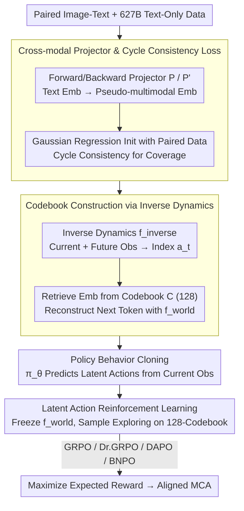

# Controlling Multimodal Conversational Agents with Coverage-Enhanced Latent Actions

**Conference**: ACL 2026  
**arXiv**: [2601.07516](https://arxiv.org/abs/2601.07516)  
**Code**: [GitHub](https://github.com/AlibabaResearch/DAMO-ConvAI/tree/main/MMLatentAction)  
**Area**: Reinforcement Learning / Multimodal Dialogue  
**Keywords**: Latent Actions, Reinforcement Learning, Multimodal Dialogue, Vision-Language Models, Cross-modal Projection

## TL;DR

The authors propose constructing a compact latent action space for Multimodal Conversational Agents (MCA) to replace the vast token action space during RL fine-tuning. By utilizing cross-modal projectors and cycle consistency loss, they leverage paired image-text and text-only data to build a codebook. This approach compresses the action space from 152K (vocabulary size) to 128 (codebook size), consistently outperforming token-level RL baselines across two dialogue tasks.

## Background & Motivation

**Background**: Vision-Language Models (VLM) such as Qwen-VL and GPT-4o are increasingly utilized as Multimodal Conversational Agents (MCA), supporting emotionally rich and context-aware dialogues based on images and text. RL has been widely explored to adapt MCAs to diverse human-computer interaction scenarios.

**Limitations of Prior Work**: Token-level RL faces a massive exploration space—given a vocabulary size $|\mathcal{V}|=152K$ (e.g., Qwen2.5-VL) and a response length of $m$ steps, the sampling space grows exponentially to $|\mathcal{V}|^m$. This results in low RL exploration efficiency and insufficient diversity.

**Key Challenge**: Constructing a latent action space requires diverse data with sufficient coverage. However, the paired image-text data required by VLMs is expensive to annotate and limited in scale. Training a codebook solely on limited paired data leads to poor coverage and generalization; incorporating large amounts of unpaired text data may introduce unimodal bias (where the model over-relies on text and ignores visual information).

**Goal**: To design a coverage-enhanced latent action space construction method for MCAs that leverages both paired image-text data and large-scale text-only data while avoiding unimodal bias.

**Key Insight**: The authors draw inspiration from the "learning from observation" mechanism to build a latent action codebook—inferring current latent actions from future observations and then using those actions to reconstruct future observations.

**Core Idea**: A cross-modal projector $P$ is trained to map text embeddings to the image-text embedding space. It is initialized with paired data and enhanced with text-only data using cycle consistency loss for robustness. This allows for the safe utilization of 627B tokens of text-only data to extend codebook coverage.

## Method

### Overall Architecture

Three new modules are introduced atop a base VLM: (1) a language world model $f_{\text{world}}$ that receives current observations and latent actions to autoregressively generate the next token; (2) an inverse dynamics model $f_{\text{inverse}}$ that infers the current latent action index from future observations; and (3) a policy model $\pi_\theta$ that predicts latent actions based solely on current observations. The workflow consists of two stages: Stage 1 constructs the latent action space by utilizing a cross-modal projector to incorporate massive text-only data, learning a codebook of size 128 via inverse dynamics, and aligning the policy model to this space via behavior cloning. Stage 2 freezes the world model and performs RL fine-tuning on downstream tasks within the compact latent action space.

### Key Designs

**1. Cross-modal Projector and Cycle Consistency Loss: Safely Integrating Massive Text Data into the Codebook**

Building a latent action codebook requires data with sufficient coverage. Since paired VLM data is scarce, using it alone leads to poor coverage. However, directly inserting text embeddings introduces unimodal bias. The solution is to train a forward projector $P$ that maps text embeddings $e^T$ to diagonal Gaussian distribution parameters $(\mu, \sigma) = P(e^T)$, along with a backward projector $P'$ for the inverse mapping. Both are initialized on paired data using Gaussian regression loss $\mathcal{L}_{\text{t2vt}} + \mathcal{L}_{\text{vt2t}}$, then jointly trained on text-only data via cycle consistency loss $\mathcal{L}_{\text{cycle}}$, enforcing $P'(P(e^T)) \approx e^T$. This generates reasonable pseudo-multimodal embeddings even without real images, ensuring the projector does not deviate from the real image-text space.

**2. Codebook Construction via Inverse Dynamics: Unsupervised Learning of Controllable Latent Actions**

To obtain discrete actions that control generation without explicit action labels, the "learning from observation" approach is adopted. The inverse dynamics model $f_{\text{inverse}}$ takes current and future observations to output a discrete action index $a_t \in \{1, \ldots, |\mathcal{C}|\}$. The corresponding embedding $c_{a_t}$ is retrieved from a learnable codebook $\mathcal{C} \in \mathbb{R}^{|\mathcal{C}| \times d}$. The world model $f_{\text{world}}$ then uses this embedding and the current observation to reconstruct the next token. They are trained jointly using $\mathcal{L}_{\text{inverse}} = -\sum_t \log f_{\text{world}}(x^T_{t+1} | e^{V,T}_t, a_t)$. This "inference + reconstruction" constraint forces the codebook to encode high-level semantic information, and a codebook size of $|\mathcal{C}|=128$ compresses the exploration space by three orders of magnitude compared to the 152K vocabulary.

**3. Latent Action Reinforcement Learning: Sampling in Compact Latent Space for Faster and More Diverse Exploration**

Token-level RL sampling space explodes exponentially ($|\mathcal{V}|^m$), resulting in low efficiency. Latent action RL shifts action selection to the codebook: the world model is frozen, and only the policy model $\pi_\theta$'s latent action distribution is optimized. At each step, $a_t \sim \pi_\theta(\cdot | x^V, x^T_{1:t})$ is sampled, and the world model generates the next token $x^T_{t+1} = f_{\text{world}}(x^V, x^T_{1:t}, a_t)$. The objective is to maximize the expected reward $\mathcal{J}(\theta) = \mathbb{E}[R(x^T_{p+1:m})]$, compatible with algorithms like GRPO and DAPO. Since only the latent action distribution is updated, policy updates are faster (0.86× baseline time), and rollout semantic diversity increases from ~1.07 to ~1.25.

### Loss & Training

Losses for the three stages: (1) Projector initialization $\mathcal{L}_{\text{proj}_1} = \mathcal{L}_{\text{t2vt}} + \mathcal{L}_{\text{vt2t}}$; (2) Joint inverse dynamics and projector training $\mathcal{L}_{\text{inverse}} + \mathcal{L}_{\text{proj}_2}$; (3) Policy behavior cloning $\mathcal{L}_{\text{bc}}$. Data scale: 14M images + 1B paired tokens + 627B text-only tokens.

## Key Experimental Results

### Main Results

Using Qwen2.5-VL-3B-Instruct, LLM-as-a-Judge score ratios:

| Method | MMRole-ID | MMRole-OOD | PCogAlign-LS1 | PCogAlign-LS2 | Average |
|------|-----------|------------|---------------|---------------|------|
| SFT | 0.843 | 0.809 | 0.808 | 0.810 | 0.817 |
| GRPO (Token) | 0.838 | 0.796 | 0.845 | 0.845 | 0.831 |
| **GRPO (Latent)** | **0.949** | **0.915** | **0.871** | 0.837 | **0.893** |
| Dr.GRPO (Token) | 0.867 | 0.823 | 0.835 | 0.834 | 0.840 |
| **Dr.GRPO (Latent)** | **0.953** | **0.916** | **0.874** | **0.840** | **0.896** |

Rollout semantic diversity comparison:

| Method | MMRole | PCogAlignBench |
|------|--------|---------------|
| GRPO (Token) | 1.079 | 1.042 |
| GRPO (Latent) | **1.248** | **1.191** |
| DAPO (Token) | 1.073 | 1.038 |
| DAPO (Latent) | **1.253** | **1.127** |

### Ablation Study

Based on GRPO + Qwen2.5-VL-3B-Instruct:

| Setting | MMRole-ID | MMRole-OOD | PCogAlign-LS1 | Average |
|------|-----------|------------|---------------|------|
| Full Method | 0.949 | 0.915 | 0.871 | 0.893 |
| w/o Cycle Consistency | 0.921 | 0.878 | 0.858 | 0.870 |
| w/o Cross-modal Projector | 0.944 | 0.901 | 0.858 | 0.880 |
| w/o Text-only Data | 0.932 | 0.861 | 0.851 | 0.865 |

### Key Findings

- Latent action RL achieves an average 4% improvement over token-level RL and is effective across all four RL algorithms tested.
- Semantic diversity significantly increases: GRPO rises from 1.079 to 1.248 (MMRole), confirming improved exploration efficiency.
- Text-only data is the most critical component—removing it results in the largest drop in OOD performance (0.915 → 0.861), indicating that coverage is vital for generalization.
- Total training time increases by only 1.08×, while policy updates are faster (0.86×), keeping the overall overhead controllable.

## Highlights & Insights

- This work marks the first introduction of latent actions into RL fine-tuning for multimodal conversational agents, with a significant compression ratio from 152K to 128.
- The cycle consistency loss cleverly exploits the cross-modal redundancy hypothesis, bridging limited paired data with massive text-only data.
- The algorithm-agnostic nature (applicable to GRPO, Dr.GRPO, DAPO, BNPO) suggests that latent actions are a fundamental and universal paradigm.

## Limitations & Future Work

- Latent actions lack interpretability; it is unclear what specific semantic concepts the 128 codebook entries encode.
- Validation is limited to dialogue tasks; broader tasks like visual mathematical reasoning and larger VLMs remain for future work.
- Inference latency increases by 1.13×, which might require optimization for real-time dialogue scenarios.

## Related Work & Insights

- CoLA (Jia et al., 2025) first introduced latent actions for text-only LLMs; this work extends it to multimodal scenarios and addresses paired data scarcity.
- The concept of "learning from observation" in robotics provides the theoretical foundation for latent space construction.
- Insight: The core bottleneck in RL fine-tuning for VLMs lies not in the algorithms themselves, but in the representation of the action space—moving from token-level to latent-level abstraction may be the key path toward more efficient RL alignment.

## Rating

- Novelty: ⭐⭐⭐⭐ Introducing latent actions to multimodal dialogue RL is a novel combination, and the cycle consistency loss is elegantly designed.
- Experimental Thoroughness: ⭐⭐⭐⭐ Evaluated across two tasks, two model scales, and four RL algorithms with comprehensive ablation and diversity analyses.
- Writing Quality: ⭐⭐⭐⭐ Clear methodological descriptions and informative pipeline diagrams, though the notation system is slightly complex.

<!-- RELATED:START -->

## Related Papers

- [\[ACL 2026\] SpiralThinker: Latent Reasoning through an Iterative Process with Text-Latent Interleaving](spiralthinker_latent_reasoning_through_an_iterative_process_with_text-latent_int.md)
- [\[ICLR 2026\] A Unifying View of Coverage in Linear Off-Policy Evaluation](../../ICLR2026/reinforcement_learning/a_unifying_view_of_coverage_in_linear_off-policy_evaluation.md)
- [\[ACL 2026\] DPEPO: Diverse Parallel Exploration Policy Optimization for LLM-based Agents](dpepo_diverse_parallel_exploration_policy_optimization_for_llm-based_agents.md)
- [\[ACL 2026\] Breaking the Impasse: Dual-Scale Evolutionary Policy Training for Social Language Agents](breaking_the_impasse_dual-scale_evolutionary_policy_training_for_social_language.md)
- [\[NeurIPS 2025\] Improving Planning and MBRL with Temporally-Extended Actions](../../NeurIPS2025/reinforcement_learning/improving_planning_and_mbrl_with_temporally-extended_actions.md)

<!-- RELATED:END -->
