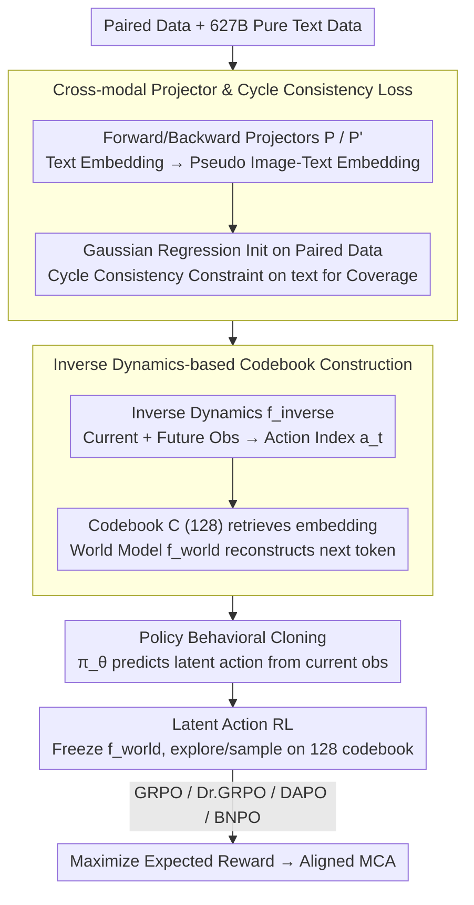

# Controlling Multimodal Conversational Agents with Coverage-Enhanced Latent Actions

**Conference**: ACL 2026  
**arXiv**: [2601.07516](https://arxiv.org/abs/2601.07516)  
**Code**: [GitHub](https://github.com/AlibabaResearch/DAMO-ConvAI/tree/main/MMLatentAction)  
**Area**: Reinforcement Learning / Multimodal Dialogue  
**Keywords**: Latent Actions, Reinforcement Learning, Multimodal Dialogue, Vision-Language Models, Cross-modal Projection

## TL;DR

This paper proposes constructing a compact latent action space for Multimodal Conversational Agents (MCA) to replace the massive token action space during RL fine-tuning. By utilizing a cross-modal projector and cycle consistency loss to leverage both paired image-text data and pure text data for codebook construction, the action space is compressed from 152K (vocabulary size) to 128 (codebook size), consistently outperforming token-level RL baselines across two dialogue tasks.

## Background & Motivation

**Background**: Vision-Language Models (VLM) such as Qwen-VL and GPT-4o are increasingly employed as Multimodal Conversational Agents (MCA), supporting emotionally rich and context-aware dialogues based on images and text. RL has been widely explored to adapt MCAs to diverse human-computer interaction scenarios.

**Limitations of Prior Work**: Token-level RL faces the challenge of a massive exploration space—with a vocabulary size $|\mathcal{V}|=152K$ (Qwen2.5-VL) and a maximum response length of $m$ steps, the sampling space grows exponentially as $|\mathcal{V}|^m$. This results in inefficient exploration and insufficient diversity during RL.

**Key Challenge**: Constructing a latent action space requires diverse data with sufficient coverage, but paired image-text data required by VLMs is expensive to annotate and limited in scale. Training a codebook solely with limited paired data leads to insufficient coverage and poor generalization; conversely, introducing large amounts of unpaired text data may introduce unimodal bias (where the model over-relies on text and ignores visual information).

**Goal**: To design a coverage-enhanced latent action space construction method for MCA that utilizes both paired image-text data and large-scale pure text data while avoiding unimodal bias.

**Key Insight**: The authors draw inspiration from the "learning from observation" mechanism to build the latent action codebook—utilizing future observations to infer current latent actions, and subsequently using those latent actions to reconstruct future observations.

**Core Idea**: Train a cross-modal projector $P$ to map text embeddings into the image-text embedding space. This projector is initialized with paired data and enhanced for robustness using pure text data combined with cycle consistency loss, safely utilizing 627B tokens of pure text data to expand codebook coverage.

## Method

### Overall Architecture

Three new modules are introduced on top of a base VLM: (1) a language world model $f_{\text{world}}$ which receives current observations and latent actions to autoregressively generate the next token; (2) an inverse dynamics model $f_{\text{inverse}}$ that infers the current latent action index based on future observations; and (3) a policy model $\pi_\theta$ that predicts latent actions based solely on contemporary observations. The pipeline consists of two stages: the first stage constructs the latent action space—using a cross-modal projector to integrate massive text data for coverage enhancement, followed by learning a codebook of size 128 via inverse dynamics, and aligning the policy model via behavioral cloning; the second stage freezes the world model and performs RL fine-tuning on downstream tasks within the compact latent action space.

### Key Designs

**1. Cross-modal Projector and Cycle Consistency Loss: Safely Integrating Mass Text Data into the Codebook**

Building a latent action codebook requires data with sufficient coverage. However, VLM paired data is scarce. Simply using paired data leads to coverage issues, while directly feeding text embeddings introduces unimodal bias. The solution is training a forward projector $P$ that maps text embeddings $e^T$ to diagonal Gaussian distribution parameters $(\mu, \sigma) = P(e^T)$, paired with a backward projector $P'$ for inverse mapping. These are initialized using Gaussian regression losses $\mathcal{L}_{\text{t2vt}} + \mathcal{L}_{\text{vt2t}}$ on paired data and then jointly trained on pure text using a cycle consistency loss $\mathcal{L}_{\text{cycle}}$, enforcing $P'(P(e^T)) \approx e^T$. This generates plausible pseudo image-text embeddings even without real images, allowing 627B tokens of pure text data to safely expand codebook coverage.

**2. Inverse Dynamics-based Codebook Construction: Unsupervised Learning of Controllable Latent Actions**

To obtain discrete actions capable of controlling generation without action labels, "learning from observation" is utilized: the inverse dynamics model $f_{\text{inverse}}$ observes current and future states to output a discrete action index $a_t \in \{1, \ldots, |\mathcal{C}|\}$. The corresponding embedding $c_{a_t}$ is retrieved from a learnable codebook $\mathcal{C} \in \mathbb{R}^{|\mathcal{C}| \times d}$. The world model $f_{\text{world}}$ then uses this embedding and current observations to reconstruct the next token. Joint training is performed with $\mathcal{L}_{\text{inverse}} = -\sum_t \log f_{\text{world}}(x^T_{t+1} | e^{V,T}_t, a_t)$. This bidirectional constraint forces the codebook to encode high-level semantic information. The codebook size $|\mathcal{C}|=128$ reduces the RL exploration space by three orders of magnitude compared to the 152K vocabulary.

**3. Latent Action RL: Sampling in a Compact Latent Space for Faster and More Diverse Exploration**

Token-level RL exploration is inefficient as its sampling space explodes ($|\mathcal{V}|^m$). Latent action RL shifts action selection to the codebook: the world model is frozen, and only the policy model $\pi_\theta$'s latent action distribution is optimized. At each step, $a_t \sim \pi_\theta(\cdot | x^V, x^T_{1:t})$ is sampled, and the world model generates token $x^T_{t+1} = f_{\text{world}}(x^V, x^T_{1:t}, a_t)$ to maximize expected reward $\mathcal{J}(\theta) = \mathbb{E}[R(x^T_{p+1:m})]$. This is compatible with algorithms like GRPO, Dr.GRPO, DAPO, and BNPO. Since only the latent action distribution is updated, policy updates are faster (0.86× baseline time), and rollout semantic diversity increases from approximately 1.07 to 1.25.

### Loss & Training

Losses across three stages: (1) Projector initialization $\mathcal{L}_{\text{proj}_1} = \mathcal{L}_{\text{t2vt}} + \mathcal{L}_{\text{vt2t}}$; (2) Joint inverse dynamics and projector training $\mathcal{L}_{\text{inverse}} + \mathcal{L}_{\text{proj}_2}$; (3) Policy behavioral cloning $\mathcal{L}_{\text{bc}}$. Data scale: 14M images + 1B paired tokens + 627B pure text tokens.

## Key Experimental Results

### Main Results

Qwen2.5-VL-3B-Instruct, LLM-as-a-Judge score ratios:

| Method | MMRole-ID | MMRole-OOD | PCogAlign-LS1 | PCogAlign-LS2 | Avg |
|------|-----------|------------|---------------|---------------|------|
| SFT | 0.843 | 0.809 | 0.808 | 0.810 | 0.817 |
| GRPO (Token) | 0.838 | 0.796 | 0.845 | 0.845 | 0.831 |
| **GRPO (Latent)** | **0.949** | **0.915** | **0.871** | 0.837 | **0.893** |
| Dr.GRPO (Token) | 0.867 | 0.823 | 0.835 | 0.834 | 0.840 |
| **Dr.GRPO (Latent)** | **0.953** | **0.916** | **0.874** | **0.840** | **0.896** |

Rollout semantic diversity comparison:

| Method | MMRole | PCogAlignBench |
|------|--------|---------------|
| GRPO (Token) | 1.079 | 1.042 |
| GRPO (Latent) | **1.248** | **1.191** |
| DAPO (Token) | 1.073 | 1.038 |
| DAPO (Latent) | **1.253** | **1.127** |

### Ablation Study

Based on GRPO + Qwen2.5-VL-3B-Instruct:

| Setting | MMRole-ID | MMRole-OOD | PCogAlign-LS1 | Avg |
|------|-----------|------------|---------------|------|
| Full Method | 0.949 | 0.915 | 0.871 | 0.893 |
| w/o Cycle Consistency | 0.921 | 0.878 | 0.858 | 0.870 |
| w/o Cross-modal Projector | 0.944 | 0.901 | 0.858 | 0.880 |
| w/o Pure Text Data | 0.932 | 0.861 | 0.851 | 0.865 |

### Key Findings

- Latent action RL improves performance by 4% on average over token-level RL and is consistently effective across four different RL algorithms.
- Semantic diversity increases significantly: GRPO rises from 1.079 to 1.248 (MMRole), confirming improved exploration efficiency.
- Pure text data is the most critical component—removing it results in the largest drop in OOD performance (0.915→0.861), indicating that coverage is vital for generalization.
- Total training time increases only by 1.08×, while policy updates are actually faster (0.86×), keeping overall overhead manageable.

## Highlights & Insights

- This is the first work to introduce latent actions into RL fine-tuning for multimodal conversational agents, achieving a significant compression from 152K to 128.
- The cycle consistency loss elegantly exploits the cross-modal redundancy hypothesis, bridging limited paired data with massive pure text data.
- The algorithm-agnostic nature (applicable to GRPO/Dr.GRPO/DAPO/BNPO) suggests that latent actions are a fundamental general paradigm.

## Limitations & Future Work

- Latent actions lack interpretability—it remains unclear what specific semantic concepts are encoded by the 128 codewords.
- Validation is restricted to dialogue tasks; broader tasks like visual mathematical reasoning and larger VLMs are left for future research.
- Inference latency increases by 1.13×, which might require optimization for real-time dialogue scenarios.

## Related Work & Insights

- CoLA (Jia et al., 2025) first introduced latent actions for pure text LLMs; this work extends it to multimodal scenarios and addresses paired data scarcity.
- The concept of "learning from observation" in robotics provides the theoretical foundation for latent space construction.
- Insight: The core bottleneck in RL fine-tuning for VLMs lies not in the algorithm itself, but in the representation of the action space—abstraction from token-level to latent-level may be the key path toward more efficient RL alignment.

## Rating

- Novelty: ⭐⭐⭐⭐ Introducing latent actions to multimodal dialogue RL is an innovative combination; the cycle consistency loss is cleverly designed.
- Experimental Thoroughness: ⭐⭐⭐⭐ Covering two tasks, two model scales, and four RL algorithms, with complete ablation and diversity analysis.
- Writing Quality: ⭐⭐⭐⭐ The methodology description is clear, and pipeline diagrams are informative, though the notation system is somewhat complex.

<!-- RELATED:START -->

## Related Papers

- [\[CVPR 2026\] Anticipatory Planning for Multimodal AI Agents](../../CVPR2026/reinforcement_learning/anticipatory_planning_for_multimodal_ai_agents.md)
- [\[ACL 2026\] SpiralThinker: Latent Reasoning through an Iterative Process with Text-Latent Interleaving](spiralthinker_latent_reasoning_through_an_iterative_process_with_text-latent_int.md)
- [\[ACL 2026\] DPEPO: Diverse Parallel Exploration Policy Optimization for LLM-based Agents](dpepo_diverse_parallel_exploration_policy_optimization_for_llm-based_agents.md)
- [\[ACL 2026\] Breaking the Impasse: Dual-Scale Evolutionary Policy Training for Social Language Agents](breaking_the_impasse_dual-scale_evolutionary_policy_training_for_social_language.md)
- [\[ICLR 2026\] A Unifying View of Coverage in Linear Off-Policy Evaluation](../../ICLR2026/reinforcement_learning/a_unifying_view_of_coverage_in_linear_off-policy_evaluation.md)

<!-- RELATED:END -->
