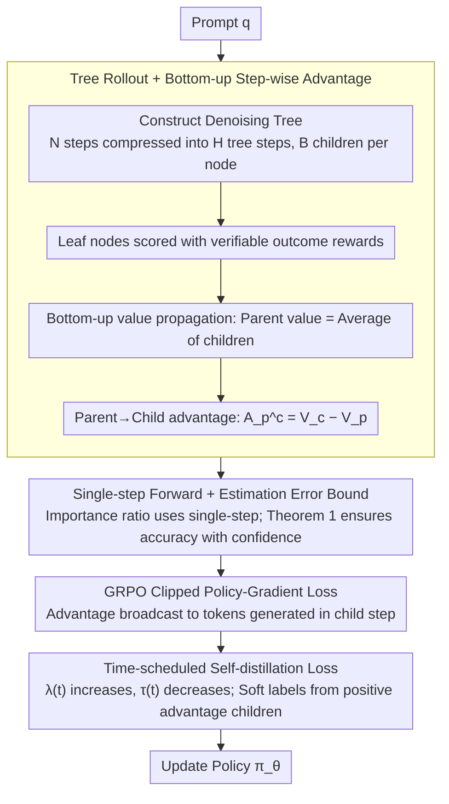

# d-TreeRPO: Towards More Reliable Policy Optimization for Diffusion Language Models

**Conference**: ACL 2026  
**arXiv**: [2512.09675](https://arxiv.org/abs/2512.09675)  
**Code**: https://github.com/THU-BPM/d-TreeRPO (Available)  
**Area**: Reinforcement Learning / Diffusion Language Models / Reasoning LLMs  
**Keywords**: dLLM, GRPO, Tree-structured Rollout, Step-wise Advantage, Self-distillation

## TL;DR
To address two major reliability bottlenecks in RL for Diffusion Language Models (dLLM)—sparse rewards and probability estimation bias—the authors propose d-TreeRPO. It organizes rollouts into a tree structure, calculating step-wise advantages bottom-up using verifiable rewards from leaf nodes. Simultaneously, it provides a theoretical proof that "higher model confidence leads to more accurate single-step forward probability estimation," and designs a time-scheduled self-distillation loss to sharpen the policy in later training stages. Tested on LLaDA-8B-Instruct, it achieves gains of +86.2% on Sudoku, +51.6% on Countdown, +4.5% on GSM8K, and +5.3% on Math500.

## Background & Motivation
**Background**: dLLMs (e.g., LLaDA, Dream, Seed Diffusion) replace autoregressive decoding with parallel denoising for faster inference. Reinforcement learning methods (PPO/GRPO families), such as Diffu-GRPO, VRPO (LLaDA-1.5), wd1, SAPO, GDPO, and TraceRL, have been adapted to enhance their reasoning capabilities.

**Limitations of Prior Work**: RL for dLLMs suffers from failures in two core components: (1) **Sparse/Unverifiable Rewards**: Most methods uniformly broadcast the final outcome reward to all tokens, causing the advantage to degenerate into a constant, or utilize learned process reward models that introduce reward hacking risks. (2) **Probability Estimation Bias**: Since dLLMs perform denoising in arbitrary orders, the true token probability should be the expectation over all possible decoding sequences (Eq. 3), which is computationally intractable. ELBO estimation provides a biased lower bound requiring multiple forward passes, while single-step forward estimation is computationally cheap but lacks theoretical guarantees.

**Key Challenge**: Precision vs. Computation. Obtaining fine-grained and verifiable advantages requires more rollouts; obtaining accurate $\log\pi$ requires multiple forward passes. Both are expensive and usually designed independently, lacking a unified framework.

**Goal**: (i) Provide step-wise and verifiable advantages within the same rollout budget; (ii) develop a strategy to improve single-step estimation accuracy without increasing forward passes; (iii) theoretically quantify the relationship between the two.

**Key Insight**: By structuring rollouts as a tree, the state transitions between parent and child nodes naturally correspond to denoising segments. Verifiable outcome rewards from leaves propagate bottom-up to yield step-wise rewards. Additionally, the gap between single-step estimation and the true expectation shrinks monotonically with policy confidence. Thus, a time-scheduled self-distillation loss can be used to actively increase confidence in the later stages of training.

**Core Idea**: Solve sparse rewards with "Tree Structure + Bottom-up Reward" and resolve estimation bias via "Time-scheduled Self-distillation." Both components reinforce each other within a unified GRPO framework.

## Method

### Overall Architecture
For each prompt $q$, $N$ denoising steps are compressed into $H = N/s$ tree steps using a merging factor $s$. Each non-leaf node expands into $B$ child nodes, with each child corresponding to $s$ consecutive denoising steps, resulting in $B^H$ fully generated leaf nodes. Leaf nodes are scored via verifiable outcome rewards. The value of an internal node is the average of its children's values (Eq. 6). The advantage of a parent-to-child transition is the child's value minus the parent's value (Eq. 7). The loss is calculated in a GRPO style for each child within subtrees of depth 1. The importance ratio uses single-step forward estimated token probabilities. An additional time-scheduled self-distillation loss forces the policy to converge toward the token distribution of high-advantage child nodes in the later stages.

### Key Designs

**1. Tree Rollout + Bottom-up Step-wise Advantage: Decomposing Outcome Rewards into Verifiable Advantages**

A common practice in dLLM RL is broadcasting the outcome reward uniformly, which leads to poor credit assignment. Using learned process reward models (PRMs) introduces hacking risks. d-TreeRPO sidesteps this by tree-structuring rollouts: the parent value is the mean of child values $V_p = \frac{1}{|C_p|}\sum_{c\in C_p} V_c$, and the advantage is $A^c_p = V_c - V_p$. Relative advantages are computed within a group of siblings and broadcast to all tokens generated by that child. Coupled with block-wise decoding (block length $b$), tokens from siblings are aligned by position, making single-step probabilities comparable. This implicitly constructs a verifiable process reward grounded in the final outcome, avoiding PRM hacking.

**2. Single-step Forward + High-probability Estimation Error Bound: Theoretical Guarantees without Extra Forwards**

Calculating the true token probability in dLLMs requires an expectation over all decoding paths (Eq. 3). The authors use the single-step estimate $\hat{p}_d := f^d_\theta(o_d \mid p)$ as a proxy and provide a bound in Theorem 1: for any $\delta \in (0,1)$, there exists a confidence gap $\epsilon_{d,\delta}=\max\{1-\hat{p}_d, 1-q_{d,1-\delta}\}$ such that $\Pr_{\sigma\sim Q}\left[\log\frac{q_{\tau(d,\sigma)}(\sigma)}{\hat{p}_d} \le -\log(1-\epsilon_{d,\delta})\right]\ge 1-\delta$. This implies that as the model's confidence increases ($\hat{p}_d$ approaches 1), the bias of the single-step estimate relative to the path probability decreases. This establishes that increasing determinism allows single-step estimation to approach the true expectation, removing the need for multi-forward ELBO estimation.

**3. Time-scheduled Self-distillation Loss: Protecting Exploration Early, Sharpening late**

Theorem 1 shows that sharpening the policy improves estimation accuracy, but doing so too early kills exploration. The authors introduce a time-scheduled distillation loss: in each depth-1 subtree, positive advantage children $C^+_p$ are selected. Advantage-weighted soft labels $w_c = \frac{\exp(A^c_p/\tau(t))}{\sum_{c'\in C^+_p}\exp(A^{c'}_p/\tau(t))}$ are calculated using temperature $\tau(t)=\tau_{\max}(1-t/T)^\beta$ and aggregated into a target distribution $P^{\sigma_i}_{\text{target}}$. The loss is $\mathcal{L}_{\text{distill}} = \lambda(t)\cdot\frac{1}{k}\sum_i \mathrm{KL}(P^{\sigma_i}_{\text{target}}\,\|\,\pi^{\sigma_i}_\theta)$, where $\lambda(t)=\lambda_{\max}\frac{e^{\gamma t/T}-1}{e^\gamma-1}$ increases monotonically while $\tau(t)$ decreases. This encapsulates a "first explore, then converge" strategy, where the target distribution is driven by RL signals rather than pure entropy.

### Loss & Training
The full objective $\mathcal{L}_{\text{d-TreeRPO}}$ (Eq. 19) is the sum of: **policy-gradient loss** (GRPO-style clipped objective using $A^c_p$ as advantage and $f^{d_i}_\theta/f^{d_i}_{\theta_{\text{old}}}$ as importance ratio), **KL loss** ($\beta\,\mathrm{KL}(\pi_\theta\|\pi_{\text{ref}})$ at parent states), and **self-distillation loss** (Eq. 17, with time-scheduled weight $\lambda(t)$). Training uses LoRA with $r=128, \alpha=64$, lr $3\times 10^{-5}$, $\tau_{\max}=2, \beta=0.7$, and $\lambda_{\max}=0.003, \gamma=2$. Decoding involves 256 tokens, block-length 32, 128 denoising steps, and a tree with $H=2, B=4$.

## Key Experimental Results

### Main Results
Main results for LLaDA-8B-Instruct (Gains relative to base in parentheses, from Table 1):

| Method | Sudoku-256 | Countdown-256 | GSM8K-256 | Math500-256 |
|------|-----------:|--------------:|----------:|------------:|
| LLaDA-8B-Instruct (base) | 6.7 | 19.5 | 76.7 | 32.4 |
| Diffu-GRPO | 12.9 | 31.3 | 79.8 | 34.1 |
| VRPO (LLaDA-1.5) | 12.8 | 22.3 | 80.1 | 35.6 |
| wd1 | 25.2 | 51.2 | 80.8 | 34.4 |
| SAPO | 20.3 | 52.0 | 80.6 | 33.8 |
| GDPO | 25.7 | 64.1 | 81.1 | 37.0 |
| TraceRL | 25.6 | 50.4 | 80.3 | 35.6 |
| **Ours** | **92.9 (+86.2)** | **71.1 (+51.6)** | **81.2 (+4.5)** | **37.7 (+5.3)** |

d-TreeRPO also leads on LLaDA-MoE-7BA1B-Instruct and maintains SOTA across various block-lengths ∈ {32, 64, 128} (Figure 3).

### Ablation Study
Table 2 & 3: Comparisons under the same rollout budget ($B^H = 16$).

| Configuration | Sudoku | Countdown | GSM8K | Math500 | Description |
|------|-------:|----------:|------:|--------:|------|
| **Ours** (Full) | 92.9 | 71.1 | 81.2 | 37.7 | Tree + Distillation |
| Sparse-Tree | 22.4 | 38.2 | 80.4 | 35.4 | Tree structure but only broadcast outcome reward |
| Sparse-Flat | 24.6 | 37.1 | 80.4 | 35.6 | 16 complete rollouts without tree structure |
| Ours w/o self-distill | 89.8 | 66.4 | 80.9 | 36.1 | Distillation provides +2–5 points |
| Ours + diversity loss | 84.2 | 63.4 | 78.5 | 35.2 | Maintaining high entropy (reverse schedule) is worst |

Probability estimation error ($\log(p_{\text{true}}/\hat{p})$, lower is better, Table 4): Full d-TreeRPO achieves 1.25 ± 1.15 on Sudoku. Removing self-distillation increases error to 2.64 ± 1.97. Adding diversity loss degrades it to 2.83 ± 2.02, confirming the "sharper is more accurate" theorem.

### Key Findings
- **Fine-grained credit assignment is the root of performance**: With a fixed budget of 16 rollouts, using a tree structure without bottom-up advantages (Sparse-Tree) yields results similar to standard Diffu-GRPO. Only with step-wise advantages do puzzle tasks jump from ~25 to ~90.
- **Self-distillation tunes both RL performance and estimation precision**: Removing it decreases rewards and doubles token probability estimation error—providing closed-loop evidence linking Theorem 1 to engineering gains.
- **Forward schedules (explore, then converge) outperform reverse schedules**: Reverse schedules show faster initial reward gains but plateau early, indicating that sharpening the policy too early leads to local optima.
- **Training time is manageable**: d-TreeRPO converges in ~48h on 8×H20, comparable to GDPO/TraceRL but with significantly higher performance.

## Highlights & Insights
- The "Rollout Tree + Bottom-up Value Propagation" approach grounds the process reward entirely in verifiable outcome rewards. This methodology is clean, avoiding the discrepancies often found between PRMs and actual outcomes.
- Theorem 1 links "token confidence" to "single-step estimation error" and utilizes self-distillation to control confidence. This closed-loop "theory to engineering" approach is rare and valuable for dLLM RL.
- The time-scheduled $\lambda(t)$ and $\tau(t)$ act as soft schedules, which are more stable than hard exploration/exploitation switching. This "exponential rise + polynomial decay" combination could likely be applied to standard AR LLM RL.

## Limitations & Future Work
- Evaluation is limited to tasks with automatically verifiable outcome rewards (puzzles and math). For subjective tasks like writing, where verifiable signals are missing, bottom-up credit assignment is not directly applicable.
- Tree structures suffer from exponential complexity $B^H$. $H=4$ was not feasible under current resources, suggesting that deep process rewards remain expensive and may require hybrid pruning/sampling strategies.
- The self-distillation target only considers positive advantage children, potentially wasting information from negative samples in multi-modal reasoning contexts.
- All experiments used LoRA; consistency with full-parameter fine-tuning remains to be verified. The model is also sensitive to the base model's ability to follow formatting.

## Related Work & Insights
- **vs. Diffu-GRPO / wd1**: These methods use single-step estimation without quantifying bias and broadcast outcome rewards globally. d-TreeRPO provides both an error bound and step-wise rewards, leading to a significant performance gap.
- **vs. VRPO (LLaDA-1.5) / GDPO**: These follow the ELBO route, which is expensive and often just a lower bound. Ours demonstrates that sharpened single-step estimation is sufficient, reducing forward pass requirements.
- **vs. SAPO**: SAPO adds a process reward term but still broadcasts it. Our process reward is implicitly defined by the tree and leaf rewards, preventing reward inconsistency.
- **vs. TraceRL**: TraceRL uses a learned diffusion value model for token-level advantages, which introduces value bias. Ours uses bottom-up averaging, requiring no additional networks.

## Rating
- Novelty: ⭐⭐⭐⭐⭐ Bringing tree rollouts, estimation error bounds, and time-scheduled distillation together is unique in dLLM RL.
- Experimental Thoroughness: ⭐⭐⭐⭐ Strong main results and comprehensive ablations, though lacking multi-turn dialog verification.
- Writing Quality: ⭐⭐⭐⭐⭐ Excellent alignment between pipelines and formulas, with clear theoretical proofs in the appendix.
- Value: ⭐⭐⭐⭐ Freshly sets SOTA for multiple dLLM reasoning benchmarks; the logic is applicable to any RL scenario involving sparse rewards and estimation bias.

<!-- RELATED:START -->

## Related Papers

- [\[ACL 2026\] Beyond Fully Random Masking: Attention-Guided Denoising and Optimization for Diffusion Language Models](beyond_fully_random_masking_attention-guided_denoising_and_optimization_for_diff.md)
- [\[ICLR 2026\] SPG: Sandwiched Policy Gradient for Masked Diffusion Language Models](../../ICLR2026/reinforcement_learning/spg_sandwiched_policy_gradient_for_masked_diffusion_language_models.md)
- [\[ICML 2026\] Learning Unmasking Policies for Diffusion Language Models](../../ICML2026/reinforcement_learning/learning_unmasking_policies_for_diffusion_language_models.md)
- [\[ICLR 2026\] FAPO: Flawed-Aware Policy Optimization for Efficient and Reliable Reasoning](../../ICLR2026/reinforcement_learning/fapo_flawed-aware_policy_optimization_for_efficient_and_reliable_reasoning.md)
- [\[ACL 2026\] Beyond Majority Voting: Towards Fine-grained and More Reliable Reward Signal for Test-Time Reinforcement Learning](beyond_majority_voting_towards_fine-grained_and_more_reliable_reward_signal_for_.md)

<!-- RELATED:END -->
