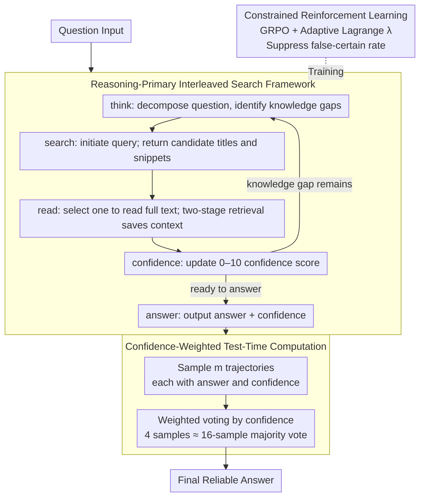

# Deliberative Searcher: Improving LLM Reliability via Reinforcement Learning with Constraints

**Conference**: ACL 2026  
**arXiv**: [2507.16727](https://arxiv.org/abs/2507.16727)  
**Code**: None  
**Area**: Reinforcement Learning  
**Keywords**: Confidence Calibration, Search-Augmented LLM, Constrained Reinforcement Learning, Reliability, Inference Efficiency

## TL;DR

This paper proposes Deliberative Searcher, a reasoning-primary framework that integrates search operations into CoT generation while maintaining explicit confidence calibration. Using constrained RL with adaptive Lagrange multipliers to jointly optimize correctness and reliability, it reduces the average "false-certain" rate of a 7B model from a baseline of 54% to 2%.

## Background & Motivation

**Background**: Search-enabled LLMs frequently exhibit confidence misalignment—providing high certainty for incorrect answers. This can lead to severe consequences in high-stakes scenarios such as decision support or medical Q&A.

**Limitations of Prior Work**: (1) There is a lack of reliable correspondence between the declared confidence of LLMs and their factual correctness; (2) Existing search-augmentation methods focus on accuracy but ignore reliability (i.e., the model should express uncertainty when unsure); (3) "False-certain" outputs represent the most dangerous state, as users cannot easily identify the error.

**Key Challenge**: Accuracy and reliability are distinct objectives—improving accuracy might be achieved by increasing certain expressions, which in turn raises the risk of "false-certain" outputs. Both must be optimized simultaneously.

**Goal**: Design an RL framework that optimizes both correctness and confidence calibration, enabling the model to produce reliable outputs during search-assisted reasoning.

**Key Insight**: Incorporate reliability constraints (limiting the "false-certain" rate) directly into the RL training objective, utilizing adaptive Lagrange multipliers to balance correctness and reliability.

**Core Idea**: Calibrated confidence not only provides reliable output but also drives efficient test-time computation—replacing standard majority voting with confidence-weighted aggregation, achieving the performance of 16 samples with only 4 samples.

## Method

### Overall Architecture

Deliberative Searcher weaves search actions directly into CoT reasoning: the model identifies knowledge gaps during reasoning, decides when to initiate retrieval, selects what to search, and determines how to integrate retrieved content back into the reasoning chain, ultimately outputting an answer alongside an explicit confidence score. During the training phase, constrained RL unifies correctness and the avoidance of overconfidence—the primary objective maximizes accuracy, while constraints strictly suppress the "false-certain" rate. During inference, calibrated confidence is reused for weighted voting, significantly reducing sampling costs.

### Key Designs

**1. Reasoning-primary interleaved search: Allowing the model to decide when and what to search**

Existing search-augmentation methods often treat retrieval as an independent preprocessing step (information-primary), where the model may search blindly without knowing its own knowledge gaps. This paper adopts a reasoning-primary approach: the entire response is organized as an autoregressive action sequence within the action space `{think, search, read, confidence, answer}`. `think` decomposes the problem and identifies gaps; `search` submits queries and retrieves candidate titles and snippets; `read` selects a specific candidate to read in full. This hierarchical retrieval compresses context length and creates explicit decision points for RL regarding whether and what to read. At each step, `confidence` reports a score from 0–10, and `answer` provides the final result. Since search is triggered by current reasoning states, the model better understands when external information is truly required.

**2. Constrained Reinforcement Learning (Adaptive Lagrange): Treating reliability as a hard constraint**

Accuracy and reliability are often conflicting objectives—solely pursuing accuracy might lead the model to falsely express certainty to gain points, increasing "false-certain" outputs. Instead of treating reliability as a soft weight in the reward function, this work formulates it as a constrained optimization problem: maximize expected accuracy while ensuring the reliability meets a specific threshold constraint. This is implemented by introducing a Lagrangian term into GRPO, converting the constraint into a penalty: $r_{\text{final}} = r_{\text{format}} \cdot (0.1\,r_{\text{format}} + 0.9\,r_{\text{acc}} + \lambda\,r_{\text{reliab}})$, where $r_{\text{reliab}}$ rewards "certainty when correct and uncertainty when incorrect" (using a confidence threshold $\zeta = 5$). Crucially, the multiplier $\lambda$ is not constant; it is dynamically updated during training via multiplicative-weights based on constraint violations. This ensures the "false-certain" rate is driven below the target threshold.

**3. Confidence-weighted test-time computation: Leveraging calibrated confidence to reduce sampling**

Since the model's confidence is calibrated, it can be used to optimize inference budgets. In standard majority voting, each sampled answer is weighted equally. Here, aggregation is performed using confidence-weighted voting—correct answers with high confidence contribute more weight, while low-confidence samples are naturally marginalized. Consequently, confidence-weighted aggregation with 4 samples matches the performance of 16-sample majority voting, reducing test-time computation by approximately 4$\times$. This efficiency is a direct benefit of effective calibration.

### Loss & Training

The total loss for constrained RL consists of the standard policy gradient loss plus the $\lambda \cdot$ constraint violation penalty. The parameter $\lambda$ is adaptively adjusted via dual gradient ascent to satisfy $P(\text{false-certain}) \leq \epsilon$. Training was conducted at both 7B and 72B scales.

## Key Experimental Results

### Main Results

**Average "False-Certain" Rate across five benchmarks**

| Method | False-Certain Rate ↓ | Accuracy |
|------|------------|--------|
| Search-Augmented Baseline | 54% | Medium |
| **Ours (7B)** | **2%** | Competitive |
| **Ours (72B)** | **9%** | Near Closed-Source |

### Ablation Study

| Configuration | Effect |
|------|------|
| Without Constrained RL | High accuracy but high false-certain rate |
| Fixed λ | Suboptimal—fails to balance objectives adaptively |
| Adaptive λ | Optimal—dynamically balances accuracy and reliability |
| Confidence-Weighted vs. Majority Vote | 4-sample weighted ≈ 16-sample majority |

### Key Findings

- The false-certain rate dropped from 54% to 2% (7B), fundamentally enhancing output reliability.
- The 72B model achieved accuracy competitive with closed-source models while maintaining low false-certain rates.
- Confidence-weighted aggregation achieved a 4$\times$ reduction in inference computation.
- Adaptive Lagrange multipliers outperformed multi-objective optimization with fixed weights.

## Highlights & Insights

- Formalizing reliability as a constrained optimization problem rather than an auxiliary goal ensures a guaranteed level of reliability.
- The dual value of confidence calibration: (1) user trust and (2) inference efficiency—addressing two challenges at once.
- The "false-certain" rate is identified as a core metric for LLM reliability with significant practical deployment implications.

## Limitations & Future Work

- The presentation of confidence scores (e.g., numeric vs. natural language) may affect user perception.
- The selection of the constraint threshold $\epsilon$ requires adjustment based on specific application scenarios.
- Search quality remains dependent on external engines; misinformation in search results may still be integrated.

## Related Work & Insights

- **vs. Standard Search-Augmented LLMs**: Standard methods ignore confidence calibration, whereas Deliberative Searcher explicitly optimizes for reliability.
- **vs. Self-Reflection Methods**: While reflection depends on internal model judgment, Deliberative Searcher ensures calibration through RL constraints.

## Rating

- Novelty: ⭐⭐⭐⭐⭐ The combination of constrained RL for reliability and confidence-weighted inference is highly novel.
- Experimental Thoroughness: ⭐⭐⭐⭐ Analyzed across five benchmarks, two model scales, and inference efficiency.
- Writing Quality: ⭐⭐⭐⭐ Clear problem definition and intuitive reliability framework.
- Value: ⭐⭐⭐⭐⭐ Significant practical implications for the reliable deployment of LLMs.

<!-- RELATED:START -->

## Related Papers

- [\[ICLR 2026\] Understanding and Improving Hyperbolic Deep Reinforcement Learning](../../ICLR2026/reinforcement_learning/understanding_and_improving_hyperbolic_deep_reinforcement_learning.md)
- [\[ACL 2026\] Scaling Behaviors of LLM Reinforcement Learning Post-Training: An Empirical Study](scaling_behaviors_of_llm_reinforcement_learning_post-training_an_empirical_study.md)
- [\[ACL 2026\] Efficient Hyperparameter Optimization for LLM Reinforcement Learning](efficient_hyperparameter_optimization_for_llm_reinforcement_learning.md)
- [\[ICLR 2026\] CUDA-L1: Improving CUDA Optimization via Contrastive Reinforcement Learning](../../ICLR2026/reinforcement_learning/cuda-l1_improving_cuda_optimization_via_contrastive_reinforcement_learning.md)
- [\[ICLR 2026\] Self-Improving Skill Learning for Robust Skill-based Meta-Reinforcement Learning](../../ICLR2026/reinforcement_learning/self-improving_skill_learning_for_robust_skill-based_meta-reinforcement_learning.md)

<!-- RELATED:END -->
