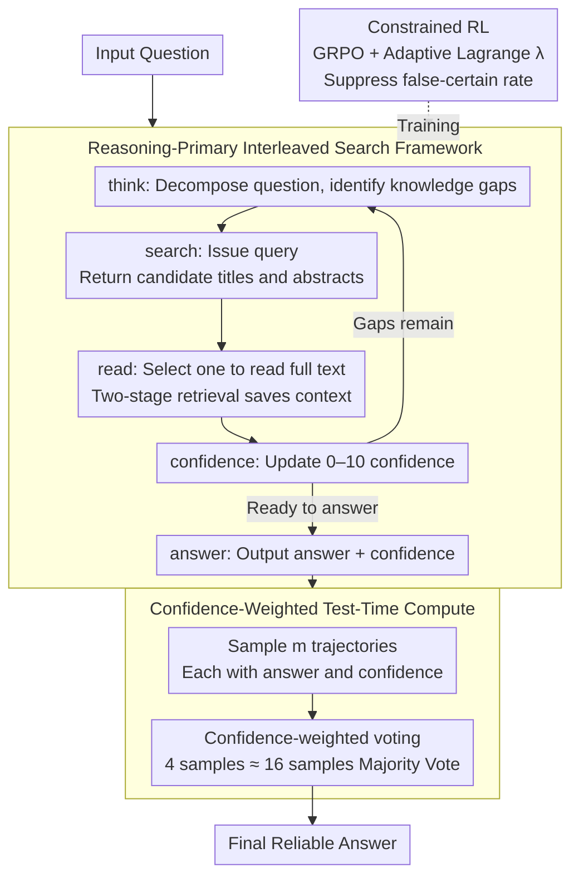

# Deliberative Searcher: Improving LLM Reliability via Reinforcement Learning with Constraints

**Conference**: ACL 2026  
**arXiv**: [2507.16727](https://arxiv.org/abs/2507.16727)  
**Code**: None  
**Area**: Reinforcement Learning  
**Keywords**: Confidence Calibration, Search-Augmented LLM, Constrained RL, Reliability, Inference Efficiency

## TL;DR

This paper proposes Deliberative Searcher, a reasoning-primary framework that integrates search operations into CoT generation while maintaining explicit confidence calibration. By employing constrained RL with adaptive Lagrange multipliers to jointly optimize correctness and reliability, the framework reduces the average "false-certain" rate of 7B models from a 54% baseline to 2%.

## Background & Motivation

**Background**: LLMs with search capabilities often exhibit confidence miscalibration—expressing high certainty in incorrect answers. This can lead to severe consequences in scenarios such as decision support and medical Q&A.

**Limitations of Prior Work**: (1) Lack of reliable correspondence between the declared confidence of LLMs and their factual correctness; (2) Existing search-augmentation methods focus on accuracy but ignore reliability (i.e., the model should express uncertainty when uncertain); (3) "False-certain" outputs are the most dangerous state as users cannot identify errors.

**Key Challenge**: Accuracy and reliability are distinct objectives—improving accuracy might be achieved by increasing certainty in expressions, which in turn increases the risk of "false-certain" outputs. Both need to be optimized simultaneously.

**Goal**: Design an RL framework that optimizes both correctness and confidence calibration, enabling the model to produce reliable outputs during search-assisted reasoning.

**Key Insight**: Incorporate reliability constraints (limiting the "false-certain" rate) directly into the RL training objective, using adaptive Lagrange multipliers to balance accuracy and reliability.

**Core Idea**: Calibrated confidence not only provides reliable outputs but also drives efficient test-time compute—replacing majority voting with confidence-weighted aggregation, achieving 16-sample performance with only 4 samples.

## Method

### Overall Architecture

Deliberative Searcher weaves search actions directly into CoT reasoning: the model identifies knowledge gaps during reasoning, decides when and what to retrieve, and determines how to integrate the retrieved content back into the reasoning chain, eventually outputting an answer along with an explicit confidence score. During training, constrained RL ties "answering correctly" and "avoiding false certainty" together—the primary objective increases accuracy while constraints strictly suppress the "false-certain" rate. During inference, the calibrated confidence is reused for weighted voting, significantly reducing sampling costs.

### Key Designs

**1. Reasoning-Primary Interleaved Search Framework: Letting the model decide when and how much to search**

Existing search-augmented methods often treat retrieval as an independent pre-processing step (information-primary), where the model may search blindly without knowing its own limitations. This paper adopts a reasoning-primary approach: the entire response is organized as an autoregressive action sequence within the action space `{think, search, read, confidence, answer}`. `think` decomposes the problem and identifies gaps; `search` submits queries and retrieves titles/abstracts; `read` selects specific documents for full reading. This hierarchical retrieval compresses context length and creates explicit decision points ("Should I read?" "Which one should I read?"), providing richer training signals for RL. At each step, `confidence` reports a 0–10 score, and `answer` provides the final result. Since search triggers are determined by the reasoning state, the model understands when external information is truly needed.

**2. Constrained Reinforcement Learning (Adaptive Lagrange): Treating reliability as a hard constraint rather than a soft weight**

Accuracy and reliability are often conflicting objectives—purely pursuing accuracy might lead the model to gain points by expressing "certainty," which elevates the dangerous "false-certain" rate. Instead of treating reliability as a soft reward term with hand-tuned weights, this paper formulates it as a constrained optimization problem: maximize expected accuracy while ensuring reliability satisfies a threshold constraint. This is implemented by introducing a Lagrangian term on top of GRPO, transforming constraints into penalties: $r_{\text{final}} = r_{\text{format}} \cdot (0.1\,r_{\text{format}} + 0.9\,r_{\text{acc}} + \lambda\,r_{\text{reliab}})$, where $r_{\text{format}}$ acts as a gate, and $r_{\text{reliab}}$ rewards "being certain when correct and uncertain when incorrect" (based on a confidence threshold $\zeta{=}5$). Crucially, the multiplier $\lambda$ is not constant; it is dynamically adjusted via multiplicative-weights during training based on constraint violations. This ensure the "false-certain" rate is suppressed below the target threshold.

**3. Confidence-Weighted Test-Time Compute: Using calibrated confidence to save sampling budget**

Since the model's confidence is well-calibrated, it can be used to optimize the inference budget. In standard majority voting, every sample has an equal vote. Here, samples are aggregated via confidence-weighted voting—high-confidence correct answers contribute more weight, while low-confidence samples are naturally weakened. Consequently, confidence-weighted aggregation with 4 samples matches the performance of 16-sample majority voting, reducing test-time compute by approximately 4×. This is a direct benefit of the previous designs: weighting is only smarter than equal voting when confidence is truly calibrated.

### Loss & Training

The total loss of constrained RL = standard policy gradient loss + $\lambda \cdot$ constraint violation penalty, where $\lambda$ is adaptively adjusted via dual gradient ascent to satisfy $P(\text{false-certain}) \leq \epsilon$. Training was conducted at both 7B and 72B scales.

## Key Experimental Results

### Main Results

**Average "False-Certain" Rate Across Five Benchmarks**

| Method | False-Certain Rate↓ | Accuracy |
|------|------------|--------|
| Search-Augmented Baseline | 54% | Medium |
| **7B Deliberative Searcher** | **2%** | Competitive |
| **72B Deliberative Searcher** | **9%** | Close to Closed-source |

### Ablation Study

| Configuration | Effect |
|------|------|
| W/O Constrained RL | High accuracy but high false-certain rate |
| Fixed λ | Suboptimal—unable to balance adaptively |
| Adaptive λ | Optimal—dynamically balances accuracy and reliability |
| Confidence-Weighted vs. Majority Voting | 4-sample weighted ≈ 16-sample majority voting |

### Key Findings

- The false-certain rate dropped from 54% to 2% (7B), fundamentally improving output reliability.
- The 72B model achieved accuracy competitive with closed-source models while maintaining low false-certain rates.
- Confidence-weighted aggregation achieved a 4× saving in inference computation.
- Adaptive Lagrange multipliers outperformed fixed-weight multi-objective optimization.

## Highlights & Insights

- Formalizing reliability as a constrained optimization problem rather than an auxiliary objective ensures reliability guarantees.
- The dual value of confidence calibration: (1) User trust and (2) Inference efficiency—killing two birds with one stone.
- The "false-certain" rate serves as a core metric for LLM reliability with significant practical deployment implications.

## Limitations & Future Work

- The expression of confidence scores (e.g., probability vs. natural language) may affect user perception.
- The selection of the constraint threshold $\epsilon$ requires adjustment based on application scenarios.
- Search quality depends on external search engines; misinformation in search results might still be integrated.

## Related Work & Insights

- **vs. Standard Search-Augmented LLMs**: Standard methods ignore confidence calibration, whereas Deliberative Searcher explicitly optimizes for reliability.
- **vs. Self-Reflection Methods**: Reflection methods rely on the model's internal judgment, while Deliberative Searcher ensures calibration through RL constraints.

## Rating

- Novelty: ⭐⭐⭐⭐⭐ The combination of constrained RL for reliability and confidence-weighted inference is highly novel.
- Experimental Thoroughness: ⭐⭐⭐⭐ Five benchmarks, two scales, and efficiency analysis.
- Writing Quality: ⭐⭐⭐⭐ Clear problem definition and intuitive four-quadrant reliability framework.
- Value: ⭐⭐⭐⭐⭐ High practical significance for the reliable deployment of LLMs.

<!-- RELATED:START -->

## Related Papers

- [\[ACL 2026\] Scaling Behaviors of LLM Reinforcement Learning Post-Training: An Empirical Study](scaling_behaviors_of_llm_reinforcement_learning_post-training_an_empirical_study.md)
- [\[ICLR 2026\] Understanding and Improving Hyperbolic Deep Reinforcement Learning](../../ICLR2026/reinforcement_learning/understanding_and_improving_hyperbolic_deep_reinforcement_learning.md)
- [\[ACL 2026\] Efficient Hyperparameter Optimization for LLM Reinforcement Learning](efficient_hyperparameter_optimization_for_llm_reinforcement_learning.md)
- [\[ICLR 2026\] Adaptive Scaling of Policy Constraints for Offline Reinforcement Learning](../../ICLR2026/reinforcement_learning/adaptive_scaling_of_policy_constraints_for_offline_reinforcement_learning.md)
- [\[ICLR 2026\] CUDA-L1: Improving CUDA Optimization via Contrastive Reinforcement Learning](../../ICLR2026/reinforcement_learning/cuda-l1_improving_cuda_optimization_via_contrastive_reinforcement_learning.md)

<!-- RELATED:END -->
