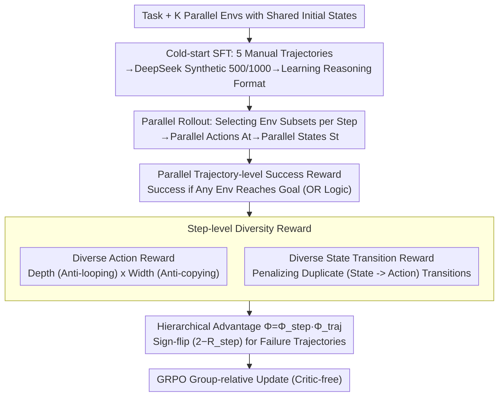

# DPEPO: Diverse Parallel Exploration Policy Optimization for LLM-based Agents

**Conference**: ACL 2026  
**arXiv**: [2604.24320](https://arxiv.org/abs/2604.24320)  
**Code**: https://github.com/LePanda026/Code-for-DPEPO  
**Area**: Reinforcement Learning / LLM Agent / GRPO Improvement  
**Keywords**: Parallel Exploration, GRPO, Diversity-Driven Reward, ALFWorld, ScienceWorld

## TL;DR
The authors propose a new paradigm of "Parallel Exploration"—where an agent interacts with $K$ environments synchronously and shares experiences across trajectories. This is supported by the **DPEPO** RL algorithm: it starts with a cold-start SFT to learn parallel reasoning, followed by GRPO training using hierarchical rewards (trajectory-level success + step-level Diverse Action/Diverse State Transition). DPEPO achieves SOTA across all splits of ALFWorld and ScienceWorld (98.2% and 61.4% respectively on Qwen2.5-7B), with token growth significantly lower than "multi-sampling" baselines as $K$ increases.

## Background & Motivation

**Background**: LLM-based autonomous agents predominantly follow the ReAct paradigm—"Think → Act → Observe → Think Again." In long-horizon tasks like ALFWorld or ScienceWorld, RL post-training methods (e.g., GRPO, GiGPO, RLVMR, SPEAR) have pushed success rates to 90%+.

**Limitations of Prior Work**: ReAct observes only a single trajectory per step, resulting in a **narrow and one-sided** understanding of the environment (termed a "narrow, linear view"). The most intuitive scaling—sampling multiple independent trajectories for the same task—suffers from two fatal flaws: (1) **Lack of Diversity**: despite increased output entropy, actions across multiple samplings tend to converge to similar choices; (2) **Efficiency and Isolation**: there is no experience sharing between trajectories, and sequential sampling leads to linear growth in token consumption and time.

**Key Challenge**: Traditional RL uses "multi-sampling" to trade compute for exploration, but the explored samples neither learn from each other nor avoid redundancy. Agents are forced to choose between "narrow vision" and "high cost," failing to understand environments both broadly and rapidly.

**Goal**: Enable an agent to interact **synchronously** with multiple environments sharing the same initial state within a single episode, sharing intermediate observations across environments while utilizing RL rewards that **actively discourage redundancy**.

**Key Insight**: Upgrade from "agent-to-environment (1:1)" to "agent-to-environment-set $\mathcal{E}=\{E_1,\ldots,E_K\}$ (1:K)." At each step, the agent selectively chooses a subset $\mathcal{E}'_t\subseteq\mathcal{E}$ to initiate parallel actions $A_t=\{(E_i, a_t)\}$, obtaining parallel states $S_t$ concurrently.

**Core Idea**: **Parallel Exploration as a Paradigm + Diversity as a Reward**—Treating parallel exploration as a paradigm-level extension of ReAct, and explicitly encoding "avoiding repetitive behavior" into the policy gradient via step-level diversity rewards to make the agent both broad and precise.

## Method

### Overall Architecture
DPEPO is a parallel extension of GRPO. Given a task and $K$ parallel environments $\mathcal{E}$ with shared initial states, the agent selects a subset $\mathcal{E}'_t$ at each step $t$, generates actions for each selected environment to form $A_t$, and executes them to obtain $S_t$, resulting in a trajectory $\tau=\{(S_t, A_t)\}_{t=1}^T$. Training consists of two stages: (1) Cold-start SFT, using 5 manually annotated ground-truth parallel trajectories to guide DeepSeek-V3.2 in generating 500/1000 SFT samples (ALFWorld/ScienceWorld) to teach the model parallel reasoning formats; (2) RL phase, using hierarchical rewards—parallel trajectory-level success + two step-level diversity rewards—optimized via GRPO's group-relative advantage. During inference, group size $N=8/4$, $K=4$, $T_{\max}=25$, and temperature 0.4.

### Key Designs

**1. Parallel Trajectory-level Success Reward: Redefining success as OR-style "Success if any environment reaches goal"**

In traditional ReAct, task success is a 0/1 reward on a single environment. Parallel settings require a new definition. This paper defines $R_{traj}(\tau)=1$ if $S_T\cap\mathcal{G}\neq\emptyset$ (success if any parallel environment reaches the target state), otherwise 0. This reward follows GRPO’s group-relative advantage: calculating mean and standard deviation from $N$ group trajectories, $\Phi_{traj}(\tau_i)=(R(\tau_i)-\text{mean})/\text{std}$. OR logic encourages the agent to treat $K$ environments as redundant backups and information sources—casting a wide net while needing only one successful path, which aligns with the essence of parallel computing. The group-relative format eliminates the need for a critic model.

**2. Diverse Action Reward: Using Depth × Width dimensions to transform action repetition into differentiable dense penalties**

Parallel exploration risks degradation if all $K$ environments perform the same task. The authors penalize action repetition within each step: $R_{action}(A_t)=\frac{1}{|\mathcal{E}'_t|}\sum_{E_i\in\mathcal{E}'_t}\alpha^{C_{depth}(E_i, a_t)}+\omega^{C_{width}(A_t)}$, where $C_{depth}$ counts how many times action $a_t$ has been repeated in the history of environment $E_i$ (Depth = anti-looping), and $C_{width}$ counts duplicate actions within $A_t$ for the current step (Width = anti-copying). $\alpha,\omega\in(0,1]$ are decay factors; more repetition drives the reward toward 0. This forces the $K$ parallel environments to explore complementary state spaces by converting "diversity" into optimizable gradient signals.

**3. Diverse State Transition Reward + Hierarchical Advantage: Penalizing repeated "State → Action" and flipping step-level reward signs based on outcome**

Actions alone are insufficient because the same action has different meanings in different states. The true unit of experience is the transition $p_t=s_t\to a_t$. Thus: $R_{transition}=\frac{1}{|\mathcal{E}'_t|}\sum_i\gamma^{M_{depth}(E_i, p_t)} + \frac{1}{|\mathcal{E}'_t|}\sum_i\beta^{M_{width}(E_i, p_t)}$, where $M_{depth}$ counts the transition frequency within $E_i$, and $M_{width}$ counts its appearance in other parallel environments. The average step-level reward $R_{step}=(R_{action}+R_{transition})/2$ is embedded into the trajectory advantage: if $\Phi_{traj}(\tau_i)>0$, then $\Phi_{step}=R_{step}$; otherwise, $\Phi_{step}=2-R_{step}$. The sign-flip $2-R_{step}$ is critical: diversity is a bonus in successful trajectories, but in failed trajectories, high step-level diversity indicates random trial-and-error and should be down-weighted. This allows the model to "explore boldly" while "converging intelligently."

### Loss & Training
The RL phase directly utilizes the GRPO policy objective (critic-free, relative advantage). Each task involves 500 RL samples, 125 training steps, 1 epoch. Group size $N$ is 8 for ALFWorld and 4 for ScienceWorld. Max steps is 25, with $K=4$ parallel environments. Cold-start behavioral cloning is performed via SFT on 500/1000 synthetic parallel trajectories.

## Key Experimental Results

### Main Results
**ALFWorld (Success Rate %) + ScienceWorld (Success Rate %) on Qwen2.5-Instruct**:

| Model / Method | ALFWorld In-Domain | ALFWorld OOD | ALFWorld Avg | SW L0 | SW L1 | SW L2 | SW Avg |
|------------|-------------------|--------------|--------------|-------|-------|-------|--------|
| GPT-4o (closed) | 48.0 | 66.0 | 57.0 | 45.4 | 49.2 | 41.0 | 45.2 |
| DeepSeek-R1 (closed) | 75.0 | 85.1 | 80.1 | 22.2 | 31.4 | 29.1 | 27.6 |
| **1.5B**: GRPO | 72.8 | 71.1 | 72.0 | 21.1 | 13.7 | 10.9 | 15.2 |
| **1.5B**: GiGPO | 86.7 | 83.2 | 85.0 | 25.8 | 15.2 | 4.7 | 15.2 |
| **1.5B**: RLVMR | 89.1 | 87.9 | 88.5 | 46.9 | 34.3 | 26.5 | 35.9 |
| **1.5B**: SPEAR | 93.2 | - | - | - | - | - | - |
| **1.5B**: **Ours (DPEPO)** | **95.7** | **92.5** | **94.1** | **59.8** | **58.1** | **34.2** | **50.7** |
| **7B**: GRPO | 77.6 | 77.3 | 77.5 | 49.1 | 30.1 | 26.6 | 35.3 |
| **7B**: GiGPO | 90.8 | 90.2 | 90.5 | 53.4 | 25.2 | 25.8 | 34.8 |
| **7B**: RLVMR | 91.4 | 91.8 | 91.6 | 67.2 | 43.0 | 32.2 | 47.5 |
| **7B**: SPEAR | 94.7 | - | - | - | - | - | - |
| **7B**: **Ours (DPEPO)** | **98.6** | **97.8** | **98.2** | **66.6** | **66.5** | **51.0** | **61.4** |

Ours (7B) outperforms the Prev. SOTA SPEAR (94.7) by 3.5 points in ALFWorld, and is 13.9 points higher than RLVMR (47.5) in ScienceWorld. Notably, Ours (1.5B) outperforms RLVMR (7B) in ScienceWorld.

**Inference Efficiency (ALFWorld, Same Setup)**:

| Method | Tokens | Steps | Time (s) |
|------|--------|-------|----------|
| DeepSeek-V3 | 950.0 | 20.5 | 62.4 |
| DeepSeek-R1 | 1667.9 | 24.8 | 237.0 |
| GiGPO | 1115.1 | 15.2 | 70.8 |
| **Ours** | 2283.4 | **12.3** | **44.7** |

While the token count is 2x that of GiGPO, the wall-clock time is the fastest due to reduced step count and the fact that parallel actions do not increase single-step execution time.

### Ablation Study

| Configuration | ALFWorld In | ALFWorld OOD | SW L0 | SW L1 | SW L2 |
|------|-------------|--------------|-------|-------|-------|
| ColdStart SFT Only | 93.6 | 97.8 | 66.5 | 62.2 | 48.1 |
| **Full DPEPO** | **98.6** | 97.8 | **66.6** | **66.5** | **51.0** |
| w/o Diverse Action Reward | 97.1 | 97.0 | 65.1 | 62.8 | 49.0 |
| w/o Diverse State Trans. Reward | 96.4 | 98.5 | 64.4 | 63.6 | 49.7 |
| w/o DAR & DTR | 96.4 | 98.5 | 66.3 | 65.7 | 49.9 |

The full DPEPO shows a Gain of +5.0 in ALFWorld In-Domain over SFT. Removing either diversity reward results in performance drops, but removing both is slightly better than removing one, suggesting they are an **interdependent** design.

### Key Findings
- **Parallel Exploration > Multi-sampling**: In ALFWorld, as $K$ increases, GiGPO's token count scales linearly whereas Ours remains nearly constant while outperforming GiGPO at all $K$. This is a success at the paradigm (rather than trick) level.
- **Small Model Superiority**: The 1.5B DPEPO outperforms the 7B RLVMR on ScienceWorld, showing that paradigm dividends can exceed parameter dividends.
- **Interdependent Dual Rewards**: Removing either DAR or DTR causes performance degradation, but removing both is slightly better—indicating the two rewards are coupled; independent use introduces misleading gradients.
- **Faster Inference**: DPEPO is 37% faster than GiGPO and 5x faster than DeepSeek-R1 in wall-clock time because parallel actions do not increase single-step time and total steps are halved.
- **OOD Robustness**: DPEPO remains optimal on ALFWorld OOD and ScienceWorld L2 (unseen variants/categories), suggesting that comprehensive cognition from parallel exploration generalizes.
- **4x Training Efficiency**: DPEPO reaches SOTA in 24 hours using 500 RL samples, whereas GiGPO requires 96 hours.

## Highlights & Insights
- **Paradigm Innovation over Tricks**: Expanding ReAct from "one environment at a time" to "multiple environments at a time" is a fundamental change, effectively the first systematic implementation of batched RL in the LLM agent domain.
- **Formalized Diversity-as-Reward**: Redefining "avoiding repetition" into Depth (intra-environment looping) × Width (inter-environment consistency) as quantified exponential decays is a clean reward shaping approach.
- **Failure Trajectory Reward Sign-flip**: Using $\Phi_{step}=2-R_{step}$ for failures is a clever detail that simultaneously encourages exploration while penalizing "aimless exploration." This outcome-conditioned reward shaping is transferable.
- **OR-Semantics for Task Success**: Embedding the "any environment success = total success" logic into RL training allows the agent to treat parallel environments as a robust hedge rather than requiring all paths to succeed.
- **Constant Tokens with Halved Time**: DPEPO clarifies the distinction between reducing steps, tokens, and time. By reducing step count while keeping wall-clock time low through parallelism, it offers high engineering value.

## Limitations & Future Work
- **Dependency on Reproducible Environments**: Environments must share initial states, which is difficult for real physical or web environments with irreversible actions. Future work involves training agents to complete different tasks in parallel.
- **Small K**: Experiments only explored $K=4$; the marginal gains and token inflation for $K=16/32$, and the necessity of increasing group size $N$ with $K$, remain unanalyzed.
- **Reliance on Synthetic SFT Data**: SFT data relies on manual trajectories expanded by LLMs, which may vary in quality for long-tail tasks.
- **Hyperparameter Sensitivity**: Sensitivity analysis for $\alpha, \omega, \gamma, \beta$ is missing.
- **Text-only Environments**: Only validated on ALFWorld and ScienceWorld; transferability to multimodal or real GUI environments is unverified.

## Related Work & Insights
- **vs GiGPO (Feng et al. 2025)**: GiGPO uses anchor-state groups for step-level advantages within single environments; DPEPO upgrades step rewards to "anti-redundancy" and breaks the single-environment constraint.
- **vs RLVMR (Zhang et al. 2025)**: RLVMR uses meta-reasoning rewards to reduce invalid exploration (reward extension); DPEPO changes the paradigm (Parallel), making the two orthogonal and combinable.
- **vs SPEAR (Qin et al. 2025)**: SPEAR uses self-imitation and intrinsic rewards; DPEPO uses parallel structures to broaden exploration directly without imitation memory.
- **vs DeepSeek-R1**: R1 is a CoT powerhouse in single environments but has the highest step count and time in agent tasks; DPEPO (7B) achieves higher performance than R1 with 5x fast wall-clock time.
- **vs Richens et al. 2025**: This work argues that agents need world models; DPEPO is an **algorithmic implementation** of this—parallel exploration directly assists agents in building more complete environment cognition.

## Rating
- Novelty: ⭐⭐⭐⭐⭐ Parallel exploration is a rare paradigm-level innovation in agent RL.
- Experimental Thoroughness: ⭐⭐⭐⭐ Extensive scale, baseline, and ablation testing; lacks real GUI/multimodal validation.
- Writing Quality: ⭐⭐⭐⭐ Clear conceptualization; some details on SFT synthesis could be more detailed.
- Value: ⭐⭐⭐⭐⭐ High practical value (SOTA with small models + faster wall-clock) and academic contribution (redefining ReAct).

<!-- RELATED:START -->

## Related Papers

- [\[ACL 2026\] Efficient Hyperparameter Optimization for LLM Reinforcement Learning](efficient_hyperparameter_optimization_for_llm_reinforcement_learning.md)
- [\[ACL 2026\] d-TreeRPO: Towards More Reliable Policy Optimization for Diffusion Language Models](d-treerpo_towards_more_reliable_policy_optimization_for_diffusion_language_model.md)
- [\[ACL 2026\] Visually-Guided Policy Optimization for Multimodal Reasoning](visually-guided_policy_optimization_for_multimodal_reasoning.md)
- [\[ICML 2026\] LABO: LLM-Accelerated Bayesian Optimization through Broad Exploration and Selective Experimentation](../../ICML2026/reinforcement_learning/labo_llm-accelerated_bayesian_optimization_through_broad_exploration_and_selecti.md)
- [\[ACL 2026\] Semantic-Space Exploration and Exploitation in RLVR for LLM Reasoning](semantic-space_exploration_and_exploitation_in_rlvr_for_llm_reasoning.md)

<!-- RELATED:END -->
