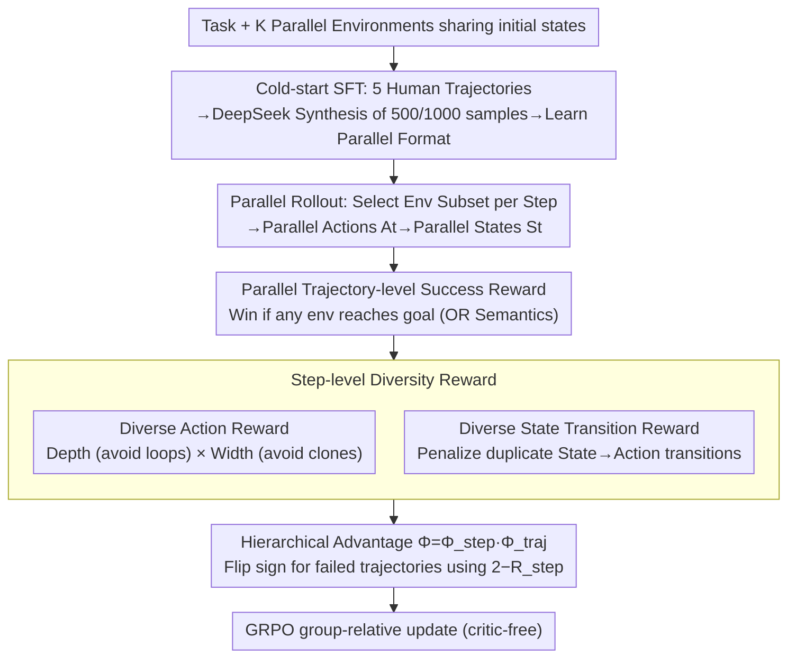

# DPEPO: Diverse Parallel Exploration Policy Optimization for LLM-based Agents

**Conference**: ACL 2026  
**arXiv**: [2604.24320](https://arxiv.org/abs/2604.24320)  
**Code**: https://github.com/LePanda026/Code-for-DPEPO  
**Area**: Reinforcement Learning / LLM Agent / GRPO Enhancement  
**Keywords**: Parallel Exploration, GRPO, Diversity-Driven Reward, ALFWorld, ScienceWorld

## TL;DR
The authors propose a new paradigm of "parallel exploration"—where an agent interacts with $K$ environments synchronously and shares experiences across trajectories—and introduce the corresponding RL algorithm **DPEPO**. It undergoes "Cold-start SFT" to learn parallel reasoning, followed by GRPO training with hierarchical rewards consisting of "Trajectory-level Success + Step-level Diverse Action / Diverse State Transition." DPEPO achieves SOTA on all ALFWorld and ScienceWorld splits (98.2% / 61.4% on Qwen2.5-7B), with token growth significantly lower than "multi-sampling" baselines as $K$ increases.

## Background & Motivation

**Background**: LLM-based autonomous agents almost exclusively follow the ReAct paradigm—"Thinking $\to$ Single-step Execution $\to$ Observation $\to$ Rethinking." In long-horizon tasks such as ALFWorld and ScienceWorld, RL post-training (GRPO, GiGPO, RLVMR, SPEAR) has successfully pushed success rates toward 90%+.

**Limitations of Prior Work**: ReAct can only observe a single trajectory at each step, leading to a **narrow and one-dimensional** environmental cognition (referred to as a "narrow, linear view"). The most straightforward extension—"sampling multiple independent trajectories for the same task"—faces two critical flaws: (1) **Lack of Diversity**: Despite increased output entropy, actions from multiple samples tend to converge toward similar choices; (2) **Efficiency and Isolation**: There is no experience sharing between trajectories, and sequential sampling causes token consumption and execution time to expand linearly.

**Key Challenge**: Traditional RL uses "multi-sampling" to gain exploration for LLM agents, but the explored samples neither learn from each other nor avoid computational redundancy. Agents are perpetually forced to choose between a "narrow vision vs. high cost," unable to understand environments both broadly and quickly.

**Goal**: To enable an agent to **synchronously** interact with multiple environments (sharing the same initial state) within a single episode, share intermediate observations across environments, and design RL rewards that **actively counteract redundancy**.

**Key Insight**: Upgrade from "one-to-one agent-environment" interaction to a "multi-to-one agent-environment set $\mathcal{E}=\{E_1,\ldots,E_K\}$." At each step, the agent autonomously selects a subset $\mathcal{E}'_t\subseteq\mathcal{E}$ and initiates parallel actions $A_t=\{(E_i, a_t)\}$, obtaining parallel states $S_t$ through concurrent execution.

**Core Idea**: **Parallel Exploration as a Paradigm + Diversity as a Reward**—Integrating "parallel exploration" as a paradigm-level extension of ReAct, and explicitly encoding the "avoidance of repetitive behavior" into the policy gradient via step-level diversity rewards to ensure the agent is both comprehensive and accurate.

## Method

### Overall Architecture
DPEPO is a parallel extension of GRPO. Given a task and $K$ parallel environments $\mathcal{E}$ sharing an initial state, the agent selects a subset $\mathcal{E}'_t$ at each step $t$, generates actions for each selected environment to form $A_t$, and executes them to obtain $S_t$, resulting in a trajectory $\tau=\{(S_t, A_t)\}_{t=1}^T$. Training consists of two stages: (1) Cold-start SFT, using 5 human-annotated ground-truth parallel trajectories to guide DeepSeek-V3.2 in synthesizing 500/1000 SFT data points (ALFWorld/ScienceWorld) so the model learns the "parallel thinking output format"; (2) RL stage, using hierarchical rewards—parallel trajectory-level success reward + two step-level diversity rewards—optimized with GRPO's group-relative advantage. During inference, group size $N=8/4$, $K=4$, $T_{\max}=25$, and temperature is 0.4.

### Key Designs

**1. Parallel Trajectory-level Success Reward: Redefining success as "Win if any environment reaches the goal" (OR logic)**

Traditional ReAct success is a 0/1 reward on a single environment; this must be redefined for parallel settings. This paper defines $R_{traj}(\tau)=1$ if $S_T\cap\mathcal{G}\neq\emptyset$ (if any parallel environment reaches the target state, the entire parallel trajectory is considered successful), and 0 otherwise. This reward is utilized via GRPO's group-relative advantage: calculating the mean and standard deviation from $N$ group trajectories, $\Phi_{traj}(\tau_i)=(R(\tau_i)-\text{mean})/\text{std}$. The OR logic encourages the agent to treat $K$ environments as both redundant backups and information sources—exploring broadly while needing only one "hit," which aligns with the nature of parallel computing.

**2. Diverse Action Reward: Encoding "action repetition" as differentiable dense penalties via Depth × Width**

The worst degradation in parallel exploration is when $K$ environments perform the same task, wasting parallelism. Action repetition is penalized within a step: $R_{action}(A_t)=\frac{1}{|\mathcal{E}'_t|}\sum_{E_i\in\mathcal{E}'_t}\alpha^{C_{depth}(E_i, a_t)}+\omega^{C_{width}(A_t)}$, where $C_{depth}$ counts how many times action $a_t$ has repeated in environment $E_i$'s history (depth direction = whether the same action is repeatedly tried within one env), and $C_{width}$ counts duplicate actions within $A_t$ at this step (width direction = whether multiple environments sent the same move). $\alpha,\omega\in(0,1]$ are decay factors; more repetition drives the reward toward 0. In short: the depth direction prevents "spinning in place" and the width direction prevents "copy-pasting," forcing the $K$ parallel environments to explore complementary state spaces.

**3. Diverse State Transition Reward + Hierarchical Advantage: Penalizing duplicate "State $\to$ Action" and flipping step-level rewards based on outcome**

Actions alone are insufficient because the same action has different semantics in different states; thus the true unit of experience is the transition. Transition is defined as $p_t=s_t\to a_t$, and $R_{transition}=\frac{1}{|\mathcal{E}'_t|}\sum_i\gamma^{M_{depth}(E_i, p_t)} + \frac{1}{|\mathcal{E}'_t|}\sum_i\beta^{M_{width}(E_i, p_t)}$, where $M_{depth}$ counts transition repetitions in $E_i$ and $M_{width}$ counts occurrences in other selected environments. The two step-level rewards are averaged as $R_{step}=(R_{action}+R_{transition})/2$, and embedded into trajectory-level advantage: if $\Phi_{traj}(\tau_i)>0$, then $\Phi_{step}=R_{step}$, otherwise $\Phi_{step}=2-R_{step}$. The final advantage is $\Phi(A_{i,t})=\Phi_{step}\cdot\Phi_{traj}$. The conditional flip $2-R_{step}$ is the key detail: diversity is a bonus in successful trajectories, but in failed trajectories, high diversity indicates the agent is guessing randomly and should be penalized—this teaches the model both "to explore" and "when to converge."

### Loss & Training
The RL stage directly applies the GRPO policy objective (critic-free, relative advantage). Each task utilizes 500 RL samples, 125 training steps, and 1 epoch. Group size $N$ is 8 for ALFWorld and 4 for ScienceWorld; max steps are 25, and parallel environment count is $K=4$. Cold start uses SFT on 500/1000 synthesized parallel trajectories for behavioral cloning.

## Key Experimental Results

### Main Results
**Success Rate (%) for ALFWorld and ScienceWorld on Qwen2.5-Instruct**:

| Model / Method | ALFWorld In-Domain | ALFWorld OOD | ALFWorld Avg | SW L0 | SW L1 | SW L2 | SW Avg |
|------------|-------------------|--------------|--------------|-------|-------|-------|--------|
| GPT-4o (closed) | 48.0 | 66.0 | 57.0 | 45.4 | 49.2 | 41.0 | 45.2 |
| DeepSeek-R1 (closed) | 75.0 | 85.1 | 80.1 | 22.2 | 31.4 | 29.1 | 27.6 |
| **1.5B**: GRPO | 72.8 | 71.1 | 72.0 | 21.1 | 13.7 | 10.9 | 15.2 |
| **1.5B**: GiGPO | 86.7 | 83.2 | 85.0 | 25.8 | 15.2 | 4.7 | 15.2 |
| **1.5B**: RLVMR | 89.1 | 87.9 | 88.5 | 46.9 | 34.3 | 26.5 | 35.9 |
| **1.5B**: SPEAR | 93.2 | - | - | - | - | - | - |
| **1.5B**: **Ours** | **95.7** | **92.5** | **94.1** | **59.8** | **58.1** | **34.2** | **50.7** |
| **7B**: GRPO | 77.6 | 77.3 | 77.5 | 49.1 | 30.1 | 26.6 | 35.3 |
| **7B**: GiGPO | 90.8 | 90.2 | 90.5 | 53.4 | 25.2 | 25.8 | 34.8 |
| **7B**: RLVMR | 91.4 | 91.8 | 91.6 | 67.2 | 43.0 | 32.2 | 47.5 |
| **7B**: SPEAR | 94.7 | - | - | - | - | - | - |
| **7B**: **Ours** | **98.6** | **97.8** | **98.2** | **66.6** | **66.5** | **51.0** | **61.4** |

7B DPEPO is 3.5 percentage points higher than the second-best SPEAR (94.7) on ALFWorld, and 13.9 points higher than RLVMR (47.5) on ScienceWorld. Remarkaby, 1.5B DPEPO (50.7) outperforms 7B RLVMR (47.5) on ScienceWorld.

**Inference Efficiency (ALFWorld, identical experimental settings)**:

| Method | Tokens | Steps | Time (s) |
|------|--------|-------|----------|
| DeepSeek-V3 | 950.0 | 20.5 | 62.4 |
| DeepSeek-R1 | 1667.9 | 24.8 | 237.0 |
| GiGPO | 1115.1 | 15.2 | 70.8 |
| **Ours** | 2283.4 | **12.3** | **44.7** |

Although token usage is 2× that of GiGPO, the wall-clock time is fastest because the number of steps is reduced and parallel execution does not increase single-step time.

### Ablation Study

| Configuration | ALFWorld In | ALFWorld OOD | SW L0 | SW L1 | SW L2 |
|------|-------------|--------------|-------|-------|-------|
| ColdStart SFT Only | 93.6 | 97.8 | 66.5 | 62.2 | 48.1 |
| **Ours (Full)** | **98.6** | **97.8** | **66.6** | **66.5** | **51.0** |
| w/o Diverse Action Reward | 97.1 | 97.0 | 65.1 | 62.8 | 49.0 |
| w/o Diverse State Trans. Reward | 96.4 | 98.5 | 64.4 | 63.6 | 49.7 |
| w/o Both | 96.4 | 98.5 | 66.3 | 65.7 | 49.9 |

Full DPEPO shows a +5.0 gain over ColdStart on ALFWorld In-Domain and +2.9 on ScienceWorld L2. Removing either diversity reward leads to performance drops, though removing both is slightly better than removing one—indicating that the two rewards are an **interdependent** holistic design where independent use disrupts trade-offs.

### Key Findings
- **Parallel Exploration > Multi-sampling**: Figure 4 shows that as $K$ increases on ALFWorld, GiGPO's token usage expands linearly while DPEPO's token consumption remains nearly constant; DPEPO outperforms GiGPO at all $K$, representing a paradigm-level (not just trick-level) victory.
- **Small Models Catch Up**: 1.5B DPEPO outperforms 7B RLVMR on ScienceWorld, showing that paradigm dividends can exceed model parameter dividends.
- **Dual Reward Interdependence**: Removing either DAR or DTR causes a drop, yet removing both is slightly better—suggesting these rewards are coupled and independent use introduces misleading gradients.
- **Faster Inference**: DREPO is 37% faster than GiGPO and 5× faster than DeepSeek-R1 in wall-clock time because parallel actions do not increase latency per step and total steps are halved.
- **OOD Robustness**: DPEPO remains best on ALFWorld OOD and ScienceWorld L2 (unseen variants + categories), indicating that "comprehensive cognition" from parallel exploration provides generalization capabilities.
- **4× Training Efficiency**: DPEPO reaches SOTA using 500 RL samples in 24 hours (GiGPO takes 96 hours); parallel environment reuse and step-level dense rewards significantly improve sample efficiency.

## Highlights & Insights
- **Paradigm-Level Innovation**: Shifting ReAct from "one environment at a time" to "multiple environments at once" is a fundamental change, similar to the first systematic implementation of batched RL for LLM agents.
- **Diversity-as-Reward Formalization**: Splitting "avoiding repetition" into depth (intra-environment + self-loop) and width (inter-environment + synchronization) and quantifying both via exponential decay is a elegant reward shaping design.
- **Reward Flipping for Failure**: The $\Phi_{step}=2-R_{step}$ inversion in failed trajectories is a brilliant detail—simultaneously encouraging exploration while penalizing "random exploration." This outcome-conditioned reward shaping can generalize to any RLHF task.
- **OR-Semantics for Task Success**: Smuggling the OR-logic of "any parallel environment success equals overall success" into RL training teaches the agent to use parallel environments as robust hedges.
- **Constant Tokens, Halved Wall-Clock Time**: In the LLM agent engineering community, the goals of "reducing steps," "reducing tokens," and "reducing time" are often conflated; DPEPO clearly disentangles these using inference timing data.

## Limitations & Future Work
- **Dependency on Reproducible Environments**: All parallel environments must share an initial state, which means real-world physical or web environments (with irreversible operations or external API status dependencies) are difficult to implement.
- **Scale of $K$**: Experiments were limited to $K=4$; the marginal gains or token bloat at $K=16/32$ were not explored, nor was the relationship between $K$ and group size.
- **SFT Data from Human + DeepSeek Synthesis**: 5 human trajectories plus LLM expansion may have inconsistent quality across long-tail tasks.
- **Hyperparameter Sensitivity**: Specific values and sensitivities for $\alpha, \omega, \gamma, \beta$ are omitted.
- **Text-only Environments**: Only tested on ALFWorld and ScienceWorld; transferability to multimodal or real GUI environments is unverified.

## Related Work & Insights
- **vs GiGPO (Feng et al. 2025)**: GiGPO uses anchor-state groups for step-level advantage but remains within the ReAct single-environment setup; DPEPO upgrades step rewards to "anti-redundancy" and breaks the single-env constraint.
- **vs RLVMR (Zhang et al. 2025)**: RLVMR addresses invalid exploration via meta-reasoning rewards; DPEPO changes the paradigm (parallelism) rather than the reward category, and the two are orthogonal.
- **vs SPEAR (Qin et al. 2025)**: SPEAR uses self-imitation + intrinsic rewards for exploration; DPEPO uses parallel structures to directly widen the exploration space without needing imitation memory.
- **vs DeepSeek-R1**: R1 is a single-environment CoT scaling powerhouse but shows high step counts and latency in agent tasks; DPEPO achieves higher performance than R1 at the 7B scale and is 5× faster in wall-clock time.
- **vs Richens et al. 2025 (General agents need world models)**: DPEPO is the **algorithmic implementation** of the argument that agents need comprehensive environment cognition, which parallel exploration directly provides.

## Rating
- Novelty: ⭐⭐⭐⭐⭐ Parallel exploration is a rare paradigm-level innovation in agent RL; the diverse reward design is also well-formed.
- Experimental Thoroughness: ⭐⭐⭐⭐ Covering 2 model scales × 2 benchmarks × 5 baselines + 4 ablations plus scaling and efficiency; only lacks verification in real GUI/multimodal environments.
- Writing Quality: ⭐⭐⭐⭐ Figure 1 perfectly captures the cognitive gap between ReAct and Parallel paradigms; math notation is rigorous.
- Value: ⭐⭐⭐⭐⭐ Extremely high practical value (SOTA with small models + faster wall-clock) + paradigm-level contribution + open-source code; directly actionable for agent RL research and deployment.

<!-- RELATED:START -->

<!-- RELATED:END -->

## Related Papers

- [\[ACL 2026\] Efficient Hyperparameter Optimization for LLM Reinforcement Learning](efficient_hyperparameter_optimization_for_llm_reinforcement_learning.md)
- [\[ACL 2026\] d-TreeRPO: Towards More Reliable Policy Optimization for Diffusion Language Models](d-treerpo_towards_more_reliable_policy_optimization_for_diffusion_language_model.md)
- [\[ICML 2026\] LABO: LLM-Accelerated Bayesian Optimization through Broad Exploration and Selective Experimentation](../../ICML2026/reinforcement_learning/labo_llm-accelerated_bayesian_optimization_through_broad_exploration_and_selecti.md)
- [\[ACL 2026\] Breaking the Impasse: Dual-Scale Evolutionary Policy Training for Social Language Agents](breaking_the_impasse_dual-scale_evolutionary_policy_training_for_social_language.md)
- [\[ACL 2026\] Semantic-Space Exploration and Exploitation in RLVR for LLM Reasoning](semantic-space_exploration_and_exploitation_in_rlvr_for_llm_reasoning.md)

<!-- RELATED:END -->
