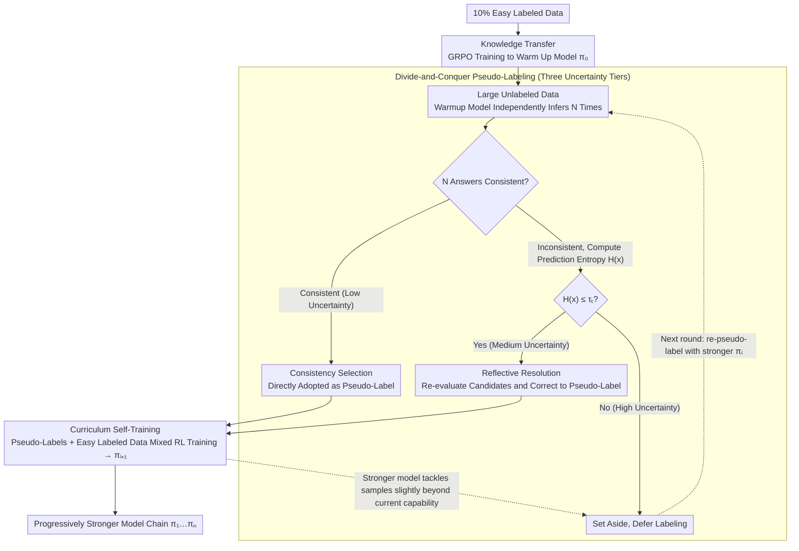

# Easy Samples Are All You Need: Self-Evolving LLMs via Data-Efficient Reinforcement Learning

**Conference**: ACL 2026 Findings  
**arXiv**: [2604.18639](https://arxiv.org/abs/2604.18639)  
**Code**: [https://github.com/YuZhiyin/EasyRL](https://github.com/YuZhiyin/EasyRL)  
**Area**: Reinforcement Learning / Data-Efficient Training  
**Keywords**: Data-Efficient RL, Self-Evolving LLM, Pseudo-labeling, Easy-to-Hard, Cognitive Learning Theory

## TL;DR

Ours proposes the EasyRL framework, inspired by cognitive development theory, which uses only 10% of simple labeled data to initialize the model via knowledge transfer, and then progressively masters difficult unlabeled data through divide-and-conquer pseudo-labeling and difficulty-incremental self-training, consistently outperforming GRPO trained on the full dataset.

## Background & Motivation

**Background**: RLVR has become a key post-training paradigm for enhancing LLM reasoning capabilities. Existing methods are divided into supervised (rely on labeled answers or reward models, high labeling costs) and unsupervised (construct rewards through voting or entropy estimation, prone to collapse or reward hacking).

**Limitations of Prior Work**: (1) Supervised methods require large amounts of high-quality labeled data, with the cost of labeling difficult problems being extremely high; (2) Performance gains of unsupervised methods are limited and unstable, easily leading to model collapse or reward hacking; (3) Neither considers the distribution of data difficulty—in reality, the cost of labeling simple problems is much lower than for difficult ones.

**Key Challenge**: The labeling cost for difficult problems is high but valuable, while the cost for simple problems is low but training on them alone is insufficient. How to use only a small amount of simple labeled data to gradually master a large amount of difficult unlabeled data?

**Goal**: Design a cognitive-inspired RL framework that evolves from limited simple labeled data to learn increasingly difficult reasoning tasks.

**Key Insight**: Vygotsky's "Zone of Proximal Development" (ZPD) theory—learners first internalize knowledge from simple, reachable cases, and then gradually expand to more difficult challenges with minimal external guidance.

**Core Idea**: (1) Use a small amount of simple labeled data to train a warmup model via GRPO; (2) Perform divide-and-conquer pseudo-labeling on unlabeled data—consistency selection for low-uncertainty samples, and reflection-correction for medium-uncertainty samples; (3) Iteratively expand the model's capability boundary through difficulty-incremental self-training.

## Method

### Overall Architecture

EasyRL consists of three stages: (1) Knowledge Transfer—training a warmup model on simple labeled data using GRPO; (2) Divide-and-Conquer Pseudo-labeling—the warmup model performs multiple inferences on unlabeled data, categorizing them into low/medium/high uncertainty groups to construct high-quality pseudo-labels via consistency selection and reflection-correction respectively; (3) Difficulty-Incremental Self-Training—iterative RL training using a mix of labeled and pseudo-labeled data, re-labeling high-uncertainty samples from the previous round in each iteration.

### Key Designs

**1. Divide-and-Conquer Pseudo-labeling Strategy: Categorizing unlabeled samples into three levels by uncertainty and labeling them appropriately.**

Directly generating pseudo-labels for unlabeled data via majority voting results in inconsistent quality, and hard samples can contaminate training with incorrect labels. EasyRL adopts a divide-and-conquer approach: for each unlabeled sample, the warmup model performs $N$ independent inferences. First, consistency selection is applied—if all $N$ outputs match, it indicates high confidence, and the answer is directly adopted as a pseudo-label (low uncertainty). If answers differ, the predictive entropy $H(x)$ is calculated; if $H(x)\leq\tau_t$, it undergoes reflection-correction, where the model re-evaluates candidates and corrects them to obtain a pseudo-label (medium uncertainty). High-uncertainty samples with $H(x)>\tau_t$ are left unlabeled for later iterations. These three levels correspond to "high-confidence direct adoption," "reflection for partial consistency," and "deferred processing for high uncertainty," thereby maximizing pseudo-label quality instead of relying blindly on voting.

**2. Difficulty-Incremental Self-Training: Letting the model tackle only samples slightly beyond its current capability in each round.**

Providing all hard problems at once prevents the model from labeling or learning effectively. EasyRL allows capabilities to climb round by round: in round $i$, the current model $\pi_i$ re-labels and filters high-uncertainty samples left over from the previous round. The successful samples are mixed with the original simple labeled data for RL training to obtain a stronger $\pi_{i+1}$. As the model strengthens, difficult problems it couldn't label before are gradually included with confidence. Thus, $\pi_1,\pi_2,\dots,\pi_n$ form a chain of increasing capability. This corresponds to Vygotsky's Zone of Proximal Development (ZPD)—the pseudo-labels included each round are precisely those tasks that are "slightly beyond current capability but reachable," preventing both waste from simplicity and collapse from excessive difficulty.

**3. Unified Perspective of Cognitive Learning Curves: Quantifying model growth using ConsRate.**

The first two designs are not isolated but collectively simulate the human cognitive acquisition curve: internalizing basic rules from simple cases (Knowledge Transfer), then transferring capabilities to harder new problems through analogy and self-reflection (Divide-and-Conquer Pseudo-labeling + Incremental Self-Training). Observable evidence for this framework is the consistency rate ConsRate (the proportion of samples where $N$ inferences yield identical answers), which rises progressively through iterations. This demonstrates that the model becomes increasingly certain about the same data, empirically validating the "incremental capability growth" hypothesis of the cognitive curve rather than remaining a mere metaphor.

### Loss & Training

Standard GRPO objective function. Correctness reward $r=1$ (match), $r=-0.5$ (format error), $r=0$ (otherwise). Evaluations are conducted on Qwen2.5-Math-1.5B/7B and Llama-3.2-3B. Simple labeled data accounts for 10% of the total (selected from simple subsets based on AoPS difficulty levels).

## Key Experimental Results

### Main Results

| Model / Method | Math Avg. | Science Avg. | Labeled Data Volume |
|----------|---------|---------|----------|
| Qwen2.5-Math-1.5B Base | 32.6 | 1.5 | 0 |
| w/ Supervised GRPO (10%) | 35.7 | 7.9 | 10% |
| w/ Unsupervised EMPO | 38.5 | 15.6 | 0 |
| w/ EasyRL Iter3 | **40.3** | **19.4** | 10% |
| Qwen2.5-Math-7B Base | 38.5 | 24.1 | 0 |
| w/ Supervised GRPO (10%) | 43.3 | 27.4 | 10% |
| w/ EasyRL Iter3 | **50.6** | **30.6** | 10% |

### Ablation Study

| Configuration | Effect | Description |
|------|------|------|
| Knowledge Transfer only (warmup) | Baseline | Simple data only |
| + Divide-and-Conquer Pseudo-labeling Iter1 | Gain | Incorporates easy unlabeled data |
| + Iter2 | Further Gain | Incorporates medium-difficulty data |
| + Iter3 | Optimal | Incorporates more difficult data |

### Key Findings

- EasyRL with 10% simple labeled data outperforms Supervised GRPO using the full dataset.
- Iterative self-training brings continuous improvements: Iter1→Iter2→Iter3 shows steady growth across both Math and Science benchmarks.
- Pseudo-label consistency rate increases with iterations, confirming self-evolution of model capability.
- EasyRL is effective on out-of-distribution tasks (Science reasoning), indicating the acquisition of general reasoning skills.
- The reflection mechanism significantly improves pseudo-label quality for medium-uncertainty samples.

## Highlights & Insights

- **The "simple samples are all you need" finding has practical value**: Labeling hard problems is expensive; EasyRL proves that labeling simple problems is sufficient to cover hard ones through self-evolution. This is highly meaningful for real-world scenarios with limited labeling resources.
- **Divide-and-conquer strategy based on uncertainty is natural**: The three-tier strategy (total consistency → reflection/correction → deferred processing) applies the most appropriate handling to each tier.
- **Cognitive science theory provides methodological guidance**: ZPD theory is not a simple analogy but guides specific design choices (easy-to-hard, incremental expansion).

## Limitations & Future Work

- Evaluation of pseudo-labels through multiple inferences incurs significant computational cost.
- Convergence speed and the final upper bound of iterative self-training depend on the quality of the initial warmup model.
- Defining "simple" and "hard" depends on AoPS difficulty labels; similar grading is not available in all domains.
- Behavior on larger models (>7B) has not been explored.

## Related Work & Insights

- **vs Standard GRPO (Full Supervision)**: EasyRL surpasses fully supervised GRPO using only 10% simple data through self-evolution, proving that data quality and learning strategy are more important than data volume.
- **vs Unsupervised EMPO**: EMPO requires no labeling but has limited and unstable performance gains. EasyRL uses a small amount of simple labels as anchors to achieve more stable self-evolution.

## Rating

- Novelty: ⭐⭐⭐⭐ Introduction of cognitive learning theory is inspiring; the combination of divide-and-conquer pseudo-labeling and incremental self-training is clever.
- Experimental Thoroughness: ⭐⭐⭐⭐⭐ Evaluated across 3 models, Math and Science benchmarks, multi-round iteration ablations, and pseudo-label quality analysis.
- Writing Quality: ⭐⭐⭐⭐ Motivation is clear; well-explained correspondence between theoretical motivation and method design.

<!-- RELATED:START -->

## Related Papers

- [\[ICLR 2026\] R-Zero: Self-Evolving Reasoning LLM from Zero Data](../../ICLR2026/reinforcement_learning/r-zero_self-evolving_reasoning_llm_from_zero_data.md)
- [\[ICML 2026\] D$^2$Evo: Dual Difficulty-Aware Self-Evolution for Data-Efficient Reinforcement Learning](../../ICML2026/reinforcement_learning/d2evo_dual_difficulty-aware_self-evolution_for_data-efficient_reinforcement_lear.md)
- [\[ICML 2026\] Metis: Learning to Jailbreak LLMs via Self-Evolving Metacognitive Policy Optimization](../../ICML2026/reinforcement_learning/metis_learning_to_jailbreak_llms_via_self-evolving_metacognitive_policy_optimiza.md)
- [\[ICLR 2026\] SPELL: Self-Play Reinforcement Learning for Evolving Long-Context Language Models](../../ICLR2026/reinforcement_learning/spell_self-play_reinforcement_learning_for_evolving_long-context_language_models.md)
- [\[ACL 2026\] LearnAlign: Data Selection for LLM Reinforcement Learning with Improved Gradient Alignment](learnalign_data_selection_for_llm_reinforcement_learning_with_improved_gradient_.md)

<!-- RELATED:END -->
