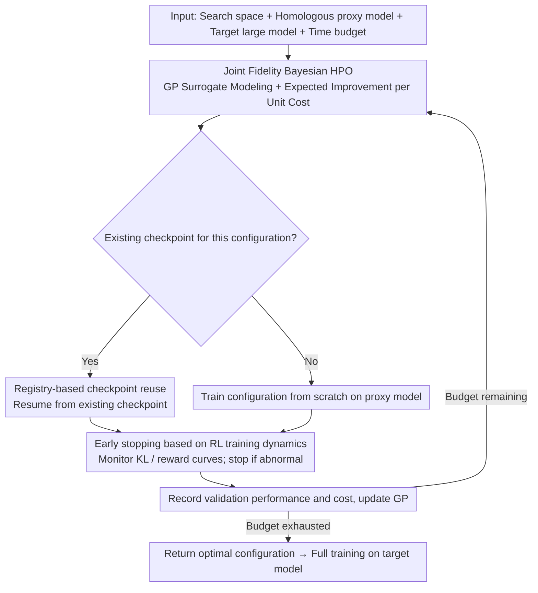

# Efficient Hyperparameter Optimization for LLM Reinforcement Learning

**Conference**: ACL2026  
**arXiv**: [2606.03073](https://arxiv.org/abs/2606.03073)  
**Code**: None  
**Area**: LLM RL / Hyperparameter Optimization  
**Keywords**: LLM RL, Hyperparameter Optimization, Bayesian Optimization, Multi-fidelity Search, GRPO

## TL;DR
This paper proposes JF-HPO, which integrates small homologous proxy models, training step fidelity, training dynamic early stopping, and checkpoint reuse into a Bayesian HPO framework. It finds more stable hyperparameters for LLM reinforcement learning at significantly lower costs and outperforms VeRL Recipe, Random Search, and BOHB across multiple reasoning tasks.

## Background & Motivation
**Background**: LLM RLHF/RLVR training increasingly relies on policy optimization algorithms like PPO and GRPO. Verifiable rewards are commonly used to train models in mathematical reasoning and multiple-choice Q&A. In practice, frameworks such as VeRL provide recommended hyperparameter sets, which researchers typically adopt directly or tune using general HPO methods like Random Search or BOHB.

**Limitations of Prior Work**: LLM RL is highly sensitive to hyperparameters such as learning rate, clip ratio, KL coefficient, and the number of rollouts; minor variations can lead to significant differences in final accuracy and training stability. However, traditional HPO requires a full training run of the large model for every trial—involving both token-by-token rollout and backpropagation—making the cost of a single trial too high for systematic searching.

**Key Challenge**: HPO requires a large number of trials to find an optimal configuration, yet each trial in LLM RL is expensive. Existing multi-fidelity methods mainly focus on shortening the training budget but fail to exploit the opportunity where "homologous small models can approximate the ranking of large model configurations," nor do they implement early stopping tailored to RL training dynamics.

**Goal**: The authors aim to explore more hyperparameter configurations within a fixed time budget while maintaining performance ranking correlation between proxy and target models. The ultimate goal is not to change GRPO/PPO itself, but to make these RL algorithms easier to tune reliably.

**Key Insight**: This paper treats both "model scale" and "training budget" as fidelity dimensions. In the low-fidelity stage, the system uses $0.5B$ to $1B$ homologous proxy models to quickly evaluate configurations. In the high-fidelity stage, only the best configurations are migrated to $7B/8B/14B$ target models for full training.

**Core Idea**: Replace brute-force tuning on large models with joint fidelity Bayesian optimization, while using training dynamic early stopping and checkpoint reuse to prune ineffective trials as early as possible.

## Method
The core of JF-HPO is not a new RL objective, but a redesign of the HPO evaluation unit around the LLM RL training process. It represents each candidate configuration as $(\phi_t, r_t)$: where $\phi_t$ includes hyperparameters such as learning rate, scheduler, actor clip ratio, gradient clip, KL loss coefficient, and rollout count; $r_t$ represents the training step fidelity. Model fidelity is reflected through the selection of proxy and target models.

### Overall Architecture
The input consists of a hyperparameter search space, a small homologous proxy model, the target large model, and a total time budget. JF-HPO first uses a Gaussian Process (GP) surrogate to model the relationship between "configuration + training step fidelity" and both performance and cost. It then uses expected improvement per unit cost to select the next configuration-fidelity pair. Once selected, the system prioritizes training on the proxy model; if a checkpoint for the same configuration at a lower step count exists, it resumes from that checkpoint. During training, it monitors KL divergence and reward curves, terminating early if significant instability or a lack of learning signal is detected. After each trial, the validation performance and time cost are recorded in the observation set to update the GP and continue the search. Once the budget is exhausted, the algorithm returns the optimal configuration for final full training and testing on the target large model.

### Key Designs

**1. Joint Fidelity Bayesian HPO: Treating model scale and training steps as fidelity to shift searching to cheap proxy models**

Traditional multi-fidelity HPO only shortens training steps, but each trial still runs on the target large model, resulting in limited cost savings. Relying purely on small models lacks high-fidelity calibration for the large model. JF-HPO incorporates both "model scale" and "training steps" into fidelity control. It uses a Gaussian Process surrogate to model the relationship between configuration, performance, and cost. The acquisition function is defined as expected performance improvement per unit cost: $\alpha(\phi_t,r_t)=\mathbb{E}[f'(\theta',\phi_t,r_t)-f^*(\theta,\phi^+,r_{max})\mid D]/\mathbb{E}[C(\theta',\phi_t,r_t)]$, which prioritizes cost-effective trials. A key premise is that the proxy and target models must belong to the same series and share architecture so that hyperparameter rankings successfully transfer. This allows the algorithm to explore cheaply with $0.5B–1B$ proxies early on, mapping only the winning configurations to the $7B/8B/14B$ target models for final training.

**2. Early stopping based on RL training dynamics: Using reward/KL curve anomalies to prune bad configurations before completion**

Failure in LLM RL often manifests in training curves before final benchmark accuracy—waiting for full training to finish before identifying a bad trial wastes budget. JF-HPO monitors two signals: KL divergence and training reward. If the rate of KL increase exceeds a threshold $\tau_1$ for $k$ consecutive global steps, it indicates the policy is drifting too fast from the reference model. If the reward decrease exceeds $\tau_2$ or remains zero, the configuration is failing to produce valid updates. Trials are terminated immediately if either condition is met. The experiments use $\tau_1=15\%$, $\tau_2=10\%$, and $k=5$ to replace delayed benchmark evaluation with real-time loss prevention.

**3. Registry-based checkpoint reuse: Allowing continued training during fidelity promotion instead of restarting**

Multi-fidelity schedules like successive halving repeatedly increase the training budget for surviving configurations, evaluating the same configuration at higher fidelity levels. If every stage starts from zero, the cost of previous low-fidelity training is wasted. Since RL rollout and backpropagation are expensive, this waste is significant. JF-HPO maintains a registry for each trial, recording hyperparameters, budget, steps completed, and the checkpoint path. When a configuration matures from low to high fidelity, the system resumes directly from the existing checkpoint, converting exploratory trials into parts of the subsequent training. This component provided the largest performance gain in ablation studies.

### Loss & Training
The underlying RL algorithm uses GRPO to demonstrate effectiveness. GRPO avoids training an independent value function by computing group-relative advantages across multiple sampled outputs for a single prompt. It uses a clipped policy objective with a KL penalty. Hyperparameters searched include learning rate, LR scheduler, actor clip ratio, gradient clip, KL loss coefficient, and rollout count. The search space consists of continuous or discrete intervals around the VeRL Recipe. Experiments use a $48$-hour time budget and train the target model for $3$ epochs after the optimal configuration is found.

## Key Experimental Results

### Main Results
The paper evaluates the method on GSM8K, MATH, OpenBookQA, and MMLU using LLaMA-3.1 8B, Qwen-2.5 7B, and Qwen-3 14B. JF-HPO outperformed or matched baselines in 22 out of 24 task-model combinations in Table 2.

| Model | Method | GSM8K | MATH | OpenBookQA | MMLU | Average |
|------|------|------:|-----:|-----------:|-----:|--------:|
| LLaMA-3.1 8B | VeRL Recipe | 67.32 | 22.99 | 83.00 | 61.22 | 58.63 |
| LLaMA-3.1 8B | BOHB | 86.66 | 48.62 | 85.80 | 66.08 | 71.79 |
| LLaMA-3.1 8B | JF-HPO | 87.11 | 48.64 | 87.80 | 68.34 | 72.97 |
| Qwen-2.5 7B | VeRL Recipe | 83.47 | 63.21 | 88.20 | 68.81 | 75.92 |
| Qwen-2.5 7B | BOHB | 81.65 | 70.29 | 91.00 | 69.58 | 78.13 |
| Qwen-2.5 7B | JF-HPO | 88.17 | 68.19 | 91.00 | 71.23 | 79.65 |
| Qwen-3 14B | VeRL Recipe | 93.03 | 70.21 | 90.60 | 70.92 | 81.19 |
| Qwen-3 14B | JF-HPO | 94.84 | 71.83 | 92.60 | 72.14 | 82.85 |

### Ablation Study
Ablations on GSM8K + Qwen-2.5 7B show all three components are effective, with checkpointing being the most critical.

| Configuration | Accuracy | Description |
|------|---------:|------|
| JF-HPO | 88.17 | Full method |
| w/o proxy model | 86.88 | No small model proxy; search efficiency drops |
| w/o checkpointing | 84.84 | Redundant training overhead; fewer explored configs |
| w/o early stopping | 86.35 | Budget wasted on bad configurations |

### Efficiency & Generalization
| Model | Method | Overall Throughput | Avg. Time/Trial | Trial Speedup |
|------|------|-------------------:|----------------:|--------------:|
| Qwen-2.5 7B | Random Search | 521.6 tokens/s | 8.80 h | 1.0x |
| Qwen-2.5 7B | BOHB | 521.6 tokens/s | 2.20 h | 4.0x |
| Qwen-2.5 7B | JF-HPO | 8772.0 tokens/s | 0.59 h | 14.9x |
| LLaMA-3.1 8B | Random Search | 864.9 tokens/s | 5.38 h | 1.0x |
| LLaMA-3.1 8B | BOHB | 864.9 tokens/s | 1.80 h | 3.0x |
| LLaMA-3.1 8B | JF-HPO | 7167.3 tokens/s | 0.59 h | 9.1x |

Appendix results further show that after training on MATH using Qwen-2.5 7B, JF-HPO increased OOD performance on AMC 2023 from 27.71 to 44.58 and on AIME 2025 from 0.0 to 3.3. For LLaMA-3.1 8B on MMLU sub-domains, gains over VeRL Recipe were 8.18% (Humanities), 5.93% (STEM), 7.42% (Social), and 7.64% (Other).

### Key Findings
- Learning rate is the most sensitive hyperparameter; performance degrades significantly beyond $1e^{-6}$. A larger learning rate with a cosine scheduler is more stable than a constant scheduler.
- There is a high correlation in configuration rankings between proxy and target models: out of 5 configurations (120 rankings), Spearman's $\rho = 0.90$ and Kendall's $\tau = 0.80$.
- JF-HPO yields higher gains on harder samples: Qwen-2.5 7B improved from 38.80 to 46.07 on MATH Level-5, a relative increase of 18.74%.

## Highlights & Insights
- Expanding HPO "low fidelity" from simple step reduction to "small model + few steps" aligns better with LLM RL cost structures, where rollout and backprop costs grow sharply with model scale.
- The early stopping criteria are highly practical: rapid KL spikes and sustained zero rewards are early failure signals in RL training, precluding the need for full benchmark runs to identify bad trials.
- The checkpoint registry is an overlooked but practical design. Successive multi-fidelity HPO naturally revisits configurations; reusing checkpoints converts trial runs into useful training progress.
- A useful empirical takeaway: when migrating from proxy to target models, pay attention to hyperparameter sensitivity. Low-sensitivity parameters like the KL loss coefficient migrate easily, while learning rate and actor clip ratio are prone to overfitting on small models.

## Limitations & Future Work
- The authors note that JF-HPO depends on a stable performance ranking correlation between proxy and target models; this correlation has not been verified for migrations from dense proxies to structurally different targets like MoE.
- Experiments focused on math reasoning, Q&A, and MMLU, omitting open-ended generation tasks like creative writing. In such tasks, rewards are more subjective, and hyperparameter landscapes may differ from RLVR scenarios.
- Due to resource constraints, only $0.5B$ to $1B$ proxies and up to $14B$ targets were used. Fidelity choices and correlation boundaries for $70B+$ models remain for future study.
- Future work could extend JF-HPO to new RL algorithms like DAPO or REINFORCE++ and investigate theoretical bounds for proxy-target ranking correlation.

## Related Work & Insights
- **vs VeRL Recipe**: VeRL Recipe provides recommended hyperparameters at low cost but cannot adapt to different tasks and models; JF-HPO retains the VeRL framework while searching for task-specific configurations for higher average performance.
- **vs Random Search**: Random Search avoids surrogate models but is too costly for LLM RL trials; JF-HPO explores more configurations using expected improvement per unit cost and proxy models.
- **vs BOHB / Successive Halving**: BOHB allocates training budgets but still primarily trains on the target large model; JF-HPO reduces both model scale and training budget while avoiding redundant training via checkpointing.
- **Insight**: For any expensive post-training pipeline, consider using small models from the same family as hyperparameter ranking probes rather than using them only for algorithm prototyping.

## Rating
- Novelty: ⭐⭐⭐⭐☆ The combination of proxy-model fidelity, step fidelity, and RL dynamic early stopping is well-suited to the actual bottlenecks of LLM RL.
- Experimental Thoroughness: ⭐⭐⭐⭐☆ Covers multiple models and tasks with ablations, efficiency, and OOD analysis, though open generation and massive models are missing.
- Writing Quality: ⭐⭐⭐⭐☆ Motivation, algorithm, and experimental tables are clear; engineering details are sufficient to replicate the primary ideas.
- Value: ⭐⭐⭐⭐⭐ Extremely useful for resource-constrained teams, directly addressing the practical challenge of making LLM RL tuning affordable.

<!-- RELATED:START -->

## Related Papers

- [\[ACL 2026\] DPEPO: Diverse Parallel Exploration Policy Optimization for LLM-based Agents](dpepo_diverse_parallel_exploration_policy_optimization_for_llm-based_agents.md)
- [\[ACL 2026\] LearnAlign: Data Selection for LLM Reinforcement Learning with Improved Gradient Alignment](learnalign_data_selection_for_llm_reinforcement_learning_with_improved_gradient_.md)
- [\[ICLR 2026\] FAPO: Flawed-Aware Policy Optimization for Efficient and Reliable Reasoning](../../ICLR2026/reinforcement_learning/fapo_flawed-aware_policy_optimization_for_efficient_and_reliable_reasoning.md)
- [\[ICML 2026\] Revisiting Regularized Policy Optimization for Stable and Efficient Reinforcement Learning in Two-Player Games](../../ICML2026/reinforcement_learning/revisiting_regularized_policy_optimization_for_stable_and_efficient_reinforcemen.md)
- [\[ICLR 2026\] QuRL: Efficient Reinforcement Learning with Quantized Rollout](../../ICLR2026/reinforcement_learning/qurl_efficient_reinforcement_learning_with_quantized_rollout.md)

<!-- RELATED:END -->
