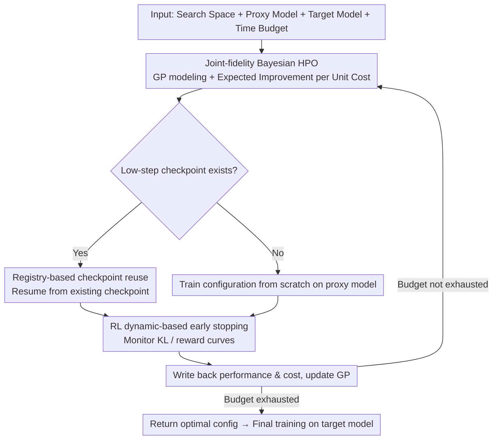

# Efficient Hyperparameter Optimization for LLM Reinforcement Learning

**Conference**: ACL2026  
**arXiv**: [2606.03073](https://arxiv.org/abs/2606.03073)  
**Code**: None  
**Area**: LLM Reinforcement Learning / Hyperparameter Optimization  
**Keywords**: LLM Reinforcement Learning, Hyperparameter Optimization, Bayesian Optimization, Multi-fidelity Search, GRPO

## TL;DR
This paper proposes JF-HPO, which integrates small intra-family proxy models, training step fidelity, training dynamic early stopping, and checkpoint reuse into a Bayesian HPO framework. This approach finds more stable hyperparameters for LLM reinforcement learning at a lower cost and outperforms VeRL Recipe, Random Search, and BOHB across multiple reasoning tasks.

## Background & Motivation
**Background**: LLM RLHF/RLVR training increasingly relies on policy optimization algorithms like PPO and GRPO. Verifiable rewards are commonly used for training models in mathematical reasoning and multiple-choice Q&A tasks. In practice, frameworks like VeRL provide a set of recommended hyperparameter recipes, which researchers often adopt directly or tune using general HPO methods such as Random Search or BOHB.

**Limitations of Prior Work**: LLM RL is highly sensitive to hyperparameters such as learning rate, clip ratio, KL coefficient, and rollout counts; small variations can lead to significantly different final accuracy and training stability. However, traditional HPO requires a full training run for each trial, involving both token-by-token rollout and backpropagation, making the cost per trial too high for systematic searching.

**Key Challenge**: HPO requires numerous trials to find optimal configurations, while each individual LLM RL trial is expensive. Existing multi-fidelity methods primarily shorten training budgets but do not fully exploit the opportunity of using "small intra-family models to approximate the configuration rankings of large models," nor do they implement early stopping tailored to RL training dynamics.

**Goal**: The authors aim to explore more hyperparameter configurations within a fixed time budget while maintaining performance ranking correlation between the proxy model and the target model. The ultimate goal is not to modify GRPO/PPO themselves, but to make these RL algorithms more reliably tunable.

**Key Insight**: This paper treats both "model scale" and "training budget" as fidelity dimensions. In the low-fidelity stage, 0.5B to 1B intra-family proxy models are used to evaluate configurations quickly. In the high-fidelity stage, only the optimal configurations are migrated to 7B/8B/14B target models for full training.

**Core Idea**: Use joint-fidelity Bayesian optimization instead of brute-force tuning on large models, and use training dynamic early stopping and checkpoint reuse to prune invalid trials as early as possible.

## Method
The core of JF-HPO is not a new RL objective but a redesign of the evaluation unit for HPO around the LLM RL training process. It represents each candidate configuration as $(\phi_t, r_t)$: where $\phi_t$ includes hyperparameters like learning rate, scheduler, actor clip ratio, gradient clip, KL loss coefficient, and rollout count, and $r_t$ is the training step fidelity. Model fidelity is reflected in the selection of the proxy and target models.

### Overall Architecture
The input consists of a hyperparameter search space, a small intra-family proxy model, a target large model, and a total time budget. JF-HPO first employs a Gaussian Process (GP) surrogate to model the relationship between "configuration + training step fidelity" and both performance and cost. It then uses expected improvement per unit cost to select the next configuration-fidelity pair. Once selected, the system prioritizes training on the proxy model; if a checkpoint for the same configuration at a lower step exist, training resumes from that checkpoint. During training, it monitors KL divergence and reward curves, terminating early if significant instability or a lack of learning signal is observed. After each trial, the validation performance and time cost are recorded in the observation set to update the GP and continue the search. Once the budget is exhausted, the algorithm returns the optimal configuration for final training and testing on the target large model.

### Key Designs

**1. Joint-fidelity Bayesian HPO: Treating both model scale and training steps as fidelity to concentrate search on cheap proxy models**

Traditional multi-fidelity HPO only shortens training steps, but running each trial on the target large model still limits cost savings. Conversely, using only small models lacks high-fidelity calibration for the large model. JF-HPO incorporates both "model scale" and "training steps" into fidelity control. It uses a Gaussian Process surrogate to model configurations against performance and cost, using an acquisition function that represents "expected improvement per unit cost": $\alpha(\phi_t,r_t)=\mathbb{E}[f'(\theta',\phi_t,r_t)-f^*(\theta,\phi^+,r_{max})\mid D]/\mathbb{E}[C(\theta',\phi_t,r_t)]$. This prioritizes high-ROI trials. The key assumption is that the proxy and target models belong to the same family and share an architecture, allowing relative hyperparameter rankings to transfer. This allows the algorithm to explore cheaply with 0.5B–1B models and only map the winners to 7B/8B/14B models for full training.

**2. RL Dynamic-based Early Stopping: Pruning bad configurations using reward/KL anomalies instead of waiting for completion**

Failures in LLM RL often manifest in training curves long before final evaluation. JF-HPO monitors two signals: KL divergence and training reward. If the KL growth ratio exceeds threshold $\tau_1$ for $k$ consecutive global steps, the policy is drifting too fast from the reference model. If the reward drop ratio exceeds $\tau_2$ or remains at 0, the configuration is failing to produce valid policy updates. Hitting either condition terminates the trial. Using $\tau_1=15\%$, $\tau_2=10\%$, and $k=5$, the system replaces delayed benchmark feedback with real-time loss mitigation.

**3. Registry-based Checkpoint Reuse: Enabling continued training during multi-fidelity promotion**

Successive halving processes repeatedly expand the budget for surviving configurations. If training starts from zero each time, the costs of previous low-fidelity trials are wasted. Since LLM RL rollouts and backpropagation are expensive, JF-HPO maintains a registry for each trial, recording hyperparameters, budget, steps, and paths. When a configuration is promoted, it resumes from the existing checkpoint, effectively converting trial runs into part of the final training.

### Loss & Training
The underlying RL algorithm uses GRPO to demonstrate efficacy. GRPO omits a separate value function, instead using group-relative advantage across sampled outputs for a single prompt, employing a clipped policy objective with a KL penalty. Hyperparameters searched include learning rate, LR scheduler, actor clip ratio, gradient clip, KL loss coefficient, and rollout count. The search space is centered around VeRL Recipe intervals. A 48-hour time budget is used, followed by 3 training epochs for the target model.

## Key Experimental Results

### Main Results
The paper evaluates LLaMA-3.1 8B, Qwen-2.5 7B, and Qwen-3 14B on GSM8K, MATH, OpenBookQA, and MMLU. JF-HPO outperformed or matched baseline methods in 22 out of 24 task-model runs.

| Model | Method | GSM8K | MATH | OpenBookQA | MMLU | Average |
|------|------|------:|-----:|-----------:|-----:|--------:|
| LLaMA-3.1 8B | VeRL Recipe | 67.32 | 22.99 | 83.00 | 61.22 | 58.63 |
| LLaMA-3.1 8B | BOHB | 86.66 | 48.62 | 85.80 | 66.08 | 71.79 |
| LLaMA-3.1 8B | JF-HPO | 87.11 | 48.64 | 87.80 | 68.34 | 72.97 |
| Qwen-2.5 7B | VeRL Recipe | 83.47 | 63.21 | 88.20 | 68.81 | 75.92 |
| Qwen-2.5 7B | BOHB | 81.65 | 70.29 | 91.00 | 69.58 | 78.13 |
| Qwen-2.5 7B | JF-HPO | 88.17 | 68.19 | 91.00 | 71.23 | 79.65 |
| Qwen-3 14B | VeRL Recipe | 93.03 | 70.21 | 90.60 | 70.92 | 81.19 |
| Qwen-3 14B | JF-HPO | 94.84 | 71.83 | 92.60 | 72.14 | 82.85 |

### Ablation Study
Ablations on GSM8K with Qwen-2.5 7B show all three components are effective, with checkpointing being the most critical to performance.

| Configuration | Accuracy | Description |
|------|---------:|------|
| JF-HPO | 88.17 | Full method |
| w/o proxy model | 86.88 | Search efficiency drops without proxy |
| w/o checkpointing | 84.84 | Reduced configurations explored due to overhead |
| w/o early stopping | 86.35 | Budget utilization drops as bad trials persist |

### Efficiency & Generalization

| Model | Method | Overall Throughput | Avg. Time/Trial | Trial Speedup |
|------|------|-------------------:|----------------:|--------------:|
| Qwen-2.5 7B | Random Search | 521.6 tokens/s | 8.80 h | 1.0x |
| Qwen-2.5 7B | BOHB | 521.6 tokens/s | 2.20 h | 4.0x |
| Qwen-2.5 7B | JF-HPO | 8772.0 tokens/s | 0.59 h | 14.9x |
| LLaMA-3.1 8B | Random Search | 864.9 tokens/s | 5.38 h | 1.0x |
| LLaMA-3.1 8B | BOHB | 864.9 tokens/s | 1.80 h | 3.0x |
| LLaMA-3.1 8B | JF-HPO | 7167.3 tokens/s | 0.59 h | 9.1x |

### Key Findings
- Learning rate is the most sensitive hyperparameter; performance degrades beyond $1e^{-6}$. A larger LR with a cosine scheduler is more stable than a constant scheduler.
- Proxy and target models show high configuration ranking correlation: across 120 rankings from 5 configurations, Spearman is 0.90 and Kendall is 0.80.
- JF-HPO yields higher gains on difficult samples: Qwen-2.5 7B improved from 38.80 to 46.07 on MATH Level-5, an 18.74% relative Gain.

## Highlights & Insights
- Expanding "low-fidelity" from fewer steps to "small model + fewer steps" better fits the cost structure of LLM RL, where rollout and backprop costs scale drastically with model size.
- Early stopping criteria are highly practical: rapid KL spikes and sustained zero rewards are observable failure signals in RL that precede final benchmark results.
- The checkpoint registry is a subtle but vital design. Multi-fidelity promotion naturally revisits configurations; reuse converts exploratory trials into cumulative training progress.
- Insight: When migrating from proxy to target models, focus on hyperparameter sensitivity. Low-sensitivity parameters like the KL loss coefficient transfer easily, whereas LR and actor clip ratio are more prone to small-model-success but large-model-overfitting failures.

## Limitations & Future Work
- The authors note that JF-HPO relies on stable performance ranking correlation between models. Transferring from dense proxies to structurally different targets (e.g., MoE) remains unverified.
- Experiments focused on math, Q&A, and MMLU, excluding creative writing or open-ended generation where rewards are more subjective.
- Resource constraints limited experiments to 0.5B-1B proxies and 14B targets. Fidelity selection and checkpoint costs for 70B+ models require further study.
- Future work could extend JF-HPO to other RL algorithms (e.g., DAPO, REINFORCE++) and investigate theoretical bounds for proxy-target ranking correlations.

## Related Work & Insights
- **vs VeRL Recipe**: VeRL Recipe provides fixed recommendations that are low-cost but lack adaptation; JF-HPO systematic search delivers higher task-specific performance.
- **vs Random Search**: Random Search avoids surrogate overhead but is prohibitively expensive for large model trials; JF-HPO explores more configs using expected improvement per unit cost.
- **vs BOHB / Successive Halving**: BOHB manages budgets but still trains primarily on the target model; JF-HPO reduces both scale and steps while avoiding redundant training via checkpointing.
- **Insight**: For any expensive post-training process, small models within a family should be viewed as hyperparameter ranking probes rather than just targets for algorithm prototyping.

## Rating
- Novelty: ⭐⭐⭐⭐☆ Combines proxy-model fidelity, training step fidelity, and RL dynamic early stopping in a manner that addresses real LLM RL bottlenecks.
- Experimental Thoroughness: ⭐⭐⭐⭐☆ Comprehensive across models and tasks with ablation and efficiency analysis, though open generation and very large models are missing.
- Writing Quality: ⭐⭐⭐⭐☆ Motivation, algorithm, and experimental tables are clear; engineering details are sufficient for reproducing core ideas.
- Value: ⭐⭐⭐⭐⭐ Extremely useful for resource-constrained teams, addressing the practical question of how to afford LLM RL hyperparameter tuning.

<!-- RELATED:START -->

## Related Papers

- [\[ACL 2026\] DPEPO: Diverse Parallel Exploration Policy Optimization for LLM-based Agents](dpepo_diverse_parallel_exploration_policy_optimization_for_llm-based_agents.md)
- [\[ACL 2026\] LearnAlign: Data Selection for LLM Reinforcement Learning with Improved Gradient Alignment](learnalign_data_selection_for_llm_reinforcement_learning_with_improved_gradient_.md)
- [\[ICML 2026\] Revisiting Regularized Policy Optimization for Stable and Efficient Reinforcement Learning in Two-Player Games](../../ICML2026/reinforcement_learning/revisiting_regularized_policy_optimization_for_stable_and_efficient_reinforcemen.md)
- [\[ICLR 2026\] FAPO: Flawed-Aware Policy Optimization for Efficient and Reliable Reasoning](../../ICLR2026/reinforcement_learning/fapo_flawed-aware_policy_optimization_for_efficient_and_reliable_reasoning.md)
- [\[ICLR 2026\] QuRL: Efficient Reinforcement Learning with Quantized Rollout](../../ICLR2026/reinforcement_learning/qurl_efficient_reinforcement_learning_with_quantized_rollout.md)

<!-- RELATED:END -->
