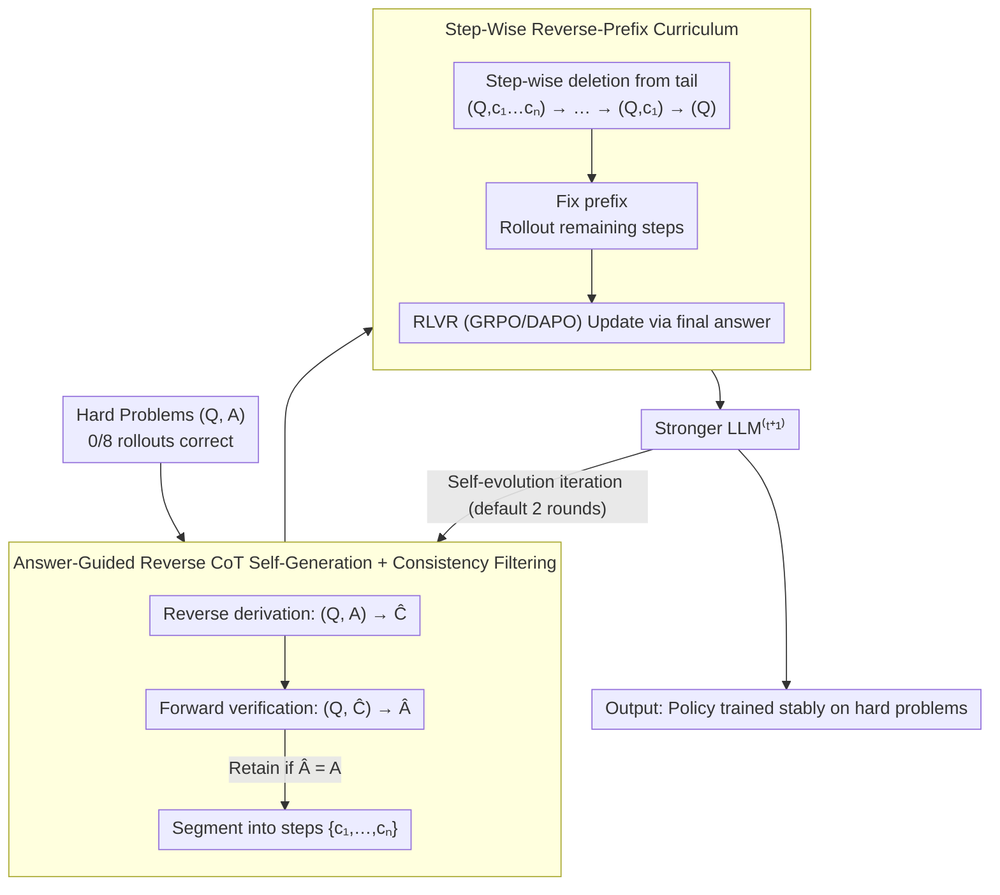

# EvoCoT: Overcoming the Exploration Bottleneck in Reinforcement Learning for LLMs

**Conference**: ACL 2026  
**arXiv**: [2508.07809](https://arxiv.org/abs/2508.07809)  
**Code**: <https://github.com/gtxygyzb/EvoCoT>  
**Area**: Reinforcement Learning / LLM Reasoning / Curriculum Learning  
**Keywords**: RLVR, Chain-of-Thought, Curriculum Learning, Self-Evolution, Sparse Reward

## TL;DR
This paper proposes EvoCoT, a two-stage self-evolving curriculum learning framework. It first constrains the LLM with final answers to self-generate verifiable CoT trajectories, then progressively deletes reasoning steps from the tail to expand the exploration space. This enables stable RLVR training on hard problems with sparse rewards without relying on teacher models or human-written CoTs, significantly improving the accuracy of R1-Qwen-1.5B on hard MATH training set problems from 55.7% to 87.8%.

## Background & Motivation

**Background**: RLVR (Reinforcement Learning with Verifiable Reward) has become the mainstream paradigm for LLM reasoning post-training, as evidenced by DeepSeek-R1 and Kimi-k1.5. This process involves rollout sampling, rule-based verification of the final answer, and updating policies using GRPO/DAPO. However, this method depends on rollouts hitting the correct answer to receive a reward.

**Limitations of Prior Work**: Rollout hit rates on hard problems are extremely low (even after GRPO training, Qwen2.5-7B fails to solve 8.8% of GSM8K and 22.0% of MATH). Rewards remain sparse for long periods, leading to near-zero learning signals. Existing solutions fall into two categories: (i) Teacher-model dependence (LUFFY / Guide-GRPO / ReLIFT / TAPO / SRFT), requiring distillation from GPT-4o-class models, which is unsuitable for training flagship models; (ii) Curriculum learning filtering (RORL / AdaRFT / SEC), which discards hard problems that could otherwise contribute learning signals.

**Key Challenge**: Hard problems are critical for expanding the upper bound of model reasoning capabilities, but sparse rewards prevent RLVR from learning from them. How to enable LLMs to learn from hard problems under the constraints of "distillation-free" and "unfiltered" is a fundamental bottleneck in RLVR identified by Yue / Zhao (2025).

**Goal**: (i) Design a distillation-free and unfiltered training framework; (ii) Enable models to receive dense rewards on hard problems where the initial 0/8 rollouts were incorrect; (iii) Ensure orthogonality with existing GRPO/DAPO methods to serve as a post-training enhancement layer.

**Key Insight**: The authors identify the mismatch between the "large exploration space" and the "current model capability" as the bottleneck (Figure 1). By temporarily constraining the exploration space to where the LLM can reach, hard problems generate dense reward signals; the exploration space is then incrementally expanded to approach the original task difficulty. While this aligns with curriculum learning, prior methods either used difficulty buckets (requiring external labels) or static reverse curriculum like R3/AdaBack (requiring complete CoT data).

**Core Idea**: Transform each hard problem into "self-generated CoT + progressively shortened prefix." Longer CoTs require the model to only complete the end (low difficulty), while shorter CoTs require more generation (approaching original difficulty). Each sample provides an "easy-to-hard" gradient without external labels or teacher CoTs.

## Method

### Overall Architecture
EvoCoT is an iterative framework with two nested stages. Stage 1 (Answer-Guided Reasoning Path Self-Generation): For each hard problem $(Q,A)$, the LLM generates $\hat{C}$ conditioned on the answer $A$. Consistency check $(Q,\hat{C}) \to \hat{A}$ is applied, retaining only $\hat{C}$ where $\hat{A}=A$, and segmenting it into steps $\{\hat{c_1},\dots,\hat{c_n}\}$ via "\n\n". Stage 2 (Step-Wise Curriculum Learning): Steps are deleted from the tail—starting with $(Q,c_1,\dots,c_n)$, then $(Q,c_1,\dots,c_{n-1})$, ..., $(Q,c_1)$, and finally $(Q)$—creating a gradient from full-prefix guidance to zero guidance. Each prefix is fixed during rollout, with remaining steps freely generated and updated via RLVR. These stages iterate $t$ times (Equation 5); as LLM capability improves, Stage 1 generates higher-quality CoTs in subsequent rounds.

### Key Designs

**1. Answer-Guided Reverse CoT Self-Generation + Answer-Consistency Filtering**

EvoCoT generates reliable reasoning chains from hard problems where rollouts failed. By providing both $Q$ and $A$ to the LLM, the model "reverse derives" a reasoning chain $\hat{C}$ that supports the answer $(Q,A) \xrightarrow{\text{LLM}} \hat{C}$. Generating a reasonable CoT with the answer is significantly easier than forward derivation. To prevent answer leakage or shortcuts, a forward consistency check $(Q,\hat{C}) \xrightarrow{\text{LLM}} \hat{A}$ ensures $\hat{A}=A$. This generates reasoning chains without teacher models while ensuring they lead to the correct answer.

**2. Step-Wise Reverse-Prefix Curriculum**

To avoid SFT-style memorization, EvoCoT segments verified CoTs into steps $\{c_1,\dots,c_n\}$ and constructs a sequence $(Q,c_1,\dots,c_n) \to (Q,c_1,\dots,c_{n-1}) \to \dots \to (Q,c_1) \to (Q)$. Each prefix acts as a teacher-forcing constraint. Long prefixes reduce exploration space and increase reward density, while shorter prefixes expand the space as the model stabilizes. Deleting down to $(Q)$ prevents reward hacking by ensuring the model can eventually derive $A$ from $Q$ alone. Unlike R3/AdaBack, EvoCoT does not require external CoT data.

**3. Self-Evolving Iterative Optimization**

Training is limited by the initial quality of self-generated CoTs. EvoCoT utilizes an iterative loop: in round $t$, $\text{LLM}^{(t)}$ generates $\hat{C}^{(t)}$ to train $\text{LLM}^{(t+1)}$, which then generates higher quality $\hat{C}^{(t+1)}$ in the next round (Equation 5). This mechanism is orthogonal to RL algorithms like GRPO/DAPO and serves as a drop-in enhancement for RLVR pipelines.

### Loss & Training
Stage 2 utilizes RLVR (defaulting to GRPO, compatible with DAPO/PRIME). Rollouts follow a fixed prefix, and rewards are based on rule-based verification of the final answer. In Stage 1, hard problems are filtered from GSM8K + MATH training sets (8 failed rollouts), and 8 CoTs are sampled per problem (temperature=1.0). Experiments were conducted on 8×A100 (40GB) with fixed training steps. EvoCoT defaults to 2 iterations.

## Key Experimental Results

### Main Results (Cross-family comparison on 6 math benchmarks, pass@1)

| Model + Method | GSM8K | MATH | AIME24 | AMC23 | Minerva | Olympiad | Avg |
|------------|-------|------|--------|-------|---------|----------|-----|
| Llama3.1-8B + GRPO | 78.5 | 23.1 | 0.0 | 5.0 | 4.4 | 6.2 | 19.5 |
| Llama3.1-8B + EvoCoT | 80.5 | 23.8 | 0.0 | 7.5 | 4.8 | 5.8 | **20.4** |
| DeepSeek-Math-7B + GRPO | 79.8 | 38.7 | 0.0 | 15.0 | 16.2 | 12.4 | 27.0 |
| DeepSeek-Math-7B + EvoCoT | 76.3 | 39.1 | 0.0 | 20.0 | 19.1 | 13.0 | **27.9** |
| Qwen2.5-7B + GRPO (SimpleRL) | 92.4 | 79.7 | 10.0 | 52.5 | 34.6 | 38.1 | 51.2 |
| Qwen2.5-7B + EvoCoT | 91.4 | 76.5 | 20.0 | 60.0 | 37.1 | 35.9 | **53.5** |
| R1-Qwen-1.5B + DeepScaleR (GRPO) | 88.2 | 89.4 | 36.7 | 77.5 | 38.2 | 51.6 | 63.6 |
| R1-Qwen-1.5B + EvoCoT | 88.0 | 89.7 | **40.0** | **87.5** | **42.8** | **52.0** | **66.7** |

R1-Qwen-1.5B + EvoCoT significantly outperforms DeepScaleR on AMC23 (+10pp), AIME24 (+3.3pp), and Minerva (+4.6pp).

### Ablation Study (Hard Problems + Iteration)

| Configuration | GSM8K (Hard) | MATH (Hard) | Avg |
|------|--------------|--------------|------|
| Qwen2.5-7B + GRPO | 91.2 | 78.0 | 84.6 |
| Qwen2.5-7B + EvoCoT | 95.4 | 82.7 | **89.1** |
| R1-Qwen-1.5B + GRPO | 80.7 | 55.7 | 68.2 |
| R1-Qwen-1.5B + EvoCoT | 91.9 | **87.8** | **89.9** |

Self-evolution iteration (R1-Qwen-1.5B avg): iter0 = 63.6 → iter1 = 64.3 → **iter2 = 66.7** → iter3 = 65.8 (starts to plateau).

### Key Findings
- **Strong models benefit more**: R1-Qwen-1.5B on hard MATH jumped from 55.7 to 87.8 (+32.1), whereas Llama3.1-8B showed little change. Self-evolution depends on the base model crossing a quality threshold in Stage 1.
- **Stable correct rollouts**: Figure 2 shows R1-Qwen-1.5B maintaining 220+ correct/256 rollouts, while GRPO oscillates between 0-5. This confirms the effectiveness of constrained exploration.
- **Superiority over SFT**: Compared to STaR-style SFT, EvoCoT reached 53.5 while SFT only achieved 36.9 for Qwen2.5-7B. Curriculum RL prevents the memorization pitfalls of SFT.
- **Data Efficiency**: Using only GSM8K + MATH, results are comparable to PRIME (53.5 vs 55.3), which uses 380K samples.

## Highlights & Insights
- **The "Reverse Answer-Guided" Prior**: While traditional RL moves from CoT to answer, EvoCoT uses the answer to generate CoT then validates forward. This dual constraint improves self-synthesized CoT quality in weak supervision settings.
- **Sample-Level Curriculum**: Unlike methods requiring external labels or CoT data, EvoCoT's prefix deletion creates a difficulty gradient within each sample.
- **Orthogonality**: It does not replace RL algorithms but modifies the training sample structure, acting as a drop-in enhancement for existing pipelines.

## Limitations & Future Work
- Ineffective on weak models where the Stage 1 generation quality is too low.
- Self-evolution plateaus after ~2 rounds.
- Validation is focused on math; extensibility to code or tool-use is yet to be proven.
- High training cost due to multi-round rollouts and iterations.

## Related Work & Insights
- **vs LUFFY / Guide-GRPO**: These rely on teacher models; EvoCoT is self-sufficient.
- **vs RORL / AdaRFT**: These filter by difficulty; EvoCoT remains unfiltered.
- **vs STaR**: EvoCoT upgrades answer-rationalization from SFT to RL curriculum, significantly improving performance.

## Rating
- Novelty: ⭐⭐⭐⭐
- Experimental Thoroughness: ⭐⭐⭐⭐
- Writing Quality: ⭐⭐⭐⭐
- Value: ⭐⭐⭐⭐⭐

<!-- RELATED:START -->

## Related Papers

- [\[ACL 2026\] RL-PLUS: Countering Capability Boundary Collapse of LLMs in Reinforcement Learning with Hybrid-policy Optimization](rl-plus_countering_capability_boundary_collapse_of_llms_in_reinforcement_learnin.md)
- [\[ACL 2026\] Targeted Exploration via Unified Entropy Control for Reinforcement Learning](targeted_exploration_via_unified_entropy_control_for_reinforcement_learning.md)
- [\[ACL 2026\] Free Energy-Driven Reinforcement Learning with Adaptive Advantage Shaping for Unsupervised Reasoning in LLMs](free_energy-driven_reinforcement_learning_with_adaptive_advantage_shaping_for_un.md)
- [\[ACL 2026\] HEALing Entropy Collapse: Enhancing Exploration in Few-Shot RLVR via Hybrid-Domain Entropy Dynamics Alignment](healing_entropy_collapse_enhancing_exploration_in_few-shot_rlvr_via_hybrid-domai.md)
- [\[ACL 2026\] Semantic-Space Exploration and Exploitation in RLVR for LLM Reasoning](semantic-space_exploration_and_exploitation_in_rlvr_for_llm_reasoning.md)

<!-- RELATED:END -->
