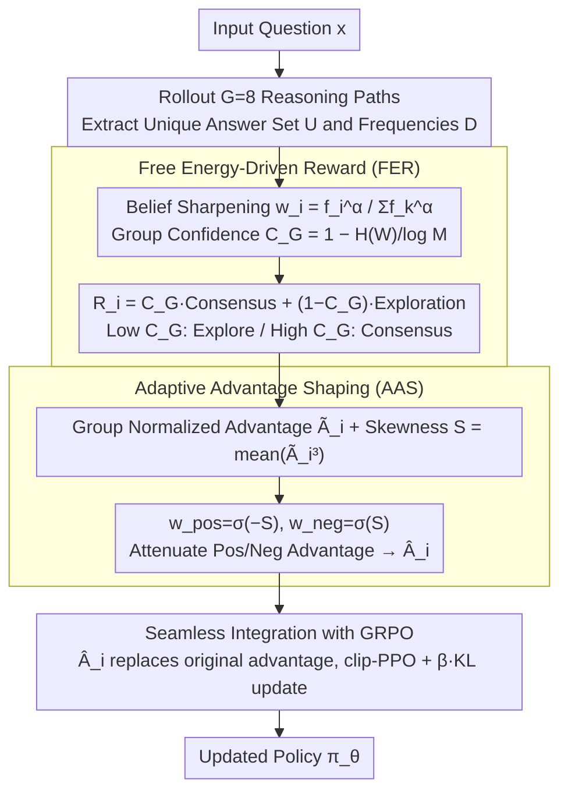

# Free Energy-Driven Reinforcement Learning with Adaptive Advantage Shaping for Unsupervised Reasoning in LLMs

**Conference**: ACL 2026  
**arXiv**: [2605.04065](https://arxiv.org/abs/2605.04065)  
**Code**: Not yet released  
**Area**: Reinforcement Learning / Unsupervised RL / LLM Reasoning / GRPO  
**Keywords**: Free Energy Principle, Unsupervised RL, Advantage Shaping, GRPO, Self-improvement

## TL;DR
FREIA introduces the Free Energy Principle (FEP) into label-free RL fine-tuning, simultaneously addressing the premature convergence of traditional majority voting/confidence rewards and the advantage estimation mismatch during training. It employs a "consensus + exploration" adaptive reward (FER) and adaptive advantage shaping (AAS) based on reward distribution skewness, achieving performance comparable to or better than supervised GRPO across 3 reasoning tasks and 9 datasets.

## Background & Motivation

**Background**: RLVR (Reinforcement Learning with Verifiable Rewards) has become a core technology for LLM reasoning capabilities (e.g., DeepSeek-R1, o1), but it relies on human-annotated ground-truth. Unsupervised self-improvement has become a hotspot, mainly divided into two camps: (1) **Trajectory-intrinsic methods** (Entropy, Intuitor, Confidence-is-all-you-need) which use semantic entropy or confidence as rewards; (2) **Group consensus methods** (TTRL, Self-Consistency PO, Co-Reward) which use majority voting as rewards.

**Limitations of Prior Work**: The authors expose the fundamental flaws of both camps through a concise example—the correct answer is "13", but majority voting assigns a score of 0 to the correct answer "13" and full marks to the incorrect majority answer "4". Confidence-based methods assign high scores to "rare but confident" incorrect answers. More critically, both approaches apply **static criteria** to a **dynamically evolving capability**:

- **Early Training (Weak Consensus)**: High-reward answers are scarce. Standard advantage normalization assigns a massive positive advantage to a few outliers, causing the model to overfit to this noise prematurely.
- **Late Training (Strong Consensus)**: Majority answers dominate the population. Standard advantage treats occasional minority paths as having large negative advantages, causing the policy to degenerate from "consolidating advantages" to "merely avoiding mistakes."

**Key Challenge**: Both reward design and advantage estimation **are static** and fail to adjust as the model evolves. The model needs to encourage exploration early on and consolidate consensus later, whereas existing methods use the same rules for both.

**Goal**: (1) Design a reward that can adaptively switch between "Consensus $\leftrightarrow$ Exploration"; (2) Design advantage shaping that is aware of the current training stage; (3) Surpass all unsupervised baselines across math, SQL, and multimodal geometry tasks without introducing extra training costs.

**Key Insight**: The authors borrow the **Free Energy Principle (FEP, Friston 2010)** from neuroscience—the brain achieves a balance between "exploiting existing beliefs" and "active exploration" by minimizing free energy. Analogizing unsupervised LLM self-improvement to minimizing free energy naturally derives a dual-objective of "consensus alignment + novel path exploration."

**Core Idea**: Use group confidence $C_G\in[0,1]$ as a gate to adaptively interpolate between consensus reward and exploration reward; use the **skewness** $\mathcal{S}$ of the reward distribution as a training stage indicator to dynamically attenuate the weights of positive/negative advantages.

## Method

### Overall Architecture

FREIA is built upon GRPO, modifying only the "Reward" and "Advantage" components while retaining the PPO structure. For each input $x$, it first rolls out $G=8$ reasoning paths and extracts the final answers, calculating the unique answer set $U=\{u_1,...,u_M\}$ and their frequencies $D=\{f_1,...,f_M\}$. Then, the FER module adaptively mixes "following consensus" and "encouraging exploration" based on group confidence to assign a continuous reward $R_i$ to each path. The AAS module uses the skewness of this reward distribution to determine the training stage, attenuating positive and negative advantages respectively to obtain the shaped $\hat{A}_i$. Finally, $\hat{A}_i$ is fed into the standard GRPO clip-PPO objective (with $\beta=0.001$ KL constraint) for policy updates. The entire pipeline introduces no additional training costs.

### Key Designs

**1. Free Energy-Driven Reward (FER): A single formula expressing "Following the Majority" and "Encouraging Risk-taking" with dynamic gating**

Both unsupervised camps have flaws: pure consensus is trapped by incorrect majorities, while pure confidence over-rewards "rare but confident" errors. Critically, both apply static rules to evolving capabilities. FER merges these into one reward. First, nonlinear belief sharpening is applied to answer frequencies: $w_i = f_i^\alpha / \sum_k f_k^\alpha$ ($\alpha=2$, higher values reinforce the majority). Group confidence is defined using normalized Shannon entropy: $C_G = 1 - H(W)/\log M$ (if $M=1, C_G=1$). The consensus term $r_{cons}(y_i) = \mathbb{1}[a_i = \text{Vote}(A)]$ rewards following the majority, while the exploration term $r_{explore}(y_i) = \tanh(-\log w_i)$ rewards rare answers ($\tanh$ prevents signal explosion). The final reward is $R_i = C_G \cdot r_{cons}(y_i) + (1 - C_G) \cdot r_{explore}(y_i)$. Early in training, $C_G$ is low, automatically favoring exploration to avoid incorrect majority locks; later, higher $C_G$ leans toward consensus to consolidate correct paths—a direct application of FEP's "exploit when confident, explore when uncertain" to unsupervised LLMs.

**2. Adaptive Advantage Shaping (AAS): Using reward distribution skewness as a training stage probe to attenuate positive and negative advantages**

Even with a well-designed reward, standard group normalization can fail: early on, scarce high-reward answers receive massive positive advantages (leading to overfitting noise), while later, occasional minority paths are penalized with large negative advantages (restricting policy to "avoiding mistakes"). AAS makes advantages adaptive. After calculating standard group-normalized advantages $\tilde{A}_i = (R_i - \mu_R)/(\sigma_R + \epsilon)$, sample skewness $\mathcal{S} = \frac{1}{G}\sum_i \tilde{A}_i^3$ serves as the stage indicator. Sigmoid functions map skewness to attenuation weights: $w_{pos} = \sigma(-\mathcal{S})$ and $w_{neg} = \sigma(\mathcal{S})$, yielding $\hat{A}_i = w_{pos}\tilde{A}_i$ (if $\tilde{A}_i > 0$) or $w_{neg}\tilde{A}_i$ (if $\tilde{A}_i < 0$). Positive skew implies low rewards dominate and high rewards are likely random outliers, so $w_{pos}\to 0$ to suppress overfitting. Negative skew signifies high rewards dominate and low rewards are likely harmless variants, so $w_{neg}\to 0$ to prevent over-penalizing minority paths. Essentially, this mirrors FER's adaptivity at the advantage level using a self-contained batch calculation.

**3. Seamless Integration with GRPO: FER+AAS as a drop-in plugin without altering PPO's clip or KL structure**

Ours only replaces the standard group-normalized advantage with $\hat{A}_i$ in the GRPO loss function: $\mathcal{L}(\theta) = \mathbb{E}[\frac{1}{G}\sum_i \frac{1}{|o_i|} \sum_t \min(r_{i,t}(\theta)\hat{A}_i, \text{clip}(r_{i,t}, 1\pm\epsilon)\hat{A}_i) - \beta D_{KL}(\pi_\theta \| \pi_{ref})]$. Token-level loss, clip ranges, and KL terms remain as default. This allows for zero-cost replacement in any GRPO implementation, which is why wall-clock time remains consistent with baselines (Figure 6)—as FER and AAS are $O(G)$ statistical operations within a batch.

### Loss & Training

- **Training**: MATH dataset, AdamW (lr=1e-6), 400 steps, batch=512, rollout $G=8$, sampling temperature=1.0; KL coefficient $\beta=0.001$; FER hyperparameter $\alpha=2$.
- **Evaluation**: Pass@1, sampling temperature=0.6, mean over 3 random seeds.
- **Hardware**: 4× A100 40GB GPUs.

## Key Experimental Results

### Main Results

Pass@1 for mathematical reasoning across 6 benchmarks (DeepSeek-R1-Distill-Qwen-1.5B):

| Dataset | Base | GRPO (Supervised) | TTRL | Entropy | Intuitor | **FREIA** |
|--------|------|-------------------|------|---------|----------|-----------|
| MATH500 | 77.6 | 82.4 | 82.6 | 81.8 | 81.4 | 82.2 |
| AIME24 | 16.7 | 20.0 | 20.0 | 16.7 | 16.7 | **20.0** |
| AIME25 | 16.7 | 20.0 | 20.0 | 16.7 | 16.7 | **20.0** |
| AMC23 | 62.5 | 70.0 | 70.0 | 65.0 | 65.0 | **72.5** |
| Minerva | 27.6 | 30.5 | 30.9 | 29.8 | 29.4 | **31.3** |
| Olympiad | 42.4 | 48.6 | 49.0 | 47.5 | 46.6 | **49.4** |
| **Avg.** | 40.6 | 45.3 | 45.4 | 42.7 | 42.4 | **45.9** |

Average Pass@1 on Qwen2.5-Math-1.5B-Instruct: Base=33.2 → Entropy=35.7 → Intuitor=34.8 → TTRL=38.1 → **FREIA=38.5**, still outperforming supervised GRPO (38.3). On Qwen2.5-3B, FREIA matches supervised GRPO (30.1 vs 30.1), and is 0.6pp higher than the strongest unsupervised baseline TTRL (29.5).

### Ablation Study

| Configuration | Avg Pass@1 (Relative Change) | Description |
|------|----------------------|------|
| Full FREIA | 45.9 | Full version with FER + AAS |
| w/o AAS | ↓ Slight | Reverts to static advantage normalization |
| w/o Exploration | ↓↓ | Consensus-only reward; premature convergence in early stages |
| w/o Consensus | ↓↓↓ **Largest drop** | Exploration-only reward; loses self-improvement drive |

**$\alpha$ Sensitivity**: Optimal around $\alpha=2$. Smaller $\alpha$ results in noisy, unstable signals; larger $\alpha$ over-reinforces consensus, leading to premature suboptimal convergence. The flat curve suggests robustness to hyperparameters.

### Key Findings

- **Unsupervised can outperform supervised GRPO**: FREIA (45.9) beats supervised GRPO (45.3) on DeepSeek-1.5B. This is attributed to FER providing "continuous + dense" signals compared to binary RLVR signals.
- **Consensus is more critical than exploration**: Ablations show the largest drop when removing consensus, indicating that while exploration is a safety valve against early convergence, the primary driver is the majority signal.
- **Training dynamics align with FEP**: Figure 7 shows monotonically decreasing policy entropy, increasing $C_G$, and smoothly rising consensus rewards, while exploration rewards remain volatile—the model converges while **retaining continuous exploration**, consistent with FEP theory.
- **Cross-task transferability**: FREIA leads across all unsupervised baselines in SQL generation (Spider/BIRD) and multimodal geometry (Geometry3K), proving effectiveness beyond mathematics.
- **AAS skewness signal is effective**: Although "w/o AAS" is the strongest ablation variant, it remains inferior to full FREIA, proving the necessity of dynamic advantage shaping.

## Highlights & Insights

- **First to apply Free Energy Principle to unsupervised RL reward design**: FEP was previously limited to the Active Inference community. This paper simplifies it into a computable "gate $C_G$ + consensus + exploration" formula, offering a new design language for LLM RL.
- **Skewness as a training stage probe**: Unlike traditional step-based or entropy-based indicators, AAS uses batch skewness $\mathcal{S}$—a self-contained, global-state-free metric that can be computed within a single batch. This can be transferred to any group-based RL (GRPO/RLOO/REINFORCE++).
- **"Belief sharpening + soft normalization" combo**: The design of $w_i = f_i^\alpha / \sum f_k^\alpha$ alongside $\tanh(-\log w_i)$ is clever—sharpening amplifies consensus, while $\tanh$ prevents the exploration reward from dominating. This pair is a general template for preventing reward hacking in unsupervised RL.
- **Zero computational overhead**: FER and AAS are $O(G)$ operations per batch. Wall-clock time matches baselines (Figure 6), meaning there is no hidden "time for accuracy" trade-off.

## Limitations & Future Work

- **Author Acknowledgments**: (1) Experiments limited to 3B parameters; performance on larger models is unknown. (2) $C_G$ only considers the final answer distribution, ignoring semantic reasoning steps, which is a coarse approximation for process-level rewards. (3) AAS uses batch-level skewness, which may mask intra-batch heterogeneity; per-sample shaping is a future direction.
- **Hidden Concerns**: (1) Gains are modest—average Pass@1 is 0.5-3.5 points higher than TTRL; statistically significant but of smaller engineering impact. (2) FER's "Consensus = Majority" fails in open-ended generation (e.g., creative writing), as success heavily relies on tasks with "short verifiable answers." (3) $C_G$ depends on sampling $G=8$; noise might overwhelm the signal in smaller batches.
- **Improvements**: (1) Downscale skewness signals to token-level adaptive shaping. (2) Extend $C_G$ to "step-level confidence" to integrate process reward models into the FEP framework. (3) Verify FEP on long-CoT tasks where sparse rewards might make FER's dense signals even more advantageous.

## Related Work & Insights

- **vs TTRL (Test-Time RL)**: TTRL relies purely on majority voting and can be trapped by incorrect majorities; FREIA retains learning signals from minority paths via the $(1-C_G)$ exploration term.
- **vs Entropy / Intuitor (Confidence-based)**: These only use trajectory-intrinsic signals and reward "confident but wrong" answers; FREIA uses group consensus as an external anchor.
- **vs Co-Reward / Self-Consistency PO**: Co-Reward uses cross-view consensus for robustness at the cost of exploration; FREIA achieves both consensus and exploration within the same rollout batch.
- **vs supervised GRPO**: GRPO uses binary rewards (sparse); FER used $(0,1)$ continuous rewards, providing dense gradients for every path.

## Rating
- Novelty: ⭐⭐⭐⭐ FEP as a reward design principle is a new perspective, though the GRPO framework itself remains unchanged.
- Experimental Thoroughness: ⭐⭐⭐⭐ 3 tasks × 9 datasets × 3 models × 4 baselines × 3 seeds, including ablation and sensitivity analysis.
- Writing Quality: ⭐⭐⭐⭐ Clear derivations, intuitive Figure 1/2 explanations, and comprehensive appendices.
- Value: ⭐⭐⭐⭐ Unsupervised RL is a cost-reduction tool; this provides a strong plug-and-play baseline and a clear design paradigm for GRPO.

<!-- RELATED:START -->

## Related Papers

- [\[ACL 2026\] Verifier-Free RL for LLMs via Intrinsic Gradient-Norm Reward](verifier-free_rl_for_llms_via_intrinsic_gradient-norm_reward.md)
- [\[ACL 2026\] LANG: Reinforcement Learning for Multilingual Reasoning with Language-Adaptive Hint Guidance](lang_reinforcement_learning_for_multilingual_reasoning_with_language-adaptive_hi.md)
- [\[ICLR 2026\] Unsupervised Learning of Efficient Exploration: Pre-training Adaptive Policies via Self-Imposed Goals](../../ICLR2026/reinforcement_learning/unsupervised_learning_of_efficient_exploration_pre-training_adaptive_policies_vi.md)
- [\[ICML 2026\] CPMöbius: Iterative Coach–Player Reasoning for Data-Free Reinforcement Learning](../../ICML2026/reinforcement_learning/cpmobius_iterative_coach-player_reasoning_for_data-free_reinforcement_learning.md)
- [\[ICLR 2026\] Reasoning Boosts Opinion Alignment in LLMs](../../ICLR2026/reinforcement_learning/reasoning_boosts_opinion_alignment_in_llms.md)

<!-- RELATED:END -->
