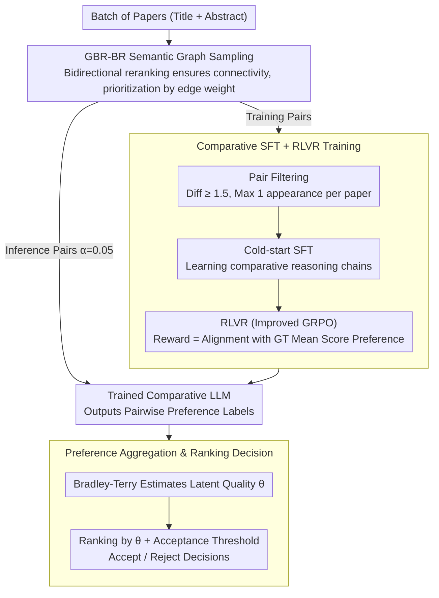

# From Isolated Scoring to Collaborative Ranking: A Comparison-Native Framework for LLM-Based Paper Evaluation

**Conference**: ACL2026 Findings  
**arXiv**: [2603.17588](https://arxiv.org/abs/2603.17588)  
**Code**: The paper claims it is open-sourced, but the current cache does not provide a specific GitHub URL  
**Area**: LLM Evaluation / Automated Peer Review / Learning to Rank  
**Keywords**: Comparative Evaluation, Paper Ranking, LLM as Reviewer, Bradley-Terry, RLVR  

## TL;DR
This paper transforms LLM paper evaluation from "assigning absolute scores to single papers" to "pairwise comparisons followed by global ranking." By employing semantic graph sampling, comparative SFT, and reinforcement learning with verifiable rewards (RLVR) to train a 7B model, the framework significantly outperforms DeepReview-14B in ICLR-2025 paper ranking and acceptance prediction, demonstrating strong zero-shot transferability across multiple unseen conferences.

## Background & Motivation
**Background**: LLMs have been utilized to assist in paper review, with the standard paradigm involving a model reading a single paper and outputting an absolute score, review comments, or an acceptance recommendation. Training-based methods use historical review scores as supervision, while agent-based methods simulate multi-reviewer discussions; however, most still revolve around the question "what score should this single paper receive?"

**Limitations of Prior Work**: Absolute scores are inherently unstable. A score of "6" holds different meanings across different conferences, years, domains, or criteria. Models easily overfit specific scoring habits of a dataset rather than learning transferable academic judgment. Furthermore, paper evaluation is essentially a ranking problem: program committees care about which submissions in a pool are most deserving of acceptance, rather than evaluating each paper in isolation against a fixed scale.

**Key Challenge**: LLMs excel at relative judgment and linguistic reasoning, yet existing training signals force them to fit absolute numerical values. These values are skewed by conference scales, scoring habits, and domain differences, leading models to mistake dataset-specific rules for "paper quality."

**Goal**: The authors aim to establish a comparison-native paper evaluation framework that directly processes pairwise preferences during data construction, model training, and inference, aggregating these preferences into a global quality ranking to determine the acceptance set.

**Key Insight**: Driven by the observation that human reviewers often form judgments through comparison, this work decomposes complex quantitative scoring into a large number of simpler pairwise comparisons. Such supervision avoids inconsistent absolute scales and better aligns with the LLM's capacity for comparative analysis.

**Core Idea**: Replace "absolute scoring for single papers" with "graph sampling of informative pairs + comparative SFT/RLVR for preference learning + Bradley-Terry for preference aggregation."

## Method
The core of this method is not just a new reviewer prompt, but a complete restructuring of the paper evaluation data flow into a comparison task: constructing paper pairs for the model to judge quality during training/inference, and then aggregating these preference edges into a global ranking.

### Overall Architecture
The input is a batch of papers to be evaluated, represented primarily by their titles and abstracts. The framework first selects pairs via pair sampling, utilizes a trained LLM to output preference labels for each pair, and aggregates these into a global ranking. During training, sampled pairs are filtered by score differences and frequency constraints to ensure reliable supervision. The model undergoes cold-start SFT to learn comparative reasoning, followed by RLVR (an improved GRPO) based on ground-truth mean score preferences. During inference, a small fraction of pairs is sampled, and the Bradley-Terry model estimates the latent quality scores to make acceptance/rejection decisions based on a threshold.

### Key Designs

**1. GBR-BR Semantic Graph Sampling: Selecting "Comparable and Informative" Pairs**
Random pairing results in many cross-domain pairs that are difficult to judge or have low information density, while intra-domain pairing alone sacrifices cross-domain generalization. GBR-BR employs a semantic graph: each paper retrieves candidates via embeddings, followed by a reranker to get bidirectional ranks. An edge is created if $p_i$ and $p_j$ are top-ranked for either, with weight $2k_r-r_{ij}-r_{ji}$. Connectivity is maintained by relaxing thresholds for isolated nodes. Pairs are then prioritized by edge weights to ensure fine-grained supervision between similar papers while maintaining a connected signal across the pool.

**2. Comparative SFT + RLVR Training: Teaching the 7B Model to Judge "Which is Stronger"**
Directly using a general LLM as a comparator is unreliable, and pure RL can be unstable. Therefore, a two-step "cold-start + reinforcement" process is used. Training pairs are filtered ($d_{min}=1.5$, $c_{max}=1$) for quality. The model first performs cold-start SFT using reasoning chains generated by an instruct LLM. Then, an improved GRPO is used for RL, where the reward is derived from verifiable ground-truth preference labels $y_{ij}=\mathbb{I}(s_i>s_j)$. If the model's predicted direction is correct, it receives $R_l=\gamma\cdot\mathbb{I}(y_{ij}=\hat y_{ij}^{(l)})$ (where $\gamma=5$). SFT establishes the reasoning format, while RLVR aligns quality judgments with verifiable labels.

**3. Preference Aggregation & Ranking Decision: Converting Local Preferences to Global Rankings**
Since pairwise judgments do not directly produce an acceptance set, inference involves sampling a small fraction of pairs ($\alpha=0.05$). The trained LLM generates labels, and the Bradley-Terry model aggregates these into latent quality scores $\theta_i$, where the probability of $i$ being preferred over $j$ is $p_{ij}=e^{\theta_i}/(e^{\theta_i}+e^{\theta_j})$. After maximizing likelihood, papers are ranked by $\theta_i$, and the top $N$ papers are accepted based on a target acceptance rate. Bradley-Terry was chosen for its interpretability and superior experimental performance.

### Loss & Training
The base model is Qwen2.5-7B-Instruct with LoRA for efficiency. Training data is from ICLR-2025 using a standard train-test split with ground-truth mean scores. Pairs are filtered with $d_{min}=1.5$ and $c_{max}=1$. The inference sampling ratio is $\alpha=0.05$, with an acceptance rate fixed at 31.4% (ICLR 23/24 average). The reward function does not fit absolute values but checks if the preference direction matches the ground truth.

## Key Experimental Results

### Main Results
| Dataset / Task | Metric | Ours (CNPE-7B) | Strongest Baseline | Gain / Conclusion |
|--------|------|------|----------|------|
| ICLR-2025 Acceptance | Accuracy | 0.7192 | DeepReview-14B 0.6845 | 7B model outperforms 14B trained reviewer |
| ICLR-2025 Acceptance | F1 | 0.6732 | DeepReview-14B 0.6254 | More sensitive to the accept/reject boundary |
| ICLR-2025 Acceptance | AUC | 0.7408 | DeepReview-14B 0.6624 | 11.8% relative improvement over the nearest competitor |
| ICLR-2025 Ranking | Spearman $\rho$ | 0.4091 | DeepReview-14B 0.4014 | Slight lead in ranking correlation |
| ICLR-2025 Ranking | MAP@20 | 0.7076 | PairReview(GLM) 0.3474 | Significant advantage in identifying top-20 papers |
| ICLR-2025 Ranking | NDCG@20 | 0.8153 | PairReview(Gemini) 0.7522 | Better top-tier ranking quality |
| ICLR-2025 Overall | Avg. Perf. | 1.0000 | DeepReview-14B 0.8211 | 21.8% average relative improvement |

### Ablation Study
| Configuration | Key Metric | Description |
|------|---------|------|
| Full model | Avg. Perf. 1.0000; F1 0.6732 | Full CNPE with SFT+RLVR and mixed sampling |
| w/o Training | Avg. Perf. 0.5845 | 41.6% drop without comparative training; general models are poor comparators |
| w/o RLVR | Avg. Perf. 0.7744 | SFT alone is insufficient; 21.6% performance degradation |
| w/o SFT cold-start | Avg. Perf. 0.7511 | Direct RL is worse than starting with SFT (reasoning format matters) |
| w/o Random (train) | Avg. Perf. 0.8792 | Lack of random cross-domain pairs hurts generalization |
| w/o Sim (train) | Avg. Perf. 0.8358 | Loss of semantic pairs is more detrimental (fine-grained comparison is key) |

### Key Findings
- Improvements in ranking metrics are more pronounced than in binary classification, especially MAP@20, which jumped to 0.7076, proving that the comparison-native design is better suited for "finding the best papers."
- SFT and RLVR are complementary: SFT provides the comparative reasoning format, while RLVR aligns the preference direction with ground-truth scores.
- In unseen conference generalization, the model created larger percentile gaps between accepted/rejected groups in ICML (+18.5) and NeurIPS (+15.9), and smaller but consistent gaps in ACL/EMNLP/NAACL groups (Long vs. Findings), aligning with the inherent quality distributions of these venues.

## Highlights & Insights
- **Refined Task Objective**: Paper quality evaluation is a ranking problem; absolute scores are merely intermediaries. This framework converts data, training, inference, and aggregation into a comparative pipeline, which is more fundamental than simple prompting.
- **Utility of Semantic Graph Sampling**: Purely random pairs provide generalization but are noisy, while purely intra-domain pairs are narrow. GBR-BR's connected graph balances fine-grained comparability with global coverage, a technique transferable to model evaluation and data filtering.
- **RLVR with Verifiable Rewards**: By using ground-truth score relationships as a verifiable reward instead of training a separate reward model, the authors propose an efficient training paradigm for any task that can be converted into verifiable preference labels.
- **Addressing Positional Bias**: The paper notes that untrained LLMs exhibit significant positional bias, which is mitigated through comparative SFT and RL, making the ranking independent of paper ordering.

## Limitations & Future Work
- Data scope is narrow, focused on recent CS conferences; results may not generalize to medical or social science journals.
- The method uses only titles and abstracts for efficiency, losing details on methodology, rigor, and technical limitations found in the full text.
- Model scale is limited to 7B due to resources; while it outperforms 14B baselines, larger models might offer better knowledge coverage.
- Automated reviews still fall short of human expert quality and carry ethical risks. The system should be positioned as an auxiliary tool for ranking and pre-screening rather than a replacement.

## Related Work & Insights
- **vs DeepReview / SEA**: These models learn point-wise absolute scores; CNPE learns pairwise quality preferences, making it less dependent on conference-specific scoring scales.
- **vs AIScientist / AgentReview**: Multi-agent systems use general LLMs; CNPE specifically trains a comparator and aggregates results via a ranking model.
- **vs PairReview / NAIP**: While PairReview uses pairwise comparison, its comparator is usually a fixed LLM; NAIP introduces listwise training but still predicts isolated scores. This work is comparison-native across the entire lifecycle.
- **Inspiration**: Many "scoring" tasks could benefit from "comparison + ranking" (e.g., benchmark evaluation, search result reranking). The key lies in designing a sampling strategy that is both comprehensive and informative.

## Rating
- Novelty: ⭐⭐⭐⭐☆ While pairwise logic isn't new, the systematic integration of sampling, RLVR, and Bradley-Terry for paper review is comprehensive.
- Experimental Thoroughness: ⭐⭐⭐⭐☆ Covers main experiments, ablations, generalization, and positional bias; limited by title/abstract usage and CS-centric data.
- Writing Quality: ⭐⭐⭐⭐☆ Clear structure and motivation; some formula and table formatting in raw text is slightly fragmented.
- Value: ⭐⭐⭐⭐☆ Strong implications for automated evaluation and LLM-as-judge tasks, though requires cautious deployment.

<!-- RELATED:START -->

## Related Papers

- [\[AAAI 2026\] A Multi-Agent Conversational Bandit Approach to Online Evaluation and Selection of User-Aligned LLM Responses](../../AAAI2026/reinforcement_learning/a_multi-agent_conversational_bandit_approach_to_online_evaluation_and_selection_.md)
- [\[ICLR 2026\] Toward a Dynamic Stackelberg Game-Theoretic Framework for Agent-Based Conversational AI Defense Against LLM Jailbreaking](../../ICLR2026/reinforcement_learning/toward_a_dynamic_stackelberg_game-theoretic_framework_for_agent-based_conversat.md)
- [\[ACL 2026\] Semantic-Space Exploration and Exploitation in RLVR for LLM Reasoning](semantic-space_exploration_and_exploitation_in_rlvr_for_llm_reasoning.md)
- [\[ICLR 2026\] Menlo: From Preferences to Proficiency – Evaluating and Modeling Native-like Quality Across 47 Languages](../../ICLR2026/reinforcement_learning/menlo_from_preferences_to_proficiency_--_evaluating_and_modeling_native-like_qua.md)
- [\[ACL 2026\] LearnAlign: Data Selection for LLM Reinforcement Learning with Improved Gradient Alignment](learnalign_data_selection_for_llm_reinforcement_learning_with_improved_gradient_.md)

<!-- RELATED:END -->
