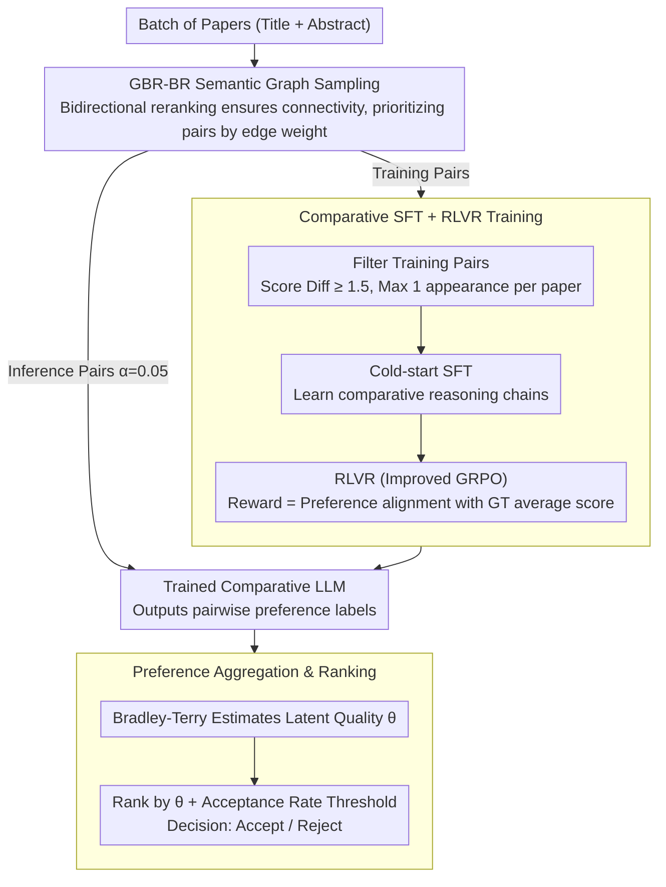

# From Isolated Scoring to Collaborative Ranking: A Comparison-Native Framework for LLM-Based Paper Evaluation

**Conference**: ACL2026 Findings  
**arXiv**: [2603.17588](https://arxiv.org/abs/2603.17588)  
**Code**: The paper claims it is open-sourced, but the specific GitHub URL is not provided in the current cache.  
**Area**: LLM Evaluation / Automated Peer Review / Learning to Rank  
**Keywords**: Comparative Evaluation, Paper Ranking, LLM for Paper Review, Bradley-Terry, RLVR  

## TL;DR
This paper transforms LLM paper review from "individual absolute scoring" to "pairwise comparison followed by global ranking." By employing semantic graph sampling, comparative SFT, and Reinforcement Learning from Verifiable Rewards (RLVR) to train a 7B model, it significantly outperforms DeepReview-14B in ICLR-2025 paper ranking and acceptance prediction, while demonstrating strong transferability to unseen conferences.

## Background & Motivation
**Background**: LLMs have been utilized to assist in paper reviews, typically by outputting absolute scores, review comments, or acceptance suggestions after reading a paper. Training-based methods use historical review scores for supervision, while agent-based methods simulate multi-reviewer discussions; however, most still revolve around specific "scores for a single paper."

**Limitations of Prior Work**: Absolute scores are inherently unstable. A score of "6" holds different meanings across different conferences, years, domains, or criteria. Models easily overfit to the scoring habits of a specific dataset rather than learning transferable academic judgment. Furthermore, paper review is essentially a ranking problem: program committees care about which submissions in a pool are most worthy of acceptance, rather than evaluating each paper against a fixed, isolated scale.

**Key Challenge**: While LLMs are proficient at relative judgment and linguistic reasoning, existing training signals force them to fit absolute numerical values. These values are influenced by conference scales, scoring habits, and domain differences, causing models to mistake dataset-specific rules for "paper quality."

**Goal**: The authors aim to establish a comparison-native paper evaluation framework. This framework handles preferences between paper pairs directly during data construction, model training, and inference, aggregating pairwise preferences into a global quality ranking to determine the acceptance set.

**Key Insight**: Starting from the observation that "human reviewers often form judgments through comparison," the complex quantitative scoring problem is decomposed into a large number of simpler pairwise comparisons. This supervision avoids alignment issues with absolute score scales and aligns better with the LLM's capability for comparative analysis.

**Core Idea**: Replace "absolute scoring for single papers" with "graph sampling of informative paper pairs + comparative SFT/RLVR for preference learning + Bradley-Terry for preference aggregation."

## Method
The key to this method is not just a new reviewer prompt, but the rewriting of the entire paper evaluation data flow as a comparison task: constructing paper pairs for the model to judge quality during training, doing the same during inference, and aggregating these preference edges into a global ranking.

### Overall Architecture
The input consists of a batch of papers represented by titles and abstracts. The framework first selects paper pairs through "pair sampling," uses a trained LLM to output preference labels for each pair, and aggregates these into a global ranking. During training, sampled pairs are filtered by score differences and appearance frequency constraints. The model is first trained via cold-start SFT to learn comparative reasoning, followed by RLVR based on real average score preferences. During inference, a small fraction of potential pairs are sampled for comparison, and the Bradley-Terry model estimates the latent quality scores to make acceptance/rejection decisions based on a threshold.

### Key Designs

**1. GBR-BR Semantic Graph Sampling: Picking "Comparable and Informative" pairs from massive possibilities**

Complete random pairing leads to many cross-domain pairs that are difficult to judge or have low information density, while only pairing within domains sacrifices cross-domain generalization. GBR-BR uses a semantic graph as a compromise: each paper retrieves candidates via embedding, followed by a reranker for bidirectional ranking. An edge is formed between $p_i$ and $p_j$ if either appears in the top rankings of the other, with weight $2k_r-r_{ij}-r_{ji}$ (higher weight for higher bidirectional rank). Connectivity is maintained; if nodes are isolated, retrieval thresholds are relaxed. This ensures fine-grained supervision between similar papers while maintaining global connectivity.

**2. Comparative SFT + RLVR Training: Teaching a 7B model "which is better" rather than relying on vanilla LLM judgment**

Generic LLMs are unreliable comparators, and pure SFT may not optimize preference correctness. The authors use a two-step "cold-start + reinforcement" approach. Training pairs are filtered: average score difference $d_{min} \ge 1.5$ and each paper appears at most $c_{max}=1$ time. The model undergoes cold-start SFT using reasoning chains generated by an instruct LLM, followed by an improved GRPO reinforcement. The reward is derived from the ground truth preference $y_{ij}=\mathbb{I}(s_i>s_j)$. If the model's predicted direction is correct, it receives $R_l=\gamma \cdot \mathbb{I}(y_{ij}=\hat y_{ij}^{(l)})$, where $\gamma=5$. SFT establishes reasoning formats, while RLVR aligns relative quality judgment using verifiable labels.

**3. Preference Aggregation and Ranking Decision: Turning local preferences into conference-level global rankings**

Pairwise judgments do not directly produce an acceptance set. During inference, only a fraction of pairs (ratio $\alpha=0.05$) are sampled from the $O(n^2)$ space. Preference labels from the LLM are aggregated using the Bradley-Terry model to estimate latent quality $\theta_i$, where the probability of $i$ being preferred over $j$ is $p_{ij}=e^{\theta_i}/(e^{\theta_i}+e^{\theta_j})$. After maximizing the likelihood of all labels, papers are ranked by $\theta_i$, and the acceptance set is determined by a preset acceptance rate.

### Loss & Training
The base model is Qwen2.5-7B-Instruct, fine-tuned using LoRA. Training data is from ICLR-2025 (DeepReview split) with ground truth as real average scores. Training pair filtering uses $d_{min}=1.5$ and $c_{max}=1$. Inference sampling $\alpha=0.05$. The acceptance rate is fixed at 31.4% (ICLR 23-24 average). The optimization follows "Cold-start SFT → RLVR," where rewards check preference direction rather than fitting absolute scores.

## Key Experimental Results

### Main Results

| Dataset / Task | Metric | Ours CNPE-7B | Representative Baseline | Gain / Conclusion |
|--------|------|------|----------|------|
| ICLR-2025 Prediction | Accuracy | 0.7192 | DeepReview-14B 0.6845 | 7B model outperforms 14B trained reviewer |
| ICLR-2025 Prediction | F1 | 0.6732 | DeepReview-14B 0.6254 | More sensitive to Accept/Reject boundary |
| ICLR-2025 Prediction | AUC | 0.7408 | DeepReview-14B 0.6624 | ~11.8% improvement over closest competitor |
| ICLR-2025 Ranking | Spearman $\rho$ | 0.4091 | DeepReview-14B 0.4014 | Leads in rank correlation |
| ICLR-2025 Ranking | MAP@20 | 0.7076 | PairReview(GLM) 0.3474 | Significant advantage in Top-20 identification |
| ICLR-2025 Ranking | NDCG@20 | 0.8153 | PairReview(Gemini) 0.7522 | Better top-tier ranking quality |
| ICLR-2025 Overall | Avg. Perf. | 1.0000 | DeepReview-14B 0.8211 | 21.8% average relative improvement |

### Ablation Study

| Configuration | Key Metrics | Note |
|------|---------|------|
| Full model | Avg. Perf. 1.0000; MAP@20 0.7076 | Full CNPE (SFT+RLVR) with mixed sampling |
| w/o Training | Avg. Perf. 0.5845 | -41.6% performance; base LLM is not a reliable comparator |
| w/o RLVR | Avg. Perf. 0.7744 | SFT alone is insufficient; -21.6% degradation |
| w/o SFT cold-start | Avg. Perf. 0.7511 | Direct RL is worse; reasoning format matters |
| w/o Random (train) | Avg. Perf. 0.8792 | Lack of cross-domain pairs hurts generalization |
| w/o Sim (train) | Avg. Perf. 0.8358 | Lack of similar pairs hurts more; fine-grained comparison is key |

### Key Findings
- Improvements in ranking metrics are more pronounced than binary classification, especially MAP@20, indicating the comparison-native design is ideal for "finding the best papers."
- SFT and RLVR are complementary: SFT provides comparative reasoning, while RLVR aligns preference directions with ground truth.
- In zero-shot conference transfer, the model demonstrates significant percentile gaps between accepted/rejected groups (e.g., +18.5 for ICML, +15.9 for NeurIPS).

## Highlights & Insights
- **Clear Objective Function**: Quality assessment is a ranking problem; absolute scores are just intermediate proxies. This work aligns data, training, and inference with this goal.
- **Pragmatic Semantic Graph Sampling**: Balances random pairs (generalization) with similar pairs (fine-grained discriminative power).
- **RLVR Design**: Leverages verifiable labels from real scores instead of training a separate reward model, offering an attractive paradigm for tasks with verifiable preferences.
- **Position Bias**: Comparative SFT+RL effectively mitigates position bias found in vanilla LLMs.

## Limitations & Future Work
- **Data Scope**: Primarily focused on Computer Science conferences; may not generalize to medical or social sciences.
- **Abstract-only**: Using only titles and abstracts saves cost but misses methodological details and rigorous experimental analysis found in full papers.
- **Model Scale**: Limited to 7B; larger models might offer stronger understanding.
- **Ethics**: Automated review poses risks of reinforcing mainstream biases or suppressing unconventional directions if used without human supervision.

## Related Work & Insights
- **vs DeepReview / CycleReviewer**: These focus on absolute scores/text; CNPE learns pairwise quality preferences, making it less dependent on conference-specific score scales.
- **vs AIScientist / AgentReview**: While agents simulate processes, they often rely on frozen LLMs; CNPE trains the comparator directly.
- **Insight**: Many "scoring" tasks (data filtering, model evaluation) might be better formulated as "comparison + ranking." The key is designing coverage-sufficient and noise-controlled pair sampling.

## Rating
- Novelty: ⭐⭐⭐⭐☆ Not entirely new in concept, but the integration of sampling, RLVR, and Bradley-Terry for paper review is very complete.
- Experimental Thoroughness: ⭐⭐⭐⭐☆ Extensive ablation and transfer tests; limited by the "CS abstract-only" scope.
- Writing Quality: ⭐⭐⭐⭐☆ Clear structure and motivation.
- Value: ⭐⭐⭐⭐☆ Directly applicable to LLM-as-a-judge tasks, though usage in real peer review requires caution.

<!-- RELATED:START -->

## Related Papers

- [\[AAAI 2026\] A Multi-Agent Conversational Bandit Approach to Online Evaluation and Selection of User-Aligned LLM Responses](../../AAAI2026/reinforcement_learning/a_multi-agent_conversational_bandit_approach_to_online_evaluation_and_selection_.md)
- [\[ICLR 2026\] Toward a Dynamic Stackelberg Game-Theoretic Framework for Agent-Based Conversational AI Defense Against LLM Jailbreaking](../../ICLR2026/reinforcement_learning/toward_a_dynamic_stackelberg_game-theoretic_framework_for_agent-based_conversat.md)
- [\[ACL 2026\] Semantic-Space Exploration and Exploitation in RLVR for LLM Reasoning](semantic-space_exploration_and_exploitation_in_rlvr_for_llm_reasoning.md)
- [\[ICLR 2026\] Menlo: From Preferences to Proficiency – Evaluating and Modeling Native-like Quality Across 47 Languages](../../ICLR2026/reinforcement_learning/menlo_from_preferences_to_proficiency_--_evaluating_and_modeling_native-like_qua.md)
- [\[ACL 2026\] LearnAlign: Data Selection for LLM Reinforcement Learning with Improved Gradient Alignment](learnalign_data_selection_for_llm_reinforcement_learning_with_improved_gradient_.md)

<!-- RELATED:END -->
